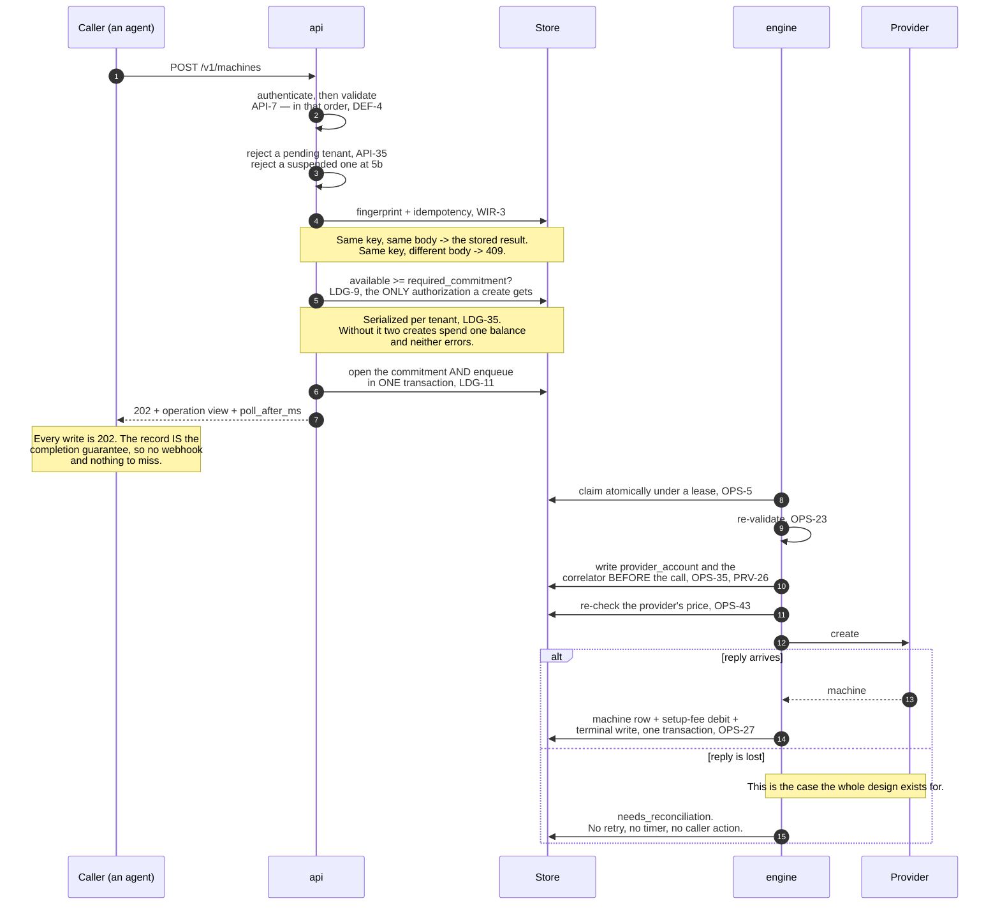

# 00 — Overview

## Problem

Server hosting providers expose wildly different provisioning surfaces. A cloud VPS
API gives you create/rebuild/delete against a catalog of images. A dedicated-server
API gives you an ordering system, a rescue environment, and an out-of-band reset — and
expects you to bring your own operating system. Any control plane that tries to unify
these by reducing them to a common subset ends up unable to do the one thing bare metal
is for: putting an arbitrary, operator-controlled image on a machine.

The system specified here unifies the *lifecycle* — create, adopt, refresh, power,
install, reverse-DNS, delete — while treating provider-specific capability as
first-class rather than as an exception. Rescue mode in particular is a workflow the
control plane orchestrates, not an opaque flag it forwards.

## Design goals

**OVR-1** The system MUST expose a uniform machine lifecycle across providers without
reducing provider capability to a lowest common denominator.

**OVR-2** Capability MUST be discoverable at runtime (`GET /v1/providers`). Clients
MUST NOT be required to infer support from a provider's name, and the server MUST NOT
accept an operation a provider has not declared support for. See `DOM-10`.

**OVR-3** Rescue-mode image installation MUST be a first-class orchestrated workflow:
the control plane activates rescue, pins the SSH host key, waits for the environment,
verifies the image, writes it, exits rescue, and cleans up credentials.

**OVR-4** Every write operation MUST be asynchronous and durable. Provisioning and
reimaging take minutes and involve billable or destructive provider mutations; they
MUST NOT be tied to the lifetime of an HTTP connection.

**OVR-5** **AMENDED.** *Uncertainty is a first-class state, not an error.* When the system
cannot determine whether a provider mutation took effect, the operation MUST enter a distinct
**resolution-pending** state (`OPS-3`) that requires evidence or human inspection to leave. **The mutation MUST NOT be retried automatically, and no timer may clear the state**; automatic
*resolution* by correlator search (`OPS-27`) is expressly permitted and required — it establishes
what happened rather than doing it again, and forbidding it would strand every automatically
resolvable operation on an operator's desk. *"Terminal" was withdrawn 2026-08-13: the state settles to
`succeeded` or `failed` on resolution, and calling it terminal forbade the very transitions
`OPS-27` and `OPS-31` mandate. What was load-bearing about the word survives intact — nothing
automatic and nothing caller-driven moves it.*
This is the single most important requirement in this document. See `03-operation-lifecycle.md`.

**OVR-6** Destructive and billable actions MUST require an explicit per-request
acknowledgement in the request body, independent of authentication and idempotency.

**OVR-7** Provider credentials MUST NOT appear in configuration files. Configuration
names the environment variable; the process reads the secret from the environment.

## System context

```
                    +---------------------------+
   API client ----->|  HTTP API                 |
                    |  authn / tenancy /        |
                    |  idempotency / validation |
                    +-------------+-------------+
                                  |
                                  v
                    +---------------------------+
                    |  Durable operation log    |
                    |  queue + leases +         |
                    |  per-machine locks        |
                    +-------------+-------------+
                                  |
                        restart-safe workers
                                  |
             +--------------------+--------------------+
             |                    |                    |
             v                    v                    v
      Provider driver A    Provider driver B    Provider driver C
       (cloud VPS)          (dedicated)          (cloud VPS)
             |                    |                    |
             +--------------------+--------------------+
                                  |
                                  v
                    +---------------------------+
                    |  Generic rescue engine    |
                    |  SSH + host-key pinning   |
                    |  rootfs / raw-disk writer |
                    +---------------------------+
```

### What happens when an agent buys a machine



**Step 9 is the one that decides the architecture.** Authorizing the purchase and opening the
commitment must be a single transaction, and `ADR-0001` chose one deployable because two stores
cannot give you one.

The four layers map to five modules with strictly one-way dependencies:

| Module | Responsibility | Depends on |
|---|---|---|
| `core` | Domain model, capability declarations, error taxonomy, provider interface | nothing |
| `providers` | Per-provider HTTP adapters implementing the provider interface | `core` |
| `rescue` | SSH orchestration and image installers, generic across providers | `core` |
| `engine` | **The credential-holding lifecycle side**: workers, driver invocation, the durable queue's execution, and the only code that may reach a provider credential | `core`, `providers`, `rescue` |
| `api` | **The customer-facing side**: HTTP surface, authentication, tenancy, enrolment, billing, abuse | `core`, `engine` — and `engine` **only through a narrow trait that does not expose a credential** |

**AMENDED 2026-08-31 — `server` is split, because the boundary that matters had no home.**
`ADR-0001` accepted one deployable on the promise that code structure keeps the public surface away
from provider credentials, and calls `OVR-10a` "the only structural defence left". `CNF-71`–`CNF-73`
then test a "customer-facing layer" and a "lifecycle layer" — **neither of which was a module.** Both
lived inside `server`, so `CNF-71`'s compile-fail test had no edge to fail across and `CNF-72`'s
tripwire had no visibility change to watch. A boundary absent from the dependency graph is a comment.

**OVR-8** The rescue engine MUST be generic. It receives a provider driver through the
provider interface and MUST NOT contain provider-specific branches. Provider-specific
rescue activation belongs in the driver (`PRV-8`).

**OVR-9** The dependency direction above MUST hold. In particular `core` MUST NOT
depend on an HTTP client, a database, or a web framework.

**`api` MUST NOT depend on `providers` or `rescue` at all, and MUST reach `engine` only through a
trait whose signatures mention no credential type.** `engine` MUST NOT depend on `api`. That single
edge, and its narrowness, is what `OVR-10a` requires and what `CNF-71`–`CNF-74` prove; the
credential-owning type is private to `engine` and reachable through nothing else.

## Deployment assumptions

**OVR-10** **SETTLED by `ADR-0001`: one deployable, with a module boundary inside it.**
Customer-facing concerns — enrolment, billing, abuse — are separated from the credential-holding
lifecycle engine by code structure, not by a network hop.

*The separate-service alternative and its comparison table are withdrawn. `ADR-0001` chose against
it and records why; keeping both forms live meant every later requirement had to be written twice
and a family of requirements accumulated around a deployment shape this product does not have
(swept 2026-08-31; see the README's withdrawn-identifier index).* **`OVR-10a` is therefore the only structural credential defence**, which is what
makes it load-bearing rather than belt-and-braces.

**OVR-10a** A deployment choosing the single-component form MUST NOT leave provider credentials
ambient in the process. They MUST be reachable only through the internal layer's interface, so
a defect in the public surface cannot read them by accident. The boundary MUST be enforced by
the code's structure — module privacy, a narrow trait, a dedicated type owning the secret — and
not merely documented. This is the compensating control for the blast radius named above;
without it the single-component form has no defence at all.

**OVR-10b** In either form, the customer-facing side MUST NOT see a provider credential and the
lifecycle side MUST NOT see a customer credential or a payment. Shared storage is permitted;
shared secrets are not.

**OVR-10c** **Provider credentials MUST be read from the environment exactly once, at startup, by
the credential-owning module — and then removed from the process environment.** `OVR-7` puts
secrets in the environment to keep them out of configuration files, but an environment variable
is ambient: any code in the process can read it forever, which reduces `OVR-10a`'s carefully
typed boundary to decoration (`F13`). Scrubbing after the single read makes the boundary
structural — after initialization, the only copy lives inside the owning type, and a defect in
the public surface that dumps the environment discloses nothing. The scrub MUST be verified, not
assumed (`CNF-173`), because some runtimes cache the environment at startup and "removed" can
mean "removed from a copy".

**OVR-14** **v1 ships three drivers: Hetzner Cloud, Hetzner Robot and DigitalOcean** (`ADR-0010`)
— both machine shapes across two unrelated companies. **This is a scope statement, not a licence
to specialise.** Nothing in `01`–`07` may make a provider's behaviour *normative* — a requirement
MAY cite a verified provider fact as evidence for a general rule (`PRV-30`, `PRV-32`), which is
what keeps a rule falsifiable rather than asserted — and `PRV-13c` continues to forbid
encoding any provider's commercial terms as constants; the launch set exists so that the
provider-neutral contract is *tested* against difference, not so that it can quietly acquire a
default.

**OVR-15** The three drivers MUST NOT share provider-specific behaviour through `core`. Two of
them face one company's API house style, and the risk this requirement addresses is specific: an
assumption true of both Hetzner products migrating into shared code where it reads as a general
rule. **DigitalOcean's role in the launch set is to make that migration fail visibly** — a
capability, an error shape or a cancellation semantic that only makes sense at Hetzner MUST break
against it rather than being absorbed.

**OVR-16** The **capability matrix MUST be exercised, not asserted.** Three drivers with different
capability sets is the first configuration in which `OVR-2`'s runtime discovery does real work, so
a deployment MUST verify that a caller reading `GET /v1/providers` can distinguish what each
provider can actually do. *(`F10`'s capabilities-without-operations were withdrawn by `DOM-22`,
not merely tested — there are none left to verify.)*

**OVR-11** The host running the service MUST have an SSH client, an SSH key generator,
and — if any configured provider uses password-based rescue — a non-interactive
password helper for SSH.

**OVR-12** The operation store and the rescue recovery directory MUST be on encrypted
storage. Both contain material that grants access to customer machines: signed image
URLs in the former, recovery private keys in the latter.

## Non-goals

The following are explicitly out of scope. A deployment that needs them MUST obtain
them elsewhere, and the specification does not pretend to provide them:

- end-user identity verification or KYC — deliberately unnecessary, because a prepaid
  balance is the entire spending authority (`ADR-0002`) and an unpaid stranger can do
  nothing;
- automatic reconciliation of duplicated provider resources;
- image signature verification beyond a caller-supplied content digest;
- console proxying or KVM-over-IP;
- network, firewall, or DNS-zone orchestration beyond reverse DNS;
- automatic filesystem expansion after a raw-image write beyond a single optional
  partition-grow step.

**Three entries were withdrawn from this list on 2026-08-10** and are recorded here rather
than deleted, because a reader who remembers them needs to know they were reversed
deliberately.

- **"Customer billing, invoicing, or quota enforcement."** Withdrawn. Self-serve enrolment
  plus prepaid balance (`ADR-0002`) makes a ledger, commitments, and balance enforcement part of
  this system's core. Nothing else can hold the reserve at the instant a create is
  authorized (`API-17b`).
- **"Abuse handling."** Withdrawn. It was defensible when tenants were operator-configured;
  once a stranger's agent can enrol itself it is this system's problem (`SEC-41`, `SEC-42`).
- **"Cancellation of dedicated-server contracts… a business process, not an API call."**
  Withdrawn as both wrong and dangerous. Wrong: Hetzner Robot cancels immediately over its
  API with no minimum term (`PRV-13c`). Dangerous: under prepaid authority, **automated
  cancellation is the enforcement mechanism.** A balance that reaches zero with no way to
  stop the meter converts a customer's exhausted credit into the operator's ongoing loss.

**OVR-13** The list above MUST be kept current. A capability that is modelled but not
implemented MUST return an explicit "unsupported" error rather than failing obscurely
or silently succeeding.
