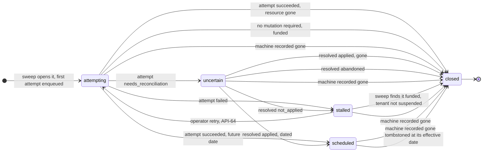

# 01 — Domain model

## Entities

### Tenant

An isolation boundary. Every machine and every operation belongs to exactly one tenant.

**DOM-1** A tenant identifier MUST be 1–128 characters of ASCII letters, digits, `.`,
`_`, `:`, or `-`.

**AMENDED 2026-08-31 — a grammar is not an identity rule.** A tenant identifier MUST be
**server-minted, globally unique, and never reused**, with enough entropy that it cannot be guessed
or collided with. The original stated only the character set, which says nothing about where an
identifier comes from or whether one can come round again.

That matters because of two deliberate decisions elsewhere. `STO-26` and `STO-29` remove the foreign
keys from `ledger_entries` and `deposits` to `tenants`, so a customer's money and payment
destinations survive the tenant row `API-34` reaps — and attribution is by **identifier**. So a
reused identifier does not merely collide: it hands a new caller a stranger's balance, their
retained deposits and their idempotency namespace. *Found by a cross-model review; the invariant was
assumed by three requirements and stated by none.*

**DOM-1a** **SETTLED by `ADR-0002`: the system maintains a tenant registry.** It owns tenant
records and their lifecycle — create, suspend, resume, delete, credential replacement — because
self-serve enrolment requires a tenant writable at runtime. *The no-registry branch below is
withdrawn; it described one reference implementation, and keeping it as a live option produced
requirements written for a deployment shape this product does not have.*

- **No registry — WITHDRAWN by `ADR-0002`, kept here as the record of what was rejected.** Tenant
  identifiers are opaque; the set of tenants is whatever the
  configured credentials say (`API-4`). Adequate when tenants are operator-configured and few.
  Consequence: nothing can verify that a tenant identifier arriving in a request names a real
  tenant — only that it is well-formed — so any front service passing tenants by header
  carries the entire tenancy boundary on an unverifiable string — a rule since swept with the
  shape it described.
- **Registry — the chosen branch.** The system owns tenant records and their lifecycle: create, suspend, resume,
  delete, credential rotation, and a defined answer for what happens to a suspended tenant's
  running machines. Required for self-serve enrolment, because a new tenant must be writable
  at runtime. Cost: account lifecycle is a real subsystem inside the process holding provider
  credentials.

*Note: earlier revisions of this document asserted flatly that no registry is maintained. That
was a description of one reference implementation — whose tenants came from a config file —
promoted to a property of the domain. It is not one. A self-serve deployment needs a registry
by definition.*

### Provider account

A configured set of credentials for one provider, addressed by a stable operator-chosen
`account_id`. Multiple accounts of the same provider kind MAY be configured (for
example one per region or per billing entity).

**DOM-2** `account_id` MUST be unique across the whole configuration. Startup MUST fail
on a duplicate.

**DOM-3** A provider account is a *global* resource, not a tenant-owned one. Because the
credentials it holds can reach every machine in that provider account, authorization to
act on a machine MUST come from the machine record, never from the ability to name a
provider account. See `SEC-6`.

### Machine

A machine known to the control plane, identified by an internal UUID and mapped to a
provider-side `external_id`.

| Field | Notes |
|---|---|
| `id` | Internal UUID, the only identifier clients use in URLs |
| `tenant_id` | Owning tenant |
| `provider_account` | Which configured account manages it |
| `external_id` | Provider-side identifier |
| `name` | Provider-side name or hostname |
| `kind` | `virtual` \| `bare_metal` |
| `state` | See below |
| `region` | Provider-defined location string, nullable |
| `public_ips` | Ordered; the first entry is the address used for rescue SSH |
| `metadata` | Redacted provider payload, for operator debugging |
| `created_at`, `updated_at` | Timestamps |

**DOM-4** **AMENDED.** `(provider_account, external_id)` MUST be unique **across all tenants**
(`STO-17`) — not merely within one. *The original added `tenant_id` to the key and then observed
that this "does not prevent two tenants from mapping the same external machine"; `F15` established
that permitting it lets each tenant destroy the other's server, so `STO-17` closed it and this
requirement was left stating the hole.*

**DOM-5** Clients MUST address machines only by internal UUID. `external_id` MUST NOT
appear in a URL path constructed by the client.

**DOM-6** `metadata` MUST be redacted before storage. Any object key whose lowercased
form contains `password`, `secret`, or `private_key`, or equals `token`, `api_key`,
`authorization`, or `credential`, MUST have its value replaced with a redaction marker,
recursively through objects and arrays. This list is a floor, not a ceiling.

### Machine state

A normalized state, mapped by each driver from provider-specific status strings.

| State | Meaning |
|---|---|
| `requested` | Ordered but not yet allocated by the provider |
| `provisioning` | Being built, deployed, or migrated |
| `running` | Powered on and allocated |
| `stopped` | Powered off |
| `rescue` | Running the provider's rescue environment |
| `rebuilding` | Native rebuild or reimage in progress |
| `deleting` | Deletion accepted, not yet complete |
| `cancellation_scheduled` | Cancellation accepted for a future date. **Still running, still reachable, still billing.** |
| `deleted` | Gone, or locally tombstoned |
| `failed` | Provider reports a terminal failure |
| `unknown` | Driver could not map the provider status |

**DOM-7** A driver MUST map an unrecognized provider status to `unknown` rather than
guessing. `unknown` is a legitimate outcome and MUST NOT block an operation that does
not depend on state.

**DOM-19** A machine whose deletion was accepted for a future date (`PRV-13`'s second shape)
MUST be `cancellation_scheduled`, never `deleted`, until that date passes — unless the resource is
independently recorded gone before it (`LDG-74`, `API-63`), which is evidence, not the acceptance.
Marking it `deleted` at accept time records a falsehood: the machine is still running, the customer can
still reach it, and the operator is still paying for it. The effective cancellation date MUST
be stored alongside the state, and any system reselling the machine MUST treat the window
between acceptance and that date as continuing cost.

**DOM-8** Machine state is a *cache* of provider truth, refreshed by explicit refresh
operations and opportunistically after actions. The system MUST NOT treat it as
authoritative when deciding whether a destructive action is safe; that decision belongs
to the caller, expressed through the destructive acknowledgement (`API-14`).

**AMENDED 2026-09-02 — one thing does refresh without a caller, and the cache now carries its own
age.** `OPS-32`'s account sweep reads each provider account independently of any caller and MUST
write what it saw (state, and `machines.state_observed_at`, `STO-48`). That is not a contradiction of
the sentence above — the state is still a cache and still not authorization for a destructive action
— but "refreshed by explicit refresh operations" was quoted by `LDG-74` and by `OPS-32` as the
*defect*: a machine created and never refreshed had no route by which the system could learn the
provider had destroyed it, and its owner's commitment drained regardless. **A reader MUST take the
staleness bound from `state_observed_at` rather than from the fact of a caller having asked.**

### Offer

A purchasable configuration: a cloud server type, a standard dedicated product, or an
auction/market listing.

| Field | Notes |
|---|---|
| `id` | Driver-scoped offer identifier, opaque to clients |
| `name` | Human-readable |
| `kind` | `virtual` \| `bare_metal` |
| `regions` | Where the offer can be placed |
| `currency`, `recurring_price`, `recurring_period` (`hour` \| `month`), `setup_fee` | Prices are strings to avoid float rounding. **Exactly one recurring price with its period, and one setup fee (`"0"` where the channel charges none), all required** — *until 2026-09-05 this row was two nullable prices and no setup fee, which could not carry Robot's per-location `price_setup` at all and let an offer with neither price pass as legal* |
| `install_strategies` | The offer's subset of `DOM-13`'s strategies, which **gates** them (`WIR-30`). Present on every offer; empty means no install is available for it |
| `max_image_bytes` | The ceiling `RSC-40` enforces against a caller-supplied image stream |
| `guest_requirements` | Prose the caller relays to whoever built the image; null where the strategy imposes none, non-null for `provider_catalogue` (`RSC-43`, `WIR-30`) |
| `min_runway_seconds`, `setup_fee_sats`, `max_rate_outage_seconds` | `PRV-13d`'s floor, `LDG-39`'s at-cost fee, and `LDG-64`'s disclosed bound (`WIR-30`) |
| `metadata` | Raw provider payload |

*The six rows after the prices were added 2026-09-02.* Every one of them is required on the wire by
`WIR-30` and load-bearing somewhere — `install_strategies` is a **safety gate** whose absence
authorizes a disk-wiping install (`05-persistence.md`), `max_rate_outage_seconds` discloses a second
trigger that destroys a machine — and none was in the entity this document defines. A caller reading
`01` learned the domain had an offer with a price and a name; a caller reading `13` received six more
fields with no entity behind them.

**DOM-9** Prices MUST be carried as strings exactly as the provider returned them.
Parsing them into floating point loses money.

**An offer carries exactly one recurring price and one setup fee, and where a provider prices per
location the driver MUST emit one offer per priced location, with a singleton `regions` and a
**distinct identifier that encodes the location** — never one product id shared across several
offers, which breaks any client keyed on it.** A
product with no price in the feed is not an offer and MUST NOT be listed. *Added 2026-09-05 from
`08-provider-notes.md`'s live pull: Hetzner Robot's standard catalogue carries a per-location
`prices[]`, each entry with its own `price` and `price_setup`, and two products were listed with an
empty array. One offer spanning several regions with one price pair either under-reserves the
expensive location or overstates the cheap one — on the channel where a setup fee runs to €1349 —
and an empty array had no legal price at all.*

Where a provider has more than one ordering channel, the driver SHOULD namespace offer
identifiers so the create path can route on them (for example `standard:` and `market:`
prefixes). This is a driver-internal convention; clients treat the identifier as opaque.

### Operation

A durable record of one requested mutation. This is the central entity of the system;
see `03-operation-lifecycle.md`.

### Episode

**DOM-31** An episode is one system-detected condition on one machine that provisiond must act on
until it ends (`ADR-0017`). Fields: `id`, `machine_id`, `key` (`delete` for an exposure-reducing
cancellation; the `system_reason` for every other trigger), `reasons` (set), `opened_at`,
`current_operation_id` (nullable), `state`, `closed_at`, `close_reason`. States: `attempting`,
`uncertain`, `stalled`, `scheduled`, `closed`. Close reasons: `resource_gone`, `funded`,
`abandoned`. At most one open episode per `(machine_id, key)`
(`STO-52`). An episode's attempts are ordinary operations; an attempt settling `failed` does not
close the episode. A machine recorded gone closes its open episode in the same transaction, and a
close is permanent (`ADR-0021`). `OPS-48` is the lifecycle; this is its shape.

<!-- formal: Provisiond.Render.dom31Diagram -->

<!-- /formal -->

### Rescue session

Ephemeral connection details for a provider's rescue environment: address, port,
username, authentication material, any host keys the provider published, an opaque
cleanup token, and an optional expiry.

**DOM-11** A rescue session carries a live credential. It MUST NOT be persisted, MUST
NOT be logged, and MUST NOT appear in an operation result or error. Its in-memory
representation MUST redact the credential in any debug or display formatting, and
SHOULD zero the credential when dropped.

**AMENDED 2026-09-02 — there is exactly one exception, it is `RSC-19`'s recovery key, and this
requirement owns it.** `RSC-19` requires the generated private key to be **persisted** whenever
rescue exit is uncertain, so that a machine stranded in rescue is still reachable; read against the
sentence above that is a straight contradiction between two MUSTs, and a builder resolves it by
picking one — either losing every stranded customer machine, or writing root credentials to disk
with no stated bounds. The exception is therefore stated here, with its bounds, so that the
prohibition remains readable as a prohibition:

- **Only the engine-generated single-use private key** (`RSC-10`), never a provider-supplied rescue
  password (`PRV-17`) and never any other field of the session. A password is the provider's to
  reset and ours to forget; the keypair is ours and is the only thing that can get back in.
- **Only when rescue exit is uncertain** — an ambiguous activation or a failed exit. *A caller
  that asked to be left in rescue was the third case until `RSC-18` was withdrawn, 2026-09-15.*
- **Only under `RSC-20`'s recovery directory**: absolute, owner-only, on encrypted storage
  (`STO-15`, `OVR-12`), inventoried and removable by a documented procedure (`RSC-21`).
- **The operation record gets neither the key nor its path** (`RSC-19`, `OPS-13`): the file is
  named by the operation id, so the location is derivable from what every operator surface shows. That is what keeps the
  rest of this requirement true: nothing reaches a log line, an operation result or an error.

*This is the shape `ADR-0005` uses everywhere else — the sensitive thing lives exactly as long as
the decision that needs it, and what survives is a reference. What was wrong was not the persistence;
it was that two documents each stated an absolute and neither named the other.*

### Abuse case

The operator's provider-neutral record of one **abuse notice**, and the only channel through
which a tenant learns that one of its machines has been complained about. See `CONTEXT.md` for
the notice/case distinction, `ADR-0012` for why nothing is relayed in either direction, and
`SEC-45` for the obligation it discharges.

**DOM-23** An abuse case MUST carry: the machine it concerns, an **operator-written**
provider-neutral summary of the allegation, an operator-written `warned_consequence` stating what
the notice threatened **at open** — never what is true now, which is `DOM-27`'s field on the
machine — a
single tenant-facing deadline, a state, and an append-only list of tenant statements. What must
never reach the customer surface is `WIR-45`'s, cited here rather than restated — a draft of this
requirement carried its own copy, and the two were already stricter than each other in different
directions.

**A case is created by an operator, never by a driver and never by a caller.** Hetzner exposes no
abuse-case API — `08-provider-notes.md` describes the process as "notice, deadline and manual
review" and names no endpoint — and **[verify]** the same is assumed of DigitalOcean, whose section
in that document is flagged as neither official nor dated. Either way an automated source would be
an email parser feeding untrusted input into an entity whose consequences reach a customer's
machines. *The `[verify]` matters only if it turns out false, and then it widens an option rather
than breaking a rule.* The operator reads the notice and transcribes it, which is also where the translation to
provider-neutral terms happens: **neutrality is produced by the act of rewriting, not by a mapping
table.** There is deliberately no allegation taxonomy; a closed class set invented before real
notices have been handled would put its own traffic in `other`.

**DOM-24** The states are `open` and `closed`, and nothing else. **Only an operator closes a case**, and
closing MUST record a provider-neutral outcome the tenant can read — an autonomous caller has no
other way to learn it can stop polling, and the provider gives the system no signal, no callback
and no API from which the end of a case could be inferred. **A closed case remains readable**, and
the collection returns closed cases on request — an outcome nobody can fetch is not an outcome.

*An `answered` state was specified and deleted on 2026-08-16. Nothing branched on it — `DOM-25`
bans timers, `DOM-26` bans restrictions, no requirement read it — and "the tenant has replied" is
derivable from the statements. What it did do was silently outlaw the second statement: every rule
governing submission and visibility said "while the case is **open**", and a case stopped being
open the instant the tenant answered, so the late correction `STO-40` exists to capture was the one
an implementer would reject. A state that no rule consumes can still be consumed by the word it
occupies.*

**DOM-25** **The deadline has no hands.** Its passing with no statement MUST NOT suspend the
tenant, cancel the machine, seal the case, or alter a balance; it makes the case *unanswered*,
which is a fact for the operator to act on. *This is a rule about **consequences**, not about
clocks: `STO-42`'s retention timer is required, and an earlier phrasing — "nothing about an abuse
case fires on a timer" — forbade it while `ADR-0005` demanded it.* The asymmetry is the reason: a
timer-fired suspension destroys a paying customer's whole fleet because a program stopped polling,
while the cost of doing nothing is the provider blocking one machine — its own routine remedy,
which `LDG-71` already accounts for. `API-58`'s suspension remains available and remains the
operator's own decision (`SEC-45`).

**DOM-27** **Whether a provider has restricted a machine's network is a fact about the machine, not
about a case, and it MUST NOT be a `DOM-7` state.** It has one home — the machine — carrying a
status (`none` | `restricted` | `disabled` | `unknown`), the **source** that established it
(`provider_api` | `operator_notice`) and when it was observed (`STO-44`, `WIR-47`).

**It is not a lifecycle state**, and that is the durable reason rather than a contingent one: a
restricted machine is still `running` or `off`, `DOM-7` is single-valued, and collapsing the two
destroys the state `LDG-37` reads to decide what is billable. Providers also restrict per address
family — Hetzner Cloud exposes `blocked` separately for IPv4 and IPv6 **[verify]** — so even a
boolean would lose information a single enum value cannot carry.

**It is not a field on the abuse case**, for a reason the schema makes concrete: a machine may have
more than one case open at once (`STO-39`), and two cases carrying two answers to one physical
question leave a caller no rule to resolve them. It also has to exist where no case does — an
account-level action (`SEC-41`) darkens every machine in the account and opens no case at all.

**Why a caller needs it stated rather than inferred.** An agent observing `state: "running"`, a
draining `runway_until` and its own connections timing out will conclude the machine is *sick* —
and the remedies for a sick machine are reset, rescue and **install**, which `CONTEXT.md` defines
as destructive by definition. The signal's job is to **stop** a remediation loop that would wipe a
customer's disk trying to fix a network block no reinstall can lift, while runway drains through
every attempt. `DOM-26` already names delete as the tenant's remedy and, without this, gives the
agent nothing to trigger it.

**DOM-26** An open case MUST NOT restrict what the tenant may do. It does not block creates,
installs, extensions or deletes — **least of all deletes on the accused machine**, which are the
tenant's own remedy for both the allegation and the bill (`LDG-71`). *Stated because the intuition
runs the other way, and a freeze written in later would remove the one action that stops the
offending traffic.*

## Image sources and installation strategies

The two are separate axes. An *image source* says what to install; a *strategy* says
how to get it onto the disk.

| Image source | Fields |
|---|---|
| `catalog` | `image` — a provider catalog identifier |
| `rootfs_tarball` | `url`, `sha256`, `format` (`tar`, `gzip`, `bzip2`, `xz`, `zstd`) |
| `raw_disk` | `url`, `sha256`, `compression` (`none`, `gzip`, `xz`, `zstd`, `bzip2`) |
| ~~`ipxe`~~, ~~`iso`~~ | **Both withdrawn from v1** — see `DOM-22` |

| Strategy | Meaning |
|---|---|
| `rootfs_via_rescue` | Boot rescue, fetch a root filesystem archive, run the provider's OS installer with a generated layout config |
| `raw_disk` | Boot rescue, stream a raw image to a named block device |
| `provider_native` | Use the provider's own rebuild or boot API against an image already in its catalogue |
| `provider_catalogue` | Import the caller's image into the operator's private catalogue at the provider, then have the provider build the machine from its own converted copy (`DOM-28`) |

**DOM-13** Only these pairings are valid; everything else MUST be rejected with an
invalid-request error before the operation is enqueued:

| Strategy | Valid image sources |
|---|---|
| `rootfs_via_rescue` | `rootfs_tarball` |
| `raw_disk` | `raw_disk` |
| `provider_native` | `catalog` (~~`ipxe`~~ and ~~`iso`~~ withdrawn, `DOM-22`) |
| `provider_catalogue` | `raw_disk` — the same caller input as a rescue raw-disk install, delivered by a different mechanism and with a different promise (`DOM-28`) |

A valid pairing is necessary and not sufficient. Capabilities are per **provider account**
(`DOM-10`), but rescue-install eligibility is a property of the **offer** — an auction listing and
a standard product at the same provider can differ — so the offer's `install_strategies`
(`13-wire-contract.md`, `WIR-30`) gates this table as well, and a strategy absent from it MUST be
rejected the same way. **The gate reads the machine's own copy of that list** —
`machines.install_strategies`, taken from the offer at create and never re-resolved
(`05-persistence.md`, `WIR-30`) — **not the offer as it stands at install time.**

**DOM-28** **Catalogue install is a separate capability from rescue install, and the promises
differ.** Both put a caller-chosen image on a machine, and that is all they share. `ADR-0013` holds
the decision; this is what a reader of the domain needs.

| | Rescue install | Catalogue install |
|---|---|---|
| Whose bytes reach the disk | the caller's, verbatim | the provider's conversion of them |
| Digest verified by provisiond | yes, before writing (`RSC-25`) | **the caller's copy is verified in transit** (`RSC-39`); what the provider writes is not |
| Guest requirements | none — any bootloader, any filesystem | whatever the provider imposes, disclosed per offer (`WIR-30`) |
| Disk layout | caller-controlled (`RSC-22`) | whatever was baked into the image |
| If the machine comes up wrong | boot rescue and fix it | there is no way back in |

**They MUST NOT be collapsed into one strategy.** A single name would let a caller believe its bytes
were checked onto the disk when nothing checked them, and let it send an image valid on one provider
to another that cannot boot it. `WIR-30`'s per-offer `install_strategies` is what tells a caller
which it is getting, and `DOM-10`'s capability is what stops a driver offering one it cannot do.

**DOM-29** **A machine MUST record how it was last installed**, as `last_install`: the strategy
used, whether provisiond verified the bytes, and when. It is a fact about the machine, not about the
operation, and it lives on the machine row (`05-persistence.md`).

**It has to live there because the operation that knows will be deleted.** `STO-14` removes settled
operations on a configured age while the machine keeps running, so a long-lived machine would
outlive the only record of how it came to be. This is the third fact that had to outlive the
operation for that reason — `OPS-39`'s deduplication, now an episode row of its own (`STO-52`), and
`STO-43`'s retention ages were the first two — and the pattern is recorded rather than rediscovered.

**What it is for:** an agent facing a machine it cannot reach needs to know whether anyone verified
these bytes and whether there is a rescue path back into this provider at all. Without it the only
remedy it can reason its way to is install, which on a catalogue-install provider is both the sole
remedy and the likely cause. That is `DOM-27`'s argument arriving at a second surface.

**DOM-30** **ADDED 2026-09-03. A machine's permitted install strategies MUST be readable by its
owner** — the machine's own copy (`machines.install_strategies`), rendered on the machine view
(`WIR-11`), present on every machine and **empty where no install is permitted**. It is the frozen
copy the gate evaluates, never the offer's list as it stands now, which is the distinction `DOM-13`
already draws for the server and this requirement extends to the caller.

**The gate reads a list the caller has no way to verify, and on one path no way even to guess.** An
install naming an ineligible strategy is refused — but a caller that guesses *right* wipes the disk,
and the request carries `acknowledge_destruction: true` (`API-14`) either way, so nothing available
before the send tells the two apart. Three paths, three different reasons:

- **An ordinary create.** The machine copies the offer's list **as it stood when the request was
  accepted** (`OPS-13`), and an offer is "a live listing that can change or disappear between the
  two" (`WIR-30`). A caller that read the offer beforehand may well hold the right list — but
  nothing binds its read to the accepted snapshot, and nothing reports a drift between the two.
- **A machine attached by resolution.** It takes the create's retained snapshot (`OPS-13`), and the
  caller never saw that snapshot — the request that produced it was purged on entry to
  `needs_reconciliation` (`ADR-0005`). A create has one attempt and one snapshot (`ADR-0014`), and
  one list the caller cannot see is still a list the caller cannot see.

**On those paths this is `API-47`'s argument arriving at a destructive verb.** No endpoint returned a
balance until 2026-08-12, so a caller could learn its own solvency only by attempting a purchase and
reading the rejection; `CNF-150` exists because making an ordinary check into a failed write
pushes an autonomous caller toward retrying purchases. The same shape pushes it toward issuing an
acknowledged install to find out whether installs are allowed.

*This paragraph was wrong twice on 2026-09-03 and the pair is the lesson, so both are recorded.
**Version one** said "both routes are closed" because `WIR-30` forbids a caller trusting what the
offer said at create — and `WIR-30` says no such thing: it forbids the **server** re-resolving the
**live** offer at install time and mandates the create-time copy. **Version two**, written to correct
that overstatement, scoped the claim to "two paths" and was wrong in both directions at once: it
conceded an ordinary create's caller "could have retained the accepted offer's list, which is the
same list the machine copied", which `OPS-13`'s **accepted** snapshot does not guarantee; and it
named every resolution attachment, where only one path — since deleted by `ADR-0014` — ever had more
than one snapshot to choose between. Narrowing an overstatement is not the same as making it true, and the second attempt
produced a fresh false claim of its own — caught by the same reviewer, at the same effort, on the
pass that was verifying the first correction. Overstating a requirement's necessity is how `CNF-224`
came to fail every conforming implementation; this is what the other direction costs.*

*This adds a read, not a fact: the list is already recorded, already frozen at create and already
authoritative. `DOM-29` was added for the neighbouring reason, and the two together answer an agent's
two questions about a machine it cannot reach — what was done to this disk, and what may still be
done to it.* **A client MUST NOT fall back to the offer's list or to the provider account's declared
capabilities when the array is empty** (`DOM-10`): capabilities are per account and eligibility is
per product, which is the substitution `05-persistence.md` refuses for the same reason.

**DOM-14** A digest MUST be required for `rootfs_tarball` and `raw_disk`, and MUST be
exactly 64 hexadecimal characters, compared case-insensitively. The inventory fingerprint a rescue
install binds its target to is a digest of a different thing, and `RSC-46` owns its canonical form
and the normalisation of the device identifier beside it.

## Capability model

Capabilities are the contract between clients and drivers. A driver declares the set of
things it actually supports operationally — not the set of things the provider's API
documents.

| Capability | Grants |
|---|---|
| `provision_virtual` | Creating virtual machines |
| `provision_bare_metal` | Creating/ordering dedicated machines |
| ~~`adopt_existing`~~ | **Withdrawn from v1 with its whole surface** (`ADR-0020`) — no launch driver can price a machine it did not buy, so no launch driver declares it |
| `delete_machine` | Deleting/cancelling a machine |
| `power_control` | Power on, power off, soft reboot |
| `hard_reset` | Out-of-band hard reset |
| `native_rebuild` | Rebuild from the provider catalog |
| `rescue_ssh` | Activating a rescue environment reachable over SSH |
| `install_rootfs_via_rescue` | The provider's OS installer accepts a root filesystem archive |
| `install_raw_disk_via_rescue` | A raw image can be streamed to a block device in rescue |
| `install_via_provider_catalogue` | A caller-supplied image can be imported into the provider's own catalogue and built from (`DOM-28`) |
| ~~`custom_ipxe`~~ | **Withdrawn from v1 with its whole surface** (`DOM-22`) — no launch driver declares it |
| `list_offers` | Enumerating purchasable offers (`DOM-22`) |
| `reverse_dns` | Setting PTR records for assigned addresses |

**DOM-10** Every operation with a capability MUST be gated on it before the
driver is called, **including create**; the driver methods with no capability entry are the ones
`PRV-4` names. There MUST be no operation whose only gate is
a driver-internal check. A capability check failure MUST return an "unsupported" error
naming the provider account and the capability.

Mapping from operation to required capability:

| Operation | Required capability |
|---|---|
| create machine, `kind = virtual` | `provision_virtual` |
| create machine, `kind = bare_metal` | `provision_bare_metal` |
| refresh | none — every driver MUST implement machine lookup |
| power on/off/reboot | `power_control` |
| hard reset | `hard_reset` |
| install, `provider_native` + `catalog` | `native_rebuild` |
| list offers | `list_offers` |
| rescue inventory | `rescue_ssh` (`RSC-38` boots rescue to read the inventory) |
| install, `rootfs_via_rescue` | `install_rootfs_via_rescue` |
| install, `raw_disk` | `install_raw_disk_via_rescue` |
| install, `provider_catalogue` | `install_via_provider_catalogue` |
| reverse DNS | `reverse_dns` |
| delete | `delete_machine` |
| release attachment | `delete_machine` — a driver that can delete a machine can release what it left behind (`PRV-45`) |

**DOM-22** Three edits to the capability model on 2026-08-12, closing the rest of `F10`:

- **`remote_console` is withdrawn.** Console proxying is a stated non-goal (`00-overview.md`),
  so the capability had no operation behind it and never could — a declared capability with no
  reachable code path is exactly what `DOM-15` calls a defect.
- **`attach_iso` and the `iso` image source are withdrawn from v1.** No driver operation for
  attaching boot media was ever specified, and no launch-set provider (`ADR-0010`) exposes
  arbitrary caller-supplied ISO attachment. The pairing returns only with a specified driver
  operation behind it.

**AMENDED 2026-08-31 — `custom_ipxe`'s surface is swept, not merely deferred.** Striking the
capability row on 2026-08-12 left everything downstream of it in place: an image source, a pairing,
a capability mapping, a whole *Boot iPXE* driver operation with `PRV-24` behind it, an `API-13`
validation row, a `WIR-20` body variant and a tier assignment — six documents describing a path no
launch driver can declare, which a builder would implement before discovering nothing can reach it.
All of it is deleted. `PRV-24` is in the README's withdrawn-identifier index. **iPXE returns with a
driver that declares the capability, and it returns as one edit rather than six.**
- **`list_offers` is added.** The offers endpoint previously documented itself as having no
  capability, which contradicted `OVR-2`'s rule that capability is discoverable rather than
  inferred — a caller had no way to know whether an empty offer list meant "nothing for sale"
  or "cannot enumerate".

**DOM-15** A capability that is declared but whose code path returns "unsupported" is a
defect. Declaration and implementation MUST agree; the conformance checklist tests this
(`10-conformance-checklist.md`).

**DOM-16** Ordering capabilities (`provision_virtual`, `provision_bare_metal`) for
providers that bill per order SHOULD be conditional on an explicit per-account
`allow_orders` configuration flag, so that a misconfigured deployment cannot spend
money. This is in addition to, not instead of, the per-request purchase acknowledgement
(`API-15`).

## Error taxonomy

One closed set of error kinds, used by drivers, the rescue engine, and the API alike.

| Kind | Meaning | HTTP |
|---|---|---|
| `invalid_request` | Caller error, deterministic | 400 |
| `not_found` | Named resource does not exist | 404 |
| `conflict` | State or idempotency conflict | 409 |
| `unsupported` | Capability not declared or not implemented | 501 |
| `authentication` | Caller or provider credential rejected | 401 |
| `rate_limited` | Caller or provider throttled | 429 |
| `provider` | Provider returned an error response | 502 |
| `network` | Transport failure reaching the provider | 502 |
| `timeout` | Operation exceeded its deadline | 502 |
| `integrity` | Digest or host-key verification failed | 422 |
| `internal` | Defect in this system | 500 |
| `insufficient_balance` | Available balance cannot fund the required commitment (`LDG-9`) | 402 |
| `not_activated` | Tenant exists but is still pending funding (`API-35`) | 403 |
| `halted` | Refused because a solvency or rate-availability gate is failing (`LDG-20`, `LDG-40`) | 503 |
| `gone` | Resource existed and was removed by retention (`STO-14`, `STO-33`) | 410 |
| `suspended` | Tenant is suspended; only the maintenance actions remain (`API-58`) | 403 |
| `ceiling_exceeded` | A per-principal ceiling for the current interval is exhausted (`SEC-39`) | 429 |
| `overloaded` | The replica obtained no store connection within the checkout bound; refused before any transaction (`STO-55`). Retryable; the refusal leaves no receipt of its own | 503 |

**DOM-21** The `gone` row was added 2026-08-12, by the append-only rule rather than by a handler
inventing a status. A caller polling an operation id past the retention horizon would otherwise
receive `not_found` — indistinguishable from "never existed," which for an autonomous caller
suggests the write was lost and invites a re-send. `gone` says the opposite: it existed, it
reached a terminal state, and the record aged out; the safe reaction is to consult the machine
list and balance, never to re-issue.

**DOM-20** Five rows in the table above were added after the original taxonomy was written:
`insufficient_balance`, `not_activated` and `halted` by this requirement, `gone` by `DOM-21`, and
`suspended` by `API-58`. `DOM-17`'s set is closed and `API-24`
forbids a handler choosing a status independently, so before the first three existed **four
conformance items asserted a rejection this taxonomy could not express** — `CNF-95` (insufficient
balance), `CNF-78` (tenant still pending), `CNF-69` (ceiling), `CNF-101` (solvency halt) — and
every one of them would have arrived at the caller as `invalid_request` / 400.

That distinction matters more here than in an ordinary API. The caller is an autonomous agent,
and **"top up" and "fix your request" are different actions.** Collapsing them means a correctly
formed create that merely needs money is indistinguishable from a malformed one, so the agent's
only recovery is to mutate its request and retry — which is how a retry loop becomes a duplicate
purchase.

**AMENDED 2026-09-02 — a sixth row, `ceiling_exceeded`, because the taxonomy was extended for three
of those four items and not for the fourth.** `SEC-39` requires server-side ceilings per principal —
machines destroyed, machines created, images
written, rescue entries, power cycles, spend, and for an operator principal retries (`API-64`), resolutions,
suspensions and re-assignments — and **this taxonomy had nothing that could express refusing one**,
while `API-24` forbids a handler choosing a status independently. `CNF-69` is the ceiling item named
in the list above; it has stood throughout, against a set of kinds that could not carry its
rejection.

**It is not `rate_limited`, and the difference is exactly the argument this requirement already
makes.** Both say "not now", and an agent's response to each is genuinely different: a rate limit is
about *load* and clears in milliseconds under the deployment's own control, so backing off is the
whole answer; a ceiling is about *authority* over a stated interval — an hour by default — and
clears only when the interval rolls, however gently the caller asks. Collapsing them means an agent
that has hit its destruction ceiling retries a delete every few seconds for an hour, and an operator
reading `429` cannot tell a busy server from a principal that has spent its budget. "Wait a moment"
and "you are out of allowance" are different actions in the same way "top up" and "fix your request"
are. The HTTP status is shared with `rate_limited` because 429 is what both mean to an
intermediary; the **kind** is what the agent branches on, which is the whole point of `DOM-17`
carrying one.

**ADDED 2026-09-12 — a seventh row, `overloaded`, and it is not `rate_limited` either.** `STO-55`
makes the connection pool the bound on `api` concurrency and refuses a request that obtains no
connection within the checkout bound. That refusal is about the *replica's* capacity, not the
caller's rate. `API-50` allows a non-rate `429` that "MUST say so in its `kind`", and `503` was
chosen over that because an intermediary reads `429` as the caller's doing and `503` as the
server's, which is what this is; and it is not `halted`, which `WIR-9a` reserves for the solvency
and rate gates. It is admission-only (`OPS-11`): nothing was written and the refusal leaves no
`STO-35` receipt, so a re-send is judged against whatever an earlier send left.

**DOM-17** Every error MUST carry a kind, a human-readable message, a boolean
`retryable`, and a structured `details` object. `retryable` describes whether repeating
the *same request* is safe and sensible. **It is normative guidance to callers** (`API-51`) —
never authorization for an automatic service retry, and no substitute for an operator's `API-64`
retry of a stalled episode. It MUST NOT be
used by the system to retry automatically (`OPS-12`).

**DOM-18** `details` MUST be redacted with the same rules as `DOM-6` before it is stored
or returned. In particular, a provider response body captured into `details` MUST be
redacted regardless of whether the response was a success or a failure. See `DEF-3`.
