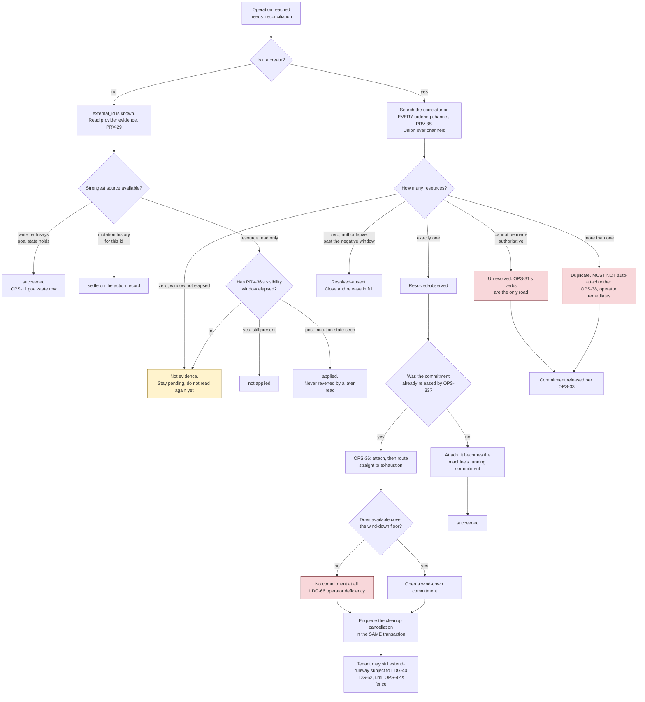

# 03 — Operation lifecycle

This is the core of the design. Everything else is plumbing around it.

## Why operations exist

A provisioning call can take minutes, can cost money, and can destroy data. The HTTP
request that triggers it can fail at any point — including *after* the provider has
already acted. A control plane that returns the provider's answer synchronously has no
way to tell "the order did not happen" from "the order happened and I lost the reply",
and a control plane that retries on failure will eventually buy two servers.

So every write becomes a durable record with an explicit settled state — plus a third state,
*I do not know*, which is resolution-pending rather than terminal (`OPS-3`): no retry and no
timer leaves it, though evidence does (`OPS-27`).

**OPS-1** Every mutating request MUST create or return a durable operation record before
any provider call is made, and MUST respond `202 Accepted` with that record.

**OPS-2** **AMENDED 2026-08-12.** An operation record MUST persist the full request payload
**while the operation is live**, so a worker can execute it after a process restart without the
original HTTP request. On entry to any settled state — **and to `needs_reconciliation`**
(`OPS-3`) — the payload is purged and replaced by a redacted summary (`ADR-0005`, `STO-9`).

The original text said "MUST persist the full request payload" without qualification, and
`ADR-0005` narrowed it in a different document without editing this sentence — leaving two
normative statements with opposite meanings. Nothing re-executes a purged payload: the operation
is one attempt, and a later attempt is a fresh operation (`ADR-0017`).

**OPS-35** The provider account MUST be resolved and written to the operation record **before**
any driver call. `05` marks it nullable, and a create whose reply is lost is precisely the case
where reconciliation must know which account to search — a search that cannot begin if the
account was only ever determined inside the call that vanished.

## States

| State | Meaning | Terminal |
|---|---|---|
| `queued` | Waiting for a worker | no |
| `running` | Claimed by the engine, whose settled-state writes are guarded on this status and the claim number, and admit their own repeat (`STO-3`) | no |
| `succeeded` | Completed; result recorded | yes |
| `failed` | Completed unsuccessfully — deterministically, or resolved so under `OPS-31`. Asserts that the requested mutation did not complete, and nothing about its side effects (`OPS-3`, *2026-09-15*) | yes |
| `needs_reconciliation` | Outcome unknown; resolution pending (`OPS-3`) | **no** — settles to `succeeded` or `failed` |

```
                    +----------+
   enqueue -------->|  queued  |<---------------------+
                    +----+-----+                      | defer (machine held, OPS-8)
                         |                            | suspend_tenant parent found
                         | claim (OPS-5)              |   running at startup (OPS-15)
                         v                            |
                    +----------+---------------------+
                    | running  |-----------------------> needs_reconciliation
                    +----+-----+   found running at startup (OPS-15)
                         |
        +----------------+----------------+
        |                |                |
   success           failure          ambiguity
        |                |                |
        v                v                v
  +-----------+    +----------+   +----------------------+
  | succeeded |    |  failed  |   | needs_reconciliation |
  +-----------+    +----------+   +----------+-----------+
        ^                ^                   |
        |                |                   | resolved observed/applied -> succeeded
        +----------------+-------------------+ resolved absent/not_applied/
                                                 abandoned -> failed

   queued --- tenant suspended, never claimed (API-58) ---> failed, error conflict
                                                            (details.reason tenant_suspended;
                                                             requested_by stays caller)
```

`needs_reconciliation` is **resolution-pending, not terminal** (`OPS-3`): it settles by evidence
(`OPS-27`) or by an operator verb (`OPS-31`), and by nothing else — no automatic retry of the
mutation, no timer, no caller action. `OPS-27`'s evidence sweep is itself automatic and does move
the state; what the system MUST NOT do automatically is retry (`OVR-5`).

**OPS-3** **AMENDED 2026-09-12 (`ADR-0022`) — the worker's guard is the operation's status and
its claim number, and a repeat of the worker's own write is admitted.** `needs_reconciliation` is
*resolution-pending*, not terminal; `succeeded` and `failed` are the terminal states. **`failed`
asserts that the operation did not complete, and nothing about its side effects** (*added
2026-09-15, `pv-x8r`*): a `failed` install may have partitioned its disk, a `failed` delete may have
been dispatched. The one positive record that nothing took effect is `OPS-31`'s `not_applied`, in
the resolution column, and `abandoned` reaches `failed` having established nothing — so the state
alone never carries either claim. What an install did to its disk is `OPS-45`'s marker's fact, and
`WIR-9a`'s `disk_effect` renders it to the caller, who sees neither the marker nor a verb. **A
transition made *by a worker* MUST be guarded on that operation still being `running` under the
claim number the worker holds** (`STO-3`, `OPS-6`), and the guard MUST admit the row the same
write already produced, so that a write repeated under `OPS-49` after a lost reply affects one row
and changes nothing; a worker whose guarded write affects no row has been overtaken — by
`OPS-15`'s startup pass after a restart, or by a later claim of the same operation after an
`OPS-8` defer — and MUST NOT overwrite the record. *Until 2026-09-12 the guard was the status
alone; the epoch that briefly replaced the lease is deleted (`ADR-0019`).*
**Resolution transitions out of `needs_reconciliation` are made by no worker** — by `OPS-27`'s
sweep or `OPS-31`/`WIR-35`'s operator verb — and are guarded instead by `STO-19`'s write-once
resolution columns. Scoping the worker clause is required, not stylistic: read unscoped it forbids
the operator verb, which no status guard fits.

*Calling it terminal contradicted every requirement that resolves it.* `OPS-27` transitions it
automatically on a correlator match, `OPS-31`/`WIR-35` transition it by operator verb, and `OPS-4`
forbade both by forbidding transitions out of terminal states. The permitted transitions are
exactly:

```
needs_reconciliation --resolved observed (create)--> succeeded
needs_reconciliation --resolved applied (non-create)--> succeeded
needs_reconciliation --resolved absent (create)--> failed
needs_reconciliation --resolved not_applied (non-create)--> failed
needs_reconciliation --resolved abandoned (any kind)--> failed
```

*The two non-create rows were added 2026-09-02 with `OPS-45`. They are not new transitions — the
states either side are unchanged — but the list says "exactly", so a verb missing from it is a verb
`OPS-4` forbids.*

**What was actually load-bearing about "terminal" survives unchanged**, and it is `OVR-5`: the
system MUST NOT retry the mutation automatically, MUST NOT clear the state on its own timer, and
MUST NOT let a caller drive it. Only evidence (`OPS-27`) or an operator (`OPS-31`) moves it. The
caller-facing `terminal` flag (`WIR-10`) is `false` in this state, and `retryable` is `false`
(`API-51`) — the operation is not finished, and it is not the caller's to retry.

The payload purge (`ADR-0005`) happens **on entry** to `needs_reconciliation` rather than at a
terminal state, and that is an explicit privacy exception recorded here so a reader does not
find it contradictory.

**OPS-4** **AMENDED 2026-09-08 (`ADR-0017`) — there is no operator transition out of a terminal
state either.** There is no automatic transition out of a terminal state. A `failed` operation is
re-issued by its caller (`OPS-28`, `API-51`) or, where it is an attempt under an episode, by the
episode's `retry` (`OPS-48`, `API-64`) — in both cases a fresh operation, never this record moved
back to `queued`.

## Claiming

**OPS-47** **AMENDED 2026-09-08 (`ADR-0019`) — the supervisor is the guarantee, and the engine
checks at boot that it is alone.** The engine MUST run as exactly one process under an external
supervisor that restarts it and never runs two. **That is a deployment obligation and not a
property this specification enforces** (`OVR-19`): where two engines run, nothing here refuses the
second, and both will work the queue. A supervisor guarantees it never *starts* two; it cannot
guarantee the first is dead, so a node cut off from its supervisor while it still reaches the
provider is out of scope and is the operator's to notice (`OVR-18`).

Before any claim the engine MUST take `STO-51`'s session-scoped advisory lock on a connection
outside the pool and hold it for its lifetime. Where the lock is refused it MUST retry for the
stated bound (`OVR-19`) and then exit non-zero having done no work; where the connection carrying
it is lost it MUST exit. **The lock is not a fence**: no write is guarded on it, holding it proves
nothing about the past, and losing it invalidates nothing already written. It answers one question,
once, at boot — is somebody else already here — and a refusal is a misconfigured deployment, which
is how two engines actually happen.

*The withdrawn form guarded every engine write on an `engine_epoch` the claiming process had
stamped itself, so the term held by construction and could not fire; `ADR-0019` has the analysis.
A supervised restart is caught without it, by `OPS-15`'s startup pass and `STO-3`'s
`status = running` term. The restart window is the accepted outage, and it is alarmed (`OVR-18`).*

**OPS-5** **AMENDED 2026-09-08 (`ADR-0019`).** Claiming MUST be atomic: selecting the next eligible
operation and marking it `running` MUST happen in one indivisible step, which also increments and
returns the claim number (`OPS-6`). No claim carries a deadline; a `running` operation stays claimed until it
settles, defers under `OPS-8`, or the startup pass finds it (`OPS-15`).

**OPS-6** **AMENDED 2026-09-12 (`ADR-0022`) — the counter is the claim number, and it is what
tells two executions of one operation apart.** The claim MUST select the oldest `queued` operation
whose availability time has passed. The claim MUST increment the operation's **claim number**
(`operations.claim_number`, `05-persistence.md`) in the same indivisible step and return it to the
worker that claimed it, and every write that worker makes to the operation MUST carry
`claim_number = mine` (`STO-3`). A claim the per-machine index refuses (`OPS-8`) never left
`queued` and does not advance the number.

The case the term exists for, stated so it can be checked: execution A defers the operation under
`OPS-8`, its write commits and the reply is lost; execution B claims the row and the number
advances; A repeats its defer under `OPS-49`. Both rows read `running`, so the status term passes,
and the claim term is the only thing that refuses A's write. The value has a second writer that is
not the write being guarded — the later claim — which is what separates it from the epoch
`ADR-0019` deleted. **The number identifies a claim and nothing else**: it bounds nothing, routes
nothing, is not an attempt count — an operation is one attempt (`OPS-2`), however many times it is
claimed — and is not a fence against a second engine, of which `OPS-47` says "where two engines
run, nothing here refuses the second". *Until 2026-09-12 the column was `attempts`, "Attempt
count MUST be incremented on claim", which read as a count of the thing `CONTEXT.md` calls an
attempt while `CNF-288` says a create has no second one by any path.*

## Per-machine serialization

**OPS-8** **AMENDED 2026-09-08 (`ADR-0016`) — the rule is a store constraint, not a lock.** At
most one `running` operation that is not yielded may name a machine at a time, enforced by
`STO-51`'s partial unique index over `operations(machine_id) WHERE status = 'running' AND
yielded_at IS NULL`. Concurrent install, power, delete, and refresh operations on one machine are
not merely wasteful, they are dangerous. A claim (`OPS-5`) that the index refuses because another
running operation holds the machine MUST return the operation to `queued` with a short delay
rather than fail it — the conflicting work will finish.

**One named, bounded phase runs with the machine released.** `RSC-41`'s import-and-poll works on an
image in the operator's catalogue and never on the machine; it is today the only such phase, and a
second needs a requirement naming it. The operation expresses it by setting
`operations.yielded_at` before the phase and clearing it after, and the clear is a conditional
write that the index refuses while another running operation holds the machine — in which case the
operation MUST defer with a short delay, as above. It MUST **re-validate** after re-acquiring
(`OPS-23`): the machine may have been installed, powered or cancelled in the gap, and an
exposure-reducing cancellation taking the machine during an import is the *intended* behaviour
(`CNF-266`). Any such phase MUST be bounded by a stated maximum (`RSC-41` states one).

**A defer is a worker write and a re-claim is a new claim** (added 2026-09-12, `ADR-0022`). The
defer — `running` back to `queued` with `available_at` advanced — is `STO-3`'s fifth guarded
write, on `(id, status = running, claim_number = mine)`, and where it affects no row the meaning is
"already deferred, or already claimed again"; the worker moves on, and does not exit as it would on
a settled-state write (`OPS-22`). The operation is then claimed again through `OPS-5` with a new
claim number, by whichever worker takes it. Clearing `yielded_at` after a phase that yielded the
machine is the *same* execution continuing and carries the same number.

*Why not simply hold it throughout: `PRV-13b` puts the deployment's worst-case operation hold
inside `wind_down_cost`, which sizes the reserve on **every machine in the fleet**, so an unbounded
provider import queue on one driver would raise the commitment every customer must post before
buying anything.*

## Classifying failures — the ambiguity rule

This is `OVR-5` made concrete.

**OPS-11** On failure, the system MUST classify the error into `failed` or
`needs_reconciliation` using the operation kind and the error kind:

| Operation | Classification rule |
|---|---|
| refresh | Always `failed`. It is read-only; a failure changed nothing. *The row read "adopt, refresh" until `ADR-0020` withdrew adopt from v1.* |
| suspend_tenant | Never `needs_reconciliation`, and never `failed` as a whole. It is a parent whose per-machine children carry their own outcomes (`WIR-39`), and it settles `succeeded` once every child has either settled or **reached `needs_reconciliation`** — a child that reached that state counts as complete for the parent. `needs_reconciliation` is not itself settled (`OPS-3`); it is a state only evidence or an operator moves, so an unresolved child is a child-level fact, and blocking the parent on it would leave every suspended tenant's record permanently open. |
| rescue inventory | Same rows as `install`. It is **not** read-only in the relevant sense: it boots the machine into rescue, so an ambiguous failure can strand it there, and `PRV-22` makes an end-rescue failure always ambiguous. Classifying it with `refresh` would mark it `failed` while the machine sits in rescue. |
| install | `needs_reconciliation` for `network`, `timeout`, `provider`, `internal`, `conflict`, and `integrity` **once the write-started marker is set** (`OPS-45`). `failed` for the deterministic caller errors `invalid_request`, `not_found`, `unsupported`, `authentication` and `rate_limited` **where no rescue session was left open** (the paragraph below), **and for any failure at all while `OPS-45`'s two markers say the disk is untouched and no rescue session was left open** — including `integrity` before the connection, which is `RSC-3`'s host-key abort. An install that got further than that may have begun overwriting a disk, or may have left the machine in rescue; one that did neither, provably did neither. **`failed` past the write-started marker, where rescue exited cleanly, asserts that the install did not complete and nothing about the disk** (*2026-09-15, `pv-x8r`*): the deterministic caller kinds stay `failed` there because the engine knows what it did — an installer that rejected the layout it had begun partitioning for is a known outcome — and `needs_reconciliation` is the state for an outcome nobody knows (`CONTEXT.md`), whose only truthful verb here would be `abandoned`, which settles `failed` after a human looked. It does not mean `not_applied`, which `OPS-31` refuses there. What the disk holds is `OPS-45`'s marker's fact, rendered to the caller as `WIR-9a`'s `disk_effect`; the state does not carry it. |
| create, power, reverse-DNS, delete, release attachment | `needs_reconciliation` if the failure is *ambiguous*, otherwise `failed`. A release is a delete of a smaller thing (`PRV-45`) and classifies exactly as one. |

**The table MUST be total, and seven kinds added later were missing.** `insufficient_balance`,
`not_activated`, `halted`, `gone`, `suspended`, — added 2026-09-02 — `ceiling_exceeded`
(`DOM-20`, `DOM-21`, `SEC-39`) and — added 2026-09-12 — `overloaded` (`STO-55`) are
**admission-only**: they are decided
before any driver call, they MUST NOT be emitted by a worker or a driver, and any pre-provider
occurrence classifies deterministically as `failed` for every operation kind. Nothing was
destroyed and nothing was ordered, so ambiguity cannot arise. Every kind in `DOM-17` MUST have a
defined classification for every operation kind. There is no implicit default, because the two possible defaults are both wrong:
defaulting to `failed` invites a caller to retry a mutation that may have happened, and
defaulting to `needs_reconciliation` pages a human for a typo. `CNF-31b` tests totality.

One case needs stating because two requirements appear to disagree. `PRV-22` says "Failure of end
rescue is *always* ambiguous". That does not conflict with the install row: an install whose
*rescue exit* fails has already done its work and reached the provider, so it is never a
deterministic caller error, and the install row classifies it `needs_reconciliation` regardless
of which error kind the driver reports. *Amended 2026-09-14: the same holds where the operation died
before reaching it. `OPS-45`'s second marker is one column, `false` for both, so the classification
cannot tell them apart, and the machine may be sitting in rescue either way — which is the fact the
marker records. The never-attempted exit was a third case until `RSC-18` was withdrawn, 2026-09-15.*

A failure is **ambiguous** when:

- the error kind is `network`, `timeout`, or `internal` — the request may have been
  received and acted on before the transport died; or
- the error kind is `conflict` *and* it arose from the worker being cut off mid-flight
  (`OPS-21`) rather than from a provider-reported state conflict; or
- the error kind is `provider` *and* the upstream status was 5xx, or no upstream status
  was recorded at all. A 4xx generally means the provider rejected the request and did not act; a
  5xx means it may have acted and then failed to say so.

**AMENDED 2026-08-31 — "a 4xx means the provider did not act" is false, and believing it strands a
customer's money.** For a **goal-state mutation** — delete, power on, power off, end rescue — a
provider may reject the request precisely *because the goal state already holds*, and that rejection
means the opposite of failure. Measured: `DELETE /v2/images/{id}` against a resource already deleted
returns `422 "Can not delete an already deleted image."` Classified `failed` under the sentence
above, a delete that succeeded is recorded as a failure, and `LDG-32` then never closes the
commitment — the customer's satoshis stay reserved against a resource that is gone.

**A provider rejection whose meaning is "already in the target state" MUST classify `succeeded`.**
Which specific codes carry that meaning is a provider fact, so the mapping belongs in the driver
(`PRV-5` already owns translating provider responses) and MUST be recorded in
`08-provider-notes.md`, pinned to codes rather than to message text, and re-verified when the
provider's API changes. This table states the rule; it does not enumerate anyone's error codes.

**OPS-12** The system MUST NOT automatically retry an operation that ended
`needs_reconciliation`, and MUST NOT automatically retry an ambiguous mutation under any
other name (no backoff loop, no "safe" re-poll that re-issues the mutation). The
`retryable` flag on an error is **normative guidance to callers** (`API-51`); what stays
prohibited is the *system* retrying on its own.

**OPS-13** When a mutation's outcome is unknown, the surviving evidence MUST be preserved
and pointed at: the error details MUST record what was attempted, any provider-side
identifiers that were created (transaction ids, key fingerprints, action ids), and — where a
recovery credential was retained — that it was (`RSC-19`; the file is named by the operation id, so
no location is recorded, and `STO-50`'s closed summary needs no row for one).

**For a create, what survives MUST include the offer snapshot** — the `offer_id` and the offer's
`install_strategies` as they stood when the request was accepted — carried in `request_summary`
(`05-persistence.md`), which outlives the purge. The machine's own copy of that list is what the
install gate reads (`WIR-30`), and an ambiguous create has **no machine row yet** to hold it while
`ADR-0005` deletes the payload on entry to `needs_reconciliation` (`OPS-2`). Without the snapshot a
create later resolved-observed attaches a machine whose install eligibility can be reconstructed
from nothing the system still holds: the offer is a live listing that may have been re-priced,
changed or withdrawn in the meantime (`DOM-9`), which is the same reason the gate reads the copy
rather than the offer. It is terms, not secrets, so it survives the purge exactly as the provider
account does — and it is retained as **evidence**, not as a comparison field.

**One snapshot, because there is one attempt** (`ADR-0014`, `ADR-0017`). `request_summary` carries
the create's correlator, its offer snapshot and its at-cost setup fee (`LDG-67`,
`05-persistence.md`), and resolution reads them without choosing.

*Withdrawn 2026-09-05, and the two sentences are kept verbatim because `F36` quotes them and a
finding whose quotes resolve to nothing is worthless. They read: "`request_summary` holds a list
aligned one-to-one with `correlator_value`", and "Resolution uses the entry of the attempt **whose
correlator matched**". The machinery existed because a second order could be placed under the same
operation, under whatever terms were live then, so the order that finally turned up might be the
first attempt's and resolution would otherwise copy the wrong `install_strategies` onto the machine
— a safety gate — or debit a setup fee the provider never charged for that order. `F36` is the
finding that the selection rule had no discriminator wherever the correlator was the operation UUID.
`ADR-0014` removed the second order instead of repairing the selection.*

## Interrupted workers

With one writer (`OPS-47`), an operation found `running` at engine startup was interrupted, and its
provider call is uncertain.

**OPS-15** **AMENDED 2026-09-08 (`ADR-0016`) — the startup pass is the sweep.** At startup, before
any claim, the engine MUST move every `running` operation to `needs_reconciliation` — with one
writer, any `running` row at startup is interrupted — guarded on `(id, status = running)`
(`STO-3`), and MUST log the count it found. It MUST NOT move them back to `queued`: a crashed
worker is exactly the case where the provider may have acted and nobody recorded it. No periodic
pass is needed; nothing but a restart can leave a `running` row with no worker behind it.

**After a restore the premise fails, and `queued` rows are the danger** (added 2026-09-12,
`ADR-0023`). "Any `running` row at startup is interrupted" is true after a crash and false after a
restore, where the row may have settled at the provider inside the lost interval — and a `queued`
row, which this pass never inspects, may already have run. So on a restore (`STO-54`) the pass
additionally moves every `queued` create, install and rescue inventory to `needs_reconciliation`,
guarded on `(id, status = queued)`, with an `internal` error naming the restore: a repeat is a
second order, a second disk write or a second boot into rescue, and `OPS-27` establishes what
happened rather than doing it again. The goal-state kinds — delete, power, end-rescue, release
attachment, reverse DNS — stay `queued` and re-run, because `OPS-11` classifies "already in the
target state" as `succeeded`. And the `suspend_tenant` exception below does not fire on a restore:
a parent found `running`, or found `queued` and unsettled — which is where `OPS-49`'s deferred
parent sits, and the likelier state at any backup instant — waits for operator confirmation and is
not claimed, since the fan-out it would resume may have been reversed inside the interval.

**What puts the pass on that branch is a record, not an operator's knowledge** (added 2026-09-20,
`ADR-0023`). `STO-54` says "a process that starts while a restore record is open is continuing that
incident, not restarting", so the successor of a process that died inside the procedure takes the
restore branch, with the rest of the procedure it inherits. *Until then the branch had no
predicate: a crash between the restore landing and this pass left the successor reading the
paragraph above, which is the naive boot `ADR-0023` is written against.*

**A `refresh` found `running` at startup MUST be settled `failed`** — the same guarded write as
above (`STO-3`), with an `internal` error naming the restart, the nearest of `DOM-17`'s kinds —
and not moved to `needs_reconciliation`: it is read-only (`OPS-11`), so there is
nothing the provider may have done that nobody recorded, and `WIR-35`'s resolve verbs refuse it
by kind. *Added 2026-09-08 (`ADR-0020`): until then this pass sent an interrupted refresh to a
state whose only exits refused it.*

**`suspend_tenant` is the other exception, and on a restart it MUST NOT require an operator.** A
`suspend_tenant` parent (`API-58`) found `running` at startup MUST be returned to `queued` and
re-claimed like any other queued work, resuming its fan-out from wherever it stopped — *on a
restart; after a restore it waits, above (`STO-54`)*. It mutates no
provider itself — its per-machine children do, and each child is an ordinary operation the rules
above already govern — so a crashed parent leaves nothing ambiguous to establish, and the re-sweep
is idempotent by `OPS-39`'s dedup: an open episode per machine and key (`STO-52`) makes a repeated
pass enqueue nothing twice. Routing the parent to `needs_reconciliation` instead would contradict
`OPS-11`'s `suspend_tenant` row and would leave a suspended tenant's fleet running, and billing,
until a human noticed — which is exactly what `SEC-45`'s one-action termination MUST NOT depend on.

**OPS-16** The sweeper MUST NOT overwrite an error already recorded on the operation; it
fills in an error only where none exists. It writes neither of `OPS-45`'s markers, which are facts
about an execution the pass is not (*"marker" here read as that word until 2026-09-16; `OPS-45`
minted it as a term after this sentence was written*).

## Resolving `needs_reconciliation`

Until this section existed, `needs_reconciliation` was a terminal state with no
exit and `OPS-25` retained its records "until an operator resolves them" through a mechanism
that did not exist.

The cost of leaving one unresolved is no longer merely operational. A create places a commitment on
the customer's balance; while the operation sits unresolved, **those satoshis are frozen** — not
spendable, not returned. Resolution latency is money the customer cannot use.

### Resolving an ambiguous outcome



**The red boxes are where a human is required or the operator absorbs a loss; the amber one is the
answer that is easiest to get wrong.** `OPS-29` forbids closing any of them by guessing: two of a
tenant's own concurrent creates can look identical, and attaching the wrong machine hands one
customer another's physical server.

**OPS-27** **AMENDED 2026-09-08 (`ADR-0017`) — one correlator, searched on every channel.** The
system MUST attempt automatic resolution before asking a human. Resolution searches the provider
for the operation's correlator (`PRV-26`, `PRV-27`) on **every ordering channel the driver
reaches** (`PRV-38`), takes the union of what those searches return, and reaches one of the four
outcomes below:

| Finding | Resolution | Effect on the commitment |
|---|---|---|
| Exactly one resource across every channel | **Resolved-observed.** Attach it and complete the operation as though it had succeeded. | Becomes the machine's running commitment (`OPS-36` where it was already released) |
| The provider's search is authoritative and returns nothing on any channel, and the negative window has elapsed — or a matched resource is read directly and is gone, past `PRV-36`'s window | **Resolved-absent.** No resource exists to attach — *"the mutation did not happen" until 2026-09-05, which the matched-and-gone case falsifies: the order landed and left nothing* | Closed and released in full (`LDG-32`); a charged fee per `LDG-39`'s absent row |
| More than one resource across every channel | **Unresolved — duplicate.** MUST NOT auto-attach either. Surface both for operator remediation (`OPS-38`). | Released per `OPS-33`; the duplicate is operator cost |
| Any one of the searches cannot be made authoritative — the provider cannot filter, the listing window has expired, or no verified correlator exists for the operation's ordering channel (`PRV-33`) | **Unresolved.** Escalate to an operator (`OPS-31`, `WIR-35`). | Released per `OPS-33`, which applies here too |

**A correlator match is proof that an order landed, not that the resource exists, and the first
row MUST be confirmed by a direct read before it attaches anything.** `08-provider-notes.md`
records, from a live order, that Hetzner Robot's transaction "still" reports `status: "ready",
server_number: N` after the server is gone — "the listing outlives the machine". So resolution
MUST follow a match with *get machine* (`PRV-12`) on the matched `external_id`. Where that read
finds the machine, the first row applies. **Where it returns `not_found` inside `PRV-36`'s
visibility window, the operation stays unresolved and resolution retries on its next pass** — a
Robot order reports `ready` with a server number before the server API lists the machine, and a
read inside that window is not evidence of absence. **Where it returns `not_found` past the
window, the operation resolves *absent* — the second row's outcome, reached without waiting for
`OPS-33`'s negative window, because a direct read past the visibility window is authoritative
where a listing was not**: no machine is attached and the commitment is released in full — with one addition to `LDG-39`, that a setup fee the provider's own transaction
shows was charged becomes an `unrecoverable_setup_fee` deficiency rather than being pretended away.
*Added 2026-09-05, and corrected the same day: a first form invented an "accepted-but-gone"
outcome, which had no value in `WIR-35`'s closed `resolution` set, no settled status, no `LDG-39`
row, and ignored the visibility window — so the ordinary Robot create resolved as gone and came
back as an `OPS-36` late attach carrying a wind-down deficiency. Without the read at all,
reconciliation attached, metered and fee-settled a ghost.*

**A create MUST NOT settle `succeeded` on the strength of the reply in hand alone.** Before the
terminal write the system MUST search the correlator across every ordering channel the driver
reaches (`PRV-38`) and MUST settle `succeeded` only where that search yields exactly one
resource. A create settles exactly one machine, so **more** than one is `OPS-38`'s many-case: it
MUST NOT auto-attach either, and it goes to an operator (`OPS-31`), never to `succeeded`. An order
that lands *after* the search was taken is beyond what any settle-time search can see, and
`OPS-32`'s account sweep is the backstop for it. *Until 2026-09-05 the search was over several
attempts' correlators; `ADR-0014` removed the second attempt, and what has to be searched is
several channels, which `PRV-38` found was never covered.*

**A create whose order landed MUST be recorded in one transaction**, in the manner of `LDG-11`.
This is one rule with **three entry points** — the provider **accepting the order in its reply**,
`OPS-27` **resolving-observed** a create whose reply was lost, and `OPS-36`'s **late attach** of a
machine whose commitment `OPS-33` had already released — because each writes a set of effects a
partial commit of which is unrepairable. Those effects are: the terminal write on
the operation (`STO-19`'s write-once columns), the machine row, the **settlement of the setup fee**
— a debit where a commitment is still open, an `LDG-66` operator deficiency where `OPS-33` has
released it (`LDG-39`, amended 2026-09-02; it is never taken from available balance) — the
clearing of any parked `LDG-67` pending-fee record, and the commitment decrement where a commitment
is still open (`LDG-31`). They MUST commit together, under `LDG-35`'s per-tenant serialization
because the debit reads the balance. **The late-attach entry point carries three further effects,
and they commit in that same transaction**: the attach itself; *either* the wind-down commitment
*or* the `LDG-66` operator deficiency that stands in for it where available cannot cover the floor,
never neither and never both; and the enqueue of the cleanup cancellation, which opens the
machine's `delete` episode as it goes (`OPS-39`, `OPS-48`). A partial commit leaves a state
nothing in the record can repair: a machine whose fee is still parked bills that setup a second
time when the obligation is next read, a debit without the machine row charges a customer for a
machine no tenant owns, a machine row without its debit runs a create nobody paid for, and an
attach whose cancellation never reached the queue is an unfunded machine billing with nothing
scheduled to stop it.

**Where the machine's tenant is suspended at the moment of the attach, that same transaction also
enqueues a system cancellation** — `requested_by: system`, `system_reason: tenant_suspended`, under
the machine's `delete` episode, opening it or adding the reason to an episode this same transaction
opened (`OPS-39`, `OPS-48`) — the identical mechanism `API-58` step (3) uses on the fan-out and the
identical attach-then-route shape as `OPS-36`. This applies at **all three** entry points. It is needed
because `API-58`'s re-sweep stops once a pass finds no un-cancelled machine, and a create that has
not yet produced a machine passes that test: the parent settles `succeeded` — counting a
`needs_reconciliation` child as complete — and no later pass will ever look again. Without it, a
create resolving *observed* after that settlement attaches a funded, billing machine to a suspended
tenant and runs its whole runway, which is precisely the outcome `SEC-45`'s one-action suspension
must not depend on a human noticing. `OPS-36`'s attach-then-cancel does not cover it: that branch fires only
where `OPS-33` had already released the commitment, and here the commitment is still open and
becomes the machine's running commitment.

**OPS-36** **A correlator match may arrive after `OPS-33` released the commitment and the tenant
spent the balance.** The specification previously had no branch for this and the three available
readings each broke something: attaching unfunded contradicts `ADR-0002`, re-committing
contradicts `LDG-10`, and cancelling contradicts row 1's instruction to attach.

The rule is: **attach the machine, then immediately route it through the exhaustion path**
(`LDG-13`). Attach, because the machine exists and belongs to that tenant and pretending
otherwise creates an orphan the operator pays for. Then cancel, because it has no funding and
`ADR-0002` admits no unfunded machine.

**AMENDED 2026-08-13: the system MUST NOT open a fresh commitment sized to keep the machine
running.** Funding the *cancel* is different in kind and is required — an unfunded cancel is a
machine the operator pays for indefinitely — and it is bounded by the wind-down floor, which is
the smallest amount that ends the exposure rather than any amount that continues it. The
withdrawn sentence said "if the tenant's balance can fund a fresh commitment, the machine
survives" — which is an automatic seizure of available balance the customer may have already
re-planned, sized from a `runway_seconds` the payload purge deleted, ignoring the
`max_commitment_sats` cap the original create may have set. That is precisely the surface
`ADR-0011` abolished, reappearing through reconciliation.

**The wind-down floor is tested against available balance with the setup fee taken out of the
question** (amended 2026-09-02). `LDG-39` used to debit the late fee from available on this same
branch, which left "does available cover the floor" with two defensible answers and no rule: with
100 sats available, a 70-sat fee and a 70-sat floor, fee-first charges 70 and makes the whole
wind-down an operator loss, while reserve-first ultimately charges the customer 100 — both preserve
`LDG-10` and the set chose neither. The fee is now never debited to the customer once `OPS-33` has
released the commitment; it is an operator deficiency (`LDG-39`, `LDG-66`). **So there is one
number to test and one order to test it in**, and the ordering question dissolves rather than being
answered.

The machine is attached. Where available balance covers the wind-down floor, a commitment of that
size is opened; **where it does not, no commitment is opened at all** and the wind-down is carried
as an operator deficiency (`LDG-66`) — a commitment the balance cannot fund is not a commitment,
and `LDG-10` forbids pretending otherwise. The branch's own
premise is that the tenant spent the balance, so on the common input available is *below* the
floor and `LDG-10` forbids driving it negative. Naming only the commitment left a builder choosing
between two MUSTs with no rule for the remainder. The machine is then routed into exhaustion
immediately (`requested_by: system`,
`system_reason: late_attach_cleanup`); the attach, the commitment-or-deficiency and that enqueue
commit together, under the atomicity rule stated above. **Survival requires a caller action**: the
tenant may
`extend-runway` (`LDG-62`), subject to `LDG-40`'s outage halt, against the attached machine
**before the cleanup cancellation this transaction enqueued has written `OPS-42`'s fence** (`OPS-41`), which is an explicit, capped,
idempotent authorization rather than an inference about what it would have wanted. *"Before the
exhaustion sweep reaches it" was the withdrawn wording, and it described a race against something
that had already happened: the delete is enqueued here, in this same transaction, so there is no
later sweep to beat. `OPS-41`'s re-check under `OPS-42`'s fence is what makes the deadline real and
what makes this survival path work at all.* **Where the branch opened no commitment**, `LDG-62` **creates** one, sized as
`LDG-62` requires — the requested runway at the current rate **plus `protected_sats`** — rather
than growing an absent record; otherwise the survival path is
unreachable for exactly the broke tenant this branch is about. **This is the branch that makes
`OPS-33`'s early release safe**, and without it that release was a hole rather than a decision.

**OPS-37** **The last row applies to the commitment exactly as `OPS-33` does.** An earlier version
said an unresolved outcome leaves the money "frozen" while `OPS-33` said it MUST be released —
the same trigger with opposite MUSTs, and the unresolved row is the *expected* path for any
provider that cannot filter server-side. `OPS-33` governs: the commitment is released and the
operation stays open. **Nothing about a customer's balance may depend on which provider's search
API is weaker.**

**OPS-38** Correlator matching MUST define cardinality: zero, one, or many — counted over every
correlator the operation recorded and every ordering channel the driver can reach (`OPS-27`,
`PRV-38`).

**AMENDED 2026-09-05 — the union over attempts is gone; the cardinality check is not**
(`ADR-0014`). A create records one correlator, so there is no union over attempts left to take. **Many
remains reachable and MUST still be handled**: `API-51` requires the contract to state "in words
that re-issuing the request under a fresh idempotency key **is a second purchase**, not a retry",
and nothing stops a caller's agent from doing exactly that — two operations, two correlators, two
machines — while a provider can also answer one order with more than one resource. A search that
finds more than one MUST NOT auto-attach either.

*The withdrawn text made many reachable by a documented procedure — a second order placed under the
same operation, so a late-succeeding first attempt and a successful second were two machines — and
required the union because on a free-field provider both orders carried the same operation UUID
while on a per-order artifact only the union saw the pair. That procedure no longer exists
(`ADR-0014`, `ADR-0017`). What replaces it as
the live source of duplicates is the caller, not the operator — which is worse for detection, since
two operations do not share a correlator to search on, and `OPS-32`'s account sweep is what finds
them.*

A driver MUST reject a caller-supplied label that collides with the correlator's
reserved key, and `OPS-31`'s operator verbs MUST be able to record which of several duplicates was
kept.

**OPS-40** **A signed image URL is validated against the queue's latency, twice** (`F20`).
`OPS-2` persists a request so it can be executed after restarts and deferrals; `SEC-21` wants the
signed URLs inside it short-lived. The two meet as follows: at **accept**, a request carrying a
signed URL MUST be rejected unless the URL's expiry exceeds the deployment's stated worst-case
admission-to-start bound; at **claim**, a worker MUST fail the operation deterministically —
before any provider mutation and before rescue is entered — if the URL cannot outlive the
install's stated worst-case duration, with an error kind and message telling the caller to
re-submit with a fresh URL. An expiry mid-stream after that gate is an ordinary install failure
under `OPS-11`'s classification. **The gate exists because the alternative is entering rescue and
beginning a destructive write fed by a URL that is already doomed.** No refresh mechanism inside the
record is needed, because the caller re-submits with a fresh URL — which this requirement already
tells it to do; the operator never held the signed URL, `STO-9` having purged it.

**OPS-43** **The provider's price MUST be re-checked at claim, and the order refused where the
commitment no longer covers it.** A create is priced and its commitment sized when the API accepts
it; the purchase happens later, in a worker. `WIR-30` says an offer price is "an indicative quote
… `binding` is `false`", and the auction channel is a live market with other bidders in it, so the
provider's own price can move in that window — which on the dedicated product can be long, since
`OPS-33` records that robot-style orders poll through an `in process` state with no documented
bound.

Before any ordering call the worker MUST re-read the offer's current price **in the provider's own
currency** and compare it with the native price the commitment was sized from — **carried on the
operation's `request_summary`, which MUST hold the accepted recurring price, its
currency and its period, and the accepted setup fee** (`LDG-2`; *the
fields are named so a worker restarted before claim can perform this comparison at all*; *named 2026-09-05 — a first form cited a native figure on the commitment
row, which carries only `reserved_sats`*) — and **fail the operation deterministically — before any
provider
mutation — where the provider's price has risen past what the reserve covers**: `conflict`,
`details.reason: "price_moved"`, the shortfall in `details`, telling the caller to re-submit. **A
movement in the satoshi rate alone MUST NOT refuse** — that is `ADR-0011`'s business, and it moves
the runway date rather than the order. *Corrected 2026-09-05. The withdrawn test was "recompute
`PRV-13b`'s reserve at the current rate … where the open commitment no longer covers it", and the
reserve carries the satoshi rate, so any downtick between accept and claim refused; the caller
resubmitted at the new rate, the next downtick refused again, and under a falling market creates
failed persistently on a product that had no shortage of provider capacity. It also named no error
kind, and `OPS-11` makes `insufficient_balance` admission-only, so a worker had nothing legal to
emit.* Same shape and same point in the lifecycle as `OPS-40`'s
signed-URL gate: it fails before anything is bought, so nothing ambiguous is created and no
reconciliation is needed.

**Nothing is grown.** This is a refusal, not a top-up, so `ADR-0011` is untouched — a commitment
still increases only by `LDG-62` and `LDG-63`'s scheduled-cancellation branch.

*The asymmetry that exposed it: the second order the set once admitted (`ADR-0014`, `ADR-0017`) was
re-priced because it "happens later — possibly much later". An original create has the same latency
and had no such rule, so the operator absorbed the difference silently and learned about it from an
invoice.*

**OPS-28** Automatic resolution MUST be restricted to searching and MUST NOT mutate. Discovering
that nothing exists does not authorize creating it; that is a new decision by the caller, and a
new purchase.

**OPS-39** **AMENDED 2026-09-08 (`ADR-0017`) — the episode is a row, its index is the dedup, and
it is never blocked by a caller's ceiling.** A system-detected condition on a machine is an
**episode** (`DOM-31`, `STO-52`): opened once, and found open by every subsequent sweep until it
closes (`OPS-48`). The episode identifies the *condition* (this machine's exhaustion, this
account's loss), not the sweep that noticed it. `STO-52`'s partial unique index admits at most one
open episode per `(machine_id, key)`, and a sweep MUST enqueue nothing against a machine whose
episode under that key is open — the index, not a claim, is what makes the second sweep enqueue no
duplicate cancellation. **For an exposure-reducing cancellation the key is the action, `delete`,
not the `system_reason`** (amended 2026-08-14), and the reasons that contributed are retained as
the episode's `reasons` **set**. Two reasons to cancel the same machine — exhaustion and its
tenant's suspension, say — are one exposure, not two: keyed by reason, each sweep opened its own
episode and each enqueued its own delete, and `OPS-8`'s per-machine serialization only orders
those two calls, it does not dedupe them. On a provider that accepts a *scheduled* cancellation
(`STO-8a`, `DOM-19`) the second call can then alter or repeat the first's mutation. Every other
kind of system trigger keys on `(machine_id, system_reason)`, because those really are distinct
episodes with distinct remedies. The attempt carries the reason it was enqueued under and the
episode it belongs to (`operations.episode_id`); the added reasons live on the episode, so it
still records why it stayed open.

**Opening a fresh episode per sweep would make the index fire never**, which is the defect this
rule exists to prevent — otherwise a sweep that runs every minute enqueues a fresh cancellation
every minute for the same exhausted machine, which is repeated provider mutation by timer. That
the episode outlives the operations that carry it is trivially true — it is a row, not an entry on
an operation — so `STO-14`'s deletion of settled attempts leaves the dedup intact. **A machine
recorded gone closes its open episode in that same transaction** (`OPS-48`, `ADR-0021`); the
episode *row* outlives the tombstone as the machine's does (`STO-8`), because an operator
investigating an attempt still needs it. *Until 2026-09-09 this sentence said a tombstoned machine
keeps its open episode, and a terminated account's episodes sat `stalled` in `OPS-26`'s listing
forever.*

**Exposure-reducing system cancellations MUST be exempt from `SEC-39`'s per-principal destruction
ceiling.** That ceiling exists to bound what a runaway *caller* can destroy; applying it to the
system's own exhaustion cancels means a tenant that hit its destruction limit keeps running
machines it cannot pay for, with the operator paying. Pacing MAY delay such a cancellation
briefly; nothing may deny it. The wait `OPS-41`'s order gives a cancellation while its machine's
currency has no rate is a delay and not a denial: it ends at the rate's return or at `LDG-64`'s
bound (*added 2026-10-02, `ADR-0029`*).

**System-initiated provider mutations MUST be operations, and the tenant MUST see them.** Exhaustion cancelling a machine (`LDG-14`), `OPS-36`'s attach-then-cancel, and any other
mutation the deployment performs on a tenant's machine without a caller request MUST go through
this queue — the atomic claim (`OPS-5`), per-machine serialization (`OPS-8`), settled states,
`needs_reconciliation` included, because a cancel
whose outcome cannot be established is ambiguous no matter who requested it — and MUST appear in the
tenant's operation list marked `requested_by: system` with a stated reason (`exhausted`,
`late_attach_cleanup`, `tenant_suspended`, `rate_outage_bound`; *`account_lost` was in this list
until 2026-09-05 with nothing that enqueued it — `SEC-46` cancels nothing on an unreachable or
rejected credential and has nothing left to cancel on a termination*). Without this,
`GET /v1/operations` is not the history of
a tenant's fleet, and the hole sits exactly where the most alarming event does: the machine that
vanished overnight (`F31`). A pure balance event with no provider mutation — a commitment
release, a re-derivation — mints **no** operation; the ledger is already that record.

**OPS-41** **An exposure-reducing cancellation MUST re-check funding under the fence, and abort if
the machine is funded.** A worker executing **any** exposure-reducing cancellation (`OPS-39`,
`LDG-64`) — *scoped by reason to exhaustion, late-attach cleanup and the rate-outage bound until
2026-09-09, which contradicted the 2026-09-05 paragraph below keying the exemption on the tenant's
current state and not the reason; `ADR-0021`* — MUST, **after claiming the
machine (`OPS-8`) and before any provider mutation**, re-read that machine's commitment and its
`runway_until` — **in the same serialized transaction that writes `OPS-42`'s fence**, without which
the extension it is racing can commit between the read and the write. Where re-deriving `LDG-33`
from what it read now puts **`runway_until` strictly in the future**, the worker MUST make no
provider call, settle the operation `succeeded` with a result recording that no mutation was
required, **write that re-derived `runway_until` to the machine row** (*withdrawn 2026-09-25,
`ADR-0028`: "and clear the deadline — `LDG-16`'s `machines.destroy_not_before` (the abort is the
second of the two authorized future-date writes, `ADR-0026`)" — no machine carries a deadline; the
restore grace's unpaused end is `STO-56`'s `grace_ends_at`*), **clear `machines.destroy_committed`**, and close
the episode where
it is still open (`OPS-48`; a gone-write may have closed it first, and a close is permanent) so a
later lapse can open a fresh one. *The date write was added 2026-09-05: the sweep routes on the
**stored** date, and an abort that re-derived a future date and wrote nothing left the stored one in
the past — so the next pass routed the same machine, the worker aborted again, and the fence was set
and cleared once per sweep until the next scheduled re-derivation. That is the non-terminating loop
this requirement warns about for the withdrawn predicate, reached through a stale column instead.
`LDG-62` had the same gap and carries the same write.*
**Those last two happen in the terminal transaction** (`OPS-48`'s no-mutation row): the fence exists to
order this worker against `LDG-62`, and leaving it set on a machine the worker has just decided not
to cancel would refuse every future extension on a funded, running machine — permanently, since
nothing else would clear it.

**A claim made while a restore record is open and its `grace_ends_at` is null or in the future
defers, and writes no fence** (*added 2026-09-25, `ADR-0028`*). A worker claiming **any**
exposure-reducing cancellation MUST read the restore record (`STO-56`) at each such claim, before
the fence transaction above, and while a restore record is open and its `grace_ends_at` is null or
in the future the claim MUST defer: the operation is returned to `queued` with `available_at =
grace_ends_at` where the instant is set, and by `OPS-8`'s ordinary short delay where it is not yet
written. No fence is written and the re-check above does not run on that path, so `LDG-62`'s
extension is refused by nothing the grace introduced. The null branch is real: claims begin after
step (2) of `STO-54`'s procedure and the instant is written at step (3), so a delete re-run by step
(2) and claimed before step (3) would otherwise fence, re-check the restored balance and call the
provider on the very tenant the grace exists for. The rule applies whichever path enqueued the
cancellation — a delete re-run by step (2), an operator's retry, `LDG-64`'s bound, a suspended
tenant's. The deferral is the write `OPS-49` gives a waiting parent — `OPS-49` says it is "the same
write as `OPS-8`'s defer, though nothing refused it", in a bullet `OPS-49` marks as `F51`'s. `OPS-8`
itself covers an index refusal and a short delay — `OPS-8` says a refused claim "MUST return the
operation to `queued` with a short delay" — which is why this paragraph states its own scope and
duration rather than citing it. The read is a new duty: `STO-56` says "Both components read the open
row before anything else they do", and that is the startup read, taken once per process, so it
cannot see an instant written or passed later in the incident. `OPS-48` gains no row — a re-queued
attempt has not settled.

**Amended 2026-10-02 (`ADR-0029`): for a funding cancellation, the grace counts rate-present
time, summed across outages.** From step (3)'s instant, derived as `grace_ends_at` minus one
re-derivation interval, accumulate only time in which the machine's currency has a rate. An outage
MUST pause that measure, neither spending the remaining grace nor resetting what accumulated.
Compute it from the retained per-currency `STO-49` history on the same history basis as `STO-37`'s
outage-start replay; see `OVR-19` for the replay settings. The return boundary is `LDG-64`'s "the observation with which `LDG-58`'s
window produces a rate again", not the first arriving observation; a thin window may need more.
Do not use a subject's `absorbed_until`, and do not assume `observed_at` increases in acceptance
order. No accumulated measure or revised grace end is persisted.

The ordered decision below determines which cancellations reach the funding-only paused check
in step 3. With no open restore record there is no restore-grace deferral. `STO-56` owns incident
closure; `STO-54` says "the freeze lifts at `grace_ends_at`"; the paused portion does not extend it.

**AMENDED 2026-09-04 — the abort predicate was the routing predicate, so every correctly routed
cancellation aborted.** *It read "where the remaining commitment now covers the wind-down floor at
the current rate — `LDG-16`'s invariant, the same test that routed it here", and that parenthesis
was the tell nobody followed. `LDG-16`'s invariant is a condition on the routing itself: a machine
enters this path **while** its commitment still covers wind-down, so the operator is never left
paying for a stop it can no longer afford. Every machine the sweep routes correctly therefore
satisfies it on arrival, and a worker re-testing it under the fence aborts every cancellation it was
sent to perform. `LDG-13` — "a machine whose funding fails MUST be cancelled" — becomes unreachable
by the only path that reaches it, and an unfunded machine bills the operator indefinitely. Two
full-set cross-model reviews read past this; the requirement cited the very thing that made it
wrong.* What distinguishes a machine funded **since** routing is not the floor, which held all along,
but the re-derived date. `OPS-41` already re-reads both terms `LDG-33` needs; only the test applied
to them was wrong.

**The predicate is the re-derived `runway_until`, because that is what the sweep routes on.**
`05-persistence.md` indexes `machines` on `(runway_until)` "for the exhaustion sweep (`LDG-13`)" and
the date's clause of `LDG-16`'s routing predicate is "its stored `runway_until` has passed" —
`usable_sats` is a term inside `LDG-33`'s formula and not a stored column, so no sweep can query it.
*`usable_sats > 0` was tried on 2026-09-04 and reverted the same day. The argument for it read
`LDG-33`'s "exhaustion begins when `usable_sats` reaches zero" as the sweep's predicate; in context
that sentence is an argument for subtracting `protected_sats` before dividing, against a withdrawn
form that divided the whole commitment. The two forms differ only where the remaining money buys
under one second, and there the sweep does route the machine — so `usable_sats > 0` aborts, settles
`succeeded` saying no mutation was needed, clears the fence, and hands the same machine back to the
next pass, once per sweep, each cycle minting a tenant-visible operation that claims to be done.*
Note that an extension is not the only thing that can satisfy this test: `LDG-33` re-derives in both
directions, so a price cut moves the date too, and a build testing for a grown commitment rather than
for the re-derived date would be wrong on exactly that path.

**Without this the survival path `OPS-36` offers does not work.** That branch attaches the machine
and enqueues the cleanup cancellation *in the same transaction*, then tells the tenant it may
`extend-runway` (`LDG-62`) "before the exhaustion sweep reaches it" — but there is no sweep left to
beat: the delete is already queued, and nothing in `LDG-62`, `OPS-36` or `OPS-39` withdraws it,
resolves its trigger, or re-examines the machine. The tenant pays, the payment is accepted and
committed, and the disk is destroyed anyway. The satoshis come back when `LDG-32` closes the
commitment; the data does not. `OPS-36` says of this branch "This is the branch that makes
`OPS-33`'s early release safe", so the release was resting on a path that could not deliver.

**The check belongs under the fence, not in the extension.** Cancelling the queued operation from
inside `LDG-62`'s transaction would have to win a race it holds nothing for — the worker may
already have claimed the operation — and would still leave the case where the payment lands after
the claim. Re-reading at the last moment before the mutation is correct under every interleaving,
including a second extension.

**The worker decides in this order, inside the fence transaction and on what that transaction
reads, never on its claim snapshot.** The order holds for every exposure-reducing cancellation,
whatever reason the attempt was enqueued under, and the first step that applies decides:

1. **The machine is recorded gone, or its episode is closed.** The worker makes no provider call and
   settles the attempt `succeeded` with a result recording that no mutation was required (`OPS-48`;
   a close is permanent). **It writes no `runway_until`**: the date the no-mutation case above
   writes is a re-derived one, and this step re-derives nothing.
2. **The tenant is suspended now.** The funding re-check does not apply and the cancellation
   proceeds; the suspension paragraph below holds that rule.
3. **A rate exists for the machine's currency** (`LDG-59`). The worker re-derives and applies the
   predicate above **first**. If funded, it performs the no-mutation abort and settlement above,
   including the re-derived date write, fence clearing and episode closure where applicable.
   **Only if the predicate would cancel**, and a restore record is open, its original
   `grace_ends_at` has passed, and the currency has accumulated less than one re-derivation
   interval of rate-present time since step (3), the worker MUST return the attempt to `queued`
   by `OPS-8`'s ordinary short delay. The paused check reads the restore record and currency
   history on this transaction's reads, including the returned rate it sees, never the claim's
   rate snapshot. It writes no new fence, makes no provider call, and neither settles the attempt
   nor closes its episode. Otherwise it proceeds to the existing fence and cancellation path.
   *Amended 2026-10-03 (`ADR-0029`): the paused check moved here from the claim. Withdrawn:
   "After that wall-clock end, while a rate exists and a funding cancellation has unspent grace,
   the claim MUST return the attempt to `queued` with `available_at` equal to
   `now + (one re-derivation interval − accumulated rate-present time)`, the paused end computed
   at this claim." The ordinary short delay replaces that availability.*
4. **There is no rate, and the outage's deadline has not passed** (`LDG-64` holds how the deadline
   is computed). The claim defers: the operation is returned to `queued` by `OPS-8`'s ordinary
   short delay, and no fence is written.
5. **There is no rate, and the deadline has passed.** This is `LDG-64`'s bound. The worker MUST, in
   the same fence transaction, conditional-write **this machine's** open `rate_outage` deficiency
   record (`STO-37`, guarded on `absorbed_until IS NULL`; a no-op write on the row, whose only
   purpose is to contend). Where that write affects a row, the outage is still open for this
   machine and the cancellation proceeds. Where it affects no row and a rate is now in force —
   restoration (`LDG-64`) closed the record first — the worker takes step 3 at that returned rate,
   including its re-derivation first and paused check on the returned currency history. Where it
   affects no row and there is still no rate, the machine carries no open record and the cancellation proceeds as well: `LDG-64`'s bound reaches a machine the meter
   opened no record for, and step 1 has already settled a machine that is gone.

**At the bound "no rate" is established by that conditional write, not by a read.** A read of "no
rate" from a snapshot taken before restoration committed would let the worker delete a funded fleet
on stale evidence, and `LDG-35`'s per-tenant primitive orders nothing against a deployment-wide
event; the write contends with the one that closes the record (`LDG-64`), so the store orders the
two. **One case is left unordered, and it is accepted** (`ADR-0029`): for a machine with no record
nothing orders the worker against a rate returning at that instant, which takes a machine the meter
never posted for and a rate returning at the bound itself.

**The short deferrals in steps 3 and 4 are not settlements.** The episode stays open and
`OPS-48` gains no row — a re-queued attempt has not settled — and each later eligible claim
decides again from step 1, so a suspension that joins the episode, a rate that returns and a
machine recorded gone are each seen at the next claim, with no wake-up to arrange. The original
wall-clock grace is still read first at the claim and precedes this order, including a bound
inside that interval; the paused portion is decided only at step 3. A paused deferral does not
clear an inherited fence.

*Amended 2026-10-02 (`ADR-0029`), with the withdrawn wording, kept because it reads as sound and
was not. Until then this requirement held: "**Where there is no rate, the cancellation proceeds.**
`LDG-40` requires the exhaustion sweep to continue during a rate outage because it reduces exposure,
and `LDG-65` keeps it running on the last derived `runway_until`. A funding re-check that cannot be
computed MUST NOT be read as "funded": the worker cancels. Failing safe here costs a machine that
may have been rescuable; failing the other way is an unfunded machine billing indefinitely, which is
what `LDG-13` exists to prevent." It cancelled a machine on a stored date that passed during the
outage, and `ADR-0029` holds the argument against that. Withdrawn with it, the reading of
a conditional write that affects no row with still no rate as "the machine's own meter stopped
(`LDG-74`), there is nothing left to cancel, and it settles as the no-mutation case": in the first
minutes of an outage no record exists yet, since the meter opens it only at the subject's first
posting that computes no rate, so that reading settled a live machine's cancellation, closed its
episode, and the sweep queued it again. And withdrawn, the scope of the bound: "A
`rate_outage_bound` cancellation is enqueued only for a machine carrying such a record, which
under `LDG-64` is every machine metered through the outage" — a machine the meter opened no record
for would never meet the
bound. The conditional write itself dates from 2026-09-05, when a `rate_outage_bound` cancellation
was brought inside this requirement's scope; a first form of it named a deployment-wide outage row
that `STO-37` does not have, applied the write on every exposure-reducing cancellation — so on the
ordinary exhaustion path, with a rate in force and no open record, it affected no row and aborted
every delete into the once-per-sweep loop — and mandated abort where restoration had closed the row
even when re-derivation at the restored rate still put the date in the past.*

**The funding re-check does not apply where the machine's tenant IS suspended at the moment of
the re-check, read in the same fence transaction** (`API-58`, `OPS-27`) — keyed on the tenant's
current state, not on the reason the operation was enqueued under and not on the episode's
`reasons` set, which is deduplication history. A suspension is not about funding, and a suspended
tenant topping up its balance is not permission to keep the fleet. *Rewritten twice on 2026-09-05.
The operation's own reason was wrong because `API-58`'s fan-out joins an already-open exhaustion
episode, so the worker may hold an `exhausted` delete on a suspended tenant and a price rise would
have aborted it as funded. The `reasons` set was wrong the other way: the reason is history, so a
tenant that was later **resumed** (`WIR-41`) and funded its machine still had `tenant_suspended` on
the episode, and a later attempt skipped the funding check and destroyed a machine its live tenant
had paid for.*

**AMENDED 2026-09-02 — the exemption is scoped to the re-check, not to the abort.** `OPS-42` keys
its fence on the **action**, so a `tenant_suspended` delete is an exposure-reducing cancellation and
takes the fence like any other — and `OPS-42` then tells a worker whose guarded write affects no row
to "settle as `OPS-41` requires", pointing at a requirement that, read whole, disclaimed the case
entirely. **The abort-and-settle shape below applies to every exposure-reducing cancellation,
whatever its reason**: make no provider call, settle `succeeded` with a result recording that no
mutation was required, and close the episode per `OPS-48` where it is still open. What changes
whether the *funding* test can send a worker down that path is the tenant's **current** state, per
the paragraph above — not the reason: a suspended tenant's machine cannot be found funded, and a
resumed tenant's can, whatever reason the attempt was enqueued under (*this sentence said "for
exhaustion and late-attach cleanup it can, for a suspension it cannot" until 2026-09-09*). *In practice a suspension cancel loses that race only to another
cancellation of the same machine, which `OPS-39`'s per-action episode key already prevents, and
never to `LDG-62`, which `API-7` step 5b refuses for a suspended tenant. The path is therefore
expected to be unreachable — and it is specified anyway, because "unreachable" is a claim about
today's rules and the abort instruction is written unconditionally.*

**OPS-42** **`OPS-41`'s re-check is not sufficient on its own, and a fence is what makes it work.**
The window that decides whether a paying customer keeps its machine is **between the worker's read
and its provider call**, not inside the read's transaction. `LDG-69` forbids a provider call under
the money serialization, so the worker must release it before mutating — and `LDG-62`'s
extend-runway can commit in that gap. Entering the serialization changes nothing; the worker still
reads *unfunded*, still lets go, and still destroys a machine the customer has just paid for.
Nothing in `LDG-62`, `OPS-36`, `OPS-39` or `OPS-41` closed it.

**The cancellation and the extension MUST contend for one row, so that one of them provably loses:**

- Before any provider mutation, an exposure-reducing cancellation MUST record its decision on the
  machine row — `machines.destroy_committed` set to its episode's id (`operations.episode_id`,
  `STO-52`) — as a conditional write guarded on **`destroy_committed IS NULL` *or*
  `destroy_committed` already holding this operation's episode id**, in the manner of `STO-3` —
  **and on that episode being open** (`STO-52`, `state <> closed`; added 2026-09-09, `ADR-0021`,
  since a gone-write may have closed it between the claim and this write, and a fence set under a
  closed episode would clear never).
  Where the write affects no row, another actor won the race and the worker MUST abort the
  cancellation and settle as `OPS-41` requires.

  **AMENDED 2026-09-08 (`ADR-0017`) — the fence holds the episode, not the attempt.** It held the
  attempt's operation id until today, and `IS NULL` alone until 2026-09-02: a first attempt that set
  the fence, called the provider and failed left its own id in the column, a second attempt's write
  affected no row, read that as "another actor won", and settled `succeeded` recording that no
  mutation was required — resolving the episode on a machine still running and still billing, while
  `LDG-62` was refused `conflict` with "the machine is already being cancelled", which was
  permanently false. The episode outlives every attempt (`ADR-0017`), so a `retry`'s fresh attempt
  (`OPS-48`, `API-64`) contends on the same id and executes. **A worker MUST NOT treat its episode's
  id in that column as evidence that a previous attempt succeeded** — the whole reason a retry was
  issued is that the provider did not act.
- `LDG-62` MUST, in its own `LDG-35` transaction, conditional-write that same machine row guarded on
  `destroy_committed IS NULL`, and MUST fail `conflict` where it affects no row. **No commitment is
  opened or grown and no balance moves**; the tenant is told plainly that the machine is already
  being cancelled.
- **`OPS-41`'s re-check and this fence write MUST be one transaction, under `LDG-35`'s per-tenant
  serialization.** The worker holds the machine (`OPS-8`) and enters the serialization for that
  bounded read-and-write, which is the one nesting direction `LDG-69` permits; it releases it before the
  provider call, which `LDG-69` forbids inside. **AMENDED 2026-09-02, because without this the fence
  does not fence.** `LDG-62` runs in its own `LDG-35` transaction, so unless the read and the fence
  write are inside one too, the extension can commit in the gap *between them* — the worker reads
  *unfunded*, the extension commits and grows the commitment, the worker's `IS NULL` write then
  succeeds because nothing has touched that column, and the machine the customer has just paid for
  is destroyed. That is the identical window this requirement was written to close, moved earlier by
  one step. Serializing the pair is what makes the next sentence true.
- Because both transactions take the same tenant primitive and write the same row, the store totally
  orders them. Fence first: the extension is
  refused, and the customer keeps its satoshis. Extension first: the worker's read sees the new
  commitment, `OPS-41` applies, and it makes no provider call at all.

**`LDG-62` never waits on the machine, which is why it is the fence rather than the ordering.**
`LDG-62` is not an operation and holds no machine under `OPS-8` — a synchronous caller write cannot
wait behind an install holding the machine for up to `RSC-35`'s ninety minutes, and refusing to
extend runway for the duration of an install is precisely the wrong failure. **The worker holds the
machine and then takes the tenant primitive**, in that order; `LDG-62` takes the tenant primitive
and never the machine. A cycle needs two acquirers in opposite orders, and there is no second order here.

*This paragraph said the worker takes the machine and never the tenant primitive until 2026-09-02,
and it is retained because the trap is live: that sentence was true of the withdrawn ordering-only
design, it survived the amendment four bullets above that made the worker enter `LDG-35`'s
serialization, and it is the sentence a builder implementing the ordering discipline would have
read. Implementing it reopens the paid-machine deletion race this whole requirement exists to
close. Found by both reviewers of 2026-09-02, independently.*

**The residual is stated rather than solved:** a payment landing after the fence is refused rather
than silently ignored, so the customer learns the machine is going and keeps its money. That is the
honest outcome, and it is the one `OPS-36` promised of its survival branch, "This is the branch
that makes `OPS-33`'s early release safe" — a promise that requirement could not keep alone.

**On a `stalled` episode the fence persists and the refusal stands** (`OPS-48`), and the route back
is the operator's `retry`, not an extension: `OPS-41`'s re-check under the fresh attempt reads the
machine's re-derived date and the tenant's *current* state, so a machine that still has runway at
the retry — a suspension cancels regardless of funding, and the fence forbids extending it, but
a `stalled` machine keeps billing and its date keeps moving — survives a retry after a resume, and
the episode closes `funded`. The one case with no exit is stated as accepted: a
provider that refuses the delete indefinitely, on a machine that is out of runway, whose customer
wants to pay. The machine bills the operator until the operator ends it another way, and no verb
lifts the fence while the condition stands (*2026-09-09; `DOM-31` drew an `abandoned` exit from
`stalled` that nothing provided, and it is deleted rather than supplied*).

*Both reviewers of 2026-08-31 rejected the ordering-only fix independently and converged on a fence;
the shape here is the one that does not make extend-runway wait on the machine.*

**OPS-44** **AMENDED 2026-09-08 (`ADR-0017`).** The end of an exposure-reducing cancellation
episode, outcome by outcome, is `OPS-48`'s table; the fence column there is
`machines.destroy_committed`'s whole life.

**OPS-48** **ADDED 2026-09-08 (`ADR-0017`) — the episode lifecycle.** An episode (`DOM-31`,
`STO-52`) is opened in `attempting` by the sweep or transaction that detects the condition, with
its first attempt enqueued in the same transaction; while it is open the index is the dedup and a
sweep enqueues nothing against it (`OPS-39`). Every attempt is an ordinary operation carrying
`operations.episode_id`, and `current_operation_id` names the latest. **An attempt settling
`failed` does not close the episode**: `failed` is a fact about the attempt, and the episode is
still open, still billing, and waiting on a decision. The transitions are exactly these, keyed on
how the current attempt settled — by the worker, by `OPS-27`'s evidence, or by `OPS-31`/`OPS-45`'s
operator verb — and on the one operator verb the episode has:

<!-- formal: Provisiond.Render.ops48Table -->
| The attempt settled | The episode | `machines.destroy_committed` (the fence, `OPS-42`; exposure-reducing cancellations only) |
|---|---|---|
| `succeeded`, resource gone — including `OPS-11`'s goal-state row | `closed`, `close_reason: resource_gone`, in the terminal transaction | **Cleared**, same transaction |
| `succeeded` recording that no mutation was required (`OPS-41`'s abort) | `closed`, `close_reason: funded`, in the terminal transaction: the condition has ended, and a later lapse opens a fresh episode | **Cleared**, same transaction |
| No attempt settled — the exhaustion sweep finds the machine of a `stalled` episode funded under `OPS-41`'s predicate (a rate rise can do this with no caller action, and the fence forbids the caller's own) **and its tenant not suspended** at that read — `OPS-41`'s exemption governs this row as it governs the worker's re-check, since a suspended tenant's machine is not kept by being funded (*added 2026-09-09, `ADR-0021`*) | `closed`, `close_reason: funded`, in the sweep's transaction; no provider call is made, so `OPS-39`'s loop concern does not apply | **Cleared**, same transaction |
| `succeeded`, **scheduled** — the provider accepted a cancellation for a future date (`DOM-19`, `STO-8a`) | `scheduled`; `closed`, `close_reason: resource_gone`, in the transaction that tombstones the machine at the effective date — that tombstone is the gone-write of the last row, and nothing tombstones by timer: `LDG-74` allows "A machine still present after its date" (*reason stated 2026-09-14; the row named none while every other close did*) | **Stays set**; **Cleared** by the tombstone, same transaction |
| `failed` — deterministic; the provider did not act | `stalled` | **Stays set** |
| `needs_reconciliation` | `uncertain`, until the attempt is resolved (`OPS-27`, `OPS-31`) and one of the rows below applies | **Stays set** |
| Resolved `applied`, the resource gone (`OPS-45`) | `closed`, `close_reason: resource_gone`, in the resolution transaction | **Cleared**, same transaction |
| Resolved `applied` **with an `effective_cancellation_date`** (`WIR-35`) — the operator established the provider *scheduled* it | `scheduled`, as the third row | **Stays set** |
| Resolved `not_applied` — the machine is still there | `stalled` | **Stays set** |
| Resolved `abandoned` — nobody established what happened | `closed`, `close_reason: abandoned`, in the resolution transaction | **Cleared**, same transaction, so a later sweep may open a fresh episode and fence again |
| `retry` (`API-64`) on a `stalled` episode | `attempting`, with a fresh attempt enqueued in the same transaction as the state change; admissible in no other state | **Stays set**, unchanged: the new attempt contends on the same episode id |
| No attempt settled — **the machine is recorded gone** (`ADR-0021`): the write of `machines.state` to gone with `machines.state_observed_at` (`STO-48`), by any of `LDG-74`'s triggers — a refresh, a driver read during any operation, `OPS-32`'s complete pass — or by `API-63`'s termination; in any open state, `scheduled` included. Where that write and an attempt's terminal write are one transaction, as a delete's own "already gone" answer is, they are one close under the first row | `closed`, `close_reason: resource_gone`, in the transaction that records the gone state | **Cleared**, same transaction |
<!-- /formal -->

*The table is a marked region since 2026-09-15 (`ADR-0025`): its outcome tokens render `OPS-48`'s
declaration, and the retry and scheduled rows' fence cells were reworded that day to carry the
verdict token, with no row's meaning changed.*

**A close is permanent, and the rows above apply to an open episode only** (`ADR-0021`). An
attempt under a closed episode that later settles, or is resolved under `OPS-31`, changes the
attempt and not the episode: `closed_at`, `close_reason` and the cleared fence stand, `STO-52`'s
index admits a fresh episode, and a `not_applied` on such an attempt does not put a closed episode
back in `stalled`. The two writes that could race a gone-write are guarded against it: `retry`'s
`stalled → attempting` is a conditional write on `(id, state = stalled)` (`API-64`), and `OPS-42`'s
fence write is guarded on the episode being open. The gone-write row keys on the **machine's** gone-write and never on the
account's status: a machine `OPS-36` attaches under a terminated account has been observed present,
carries no gone-write, and its cleanup episode goes `stalled` — `API-63`: "That is the honest end
for it". `OPS-25` still
retains the unresolved attempt; the termination establishes that the resource is gone, not which
call made it so.

**A `stalled` episode is never retried by a timer.** A deterministic rejection repeated
automatically is the loop `OPS-39` exists to prevent. A provider throttle is not a deterministic
rejection, but it is not deferred either: `rate_limited` is on neither of `OPS-11`'s ambiguity
lists, so a throttled delete is `failed` under its delete row, nothing in this set returns it to
`queued`, and the attempt stalls its episode like any other refusal (`F48` records why no deferral
is specified). A `stalled` or `uncertain` episode is therefore the operator's to look at
(`OPS-26`): its machine is still running, still billing and still unfunded, the exposure is
unchanged and the episode is not over. The open episode is what keeps a later sweep from enqueuing
a **second** delete against the same machine, and the fence is what keeps `LDG-62` from selling
runway on a machine the operator has already decided to destroy.

**`scheduled` is the row a reader will not expect.** `DOM-19` says "the machine is still running,
the customer can still reach it, and the operator is still paying for it" until its effective
date, so it is still unfunded and the next exhaustion sweep will find it. Closing the episode there
is precisely the case `OPS-39`'s 2026-08-14 amendment warns about — "on a provider that accepts a
*scheduled* cancellation the second call can then alter or repeat the first's mutation" — reached
through resolution instead of through a reason key. So an `applied` carrying an
`effective_cancellation_date` schedules rather than closes, exactly as it would had the worker's
own call returned the schedule. *A cancellation resolves through `OPS-45`'s verbs, not through
`observed`/`absent`: those name a resource a create may have produced, and a cancellation names a
machine that already exists.*

**Nothing else clears `destroy_committed`.** The column's life is stated for every outcome in the
table, and the deliberate answer for an attempt that *did* reach the provider without ending the
exposure is that the fence **persists** — the customer keeps its satoshis and is told plainly that
the machine is being cancelled — the residual `OPS-42` accepts, not an oversight. On
the scheduled branch that is also the right answer on its own terms: runway bought past an
effective cancellation date buys nothing, since `LDG-33` already protects the cost of running to it
and the machine goes on that date regardless.

**OPS-29** A correlator match MUST be exact. Resolution MUST NOT match on hostname, offer,
creation time or any other heuristic, because two of a tenant's own concurrent creates can look
identical, and attaching the wrong machine gives one customer another's server. Where no
correlator exists, the correct outcome is *unresolved*, not a guess.

**OPS-30** Resolution MUST be idempotent and MUST NOT race a healthy in-flight operation. A
resource bearing operation X's correlator belongs to operation X and to nothing else; a sweep
MUST NOT attach a resource whose operation is still `running` and not yielded (`OPS-8`). *"Claim"
here read "attach" until 2026-09-12; the word now names the queue take (`OPS-5`, `CONTEXT.md`).*

**OPS-31** Operator verbs MUST exist for the unresolved case, and they resolve the attempt — an
episode's `retry` (`API-64`) is a different verb on a different record (`OPS-48`): record an
observed resource by its external identifier, record that nothing was created, or
abandon the operation and accept the loss. Each MUST record who resolved it and on what
evidence, and abandonment MUST close the commitment and release it in full (`LDG-32`) **where the
operation opened one** — a create (`LDG-11`). An install, a rescue inventory,
a power action, a
reverse-DNS change and a delete open none (`API-7`'s tail), and the only commitment within reach of one is the
machine's **running** commitment, which abandonment MUST NOT touch: the machine is still there and
still consuming it. *Scoped 2026-09-02; unscoped, abandoning a failed install released the funding
of a machine that is still running, which is `LDG-13`'s unfunded machine created by an operator
verb.*

**AMENDED 2026-09-02 — those three verbs are create-shaped, and the kinds `OPS-45` governs cannot
use them** (*"five" until 2026-09-16; `PRV-45`'s release attachment made six*). `observed` names an
`external_id` that a create produced; `absent` says nothing was created.
An install, a **rescue inventory**, a power action, a reverse-DNS change, a **delete** and a release
attachment all act on
a machine that
**already exists**, so
neither verb has a meaning there and the only reachable one is `abandoned` — which is why every
install that failed after entering rescue could be resolved exactly one way, as a loss, with
`retryable: false` returned to the caller. **On a delete the create-shaped verbs are worse than
useless: `absent` reads as "the resource is gone", which for a cancellation is *success* and for a
create is *failure*** — the same word, opposite meanings, on the operation an exposure-reducing
episode hangs on (`OPS-44`). **Two further verbs therefore exist, `applied` and
`not_applied`** (`WIR-35`), which are the non-create shapes of `observed` and `absent`: the mutation
took effect, so the operation settles `succeeded`; or it did not, so it settles `failed`. `abandoned`
remains for the case nobody can establish. **`not_applied` MUST be refused, on a `rootfs_via_rescue`
or `raw_disk` install only, where `OPS-45`'s write-started marker is set** — a partially written disk
is not "nothing happened", and the verb would record on `STO-19`'s evidence trail that the mutation
did not take effect, which is false. *It read "tells a caller its data survived" until 2026-09-15;
the caller sees no resolution verb (`API-20`) and reads the disk from `WIR-9a`'s `disk_effect`
instead.* There the
honest verbs are `applied` or `abandoned`. *The scope was absent until 2026-09-04, and it is the
difference between a rule and its opposite: on every other kind `OPS-45` sets that marker when the
provider call is **dispatched**, so the refusal covered every operation an operator could ever be
asked to resolve. `WIR-35` carries the same rule for the wire; this sentence is the engine's copy of
it, and the first correction reached only the wire.*

**And an operator MUST NOT be the first resort here.** `OPS-45` requires the engine's own record of
whether a write began to be consulted before any of this: most install failures never reached a
disk, and those are deterministic outcomes, not questions for a human.

*Both enumerations above said "an install, a power action, a reverse-DNS change and a delete" until
2026-09-03, and the header counted them as three. **Rescue inventory was the missing member**, in a
set `OPS-45`, `WIR-35` and `05-persistence.md` all state as five. It is not a harmless omission in
either place: `OPS-11` classifies a rescue inventory with `install` precisely because it can strand a
machine in rescue, so it reaches `needs_reconciliation` and `CNF-201` tests that it does — after
which a builder following this list would find `applied` and `not_applied` unavailable for it and
resolve it the one way this amendment exists to abolish, as `abandoned`. **The defect was removed for
four kinds and left standing for the fifth.** The commitment sentence had the mirror gap: rescue
inventory fell between "a create or an adopt" (as the sentence then read), which opens a commitment,
and an enumeration that did not name it, so the requirement gave no rule for the one case it did
not mention.*

**OPS-45** **The engine knows whether it started writing, and that knowledge MUST be recorded and
used before anyone asks a human.** `OPS-11` sends an install's `integrity` failure to
`needs_reconciliation`; `RSC-3`'s host-key abort is an `integrity` failure that happens **before the
connection is made**, with nothing written and the machine's disk untouched — and `OPS-31`'s verbs
could only ever call that outcome "abandoned". So the differentiator's most security-critical
success case (a pinned key that did not match, aborting exactly as designed) ended as an
operator-resolved loss.

**This requirement governs the kinds that act on a machine that already exists — install, rescue
inventory, power, reverse DNS, delete and release attachment (`PRV-45`) — and nothing else.** It does **not** reach `create`:
there is no machine yet, the question is whether a *resource was produced*, and the answer
comes from `OPS-27`'s correlator search rather than from anything the engine can record about
itself. Nor does it reach `suspend_tenant`, which mutates no provider (`OPS-11`). *Until
2026-09-08 this sentence excluded `adopt` on the same grounds, which were false for a machine that
already exists; adopt is withdrawn (`ADR-0020`).* **Scoping this is
not a formality**: read unscoped, "the marker is unset, so settle `failed`" would settle every
ambiguous create as a deterministic failure, which deletes `OPS-27`'s resolution, `OPS-33`'s
negative window, `OPS-36`'s late attach and `LDG-39`'s whole fee table in one sentence — the
correlator exists precisely because a create's own execution *cannot* tell you what happened.

**The engine MUST persist a write-started marker on the operation**, at the moment a phase begins
that could have altered the machine, and before that phase runs:

| Kind | The marker is set when |
|---|---|
| install, `rootfs_via_rescue` | the provider's OS installer is started (`RSC-25` verifies the digest first, so nothing before that point has touched the disk) |
| install, `raw_disk` | the first byte is written to the target device (`RSC-28`) |
| install, `provider_native` / `provider_catalogue` | the provider's rebuild call is dispatched |
| power, reverse DNS, delete, release attachment | the provider call is dispatched |
| rescue inventory (`RSC-38`) | **never** — it writes nothing to a disk by construction, so its whole classification turns on the second marker below |

**Entering rescue is itself a mutation, so a second marker is required and the two are read
together.** Activating rescue reboots the machine into another operating system (`PRV-15`) and
`PRV-22` makes *failure* of the exit always ambiguous — so "nothing was written" is not on its own
"nothing happened". The engine MUST therefore also record **whether the rescue session it opened
was closed without error** — `rescue_exited_cleanly` (`05-persistence.md`), three-valued: **null**,
the column before its first write, which says no session was opened (*reworded 2026-09-19; it read
"where begin rescue was never dispatched"*); **false, written before begin rescue (`PRV-15`) is
dispatched**, as the write-started marker is written before its phase, and standing while the
session is open, where the exit fails and where the operation dies before reaching it; **true**
when the driver's end-rescue call returns success. A dead process writes nothing, which is why
`false` precedes the session and not the exit: it is what lets `OPS-15`'s pass render `rescue_exit:
"unknown"` (`RSC-19`, `WIR-9a`). `false` is the conservative value as much as the open-session one:
a process that dies between that write and the dispatch leaves `false` over a machine that was
never rebooted into rescue, and the column does not separate that row from one whose session is
still open. Null is the only value that means no session was opened, and `false` moves to `true`
and never back. **A driver's report that it cleaned up after a partial activation (`PRV-18`) does
not move this marker**: the engine did not open the session and did not close it, and `PRV-18`'s
own output for that case is "the identifiers of the leaked resources", an operator's fact and not
the engine's record of its own execution. *Until 2026-09-16 this read "set when the driver's
end-rescue call returns success, left unset when it fails or when the operation dies" — the
classifier's two-way question standing where the column's three values belonged, and no sentence
said when the column was written; a never-attempted exit was a third case until `RSC-18` was
withdrawn, 2026-09-15. Four readers converged on the pre-dispatch write.*

**An operation settles `failed` — deterministically, with no operator and no reconciliation — when
the write-started marker is unset *and* either no rescue session was opened or the one that was
opened was closed without error.** In that state the engine has positive evidence from its own
execution that the disk is untouched and the machine is back where it started. This rule classifies a failure a
worker recorded; an operation interrupted rather than classified is `OPS-15`'s, whatever the markers
hold, and after a restore `STO-54` quarantines it on the same footing (*scoped 2026-09-16*). Everything else
follows `OPS-11`'s classification, and resolution then
proceeds by `PRV-29`/`PRV-36`'s provider evidence where the driver can produce it, falling back to
`OPS-31`'s `applied`/`not_applied`/`abandoned` where it cannot.

**The marker means two different things across the table above, and only one of them can foreclose
anything.** On `rootfs_via_rescue` and `raw_disk` it means **the destructive phase was allowed to begin** — the
installer invoked, or the first write issued — and from then on the machine's old contents MUST NOT
be represented as preserved, whatever the outcome. The marker is written before the phase runs, so
it establishes that preservation is no longer proven, not that a byte landed: a process that dies
between the write and the phase leaves a set marker over an untouched disk, and nothing later can
tell the two apart (*reworded 2026-09-15; it read "bytes have reached the disk"*). On `provider_native`, `provider_catalogue`, power, reverse DNS, delete and release
attachment it means only
that **a request was dispatched**, which is a fact about this process and not about the machine: a
rebuild the provider never began, a power call it dropped, a delete whose response was lost, all set
the marker and all may have changed nothing. *Recorded 2026-09-04 because a single column carrying
two meanings was read as carrying the first one everywhere — see `WIR-35`, where it made
`not_applied` unreachable on every kind whose marker is set at dispatch, which is every kind that
accepts the verb except the two rescue-based install variants.* Where the marker means
dispatch, whether the mutation landed is exactly the question `OPS-31`'s resolution exists to
answer, and it is answered from the provider (`PRV-36`'s evidence sources), never from this column.

**The markers are per operation, and nothing clears them** (amended 2026-09-08, `ADR-0017`). An
operation is one attempt; a later attempt on the same machine is a fresh operation with unset
markers of its own, so "did **this** attempt dispatch" is answered by this row and no other. *Until
today the dispatch-kind marker was cleared when the same record was re-run, so a second attempt
stopping short did not inherit the first's ambiguity; a settled or unresolved record is no longer
re-run (`ADR-0017`), and there is nothing to clear. A record claimed again after an `OPS-8` defer
is the same attempt continuing under a new claim number (`OPS-6`), and its markers stay.*

**The pinned-host-key abort is the case this exists for.** `RSC-3` refuses to connect when the trust
decision cannot be made — the security-critical decision in the whole workflow, working exactly as
designed — and with the rescue exit succeeding, the machine is back in its installed
system with nothing written. That is a clean, deterministic refusal, and it was reaching
`needs_reconciliation` and then an operator's `abandoned`. **Where the same abort is followed by a
failed rescue exit it stays ambiguous**, because the machine may be sitting in rescue with a
temporary credential registered — which is `PRV-22`'s point and is a fact about the *machine*, not
about the disk.

**Both markers MUST survive the payload purge** (`ADR-0005`, `OPS-2`). They live in named columns on
the operation (`05-persistence.md`), which is what `OPS-11` and `OPS-31` read; the copy in
`request_summary` is a **convenience copy for an operator reading a resolved record**, and the
columns are authoritative. *Stated because one fact with two homes and no authority rule is how
`SEC-46`'s amendment came to ship claiming it had applied.*

**What outlives the operation is the disk, not the marker.** A `rootfs_via_rescue` or `raw_disk`
install whose marker is set may have altered the disk, and no later operation that stops short
re-establishes that it did not; it is read from that operation's row, which `STO-14` retains
as any settled row. `rescue_exited_cleanly` describes **the machine as that operation left it**,
and a later operation that exits rescue cleanly genuinely repairs what a previous one left open,
recorded on its own row.

A worker's write of either is guarded like any other worker write (`STO-3`), and MUST report
whether it affected a row — a worker that has been overtaken MUST NOT record that it began writing;
it exits. **The write sets the marker only where it is null** — `COALESCE(write_started_at, now)` under the
worker guard, never a guard on the marker being null (amended 2026-09-12, `ADR-0022`): a repeat
after a lost reply then affects a row and moves nothing, where a null-guarded write would affect
no row and read as overtaken. The second marker has two writes of the same shape (*2026-09-16*):
`COALESCE(rescue_exited_cleanly, false)` before the begin-rescue dispatch, and `true` on the
end-rescue success, idempotent by value; both under the worker guard, and each acknowledged by the
store before the provider call it precedes is made.

**OPS-32** **AMENDED 2026-08-12 — it is now a MUST, and it keys on the wrong thing no longer.**
Periodic reconciliation MUST run across each provider account independently of any stuck
operation, comparing what the provider reports against what this system believes exists. It
catches drift no operation record would reveal: machines created by hand, machines deleted behind
the system's back, and orphans from an operation whose correlator search was given up on.

**AMENDED 2026-09-02 — the sweep records what it saw, it does not only report it.** Where the sweep
finds a machine this system believes exists and the provider does not, it MUST write that
observation to the machine row — the state and `machines.state_observed_at` (`STO-48`) — in the same
pass. **Only a pass that enumerated the account completely may record an absence.** A sweep that
paginated part way and then yielded to `rate_limited` has seen a subset, and treating that subset as
the account would record every unlisted machine as gone — stopping their meters and closing their
commitments across a whole account, on a throttle. An interrupted pass MUST record nothing about
absence; what it observed *present* it may still record.

The sweep's gone-write is an exit under `LDG-38`. Provider enumeration and the direct re-read below
remain outside the primitive (`LDG-69`).

**And it may record an absence only about a machine past `PRV-36`'s effective visibility window for
that provider** — `max(declared, max(observed))`, not the declaration alone (`ADR-0018`; this
sentence read "declared" until 2026-09-08) — measured from the dispatch of the create that produced
its `external_id`. *Added 2026-09-04. The sweep's listing is a read of provider state, and `PRV-36`
reads "a read of provider state is not authoritative about a mutation the driver issued until that
provider's effective visibility window has elapsed". Nothing drew the line to here, so a machine created seconds before
the sweep, whose create the provider's listing had not yet caught up with, was recorded gone:
`LDG-74` stopped its meter, `LDG-32` closed and released its commitment, and the machine went on
running and billing the operator with no funding behind it and nothing scheduled to look again.* A
machine inside the window is not evidence either way and MUST be skipped, not deferred to a second
opinion; the next pass has evidence.

**A missing machine MUST be re-read directly before its absence is recorded.** The listing narrows
the candidates; it never establishes one. *Added 2026-09-04, replacing a pass-start eligibility
cutoff drafted the same day — which was strictly weaker, because the problem is not only timing.*
**Pagination is not a snapshot.** A live machine can move from an unread page onto one already read
when another resource disappears ahead of it, and a create dispatched before the pass began can
attach locally after its page was fetched. Both survive any age test, and the traversal is
*complete* in each case — so the completeness guard above does not see them either, and a running
machine is recorded gone, its meter stopped and its commitment released. A direct read of
`(provider_account, external_id)` answers the question the listing only suggested, costs one call
per candidate rather than per machine, and is needed anyway on any provider that does not promise
snapshot-consistent pagination — which is all of them.

**It is `PRV-36`'s window and NOT `OPS-33`'s negative window, and the two must not be conflated.**
`OPS-33`'s bounds a **correlator search** for a create whose outcome is unknown — derived from a
provider's allocation behaviour, and on Hetzner Robot bounded by how quickly a human looks
(`PRV-33`). Binding absence detection to it would let a machine the provider terminated in its first
hours go on billing its customer for that whole window, while `LDG-74` makes the **sweep interval**
"this rule's error bound, the maximum time a customer can be billed for a machine that is gone". `PRV-36`'s window is
listing lag — eight seconds against live DigitalOcean — which is the quantity actually in play here.
**A machine with no create of its own has no window at all**: a late-attached machine (`OPS-36`)
was observed present at the provider before it became a record here, so an absence is evidence
about it from the first pass. `LDG-74` is why the write exists at all: the
meter reads the machine record, `DOM-8` refreshes that record only on an explicit caller operation,
and nothing in this set refreshes on a schedule — so a machine the provider terminated went on
draining its tenant's commitment until somebody happened to look. Reporting it to an operator is not
enough, because the cost accrues while the report sits unread. **This sweep's stated interval is
therefore a money parameter** (`OVR-19`): it is the maximum time a customer can be billed for a
machine that no longer exists.

**A machine is unrecorded when it is absent from the `machines` table by
`(provider_account, external_id)`** — *not* when it bears no correlator. The previous wording
would have reported as unrecorded, on every sweep forever, **every Hetzner Robot machine** (whose
correlator lives on the order, never on the server) —
a 100% false-positive rate on the dedicated product line this specification exists for. An
unrecorded machine MUST NOT be auto-attached to any tenant (`OPS-29`); it is reported to the
operator. *The word was "unclaimed" until 2026-09-12; "claim" now names the queue take (`OPS-5`),
and this is the adopt sense `CONTEXT.md` flags.*

It was raised from SHOULD because `OPS-33` releases a customer's commitment on the promise that a
late-appearing machine will be *detected as the operator's own problem*. A MUST that gives money
away, compensated by a SHOULD that recovers it, is not a bounded loss — it is an unbounded one
with an optional remedy.

**AMENDED 2026-08-31 — a MUST that money depends on may not have an unstated cost.** The deployment
MUST state the sweep interval; the sweep MUST paginate the provider listing rather than assuming one
response; it MUST yield to `rate_limited` rather than retrying into it (`DOM-17` carries that kind
because providers throttle, and a sweep that trips the limit degrades every tenant's operations in
that account); and it MUST NOT delay caller-initiated work. **Its lookup is by
`(provider_account, external_id)`**, which `STO-17`'s cross-tenant constraint supplies as an index —
stated there as a constraint and now listed as an index, because the `machines` index list leads
with `tenant_id` and the sweep does not have one.

**The sweep also covers imported images** (`ADR-0013`): an image tagged with an operation's
correlator whose operation has settled or vanished is caller data the deployment promised to purge,
so it is **deleted** rather than reported. That is the opposite remedy from an unrecorded machine, and
the asymmetry is the point — one is a customer's running server, the other is a copy of a customer's
operating system sitting in the operator's account. *A delete may answer that it already happened;
`OPS-11`'s goal-state rule makes that a success.* **And temporary key resources** (*added
2026-09-16, `pv-lld`*): a key resource carrying an operation id as its name or tag (`PRV-9`) whose
operation is not `running` is one the engine registered and could not remove — a crash before
`PRV-21`, or before a create's cleanup — and is **deleted**, on the same footing as an image. Its
private half died with the process, so it is clutter and not a credential; it is swept because
clutter that accumulates one entry per crash forever is `RSC-21`'s "slow leak" at the provider.
A key whose operation is still `running` is in use and MUST NOT be touched. On Robot the fingerprint
of a per-order key is the order's correlator (`PRV-32`); the sweep may delete the resource only
where the transaction listing carries the fingerprint independently, which `08-provider-notes.md`
records as `[verify]`.

**OPS-33** A negative search MUST NOT reserve a customer's balance indefinitely. Once a bounded
negative window has elapsed, the commitment MUST be closed and released in full even though the
operation remains open, and `OPS-32`'s account sweep MUST continue searching for the correlator
indefinitely afterwards. `OPS-36` governs what happens if the machine then appears.

**Where a provider channel has no verified correlator** (`PRV-33` — Hetzner Robot's **standard**
channel is the live case after `PRV-30` disqualified its `comment` field; its auction channel
passed `CNF-180` on 2026-09-04), the window MUST still be bounded and the commitment
MUST still be released on it, but the search it bounds is an **operator** search, not an automatic
one. The release rule does not weaken: a customer's satoshis are not held hostage to how quickly a
human looks.

**The window MUST be derived per provider from that provider's own allocation behaviour.** An
earlier version said "on the order of hours", which is wrong for the product that matters:
robot-style dedicated orders poll through an `in process` state with no documented bound, and
`08-provider-notes.md` records a 30-day transaction listing precisely because orders stay
resolvable that long. Cloud VMs allocate in seconds; a dedicated order may not resolve the same
day. **A single figure across providers is guaranteed to be wrong for one of them, and it is
wrong in the direction that costs the operator a setup fee plus a period cap.**

The reasoning is about **who carries the residual risk**, not about confidence in the search.
Releasing early moves the risk from the customer to the operator: a machine that appears late
appears as an *unrecorded machine in the operator's own account*, which the sweep detects and
which immediate cancellation bounds to a setup fee. That is a cost the operator can see, price
and absorb. A frozen balance is a cost the customer can neither see nor escape, and for an agent
buying compute it is indistinguishable from theft. Where the two are in tension, the operator
takes the visible loss.

The window MUST be recorded per provider and MUST be derived from measurement rather than
assumed. For the robot-style ordering shape it interacts with the transaction listing window
(`08-provider-notes.md`): past that horizon automatic resolution is impossible and `OPS-31` is
the only road, but the commitment was released long before.

## Worker algorithm

```
startup:                                          # STO-13, OPS-47, OPS-15
    if schema_version() < required:               # STO-13: older than required -> refuse;
        exit_nonzero()                            #   newer is served
    incident = open_restore_record()              # STO-56: an open record means this process
                                                  #   continues that incident, whatever ended
                                                  #   its predecessor (STO-54)
    if not take_startup_lock(bound):              # STO-51: session-scoped, held for life
        exit_nonzero()                            # OPS-47: another engine is already here
    n = move_running_to_needs_reconciliation(     # suspend_tenant parents -> queued (restart;
            restoring = incident is not None)     #   after a restore they wait, STO-54, and the
    log(n)                                        #   queued irreversible kinds are quarantined)

loop:
    op, mine = claim_next_queued_operation()      # OPS-5: atomic, marks running,
    if op is none:                                # OPS-6: increments and returns claim_number
        idle_sleep(); continue                    # a lost reply here is fatal: exit (OPS-49)
    if claim refused by the per-machine index:    # STO-51: another running op holds the machine
        defer(op, delay); continue                # OPS-8: never left queued, number unchanged

    outcome = execute(op)                         # OPS-21: cancellable
    # a phase RSC-41 names runs with yielded_at set; clearing it is a conditional
    # write the index may refuse, in which case defer(op, mine, delay)   (OPS-8)
    # every store write below is retried as a whole transaction under OPS-49

    if outcome is success:
        ok = finish_success(op, mine, result)     # guarded (id, running, claim_number = mine)
    else:                                         #   or (already this outcome), STO-3
        if classify(op, error) is ambiguous:
            ok = finish_needs_reconciliation(op, mine, error)
        else:
            ok = finish_failed(op, mine, error)

    if not ok:                                    # affected no row: something else moved it —
        exit()                                    # a restart, or a later claim (OPS-22)
```

A settled-state write affecting no row means something that was not this execution moved the
operation — `OPS-15`'s startup pass after a restart, or a later claim after a defer — so the worker
stops there. A repeat of its own write, after a lost reply, affects one row and is success
(`STO-3`). `OPS-42`'s fence writes a machine row and carries no such guard, which is why `OPS-47`
says "where two engines run, nothing here refuses the second, and both will work the queue"
instead of implying otherwise. *This sentence named `OPS-45`'s markers beside the fence until
2026-09-12; they are `operations` columns and are guarded like any worker write.*

**OPS-21** `execute` MUST be cancellable, and cancellation MUST be treated as an
ambiguous outcome. A provider call abandoned mid-flight is exactly the uncertainty this
design exists to represent.

**OPS-22** **AMENDED 2026-09-12 (`ADR-0022`) — the guard is the status and the claim number, a
repeat is admitted, and zero rows has one meaning.** A **worker** recording a settled state MUST do
so guarded on that operation still being `running` under the worker's claim number, with `STO-3`'s
repeat-admitting branch (`OPS-3`, `OPS-6`); a resolution transition out of `needs_reconciliation`
is made by no worker and is guarded by `STO-19`'s write-once columns instead. A repeated write
after a lost reply (`OPS-49`) affects one row and changes nothing, and is success. Where the
guarded write affects no row, **something that was not this execution moved the operation** — the
startup pass after a restart (`OPS-15`), or a later claim after an `OPS-8` defer — and the worker
MUST log it loudly, saying what it observed rather than asserting a restart, leave the record
alone, and exit. *Until 2026-09-12 the clause read "the startup pass has already classified it",
which a retried write after a lost reply made false without a restart. The epoch term this
requirement carried until `ADR-0019` could not fail, because the claiming process stamped the
value it then compared against.*

**OPS-49** **ADDED 2026-09-12 (`ADR-0022`) — a store error is a bounded whole-transaction retry,
then the engine exits.** Where a store call by a worker, or by a periodic component running in the
engine process (`OVR-17`), errors or times out, the component MUST repeat the **whole
transaction** — never the last failed statement, and never the provider call (`OPS-12`) — with the
provider's outcome retained in memory, for a stated bound (`OVR-19`), and on exhausting the bound
MUST log loudly and the engine MUST exit non-zero into its supervisor, where `OVR-18`'s alarm is
watching. The bound covers connection, execution, commit, read-back and backoff together, and it
is a money parameter: on exhaustion the outcome in hand is thrown away and `OPS-15` classifies the
row as interrupted — unless the bound's last repeat committed and its reply was lost, in which case
the row is already written, the money already posted once, and the startup pass finds nothing
`running` to classify (*the formal layer's claim model exhibits this trace, 2026-09-14*). A periodic component whose repeated write affects no row under a write-once
guard — `STO-3`'s resolution write, `STO-52`'s episode index — has seen its earlier attempt land,
and moves on. **`api`'s components do not run this loop**: a failed request transaction is the
caller's `internal` error, and a failed credit is `STO-31`'s next replay.

- **"Too slow" is `statement_timeout`.** The client-side deadline on a store call MUST NOT be
  shorter than `STO-7`'s server-side timeouts, so the server decides every statement's fate before
  the client does and the only lost reply is a dead transport. A server-side timeout is a refused
  write, and the repeat finds the row unchanged; a lost reply after a durable commit is the case
  `STO-3`'s repeat-admitting guards exist for.
- **Constraint violations and serialization failures are not store errors** and do not consume
  the bound. A unique violation on a repeat is the repeat landing on its own earlier commit, and
  the guarded status write preceding the money writes short-circuits the rest (`STO-3`). A
  serialization failure is repeated at once. **A `lock_timeout` is a store error for this
  purpose**: on `LDG-35`'s primitive or on `STO-52`'s index it rolls back, releases the connection
  before any backoff, and repeats the whole transaction with the provider outcome retained,
  against this same bound — the symptom of a genuinely stuck store is indistinguishable at the
  client, and a lock timeout outside any bound is an unalarmed loop on a held primitive. *`ADR-0022`
  first said a lock timeout "do[es] not consume the bound" and said nothing about what the worker
  then does; `F51` decided this and the ADR carries the amendment.*
- **A lost reply on the claim itself is fatal, not retried blind.** The claim's returned row is the
  only way the engine learns what it claimed; a claim repeated after a lost reply strands a
  `running` row with no worker, which `OPS-15` says "nothing but a restart can" do. The engine
  exits and the startup pass classifies it.
- **A worker cancelled during the retry loop stops retrying and exits.** `OPS-15` gives the same
  answer either way once the process is gone.
- **A suspension parent waiting on its children is deferred, not held** (*this bullet is `F51`'s,
  not `ADR-0022`'s*). A `suspend_tenant` parent (`API-58`) whose children are still queued MUST be
  returned to `queued` with `available_at` advanced — the same write as `OPS-8`'s defer, though
  nothing refused it — rather than occupy a worker while it waits; N parents waiting in N workers
  would leave no worker for the children they wait on. Its state while waiting is `queued`, which
  is why `STO-54`'s restore rule holds a `queued` parent for confirmation as well as a `running`
  one.

**OPS-23** Validation that was performed at the API boundary MUST be repeated in the
worker before the driver is called. The record may have been written by an older version
of the service, or edited in the store. Validation is cheap; a wrong install is not. **A field a
previous-release `api` may not have written is a deterministic failure in the worker, never a
passed check** (added 2026-09-12, `ADR-0024`): a create admitted without `OPS-43`'s accepted-price
fields fails before dispatch rather than dispatching at whatever the offer says now.

## Fairness and retention

**OPS-24** Claim ordering by age alone lets one tenant starve every other. The claim
strategy SHOULD provide per-tenant fairness, and the API layer SHOULD rate-limit
enqueues per tenant.

**OPS-25** The operation log grows without bound. A retention policy MUST exist: **settled** operations older than a configured age are archived or deleted, while operations in
`needs_reconciliation` — which is not a settled state (`OPS-3`) — MUST be retained until they are
resolved.

**OPS-26** Operators MUST be able to enumerate operations by status through the API —
specifically every operation in `needs_reconciliation` (`API-23`). A design that tells
operators to monitor a state and provides no way to list it is incomplete. See `DEF-8`.

**AMENDED 2026-09-08 (`ADR-0017`) — a second thing must be listable, and it is the episode.**
`OPS-48` leaves an episode `stalled` or `uncertain` on a machine that is still running and still
billing, and nothing automatic will retry it — the exhaustion sweep may still close a `stalled`
episode whose machine it finds funded, and a machine recorded gone closes its episode (`OPS-48`),
but no timer opens another attempt: its only
recovery is an operator's `retry` (`API-64`) or resolution of its attempt (`OPS-31`). Operators MUST be able to list open episodes by
state — `stalled` and `uncertain` in particular (`API-64`, `WIR-51`). Filtering operations by
`status=failed` does not find them: it returns every failed operation the deployment has ever
produced, most of them a caller's typo, and `STO-14` deletes the attempt while the episode stays
open. `GET /v1/operations`'s `requested_by` and `system_reason` filters (`WIR-10a`, `API-23`)
remain, as the history of a machine's attempts. *A design that tells operators to monitor a
**condition** and provides only a filter for a state it shares with everything else is `DEF-8`
again, one predicate down; the episode is the condition, made a row.*
