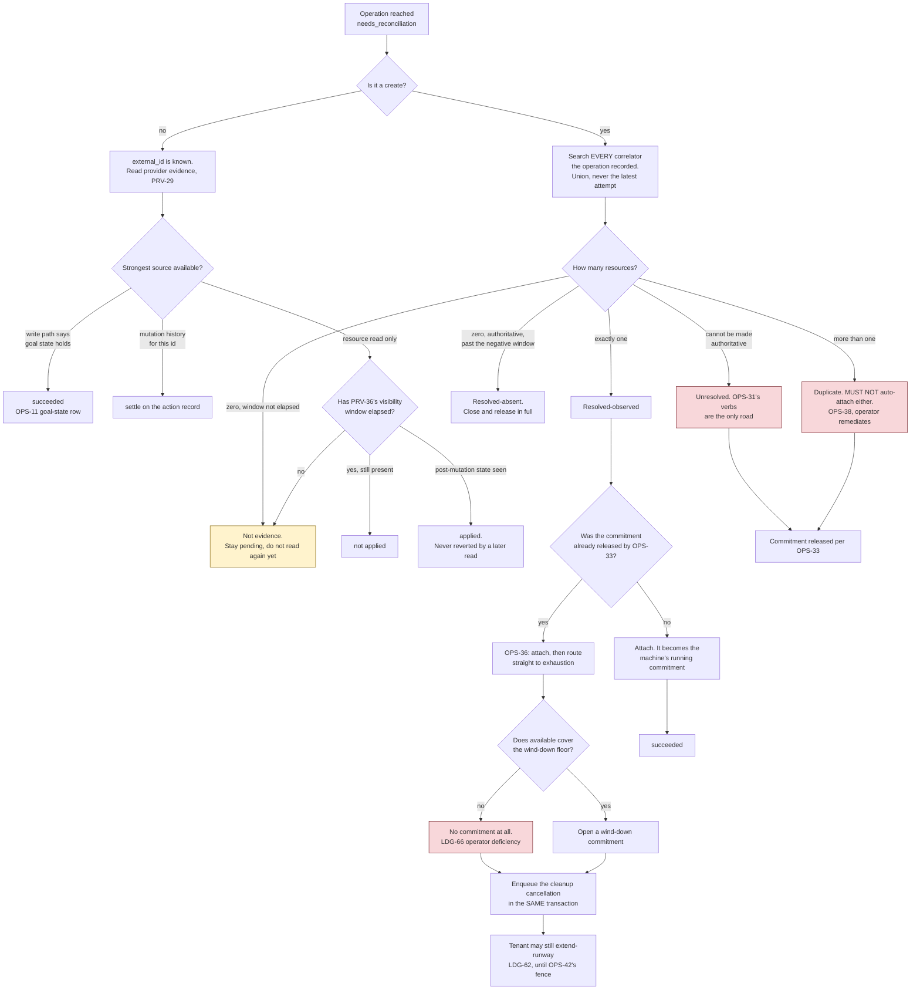

# 03 — Operation lifecycle

This is the core of the design. Everything else is plumbing around it.

## Why operations exist

A provisioning call can take minutes, can cost money, and can destroy data. The HTTP
request that triggers it can fail at any point — including *after* the provider has
already acted. A control plane that returns the provider's answer synchronously has no
way to tell "the order did not happen" from "the order happened and I lost the reply",
and a control plane that retries on failure will eventually buy two servers.

So every write becomes a durable record with an explicit settled state — plus a third state,
*I do not know*, which is resolution-pending rather than terminal (`OPS-3`): no retry and no
timer leaves it, though evidence does (`OPS-27`).

**OPS-1** Every mutating request MUST create or return a durable operation record before
any provider call is made, and MUST respond `202 Accepted` with that record.

**OPS-2** **AMENDED 2026-08-12.** An operation record MUST persist the full request payload
**while the operation is live**, so a worker can execute it after a process restart without the
original HTTP request. On entry to any settled state — **and to `needs_reconciliation`**
(`OPS-3`) — the payload is purged and replaced by a redacted summary (`ADR-0005`, `STO-9`).

The original text said "MUST persist the full request payload" without qualification, and
`ADR-0005` narrowed it in a different document without editing this sentence — leaving two
normative statements with opposite meanings. Three things depended on the unqualified version and
are corrected by `OPS-34`.

**OPS-34** **Requeue after purge.** `OPS-20` required requeue to "re-execute the original request
verbatim", and the payload is purged on entry to **either** requeue-eligible state — `failed` (terminal) and
`needs_reconciliation` (resolution-pending, `OPS-3`) — so after `ADR-0005` it is always gone and requeue as specified cannot work at all. Since
`API-19`, `OPS-31` and `DEF-17` all rest on it, the resolution is:

- **Requeue MUST carry a fresh payload supplied by the operator**, and the system MUST verify it
  is equivalent to the stored summary in every respect the summary records (kind, machine,
  provider account, target). It is no longer a replay of bytes the system holds; it is a new
  submission checked against what survived.
- Where the summary cannot establish equivalence, requeue MUST be refused and `OPS-31`'s
  resolution verbs are the only road.
- `API-11`'s idempotency comparison has the same problem and the same answer (`API-38`).

**OPS-35** The provider account MUST be resolved and written to the operation record **before**
any driver call. `05` marks it nullable, and a create whose reply is lost is precisely the case
where reconciliation must know which account to search — a search that cannot begin if the
account was only ever determined inside the call that vanished.

## States

| State | Meaning | Terminal |
|---|---|---|
| `queued` | Waiting for a worker | no |
| `running` | Claimed by a worker under a lease | no |
| `succeeded` | Completed; result recorded | yes |
| `failed` | Completed unsuccessfully; provider state is known | yes |
| `needs_reconciliation` | Outcome unknown; resolution pending (`OPS-3`) | **no** — settles to `succeeded` or `failed` |

```
                    +----------+
   enqueue -------->|  queued  |<---------------------+
                    +----+-----+                      | defer (machine locked)
                         |                            | operator requeue
                         | claim (lease)              | suspend_tenant parent whose
                         v                            |   lease expired (OPS-14)
                    +----------+---------------------+
                    | running  |
                    +----+-----+
                         |
        +----------------+----------------+
        |                |                |
   success           failure          ambiguity
        |                |                |
        v                v                v
  +-----------+    +----------+   +----------------------+
  | succeeded |    |  failed  |   | needs_reconciliation |
  +-----------+    +----------+   +----------+-----------+
        ^                ^                   |
        |                |                   | resolved observed/applied -> succeeded
        +----------------+-------------------+ resolved absent/not_applied/
                         |                   |   abandoned -> failed
                         |                   |
                         +--- operator requeue ---> queued

   queued --- tenant suspended, never claimed (API-58) ---> failed, error conflict
                                                            (details.reason tenant_suspended;
                                                             requested_by stays caller)
```

`needs_reconciliation` is **resolution-pending, not terminal** (`OPS-3`): it settles by evidence
(`OPS-27`) or by an operator verb (`OPS-31`), and by nothing else — no automatic retry of the
mutation, no timer, no caller action. `OPS-27`'s evidence sweep is itself automatic and does move
the state; what the system MUST NOT do automatically is retry (`OVR-5`).

**OPS-3** **AMENDED — `needs_reconciliation` is *resolution-pending*, not terminal.** `succeeded`
and `failed` are the terminal states. **A transition made *by a worker* MUST be conditional on that
worker still holding the lease** (`STO-3`); a worker that has lost its lease MUST NOT overwrite the
record. **Resolution transitions out of `needs_reconciliation` are made by no worker and under no
lease** — by `OPS-27`'s sweep or `OPS-31`/`WIR-35`'s operator verb — and are guarded instead by
`STO-19`'s write-once resolution columns. Scoping the lease clause to workers is required, not
stylistic: read unscoped it forbids every transition this amendment enumerates, since an operation
in `needs_reconciliation` has no lease for anyone to hold.

*Calling it terminal contradicted every requirement that resolves it.* `OPS-27` transitions it
automatically on a correlator match, `OPS-31`/`WIR-35` transition it by operator verb, and `OPS-4`
forbade both by forbidding transitions out of terminal states. The permitted transitions are
exactly:

```
needs_reconciliation --resolved observed (create)--> succeeded
needs_reconciliation --resolved applied (non-create)--> succeeded
needs_reconciliation --resolved absent (create)--> failed
needs_reconciliation --resolved not_applied (non-create)--> failed
needs_reconciliation --resolved abandoned (any kind)--> failed
needs_reconciliation --operator requeue--> queued
```

*The two non-create rows were added 2026-09-02 with `OPS-45`. They are not new transitions — the
states either side are unchanged — but the list says "exactly", so a verb missing from it is a verb
`OPS-4` forbids.*

**What was actually load-bearing about "terminal" survives unchanged**, and it is `OVR-5`: the
system MUST NOT retry the mutation automatically, MUST NOT clear the state on its own timer, and
MUST NOT let a caller drive it. Only evidence (`OPS-27`) or an operator (`OPS-31`) moves it. The
caller-facing `terminal` flag (`WIR-10`) is `false` in this state, and `retryable` is `false`
(`API-51`) — the operation is not finished, and it is not the caller's to retry.

The payload purge (`ADR-0005`) happens **on entry** to `needs_reconciliation` rather than at a
terminal state, and that is an explicit privacy exception recorded here so a reader does not
find it contradictory.

**OPS-4** Only `failed` and `needs_reconciliation` MAY be requeued, and only by an
explicit operator action (`API-19`). There is no automatic transition out of a terminal
state.

## Claiming and leases

**OPS-5** Claiming MUST be atomic: selecting the next eligible operation and marking it
`running` with a claimant identity and a lease expiry MUST happen in one indivisible
step. Two workers MUST NOT be able to claim the same operation.

**OPS-6** The claim MUST select the oldest `queued` operation whose availability time has
passed. Attempt count MUST be incremented on claim.

**OPS-7** A worker MUST renew its lease on a heartbeat interval strictly shorter than the
lease duration (a third of it is a reasonable default, with a floor). If a heartbeat
finds the lease is no longer held, the worker MUST abandon the in-flight work
immediately and MUST NOT record a result.

## Per-machine locking

**OPS-8** An operation that names a machine MUST hold an exclusive lock on that machine
for its duration. Concurrent install, power, delete, and refresh operations on one
machine are not merely wasteful, they are dangerous.

**AMENDED 2026-09-02 — "for its duration" admits a named, bounded exception, and the exception
already shipped.** `RSC-41` requires a catalogue install's import phase to run holding **no** machine
lock, and called itself "a narrowing of `OPS-8`'s *for its duration* named explicitly here" — but a
requirement cannot narrow another by describing itself as a narrowing. Two MUSTs, one of them
unsatisfiable, and the one that loses is whichever a builder reads second. The rule is therefore:

- **An operation MUST hold the lock for every phase that touches the machine or its provider-side
  resource**, which is what makes concurrent installs, powers, deletes and refreshes impossible.
- **It MAY run a phase that touches neither outside the lock, and only where a requirement names
  that phase explicitly.** Today the list has exactly one member: `RSC-41`'s import-and-poll, which
  works on an image in the operator's catalogue and never on the machine.
- **Any such phase MUST be bounded by a stated maximum** (`RSC-41` states one) and the operation
  MUST **re-acquire the lock and re-validate** before the phase that does touch the machine
  (`OPS-9`, `OPS-23`) — the machine may have been installed, powered or cancelled in the gap, and
  an exposure-reducing cancellation acquiring the lock during an import is the *intended* behaviour
  (`CNF-266`), not an accident to be tolerated.

*Why not simply hold it throughout: `PRV-13b` puts the deployment's worst-case machine-lock hold
inside `wind_down_cost`, which sizes the reserve on **every machine in the fleet**, so an unbounded
provider import queue on one driver would raise the commitment every customer must post before
buying anything. The narrowing is real and it is paid for; what was missing was this requirement
admitting it.*

**OPS-9** Lock acquisition MUST be atomic and MUST succeed only when the lock is free,
its lease has expired, or it is already held by the same operation. An operation that
cannot take the lock MUST be returned to `queued` with a short delay rather than failed —
the conflicting work will finish.

**OPS-10** The machine lock lease MUST be renewed by the same heartbeat that renews the
operation lease, and losing either MUST be treated as losing both.

## Classifying failures — the ambiguity rule

This is `OVR-5` made concrete.

**OPS-11** On failure, the system MUST classify the error into `failed` or
`needs_reconciliation` using the operation kind and the error kind:

| Operation | Classification rule |
|---|---|
| adopt, refresh | Always `failed`. Both are read-only; a failure changed nothing. |
| suspend_tenant | Never `needs_reconciliation`, and never `failed` as a whole. It is a parent whose per-machine children carry their own outcomes (`WIR-39`), and it settles `succeeded` once every child has either settled or **reached `needs_reconciliation`** — a child that reached that state counts as complete for the parent. `needs_reconciliation` is not itself settled (`OPS-3`); it is a state only evidence or an operator moves, so an unresolved child is a child-level fact, and blocking the parent on it would leave every suspended tenant's record permanently open. |
| rescue inventory | Same rows as `install`. It is **not** read-only in the relevant sense: it boots the machine into rescue, so an ambiguous failure can strand it there, and `PRV-22` makes an end-rescue failure always ambiguous. Classifying it with `refresh` would mark it `failed` while the machine sits in rescue. |
| install | `needs_reconciliation` for `network`, `timeout`, `provider`, `internal`, `conflict`, and `integrity` **once the write-started marker is set** (`OPS-45`). `failed` for the deterministic caller errors `invalid_request`, `not_found`, `unsupported`, `authentication` and `rate_limited`, **and for any failure at all while `OPS-45`'s two markers say the disk is untouched and no rescue session was left open** — including `integrity` before the connection, which is `RSC-3`'s host-key abort. An install that got further than that may have begun overwriting a disk, or may have left the machine in rescue; one that did neither, provably did neither. |
| create, power, reverse-DNS, delete | `needs_reconciliation` if the failure is *ambiguous*, otherwise `failed`. |

**The table MUST be total, and six kinds added later were missing.** `insufficient_balance`,
`not_activated`, `halted`, `gone`, `suspended` and — added 2026-09-02 — `ceiling_exceeded`
(`DOM-20`, `DOM-21`, `SEC-39`) are **admission-only**: they are decided
before any driver call, they MUST NOT be emitted by a worker or a driver, and any pre-provider
occurrence classifies deterministically as `failed` for every operation kind. Nothing was
destroyed and nothing was ordered, so ambiguity cannot arise. Every kind in `DOM-17` MUST have a
defined classification for every operation kind. There is no implicit default, because the two possible defaults are both wrong:
defaulting to `failed` invites a caller to retry a mutation that may have happened, and
defaulting to `needs_reconciliation` pages a human for a typo. `CNF-31b` tests totality.

One case needs stating because two requirements appear to disagree. `PRV-22` says "Failure of end
rescue is *always* ambiguous". That does not conflict with the install row: an install whose
*rescue exit* fails has already done its work and reached the provider, so it is never a
deterministic caller error, and the install row classifies it `needs_reconciliation` regardless
of which error kind the driver reports.

A failure is **ambiguous** when:

- the error kind is `network`, `timeout`, or `internal` — the request may have been
  received and acted on before the transport died; or
- the error kind is `conflict` *and* it arose from lease or lock loss rather than from a
  provider-reported state conflict — the worker was cut off mid-flight; or
- the error kind is `provider` *and* the upstream status was 5xx, or no upstream status
  was recorded at all. A 4xx generally means the provider rejected the request and did not act; a
  5xx means it may have acted and then failed to say so.

**AMENDED 2026-08-31 — "a 4xx means the provider did not act" is false, and believing it strands a
customer's money.** For a **goal-state mutation** — delete, power on, power off, end rescue — a
provider may reject the request precisely *because the goal state already holds*, and that rejection
means the opposite of failure. Measured: `DELETE /v2/images/{id}` against a resource already deleted
returns `422 "Can not delete an already deleted image."` Classified `failed` under the sentence
above, a delete that succeeded is recorded as a failure, and `LDG-32` then never closes the
commitment — the customer's satoshis stay reserved against a resource that is gone.

**A provider rejection whose meaning is "already in the target state" MUST classify `succeeded`.**
Which specific codes carry that meaning is a provider fact, so the mapping belongs in the driver
(`PRV-5` already owns translating provider responses) and MUST be recorded in
`08-provider-notes.md`, pinned to codes rather than to message text, and re-verified when the
provider's API changes. This table states the rule; it does not enumerate anyone's error codes.

**OPS-12** The system MUST NOT automatically retry an operation that ended
`needs_reconciliation`, and MUST NOT automatically retry an ambiguous mutation under any
other name (no backoff loop, no "safe" re-poll that re-issues the mutation). The
`retryable` flag on an error is **normative guidance to callers** (`API-51`); what stays
prohibited is the *system* retrying on its own.

**OPS-13** When a mutation's outcome is unknown, the surviving evidence MUST be preserved
and pointed at: the error details MUST record what was attempted, any provider-side
identifiers that were created (transaction ids, key fingerprints, action ids), and the
location of any retained recovery credential (`RSC-19`).

**For a create, what survives MUST include the offer snapshot** — the `offer_id` and the offer's
`install_strategies` as they stood when the request was accepted — carried in `request_summary`
(`05-persistence.md`), which outlives the purge. The machine's own copy of that list is what the
install gate reads (`WIR-30`), and an ambiguous create has **no machine row yet** to hold it while
`ADR-0005` deletes the payload on entry to `needs_reconciliation` (`OPS-2`). Without the snapshot a
create later resolved-observed attaches a machine whose install eligibility can be reconstructed
from nothing the system still holds: the offer is a live listing that may have been re-priced,
changed or withdrawn in the meantime (`DOM-9`), which is the same reason the gate reads the copy
rather than the offer. It is terms, not secrets, so it survives the purge exactly as the provider
account and the target do — and it is retained as **evidence**, not as a comparison field:
`OPS-34`'s requeue equivalence check is over kind, machine, provider account and target, and the
snapshot adds no fifth test, because an auction offer that has since been withdrawn does not make
the requeue wrong.

**One snapshot per attempt, not one per operation.** `request_summary` holds a list aligned
one-to-one with `correlator_value` (`05-persistence.md`, `PRV-26`); a requeue **appends** an entry
and overwrites none; and each entry carries that attempt's correlator, its offer snapshot and its
at-cost setup fee (`LDG-67`). Resolution uses the entry of the attempt **whose correlator matched**
(`OPS-27`). A single snapshot for several attempts is not enough, because `OPS-20`'s requeue places
a second order under whatever terms are live then, and the order that finally turns up may be the
first attempt's: resolution would otherwise copy the wrong `install_strategies` onto the machine —
a safety gate — or debit a setup fee that is not what the provider actually charged for that order
(`LDG-39`).

## Interrupted workers

A worker that crashes leaves an operation `running` with a lease that will expire.

**OPS-14** A sweeper MUST periodically move `running` operations whose lease has expired
into `needs_reconciliation`, and MUST release machine locks whose lease has expired. It
MUST NOT move them back to `queued`. A crashed worker is exactly the case where the
provider may have acted and nobody recorded it.

**`suspend_tenant` is the single exception, and it MUST NOT require an operator.** A
`suspend_tenant` parent (`API-58`) whose lease expires MUST be returned to `queued` and re-claimed
like any other queued work, resuming its fan-out from wherever it stopped. It mutates no provider
itself — its per-machine children do, and each child is an ordinary operation the rules above
already govern — so a crashed parent leaves nothing ambiguous to establish, and the re-sweep is
idempotent by `OPS-39`'s `system_trigger_id`, which is minted per machine and per episode and
makes a repeated pass enqueue nothing twice. Routing the parent to `needs_reconciliation` instead
would contradict `OPS-11`'s `suspend_tenant` row and would leave a suspended tenant's fleet
running, and billing, until a human noticed — which is exactly what `SEC-45`'s one-action
termination MUST NOT depend on.

**OPS-15** The sweeper MUST run at startup as well as periodically, and startup MUST log
the count of operations it found interrupted.

**OPS-16** The sweeper MUST NOT overwrite an error already recorded on the operation; it
fills in a marker only where none exists.

**OPS-17** The sweep interval SHOULD be tied to the lease duration (for example, a
fraction of it), not to the worker's idle poll interval. Sweeping on every idle iteration
of a fast poll loop generates continuous write transactions for no benefit. See `DEF-11`.

## Requeue

**OPS-18** Requeue MUST be an explicit operator action on a single operation, MUST be
allowed only from `failed` or `needs_reconciliation`, and MUST itself be idempotent —
repeating a requeue with the same idempotency key MUST NOT enqueue the work twice.

**OPS-19** Requeue MUST preserve an audit trail: the previous error, the stated reason,
and the requeue timestamp MUST survive on the record.

**OPS-20** **AMENDED.** Requeue executes the **fresh operator-supplied payload** `OPS-34`
requires, after verifying every comparison the retained summary supports. *It is not a byte replay
of the original request: `ADR-0005` purges that once the operation stops being live, so the withdrawn wording
("re-executes the original request verbatim") described something that no longer exists while
`API-19`, `OPS-31` and `DEF-17` all rested on it.*

For an ordering operation a requeue means **placing a second order**, so it MUST pass the same
spending gates a fresh create would (`API-7`'s create class). **Where the original operation's
commitment is still open it is reused, not duplicated** (`LDG-30`: one open commitment per
machine); only where it was closed — by `OPS-33`'s window or a terminal outcome — does the requeue
open a new one (`LDG-11`) — a requeued create that skips them buys a machine with no authorized funding, which is
the money-out `ADR-0002` exists to prevent, reached through the operator surface. The API MUST make that
explicit in its response or documentation, and MUST refuse to requeue a provider-non-idempotent
kind unless the request carries a **second, distinct acknowledgement**
(`acknowledge_duplicate_purchase`, `WIR-28`) — the fresh payload's own `acknowledge_purchase` does
not satisfy it, because that one merely says "a purchase is intended", not "a *duplicate* purchase
is intended". Requeueing a create is a purchase decision, not a retry.

**A reused commitment MUST be re-priced before the second order is placed.** The requeue happens
later — possibly much later — and the rate moves (`LDG-40`), so a commitment sized at the original
rate under-reserves the order the requeue is about to place. The requeue's spending check MUST
therefore re-derive the required amount at the **current** rate (`PRV-13b`'s formula) and top the
reused commitment from available balance by `LDG-62`'s mechanism, in one transaction under
`LDG-35`'s per-tenant serialization and subject to `LDG-10`. **Where available cannot fund the
difference the requeue MUST be refused `insufficient_balance` and MUST place no order.** Proceeding
on the stale size buys a machine at a price the customer's balance was never checked against, which
is the same unauthorized money-out this paragraph refuses when the commitment was closed — reached
through a stale number instead of through a missing record.

**A requeued create MUST NOT settle `succeeded` on the strength of the attempt in hand.** A second
order was placed and the earlier attempt's order may have landed too, so before the terminal write
the system MUST reconcile **every** correlator the operation recorded — the union `OPS-27` searches,
never the latest attempt's alone — and MUST settle `succeeded` only where that union yields exactly
one resource. A create settles exactly one machine, so a union returning **more** resources than
that is `OPS-38`'s many-case: it MUST NOT auto-attach either, and it goes to an
operator (`OPS-31`), never to `succeeded`. Settling on the latest attempt alone leaves an operation
that reads clean while a second billable server runs in the operator's account. An order that lands
*after* the union was taken is beyond what any settle-time search can see, and `OPS-32`'s account
sweep is the backstop for it.

## Resolving `needs_reconciliation`

Requeue is not a resolution. It replays the mutation, which is the one thing an ambiguous
outcome forbids. Until this section existed, `needs_reconciliation` was a terminal state with no
exit and `OPS-25` retained its records "until an operator resolves them" through a mechanism
that did not exist.

The cost of leaving one unresolved is no longer merely operational. A create places a commitment on
the customer's balance; while the operation sits unresolved, **those satoshis are frozen** — not
spendable, not returned. Resolution latency is money the customer cannot use.

### Resolving an ambiguous outcome



**The red boxes are where a human is required or the operator absorbs a loss; the amber one is the
answer that is easiest to get wrong.** `OPS-29` forbids closing any of them by guessing: two of a
tenant's own concurrent creates can look identical, and attaching the wrong machine hands one
customer another's physical server.

**OPS-27** The system MUST attempt automatic resolution before asking a human. Resolution
searches the provider for **every correlator the operation recorded** — one per attempt, and a
requeue appends rather than replaces (`PRV-26`, `PRV-27`) — takes the union of what those
searches return, and reaches one of the four outcomes below:

| Finding | Resolution | Effect on the commitment |
|---|---|---|
| Exactly one resource across all of this operation's correlators | **Resolved-observed.** Attach it and complete the operation as though it had succeeded. | Becomes the machine's running commitment (`OPS-36` where it was already released) |
| The provider's search is authoritative and returns nothing for any of them, and the negative window has elapsed | **Resolved-absent.** The mutation did not happen. | Closed and released in full (`LDG-32`) |
| More than one resource across all of this operation's correlators | **Unresolved — duplicate.** MUST NOT auto-attach either. Surface both for operator remediation (`OPS-38`). | Released per `OPS-33`; the duplicate is operator cost |
| Any one of the searches cannot be made authoritative — the provider cannot filter, the listing window has expired, or no correlator exists for this operation kind | **Unresolved.** Escalate to an operator (`OPS-31`, `WIR-35`). | Released per `OPS-33`, which applies here too |

**A correlator match is proof that an order landed, not that the resource exists, and the first
row MUST be confirmed by a direct read before it attaches anything.** `08-provider-notes.md`
records, from a live order, that Hetzner Robot's transaction "still" reports `status: "ready",
server_number: N` after the server is gone — "the listing outlives the machine". So resolution
MUST follow a match with *get machine* (`PRV-12`) on the matched `external_id`. Where that read
finds the machine, the first row applies. **Where it returns `not_found`, the outcome is
*accepted-but-gone***: no machine is attached, the commitment is closed and released in full
(`LDG-32`), and the setup fee is settled per `LDG-39` **only where the provider's own transaction
shows it was charged** — an order that produced a machine someone then deleted did cost the fee,
and one the provider cancelled did not. *Added 2026-09-05. Without the read, reconciliation
attached, metered and fee-settled a ghost.*

**A create whose order landed MUST be recorded in one transaction**, in the manner of `LDG-11`.
This is one rule with **three entry points** — the provider **accepting the order in its reply**,
`OPS-27` **resolving-observed** a create whose reply was lost, and `OPS-36`'s **late attach** of a
machine whose commitment `OPS-33` had already released — because each writes a set of effects a
partial commit of which is unrepairable. Those effects are: the terminal write on
the operation (`STO-19`'s write-once columns), the machine row, the **settlement of the setup fee**
— a debit where a commitment is still open, an `LDG-66` operator deficiency where `OPS-33` has
released it (`LDG-39`, amended 2026-09-02; it is never taken from available balance) — the
clearing of any parked `LDG-67` pending-fee record, and the commitment decrement where a commitment
is still open (`LDG-31`). They MUST commit together, under `LDG-35`'s per-tenant serialization
because the debit reads the balance. **The late-attach entry point carries three further effects,
and they commit in that same transaction**: the attach itself; *either* the wind-down commitment
*or* the `LDG-66` operator deficiency that stands in for it where available cannot cover the floor,
never neither and never both; and the enqueue of the cleanup cancellation, which claims `OPS-39`'s
`(machine_id, late_attach_cleanup)` trigger entry as it goes. A partial commit leaves a state
nothing in the record can repair: a machine whose fee is still parked bills that setup a second
time when the obligation is next read, a debit without the machine row charges a customer for a
machine no tenant owns, a machine row without its debit runs a create nobody paid for, and an
attach whose cancellation never reached the queue is an unfunded machine billing with nothing
scheduled to stop it.

**Where the machine's tenant is suspended at the moment of the attach, that same transaction also
enqueues a system cancellation** — `requested_by: system`, `system_reason: tenant_suspended`, under
`OPS-39`'s trigger, the identical mechanism `API-58` step (3) uses on the fan-out and the identical
attach-then-route shape as `OPS-36`. This applies at **all three** entry points. It is needed
because `API-58`'s re-sweep stops once a pass finds no un-cancelled machine, and a create that has
not yet produced a machine passes that test: the parent settles `succeeded` — counting a
`needs_reconciliation` child as complete — and no later pass will ever look again. Without it, a
create resolving *observed* after that settlement attaches a funded, billing machine to a suspended
tenant and runs its whole runway, which is precisely the outcome `SEC-45`'s one-action suspension
must not depend on a human noticing. `OPS-36`'s attach-then-cancel does not cover it: that branch fires only
where `OPS-33` had already released the commitment, and here the commitment is still open and
becomes the machine's running commitment.

**OPS-36** **A correlator match may arrive after `OPS-33` released the commitment and the tenant
spent the balance.** The specification previously had no branch for this and the three available
readings each broke something: attaching unfunded contradicts `ADR-0002`, re-committing
contradicts `LDG-10`, and cancelling contradicts row 1's instruction to attach.

The rule is: **attach the machine, then immediately route it through the exhaustion path**
(`LDG-13`). Attach, because the machine exists and belongs to that tenant and pretending
otherwise creates an orphan the operator pays for. Then cancel, because it has no funding and
`ADR-0002` admits no unfunded machine.

**AMENDED 2026-08-13: the system MUST NOT open a fresh commitment sized to keep the machine
running.** Funding the *cancel* is different in kind and is required — an unfunded cancel is a
machine the operator pays for indefinitely — and it is bounded by the wind-down floor, which is
the smallest amount that ends the exposure rather than any amount that continues it. The
withdrawn sentence said "if the tenant's balance can fund a fresh commitment, the machine
survives" — which is an automatic seizure of available balance the customer may have already
re-planned, sized from a `runway_seconds` the payload purge deleted, ignoring the
`max_commitment_sats` cap the original create may have set. That is precisely the surface
`ADR-0011` abolished, reappearing through reconciliation.

**The wind-down floor is tested against available balance with the setup fee taken out of the
question** (amended 2026-09-02). `LDG-39` used to debit the late fee from available on this same
branch, which left "does available cover the floor" with two defensible answers and no rule: with
100 sats available, a 70-sat fee and a 70-sat floor, fee-first charges 70 and makes the whole
wind-down an operator loss, while reserve-first ultimately charges the customer 100 — both preserve
`LDG-10` and the set chose neither. The fee is now never debited to the customer once `OPS-33` has
released the commitment; it is an operator deficiency (`LDG-39`, `LDG-66`). **So there is one
number to test and one order to test it in**, and the ordering question dissolves rather than being
answered.

The machine is attached. Where available balance covers the wind-down floor, a commitment of that
size is opened; **where it does not, no commitment is opened at all** and the wind-down is carried
as an operator deficiency (`LDG-66`) — a commitment the balance cannot fund is not a commitment,
and `LDG-10` forbids pretending otherwise. The branch's own
premise is that the tenant spent the balance, so on the common input available is *below* the
floor and `LDG-10` forbids driving it negative. Naming only the commitment left a builder choosing
between two MUSTs with no rule for the remainder. The machine is then routed into exhaustion
immediately (`requested_by: system`,
`system_reason: late_attach_cleanup`); the attach, the commitment-or-deficiency and that enqueue
commit together, under the atomicity rule stated above. **Survival requires a caller action**: the
tenant may
`extend-runway` (`LDG-62`) against the attached machine **before the cleanup cancellation this
transaction enqueued has taken the machine lock** (`OPS-41`), which is an explicit, capped,
idempotent authorization rather than an inference about what it would have wanted. *"Before the
exhaustion sweep reaches it" was the withdrawn wording, and it described a race against something
that had already happened: the delete is enqueued here, in this same transaction, so there is no
later sweep to beat. `OPS-41`'s re-check under the lock is what makes the deadline real and what
makes this survival path work at all.* **Where the branch opened no commitment**, `LDG-62` **creates** one, sized as
`LDG-62` requires — the requested runway at the current rate **plus `protected_sats`** — rather
than growing an absent record; otherwise the survival path is
unreachable for exactly the broke tenant this branch is about. **This is the branch that makes
`OPS-33`'s early release safe**, and without it that release was a hole rather than a decision.

**OPS-37** **The last row applies to the commitment exactly as `OPS-33` does.** An earlier version
said an unresolved outcome leaves the money "frozen" while `OPS-33` said it MUST be released —
the same trigger with opposite MUSTs, and the unresolved row is the *expected* path for any
provider that cannot filter server-side. `OPS-33` governs: the commitment is released and the
operation stays open. **Nothing about a customer's balance may depend on which provider's search
API is weaker.**

**OPS-38** Correlator matching MUST define cardinality: zero, one, or many — counted over the
**union** of every attempt's correlator (`OPS-27`), never over one attempt's alone. Many is
reachable by a documented procedure: `OPS-20` requeue places a second order, so a late-succeeding
first attempt and a successful second are two machines. Where the correlator is a free field both
orders carry the same operation UUID and one search finds both; where it is a per-order artifact
(`PRV-32`) each order carries its own, and only the union sees the pair — **a search of the latest
attempt alone would report *one* and attach it, leaving the first attempt's machine billing
undiscovered.** A driver MUST reject a caller-supplied label that collides with the correlator's
reserved key, and `OPS-31`'s operator verbs MUST be able to record which of several duplicates was
kept.

**OPS-40** **A signed image URL is validated against the queue's latency, twice** (`F20`).
`OPS-2` persists a request so it can be executed after restarts and deferrals; `SEC-21` wants the
signed URLs inside it short-lived. The two meet as follows: at **accept**, a request carrying a
signed URL MUST be rejected unless the URL's expiry exceeds the deployment's stated worst-case
admission-to-start bound; at **claim**, a worker MUST fail the operation deterministically —
before any provider mutation and before rescue is entered — if the URL cannot outlive the
install's stated worst-case duration, with an error kind and message telling the caller to
re-submit with a fresh URL. An expiry mid-stream after that gate is an ordinary install failure
under `OPS-11`'s classification. **The gate exists because the alternative is entering rescue and
beginning a destructive write fed by a URL that is already doomed.** Operator requeue already
carries a fresh payload (`OPS-34`), so no refresh mechanism inside the record is needed.

**OPS-43** **The provider's price MUST be re-checked at claim, and the order refused where the
commitment no longer covers it.** A create is priced and its commitment sized when the API accepts
it; the purchase happens later, in a worker. `WIR-30` says an offer price is "an indicative quote
… `binding` is `false`", and the auction channel is a live market with other bidders in it, so the
provider's own price can move in that window — which on the dedicated product can be long, since
`OPS-33` records that robot-style orders poll through an `in process` state with no documented
bound.

Before any ordering call the worker MUST re-read the offer's current price **in the provider's own
currency** and compare it with the native price the commitment was sized from (`LDG-2`
denormalises it onto the record), and **fail the operation deterministically — before any provider
mutation — where the provider's price has risen past what the reserve covers**: `conflict`,
`details.reason: "price_moved"`, the shortfall in `details`, telling the caller to re-submit. **A
movement in the satoshi rate alone MUST NOT refuse** — that is `ADR-0011`'s business, and it moves
the runway date rather than the order. *Corrected 2026-09-05. The withdrawn test was "recompute
`PRV-13b`'s reserve at the current rate … where the open commitment no longer covers it", and the
reserve carries the satoshi rate, so any downtick between accept and claim refused; the caller
resubmitted at the new rate, the next downtick refused again, and under a falling market creates
failed persistently on a product that had no shortage of provider capacity. It also named no error
kind, and `OPS-11` makes `insufficient_balance` admission-only, so a worker had nothing legal to
emit.* Same shape and same point in the lifecycle as `OPS-40`'s
signed-URL gate: it fails before anything is bought, so nothing ambiguous is created and no
reconciliation is needed.

**Nothing is grown.** This is a refusal, not a top-up, so `ADR-0011` is untouched — a commitment
still increases only by `LDG-62`, `OPS-20`'s requeue and `LDG-63`'s scheduled-cancellation branch.

*The asymmetry that exposed it: `OPS-20` already mandates exactly this re-pricing for a requeue,
"because the requeue happens later — possibly much later". An original create has the same latency
and had no such rule, so the operator absorbed the difference silently and learned about it from an
invoice.*

**OPS-28** Automatic resolution MUST be restricted to searching and MUST NOT mutate. Discovering
that nothing exists does not authorize creating it; that is a new decision by the caller, and a
new purchase.

**OPS-39** **AMENDED — deduplicated, and never blocked by a caller's ceiling.** Each triggering
episode MUST mint **one** durable `system_trigger_id` and
**reuse it on every subsequent sweep until that episode is resolved** — the id identifies the
*condition* (this machine's exhaustion, this account's loss), not the sweep that noticed it.
**The uniqueness is over the machine's retained set, not over `operations`.** At most one **open**
entry may exist per key in `machines.system_trigger_ids` (`05-persistence.md`), and a sweep MUST
claim that entry — atomically, in the manner of `STO-2` — before it enqueues anything, so the
second sweep finds the episode already open and enqueues no duplicate cancellation.
**AMENDED 2026-08-14 — for an exposure-reducing cancellation the key is `(machine_id, action)`,
not `(machine_id, system_reason)`**, and the reasons that contributed are retained as a **set** on
that one entry. Two reasons to cancel the same machine — exhaustion and its tenant's suspension,
say — are one exposure, not two: keyed by reason, each sweep claimed its own entry and each
enqueued its own delete, and `OPS-8`'s per-machine lock only serializes those two calls, it does
not dedupe them. On a provider that accepts a *scheduled* cancellation (`STO-8a`, `DOM-19`) the
second call can then alter or repeat the first's mutation. Every other kind of system trigger keeps
`(machine_id, system_reason)`, because those really are distinct episodes with distinct remedies.
The operation the first sweep enqueued carries the reason it was enqueued under; the added reasons
live on the retained entry, so the episode still records why it stayed open.

`operations.system_trigger_id` is a **convenience copy** carried for
querying and for requeue under an existing id; a matching constraint over `operations` is a
redundant guard and MUST NOT be the only one, because `STO-14` deletes the very rows it
constrains and leaves it nothing to check. **The constraint bounds new
enqueues, not recovery**: an operation that failed deterministically may still be requeued under
its existing trigger id (`API-19`, `OPS-20`), because a cancellation that did not happen must
remain retryable or the machine bills forever. **Minting a fresh id per sweep
would make the constraint fire never**, which is the defect this rule exists to prevent — otherwise a sweep that runs every minute enqueues a fresh
cancellation every minute for the same exhausted machine, which is repeated provider mutation by
timer.

**The id MUST outlive the operations that carry it.** `STO-14` deletes settled operations after a
configured age, and an id stored only there vanishes with them — after which the next sweep of the
same unresolved condition mints a new one and re-enqueues, reaching the identical defect through
retention instead of through a timer. The id is therefore held on the **machine** row, under the
key stated above — the `action` for an exposure-reducing cancellation, the `system_reason` for
everything else (`machines.system_trigger_ids`, `05-persistence.md`) — and is removed only
when the episode resolves, which `OPS-44` defines outcome by outcome. **A tombstoned machine keeps
any entry that is still open** (`STO-8`), because a machine whose
cancellation was never established is exactly the row a later sweep reads. *That is not in tension
with `OPS-44` removing the entry on a cancellation that succeeded with the resource gone: there the
episode has ended, and the row is kept for the operation records that reference it rather than for
the dedup. The case this sentence is about is the machine tombstoned by some **other** path while a
cancellation episode is still unresolved.*

**Exposure-reducing system cancellations MUST be exempt from `SEC-39`'s per-principal destruction
ceiling.** That ceiling exists to bound what a runaway *caller* can destroy; applying it to the
system's own exhaustion cancels means a tenant that hit its destruction limit keeps running
machines it cannot pay for, with the operator paying. Pacing MAY delay such a cancellation
briefly; nothing may deny it.

**System-initiated provider mutations MUST be operations, and the tenant MUST see them.** Exhaustion cancelling a machine (`LDG-14`), `OPS-36`'s attach-then-cancel, and any other
mutation the deployment performs on a tenant's machine without a caller request MUST go through
this queue — lock, lease, settled states, `needs_reconciliation` included, because a cancel
whose outcome cannot be established is ambiguous no matter who requested it — and MUST appear in the
tenant's operation list marked `requested_by: system` with a stated reason (`exhausted`,
`late_attach_cleanup`, `tenant_suspended`, `rate_outage_bound`; *`account_lost` was in this list
until 2026-09-05 with nothing that enqueued it — `SEC-46` cancels nothing on an unreachable or
rejected credential and has nothing left to cancel on a termination*). Without this,
`GET /v1/operations` is not the history of
a tenant's fleet, and the hole sits exactly where the most alarming event does: the machine that
vanished overnight (`F31`). A pure balance event with no provider mutation — a commitment
release, a re-derivation — mints **no** operation; the ledger is already that record.

**OPS-41** **An exposure-reducing cancellation MUST re-check funding under the lock, and abort if
the machine is funded.** A worker executing a system cancellation whose reason is exhaustion, a
late-attach cleanup, **or a rate-outage bound** (`OPS-39`, `LDG-64`) MUST, **after acquiring the
machine lock and before any provider mutation**, re-read that machine's commitment and its
`runway_until` — **in the same serialized transaction that writes `OPS-42`'s fence**, without which
the extension it is racing can commit between the read and the write. Where re-deriving `LDG-33`
from what it read now puts **`runway_until` strictly in the future**, the worker MUST make no
provider call, settle the operation `succeeded` with a result recording that no mutation was
required, **write that re-derived `runway_until` to the machine row and clear
`machines.exhausted_since`** (`LDG-16`), **write `resolved_at` on the episode's
`late_attach_cleanup` deficiency where one exists** (`STO-37` — the extension that funded the abort
sized its commitment with `protected_sats`, so the wind-down the operator booked at attach is no
longer its exposure; added 2026-09-05, when nothing wrote that column), **clear
`machines.destroy_committed`**, and resolve the
episode's `system_trigger_id` entry (`machines.system_trigger_ids`) so a later lapse can open a
fresh one. *The date write was added 2026-09-05: the sweep routes on the **stored** date, and an
abort that re-derived a future date and wrote nothing left the stored one in the past — so the next
pass routed the same machine, the worker aborted again, and the fence was set and cleared once per
sweep until the next scheduled re-derivation. That is the non-terminating loop this requirement
warns about for the withdrawn predicate, reached through a stale column instead. `LDG-62` had the
same gap and carries the same write.*
**Those last two happen in the terminal transaction** (`OPS-44`'s first row): the fence exists to
order this worker against `LDG-62`, and leaving it set on a machine the worker has just decided not
to cancel would refuse every future extension on a funded, running machine — permanently, since
nothing else would clear it.

**AMENDED 2026-09-04 — the abort predicate was the routing predicate, so every correctly routed
cancellation aborted.** *It read "where the remaining commitment now covers the wind-down floor at
the current rate — `LDG-16`'s invariant, the same test that routed it here", and that parenthesis
was the tell nobody followed. `LDG-16`'s invariant is a condition on the routing itself: a machine
enters this path **while** its commitment still covers wind-down, so the operator is never left
paying for a stop it can no longer afford. Every machine the sweep routes correctly therefore
satisfies it on arrival, and a worker re-testing it under the lock aborts every cancellation it was
sent to perform. `LDG-13` — "a machine whose funding fails MUST be cancelled" — becomes unreachable
by the only path that reaches it, and an unfunded machine bills the operator indefinitely. Two
full-set cross-model reviews read past this; the requirement cited the very thing that made it
wrong.* What distinguishes a machine funded **since** routing is not the floor, which held all along,
but the re-derived date. `OPS-41` already re-reads both terms `LDG-33` needs; only the test applied
to them was wrong.

**The predicate is the re-derived `runway_until`, because that is what the sweep routes on.**
`05-persistence.md` indexes `machines` on `(runway_until)` "for the exhaustion sweep (`LDG-13`)" and
`LDG-65` has the sweep continue through an outage "on the last derived `runway_until`" —
`usable_sats` is a term inside `LDG-33`'s formula and not a stored column, so no sweep can query it.
*`usable_sats > 0` was tried on 2026-09-04 and reverted the same day. The argument for it read
`LDG-33`'s "exhaustion begins when `usable_sats` reaches zero" as the sweep's predicate; in context
that sentence is an argument for subtracting `protected_sats` before dividing, against a withdrawn
form that divided the whole commitment. The two forms differ only where the remaining money buys
under one second, and there the sweep does route the machine — so `usable_sats > 0` aborts, settles
`succeeded` saying no mutation was needed, clears the fence, and hands the same machine back to the
next pass, once per sweep, each cycle minting a tenant-visible operation that claims to be done.*
Note that an extension is not the only thing that can satisfy this test: `LDG-33` re-derives in both
directions, so a price cut moves the date too, and a build testing for a grown commitment rather than
for the re-derived date would be wrong on exactly that path.

**Without this the survival path `OPS-36` offers does not work.** That branch attaches the machine
and enqueues the cleanup cancellation *in the same transaction*, then tells the tenant it may
`extend-runway` (`LDG-62`) "before the exhaustion sweep reaches it" — but there is no sweep left to
beat: the delete is already queued, and nothing in `LDG-62`, `OPS-36` or `OPS-39` withdraws it,
resolves its trigger, or re-examines the machine. The tenant pays, the payment is accepted and
committed, and the disk is destroyed anyway. The satoshis come back when `LDG-32` closes the
commitment; the data does not. `OPS-36` calls this branch "what makes `OPS-33`'s early release
safe", so the release was resting on a path that could not deliver.

**The check belongs under the lock, not in the extension.** Cancelling the queued operation from
inside `LDG-62`'s transaction would have to win a race it holds no lock for — the worker may
already have claimed the operation — and would still leave the case where the payment lands after
the claim. Re-reading at the last moment before the mutation is correct under every interleaving,
including a second extension and a concurrent requeue.

**Where there is no rate, the cancellation proceeds.** `LDG-40` requires the exhaustion sweep to
continue during a rate outage because it reduces exposure, and `LDG-65` keeps it running on the
last derived `runway_until`. A funding re-check that cannot be computed MUST NOT be read as
"funded": the worker cancels. Failing safe here costs a machine that may have been rescuable;
failing the other way is an unfunded machine billing indefinitely, which is what `LDG-13` exists
to prevent.

**A `rate_outage_bound` cancellation is where that paragraph does the most work, and it was outside
this requirement's scope until 2026-09-05.** `LDG-64` has the outage canceller "cancel machines at
that bound if no rate has returned", one delete per machine — and the re-check above named only
exhaustion and late-attach cleanup, so those deletes ran with no re-check at all. *The interleaving:
the outage reaches its bound at T and every machine in the deployment is enqueued for deletion; the
rate returns at T+1s; workers claim at T+2s and destroy a fleet that is funded for months. The
fence's abort shape applies "whatever its reason" only where the fence write loses, and here nothing
contends for it.* For this reason the re-check asks **first whether a rate exists now**: where one
does, the machine is re-derived at it and treated like any other; where none does, the paragraph
above applies and the cancel proceeds, because a bound the outage has not cleared is still the
bound.

**The funding re-check does not apply where the episode's `reasons` set contains
`tenant_suspended`** (`machines.system_trigger_ids`, `API-58`, `OPS-27`) — keyed on the entry's set,
not on the reason the operation itself was enqueued under. That reason is not about funding, and a
suspended tenant topping up its balance is not permission to keep the fleet. *The key moved to the
set on 2026-09-05: `API-58`'s fan-out now joins an already-open exhaustion episode by appending its
reason rather than enqueuing a second delete, so the operation the worker holds may carry
`exhausted` while the machine's tenant is suspended — and a price rise between enqueue and claim
would have aborted it as funded and left a suspended tenant's machine running.*

**AMENDED 2026-09-02 — the exemption is scoped to the re-check, not to the abort.** `OPS-42` keys
its fence on the **action**, so a `tenant_suspended` delete is an exposure-reducing cancellation and
takes the fence like any other — and `OPS-42` then tells a worker whose guarded write affects no row
to "settle as `OPS-41` requires", pointing at a requirement that, read whole, disclaimed the case
entirely. **The abort-and-settle shape below applies to every exposure-reducing cancellation,
whatever its reason**: make no provider call, settle `succeeded` with a result recording that no
mutation was required, and resolve the episode per `OPS-44`. What the reason changes is only whether
the *funding* test can send a worker down that path — for exhaustion and late-attach cleanup it can,
for a suspension it cannot. *In practice a suspension cancel loses that race only to another
cancellation of the same machine, which `OPS-39`'s per-action episode key already prevents, and
never to `LDG-62`, which `API-7` step 5b refuses for a suspended tenant. The path is therefore
expected to be unreachable — and it is specified anyway, because "unreachable" is a claim about
today's rules and the abort instruction is written unconditionally.*

**OPS-42** **`OPS-41`'s re-check is not sufficient on its own, and a fence is what makes it work.**
The window that decides whether a paying customer keeps its machine is **between the worker's read
and its provider call**, not inside the read's transaction. `LDG-69` forbids a provider call under
the money serialization, so the worker must release it before mutating — and `LDG-62`'s
extend-runway can commit in that gap. Entering the serialization changes nothing; the worker still
reads *unfunded*, still lets go, and still destroys a machine the customer has just paid for.
Nothing in `LDG-62`, `OPS-36`, `OPS-39` or `OPS-41` closed it.

**The cancellation and the extension MUST contend for one row, so that one of them provably loses:**

- Before any provider mutation, an exposure-reducing cancellation MUST record its decision on the
  machine row — `machines.destroy_committed` set to its own operation id — as a conditional write
  guarded on **`destroy_committed IS NULL` *or* `destroy_committed` already holding this
  operation's own id**, in the manner of `STO-3`. Where the write affects no row, another actor won
  the race and the worker MUST abort the cancellation and settle as `OPS-41` requires.

  **AMENDED 2026-09-02 — the guard was `IS NULL` alone, and that made `OPS-39`'s required retry
  impossible.** `OPS-39` says in terms that a cancellation which did not happen "must remain
  retryable or the machine bills forever", and `API-7` step 5b keeps an exposure-reducing requeue
  reachable even for a suspended tenant. But a first attempt that set the fence, called the provider
  and failed left its **own** id in that column, so the requeued attempt's `IS NULL` write affected
  no row, it read that as "another actor won", aborted, and settled `succeeded` recording that no
  mutation was required — **resolving the episode on a machine that is still running and still
  billing.** The next sweep then minted a fresh episode and reached the identical false success,
  forever, while `LDG-62` was refused `conflict` with "the machine is already being cancelled",
  which was permanently false. Accepting the operation's own id is what makes the recovery path
  `OPS-39` mandates actually execute. *One id suffices where the finding suggested an episode:
  `OPS-39` admits at most one **open** entry per key and a sweep MUST claim it before enqueuing, so
  an open episode has exactly one operation, and a requeue re-queues that same record rather than
  minting another.* **A worker MUST NOT treat its own id in that column as evidence that its
  previous attempt succeeded** — the whole reason the attempt is being requeued is that nobody
  established what happened.
- `LDG-62` MUST, in its own `LDG-35` transaction, conditional-write that same machine row guarded on
  `destroy_committed IS NULL`, and MUST fail `conflict` where it affects no row. **No commitment is
  opened or grown and no balance moves**; the tenant is told plainly that the machine is already
  being cancelled.
- **`OPS-41`'s re-check and this fence write MUST be one transaction, under `LDG-35`'s per-tenant
  serialization.** The worker holds the machine lock and enters the serialization for that bounded
  read-and-write, which is the one nesting direction `LDG-69` permits; it releases it before the
  provider call, which `LDG-69` forbids inside. **AMENDED 2026-09-02, because without this the fence
  does not fence.** `LDG-62` runs in its own `LDG-35` transaction, so unless the read and the fence
  write are inside one too, the extension can commit in the gap *between them* — the worker reads
  *unfunded*, the extension commits and grows the commitment, the worker's `IS NULL` write then
  succeeds because nothing has touched that column, and the machine the customer has just paid for
  is destroyed. That is the identical window this requirement was written to close, moved earlier by
  one step. Serializing the pair is what makes the next sentence true.
- Because both transactions take the same tenant primitive and write the same row, the store totally
  orders them. Fence first: the extension is
  refused, and the customer keeps its satoshis. Extension first: the worker's read sees the new
  commitment, `OPS-41` applies, and it makes no provider call at all.

**This needs no lock at all, which is why it is the fence rather than the ordering.** `LDG-62` takes
no machine lock — a synchronous caller write cannot wait behind an install holding that lock for up
to `RSC-35`'s ninety minutes, and refusing to extend runway for the duration of an install is
precisely the wrong failure. **The worker takes the machine lock and then the tenant primitive**,
in that order and only for the bounded read-and-write above; `LDG-62` takes the tenant primitive
and never a machine lock. A cycle needs two acquirers in opposite orders, and there is no second
order here.

*This paragraph said "the worker takes the machine lock and never the tenant primitive" until
2026-09-02, and it is retained because the trap is live: that sentence was true of the withdrawn
ordering-only design, it survived the amendment four bullets above that made the worker enter
`LDG-35`'s serialization, and it is the sentence a builder implementing the lock discipline would
have read. Implementing it reopens the paid-machine deletion race this whole requirement exists to
close. Found by both reviewers of 2026-09-02, independently.*

**The residual is stated rather than solved:** a payment landing after the fence is refused rather
than silently ignored, so the customer learns the machine is going and keeps its money. That is the
honest outcome, and it is the one `OPS-36` promised when it called `OPS-41` "what makes `OPS-33`'s
early release safe" — a promise that requirement could not keep alone.

*Both reviewers of 2026-08-31 rejected the ordering-only fix independently and converged on a fence;
the shape here is the one that does not make extend-runway wait on a machine lock.*

**OPS-44** **An exposure-reducing cancellation episode has a stated end, and every delete outcome
reaches one.** `OPS-39` mints the episode and says it is "removed only when the episode resolves";
`OPS-41` resolves it on the one path where no mutation was required; and **nothing anywhere said
what resolves it when the delete actually ran.** That gap is what let `API-58`'s fan-out and
`OPS-42`'s fence each reason about "cancelled" with no shared definition. The rules are:

| The cancellation settled | The episode entry (`machines.system_trigger_ids`) | `machines.destroy_committed` |
|---|---|---|
| `succeeded`, resource gone — including `OPS-11`'s goal-state row and `OPS-41`'s no-mutation abort | **Removed**, in the same transaction as the terminal write | **Cleared**, same transaction |
| `succeeded`, **scheduled** — the provider accepted a cancellation for a future date (`DOM-19`, `STO-8a`) | **Stays open until the effective date passes and the machine is tombstoned** | **Stays set** |
| `failed` — deterministic, the provider rejected the request and did not act | **Stays open** | **Stays set** |
| `needs_reconciliation` | **Stays open** | **Stays set** |
| Resolved by an operator (`OPS-31`) — for a cancellation the verbs are `applied`, `not_applied` and `abandoned` (`OPS-45`) | **Removed**, in the resolution transaction | **Cleared**, same transaction |

**The "stays" rows are the point, and the second one is the one a reader will not expect.** A
cancellation that did not happen leaves a machine that is
still running, still billing and still unfunded, so the exposure is unchanged and the episode is not
over: the entry is what keeps a later sweep from enqueuing a **second** delete against the same
machine (`OPS-39`), and the fence is what keeps `LDG-62` from selling runway on a machine the
operator has already decided to destroy. **A cancellation that succeeded *as a schedule* is in the
same position**: `DOM-19` says "the machine is still running, the customer can still reach it, and
the operator is still paying for it" until its effective date, so it is still unfunded and the next
exhaustion sweep will find it. Resolving
the episode there is precisely the case `OPS-39`'s 2026-08-14 amendment warns about — "on a provider
that accepts a *scheduled* cancellation the second call can then alter or repeat the first's
mutation" — reached through resolution instead of through a reason key. The entry is released when
the machine is tombstoned (`STO-8a`), which is when the exposure actually ends — **and the tombstone
clears `destroy_committed` in the same transaction**, the third path that clears it beside the two
rows of the table above (*named 2026-09-05; the "nothing else clears" paragraph below did not
mention it, so on this path the fence had no stated end*). Recovery is `API-19`'s requeue of that same operation under
its existing trigger id, which `OPS-42`'s amended guard now permits. **A `failed` exposure-reducing
cancellation MUST therefore be surfaced to the operator** in the same listing `OPS-26` requires for
`needs_reconciliation`: it is the one settled state in this set that nothing automatic will look at
again, and the cost of not looking is unbounded provider billing.

**Operator resolution clears the fence, and that is deliberate — for `not_applied`, for
`abandoned`, and for an `applied` that reports the resource gone.** `not_applied` says the machine
is still there and `abandoned` says nobody established what happened — so in both a later
exhaustion sweep MUST be able to open a fresh episode and fence again. **An `applied` that carries
an `effective_cancellation_date` (`WIR-35`) is the table's second row, not its last**: the machine
is still running and billing to that date, so the entry and the fence stay until the tombstone,
exactly as they would had the worker's own call returned the schedule. *Corrected 2026-09-05. The
earlier text cleared on all three verbs and said so was deliberate, reasoning that `applied` "may
leave a `cancellation_scheduled` machine billing" — which is precisely the case where clearing lets
the next sweep send a second cancellation against a machine the provider has already scheduled,
the exact mutation `OPS-39`'s 2026-08-14 amendment warns about.* Leaving the fence set would make every subsequent
sweep abort on a stranger's id and settle `succeeded` without acting, which is the defect
`OPS-42`'s amendment removed by another route. *A cancellation resolves through `OPS-45`'s verbs,
not through `observed`/`absent`: those name a resource a create may have produced, and a cancellation
names a machine that already exists.*

**Nothing else clears `destroy_committed`.** `05-persistence.md` described it as "cleared when the
episode resolves without a mutation (`OPS-41`)", which is one row of the table above; the column's
life is now stated for every outcome in one place, and the deliberate answer for an attempt that
*did* reach the provider without ending the exposure is that the fence **persists** — the customer
keeps its satoshis and is
told plainly that the machine is being cancelled, which is `OPS-42`'s stated residual rather than an
oversight. On the scheduled branch that is also the right answer on its own terms: runway bought
past an effective cancellation date buys nothing, since `LDG-33` already protects the cost of
running to it and the machine goes on that date regardless.

**OPS-29** A correlator match MUST be exact. Resolution MUST NOT match on hostname, offer,
creation time or any other heuristic, because two of a tenant's own concurrent creates can look
identical, and attaching the wrong machine gives one customer another's server. Where no
correlator exists, the correct outcome is *unresolved*, not a guess.

**OPS-30** Resolution MUST be idempotent and MUST NOT race a healthy in-flight operation. A
resource bearing operation X's correlator belongs to operation X and to nothing else; a sweep
MUST NOT claim a resource whose operation is still `running` and holding its lease.

**OPS-31** Operator verbs MUST exist for the unresolved case and MUST be distinct from requeue:
record an observed resource by its external identifier, record that nothing was created, or
abandon the operation and accept the loss. Each MUST record who resolved it and on what
evidence, and abandonment MUST close the commitment and release it in full (`LDG-32`) **where the
operation opened one** — a create or an adopt (`LDG-11`, `LDG-36`). An install, a rescue inventory,
a power action, a
reverse-DNS change and a delete open none (`API-7`'s tail), and the only commitment within reach of one is the
machine's **running** commitment, which abandonment MUST NOT touch: the machine is still there and
still consuming it. *Scoped 2026-09-02; unscoped, abandoning a failed install released the funding
of a machine that is still running, which is `LDG-13`'s unfunded machine created by an operator
verb.*

**AMENDED 2026-09-02 — those three verbs are create-shaped, and five operation kinds cannot use
them.** `observed` names an `external_id` that a create produced; `absent` says nothing was created.
An install, a **rescue inventory**, a power action, a reverse-DNS change and a **delete** all act on
a machine that
**already exists**, so
neither verb has a meaning there and the only reachable one is `abandoned` — which is why every
install that failed after entering rescue could be resolved exactly one way, as a loss, with
`retryable: false` returned to the caller. **On a delete the create-shaped verbs are worse than
useless: `absent` reads as "the resource is gone", which for a cancellation is *success* and for a
create is *failure*** — the same word, opposite meanings, on the operation an exposure-reducing
episode hangs on (`OPS-44`). **Two further verbs therefore exist, `applied` and
`not_applied`** (`WIR-35`), which are the non-create shapes of `observed` and `absent`: the mutation
took effect, so the operation settles `succeeded`; or it did not, so it settles `failed`. `abandoned`
remains for the case nobody can establish. **`not_applied` MUST be refused, on a `rootfs_via_rescue`
or `raw_disk` install only, where `OPS-45`'s write-started marker is set** — a partially written disk
is not "nothing happened", and recording it as such tells a caller its data survived. There the
honest verbs are `applied` or `abandoned`. *The scope was absent until 2026-09-04, and it is the
difference between a rule and its opposite: on every other kind `OPS-45` sets that marker when the
provider call is **dispatched**, so the refusal covered every operation an operator could ever be
asked to resolve. `WIR-35` carries the same rule for the wire; this sentence is the engine's copy of
it, and the first correction reached only the wire.*

**And an operator MUST NOT be the first resort here.** `OPS-45` requires the engine's own record of
whether a write began to be consulted before any of this: most install failures never reached a
disk, and those are deterministic outcomes, not questions for a human.

*Both enumerations above said "an install, a power action, a reverse-DNS change and a delete" until
2026-09-03, and the header counted them as three. **Rescue inventory was the missing member**, in a
set `OPS-45`, `WIR-35` and `05-persistence.md` all state as five. It is not a harmless omission in
either place: `OPS-11` classifies a rescue inventory with `install` precisely because it can strand a
machine in rescue, so it reaches `needs_reconciliation` and `CNF-201` tests that it does — after
which a builder following this list would find `applied` and `not_applied` unavailable for it and
resolve it the one way this amendment exists to abolish, as `abandoned`. **The defect was removed for
four kinds and left standing for the fifth.** The commitment sentence had the mirror gap: rescue
inventory fell between "a create or an adopt", which opens a commitment, and an enumeration that did
not name it, so the requirement gave no rule for the one case it did not mention.*

**OPS-45** **The engine knows whether it started writing, and that knowledge MUST be recorded and
used before anyone asks a human.** `OPS-11` sends an install's `integrity` failure to
`needs_reconciliation`; `RSC-3`'s host-key abort is an `integrity` failure that happens **before the
connection is made**, with nothing written and the machine's disk untouched — and `OPS-31`'s verbs
could only ever call that outcome "abandoned". So the differentiator's most security-critical
success case (a pinned key that did not match, aborting exactly as designed) ended as an
operator-resolved loss.

**This requirement governs the kinds that act on a machine that already exists — install, rescue
inventory, power, reverse DNS and delete — and nothing else.** It does **not** reach `create` or
`adopt`: there is no machine yet, the question is whether a *resource was produced*, and the answer
comes from `OPS-27`'s correlator search rather than from anything the engine can record about
itself. Nor does it reach `suspend_tenant`, which mutates no provider (`OPS-11`). **Scoping this is
not a formality**: read unscoped, "the marker is unset, so settle `failed`" would settle every
ambiguous create as a deterministic failure, which deletes `OPS-27`'s resolution, `OPS-33`'s
negative window, `OPS-36`'s late attach and `LDG-39`'s whole fee table in one sentence — the
correlator exists precisely because a create's own execution *cannot* tell you what happened.

**The engine MUST persist a write-started marker on the operation**, at the moment a phase begins
that could have altered the machine, and before that phase runs:

| Kind | The marker is set when |
|---|---|
| install, `rootfs_via_rescue` | the provider's OS installer is started (`RSC-25` verifies the digest first, so nothing before that point has touched the disk) |
| install, `raw_disk` | the first byte is written to the target device (`RSC-28`) |
| install, `provider_native` / `provider_catalogue` | the provider's rebuild call is dispatched |
| power, reverse DNS, delete | the provider call is dispatched |
| rescue inventory (`RSC-38`) | **never** — it writes nothing to a disk by construction, so its whole classification turns on the second marker below |

**Entering rescue is itself a mutation, so a second marker is required and the two are read
together.** Activating rescue reboots the machine into another operating system (`PRV-15`) and
`PRV-22` makes *failure* of the exit always ambiguous — so "nothing was written" is not on its own
"nothing happened". The engine MUST therefore also record **whether the rescue session it opened
was closed without error**: set when the driver's end-rescue call returns success, left unset when
it fails, when it is never attempted (`on_failure: leave_in_rescue`), or when the operation dies
before reaching it.

**An operation settles `failed` — deterministically, with no operator and no reconciliation — when
the write-started marker is unset *and* either no rescue session was opened or the one that was
opened was closed without error.** In that state the engine has positive evidence from its own
execution that the disk is untouched and the machine is back where it started. Everything else
follows `OPS-11`'s classification, and resolution then
proceeds by `PRV-29`/`PRV-36`'s provider evidence where the driver can produce it, falling back to
`OPS-31`'s `applied`/`not_applied`/`abandoned` where it cannot.

**The marker means two different things across the table above, and only one of them can foreclose
anything.** On `rootfs_via_rescue` and `raw_disk` it means **bytes have reached the disk** — the
installer is running, or a byte is written — and there the machine's old contents are gone whatever
the outcome. On `provider_native`, `provider_catalogue`, power, reverse DNS and delete it means only
that **a request was dispatched**, which is a fact about this process and not about the machine: a
rebuild the provider never began, a power call it dropped, a delete whose response was lost, all set
the marker and all may have changed nothing. *Recorded 2026-09-04 because a single column carrying
two meanings was read as carrying the first one everywhere — see `WIR-35`, where it made
`not_applied` unreachable on every kind whose marker is set at dispatch, which is every kind that
accepts the verb except the two rescue-based install variants.* Where the marker means
dispatch, whether the mutation landed is exactly the question `OPS-31`'s resolution exists to
answer, and it is answered from the provider (`PRV-36`'s evidence sources), never from this column.

**Write-once is right for the disk fact and wrong for the dispatch fact, so the column's life is
keyed on kind exactly as the table above is.** "Once any attempt has begun altering the disk, the
disk may have been altered" is true forever; "a provider call was dispatched" is true of *that
attempt*. **`write_started_at` is therefore write-once and never cleared on `rootfs_via_rescue` and
`raw_disk`, and MUST be cleared by `OPS-20`'s requeue on the five dispatch kinds.** *Recorded
2026-09-04. Otherwise a requeue whose second attempt fails **before** dispatching anything inherits
the first attempt's marker and is classified ambiguous, when the engine has exactly the positive
evidence of a clean stop that settles the first case `failed` — and no single write-once column can
answer "did **this** attempt dispatch". A draft said the failed test "reads the marker of the attempt
being settled" while two other sites still called the column never-cleared, which is unsatisfiable;
the schema is where that had to be fixed.*

**The pinned-host-key abort is the case this exists for.** `RSC-3` refuses to connect when the trust
decision cannot be made — the security-critical decision in the whole workflow, working exactly as
designed — and with `on_failure: exit_rescue` succeeding, the machine is back in its installed
system with nothing written. That is a clean, deterministic refusal, and it was reaching
`needs_reconciliation` and then an operator's `abandoned`. **Where the same abort is followed by a
failed rescue exit it stays ambiguous**, because the machine may be sitting in rescue with a
temporary credential registered — which is `PRV-22`'s point and is a fact about the *machine*, not
about the disk.

**Both markers MUST survive the payload purge** (`ADR-0005`, `OPS-2`). They live in named columns on
the operation (`05-persistence.md`), which is what `OPS-11` and `OPS-31` read; the copy in
`request_summary` is a **convenience copy for an operator reading a resolved record**, in the manner
of `operations.system_trigger_id`, and the columns are authoritative. *Stated because one fact with
two homes and no authority rule is how `SEC-46`'s amendment came to ship claiming it had applied.*

**The two markers behave differently across attempts, and the difference is not stylistic.**
`write_started_at` is **write-once and never cleared, including by a requeue** (`OPS-20`), **on
`rootfs_via_rescue` and `raw_disk`**: once any attempt has begun altering the disk, the disk may have
been altered, and that stays true however many later attempts stop short. **On the five kinds where
it records a dispatch it is per-attempt and a requeue clears it** (2026-09-04), because dispatch is a
fact about one attempt and a sticky copy makes a later clean stop read as ambiguous. `rescue_exited_cleanly` is the opposite — it describes **the machine
right now**, so each attempt overwrites it, and a requeue that exits rescue cleanly genuinely repairs
what a previous one left open. *A single rule for both would be wrong in one direction or the other:
sticky, and a repaired machine reads as stranded forever; per-attempt, and a written disk reads as
untouched on the next attempt that fails early.*

A worker's write of either is guarded like any other worker write, on
`(id, status = running, claimant = me)` (`STO-3`), and MUST report whether it affected a row — a
worker that has lost its lease MUST NOT record that it began writing, because it may not have.

**OPS-32** **AMENDED 2026-08-12 — it is now a MUST, and it keys on the wrong thing no longer.**
Periodic reconciliation MUST run across each provider account independently of any stuck
operation, comparing what the provider reports against what this system believes exists. It
catches drift no operation record would reveal: machines created by hand, machines deleted behind
the system's back, and orphans from an operation whose correlator search was given up on.

**AMENDED 2026-09-02 — the sweep records what it saw, it does not only report it.** Where the sweep
finds a machine this system believes exists and the provider does not, it MUST write that
observation to the machine row — the state and `machines.state_observed_at` (`STO-48`) — in the same
pass. **Only a pass that enumerated the account completely may record an absence.** A sweep that
paginated part way and then yielded to `rate_limited` has seen a subset, and treating that subset as
the account would record every unlisted machine as gone — stopping their meters and closing their
commitments across a whole account, on a throttle. An interrupted pass MUST record nothing about
absence; what it observed *present* it may still record.

**And it may record an absence only about a machine past `PRV-36`'s declared visibility window for
that provider**, measured from the dispatch of the create that produced its `external_id`. *Added
2026-09-04. The sweep's listing is a read of provider state, and `PRV-36` reads "a read of provider
state is not authoritative about a mutation the driver issued until that provider's declared
visibility window has elapsed". Nothing drew the line to here, so a machine created seconds before
the sweep, whose create the provider's listing had not yet caught up with, was recorded gone:
`LDG-74` stopped its meter, `LDG-32` closed and released its commitment, and the machine went on
running and billing the operator with no funding behind it and nothing scheduled to look again.* A
machine inside the window is not evidence either way and MUST be skipped, not deferred to a second
opinion; the next pass has evidence.

**A missing machine MUST be re-read directly before its absence is recorded.** The listing narrows
the candidates; it never establishes one. *Added 2026-09-04, replacing a pass-start eligibility
cutoff drafted the same day — which was strictly weaker, because the problem is not only timing.*
**Pagination is not a snapshot.** A live machine can move from an unread page onto one already read
when another resource disappears ahead of it, and a create dispatched before the pass began can
attach locally after its page was fetched. Both survive any age test, and the traversal is
*complete* in each case — so the completeness guard above does not see them either, and a running
machine is recorded gone, its meter stopped and its commitment released. A direct read of
`(provider_account, external_id)` answers the question the listing only suggested, costs one call
per candidate rather than per machine, and is needed anyway on any provider that does not promise
snapshot-consistent pagination — which is all of them.

**It is `PRV-36`'s window and NOT `OPS-33`'s negative window, and the two must not be conflated.**
`OPS-33`'s bounds a **correlator search** for a create whose outcome is unknown — derived from a
provider's allocation behaviour, and on Hetzner Robot bounded by how quickly a human looks
(`PRV-33`). Binding absence detection to it would let a machine the provider terminated in its first
hours go on billing its customer for that whole window, while `LDG-74` makes the **sweep interval**
"this rule's error bound, the maximum time a customer can be billed for a machine that is gone". `PRV-36`'s window is
listing lag — eight seconds against live DigitalOcean — which is the quantity actually in play here.
**A machine with no create of its own has no window at all**: an adopted machine (`PRV-28`) and a
late-attached one (`OPS-36`) were both observed present at the provider before they became records
here, so an absence is evidence about them from the first pass. `LDG-74` is why the write exists at all: the
meter reads the machine record, `DOM-8` refreshes that record only on an explicit caller operation,
and nothing in this set refreshes on a schedule — so a machine the provider terminated went on
draining its tenant's commitment until somebody happened to look. Reporting it to an operator is not
enough, because the cost accrues while the report sits unread. **This sweep's stated interval is
therefore a money parameter** (`LDG-42`): it is the maximum time a customer can be billed for a
machine that no longer exists.

**A machine is unclaimed when it is absent from the `machines` table by
`(provider_account, external_id)`** — *not* when it bears no correlator. The previous wording
would have reported as unclaimed, on every sweep forever, **every Hetzner Robot machine** (whose
correlator lives on the order, never on the server) and **every adopted machine** (`PRV-28`) —
a 100% false-positive rate on the dedicated product line this specification exists for. An
unclaimed machine MUST NOT be auto-attached to any tenant (`OPS-29`); it is reported to the
operator.

It was raised from SHOULD because `OPS-33` releases a customer's commitment on the promise that a
late-appearing machine will be *detected as the operator's own problem*. A MUST that gives money
away, compensated by a SHOULD that recovers it, is not a bounded loss — it is an unbounded one
with an optional remedy.

**AMENDED 2026-08-31 — a MUST that money depends on may not have an unstated cost.** The deployment
MUST state the sweep interval; the sweep MUST paginate the provider listing rather than assuming one
response; it MUST yield to `rate_limited` rather than retrying into it (`DOM-17` carries that kind
because providers throttle, and a sweep that trips the limit degrades every tenant's operations in
that account); and it MUST NOT delay caller-initiated work. **Its lookup is by
`(provider_account, external_id)`**, which `STO-17`'s cross-tenant constraint supplies as an index —
stated there as a constraint and now listed as an index, because the `machines` index list leads
with `tenant_id` and the sweep does not have one.

**The sweep also covers imported images** (`ADR-0013`): an image tagged with an operation's
correlator whose operation has settled or vanished is caller data the deployment promised to purge,
so it is **deleted** rather than reported. That is the opposite remedy from an unclaimed machine, and
the asymmetry is the point — one is a customer's running server, the other is a copy of a customer's
operating system sitting in the operator's account. *A delete may answer that it already happened;
`OPS-11`'s goal-state rule makes that a success.*

**OPS-33** A negative search MUST NOT reserve a customer's balance indefinitely. Once a bounded
negative window has elapsed, the commitment MUST be closed and released in full even though the
operation remains open, and `OPS-32`'s account sweep MUST continue searching for the correlator
indefinitely afterwards. `OPS-36` governs what happens if the machine then appears.

**Where a provider channel has no verified correlator** (`PRV-33` — Hetzner Robot's **standard**
channel is the live case after `PRV-30` disqualified its `comment` field; its auction channel
passed `CNF-180` on 2026-09-04), the window MUST still be bounded and the commitment
MUST still be released on it, but the search it bounds is an **operator** search, not an automatic
one. The release rule does not weaken: a customer's satoshis are not held hostage to how quickly a
human looks.

**The window MUST be derived per provider from that provider's own allocation behaviour.** An
earlier version said "on the order of hours", which is wrong for the product that matters:
robot-style dedicated orders poll through an `in process` state with no documented bound, and
`08-provider-notes.md` records a 30-day transaction listing precisely because orders stay
resolvable that long. Cloud VMs allocate in seconds; a dedicated order may not resolve the same
day. **A single figure across providers is guaranteed to be wrong for one of them, and it is
wrong in the direction that costs the operator a setup fee plus a period cap.**

The reasoning is about **who carries the residual risk**, not about confidence in the search.
Releasing early moves the risk from the customer to the operator: a machine that appears late
appears as an *unclaimed machine in the operator's own account*, which the sweep detects and
which immediate cancellation bounds to a setup fee. That is a cost the operator can see, price
and absorb. A frozen balance is a cost the customer can neither see nor escape, and for an agent
buying compute it is indistinguishable from theft. Where the two are in tension, the operator
takes the visible loss.

The window MUST be recorded per provider and MUST be derived from measurement rather than
assumed. For the robot-style ordering shape it interacts with the transaction listing window
(`08-provider-notes.md`): past that horizon automatic resolution is impossible and `OPS-31` is
the only road, but the commitment was released long before.

## Worker algorithm

```
loop:
    if sweeper_due:
        expire_stale_running_operations()
        release_expired_machine_locks()

    op = claim_next_queued_operation(worker_id, lease)
    if op is none:
        idle_sleep(); continue

    if op names a machine:
        if not acquire_machine_lock(machine, op, worker_id, lease):
            defer(op, delay); continue

    start heartbeat(op, machine, lease)          # renews both leases
    outcome = race(
        execute(op),                             # cancelled if lease is lost
        lease_lost_signal()
    )
    stop heartbeat

    if outcome is success:
        finish_success(op, worker_id, result)    # conditional on still holding lease
    else:
        if classify(op, error) is ambiguous:
            finish_needs_reconciliation(op, worker_id, error)
        else:
            finish_failed(op, worker_id, error)

    if op names a machine:
        release_machine_lock(machine, op, worker_id)
```

**OPS-21** `execute` MUST be cancellable, and cancellation MUST be treated as an
ambiguous outcome. A provider call abandoned mid-flight is exactly the uncertainty this
design exists to represent.

**OPS-22** **AMENDED.** A **worker** recording a settled state MUST do so conditional on still
holding the lease (`OPS-3`, `STO-3`); a resolution transition out of `needs_reconciliation` is
made by no worker and is guarded by `STO-19`'s write-once columns instead. Where the conditional write affects no rows, the worker MUST log it loudly and
leave the record alone; the sweeper will classify it.

**OPS-23** Validation that was performed at the API boundary MUST be repeated in the
worker before the driver is called. The record may have been written by an older version
of the service, or edited in the store. Validation is cheap; a wrong install is not.

## Fairness and retention

**OPS-24** Claim ordering by age alone lets one tenant starve every other. The claim
strategy SHOULD provide per-tenant fairness, and the API layer SHOULD rate-limit
enqueues per tenant.

**OPS-25** The operation log grows without bound. A retention policy MUST exist: **settled** operations older than a configured age are archived or deleted, while operations in
`needs_reconciliation` — which is not a settled state (`OPS-3`) — MUST be retained until they are
resolved.

**OPS-26** Operators MUST be able to enumerate operations by status through the API —
specifically every operation in `needs_reconciliation` (`API-23`). A design that tells
operators to monitor a state and provides no way to list it is incomplete. See `DEF-8`.

**AMENDED 2026-09-02 — a second thing must be listable, and `status` cannot express it.** `OPS-44`
and `API-58` both require a **`failed` exposure-reducing cancellation** to reach an operator: it is
the one settled outcome in this set that nothing automatic will look at again, its machine is still
running and still billing, and its only recovery is `API-19`'s requeue. Filtering by
`status=failed` does not find it — it returns every failed operation the deployment has ever
produced, most of them a caller's typo. **`GET /v1/operations` MUST therefore also filter on
`requested_by` and on `system_reason`** (`WIR-10a`'s enums, `API-23`), so
`requested_by=system&system_reason=exhausted,tenant_suspended,late_attach_cleanup&status=failed` is
one query. *A design that tells operators to monitor a **condition** and provides only a filter for
a state it shares with everything else is `DEF-8` again, one predicate down.*
