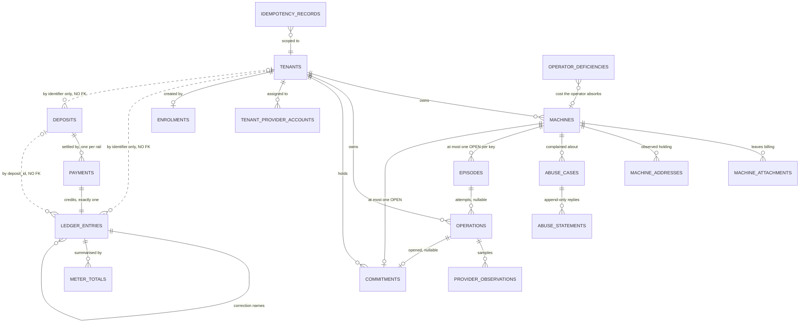

# 05 — Persistence

## What the store must provide

The operation queue is the only part of the system with real transactional demands.

**STO-1** **AMENDED 2026-09-08 (`ADR-0019`) — the claim stamps nothing; the lease went with
`ADR-0016` and the epoch with `ADR-0019`.** The store MUST provide an atomic claim:
select-oldest-eligible and mark-running in one indivisible step (`OPS-5`). A read followed by a conditional write in a separate statement is
acceptable only if the write is guarded by the row's prior state and the guard is checked by the
engine, not by application code.

**STO-3** **AMENDED 2026-09-08 (`ADR-0019`) — the guard term is the status; the lease sweeper's
guard went with the sweeper and the epoch went with `ADR-0019`.** Four conditional writes move an
operation, and each MUST report whether it affected a row (`OPS-22`):

- **A worker's write** — every settled-state write, and a worker moving its own operation into
  `needs_reconciliation` — is guarded on `(id, status = running)`. A write that affects no row
  means the startup pass has already moved it, so the worker outlived a restart and exits
  (`OPS-22`). *This term did the whole job while an `epoch = mine` term sat beside it: the claiming
  process stamped that value itself, so it held by construction (`ADR-0019`).*
- **The startup pass** (`OPS-15`) moves every `running` operation to `needs_reconciliation`,
  guarded on `(id, status = running)`. It runs before the process makes any claim, so nothing
  contends with it.
- **Resolution out of `needs_reconciliation`** is not a worker write (`OPS-3`): it is guarded on
  `(id, status = needs_reconciliation, resolution IS NULL)`, which is `STO-19`'s write-once rule
  expressed as the same kind of conditional write. *Unscoped, this requirement forbade every
  transition `OPS-3` enumerates — a `status = running` guard can never hold for an operation
  sitting in `needs_reconciliation`.*
- **The suspension fan-out's administrative transition.** `API-58` step (4) moves an operation
  that is still `queued` and was never claimed straight to `failed`, guarded on
  `(id, status = queued, requested_by = caller, the operation's tenant is suspended, and that
  suspension's fan-out parent is still unsettled)`. A child claimed by a real worker between the
  pass and the write must lose this race and settle as its own worker's write instead.
  *`requested_by = caller` was added 2026-09-05: the fan-out joins a pre-existing exhaustion
  episode by naming its queued delete rather than enqueuing a second one, and without this term
  step (4) failed the very delete step (3) had just named — an episode `OPS-48` then holds
  `stalled` for an operator, on a machine the suspension had reported as accounted for.*

**STO-4** The store MUST enforce uniqueness of `(scope_kind, scope_id, key)` on `STO-35`'s
`idempotency_records` — the tenant or the operator identity as the scope (`API-10`). *"Of
`(tenant_id, idempotency_key)`" until 2026-09-05, a fourth home for the tenant-only scope after
`API-10`, `WIR-3` and `API-7` had moved to the principal; the store had carried the right shape
since `STO-35` was written.*

**STO-5** The store MUST survive process restart with no loss of queued or running
operations.

**STO-51** **AMENDED 2026-09-08 (`ADR-0019`) — the epoch row is deleted; a startup lock replaces
it and is not a fence.** The store MUST provide a **session-scoped advisory lock** on a fixed key,
released when its session ends, which the engine takes before any claim and holds for its lifetime
(`OPS-47`). It carries no row and guards no write: it fails a second engine's *startup*, and says
nothing about any write that already happened. It MUST enforce at most one `running` operation
per machine that is not yielded (`OPS-8`) — a partial unique index over `operations(machine_id)
WHERE status = 'running' AND yielded_at IS NULL`. The index is what makes per-machine serialization
a property the store checks rather than a promise the engine keeps: a re-acquire that clears
`yielded_at` while another `running` operation holds the machine affects no row, and the engine
defers it (`OPS-8`).

### Engine choice

**The store is PostgreSQL** (`ADR-0015`, 2026-09-06; `ADR-0016` keeps it). An embedded
single-writer engine (SQLite and similar) satisfies every requirement above for a single-process
deployment and was what the reference implementation used; `STO-6` is why that is no longer the
choice.

**STO-6** **AMENDED 2026-09-08 (`ADR-0016`) — the engine is one process and that is accepted;
`api` is what replicates.** `engine` runs as exactly one supervised process (`OPS-47`). That
process is a single point of failure for every mechanism that stops a machine billing — `LDG-14`'s
exhaustion cancellation, `SEC-45`'s one-action suspension and `OPS-32`'s account sweep, of whose
interval `OPS-32` says it is "the maximum time a customer can be billed for a machine that no longer
exists" — and the supervisor's restart window is the accepted outage, alarmed under `OVR-18`.
`api` MAY run as any number of replicas against the shared store. **A deployment MUST NOT run its
store on an engine that forbids a second `api` replica**, and the primitives the store provides for
that are `STO-1`'s engine-checked atomic claim, `STO-51`'s per-machine index and startup lock,
`STO-47`'s conditional write (`STO-27`) and `LDG-35`'s per-tenant serialization.

**`LDG-35`'s "MUST state which" is discharged in `ADR-0015`**: per-tenant advisory locks held for
the transaction, acquired in ascending tenant-identifier order where one transaction spans two
tenants. *It went unstated for as long as it did because a single-writer engine satisfied it by
accident — the global write lock serialized everything, so the primitive existed without anyone
choosing it. This is the third dependency in this set that was being met for free and would have
broken silently on the engine that meets it deliberately.*

*Note for a future change feed (deferred 2026-08-12 — see `11-open-findings.md`): if one is ever
built, its cursor needs a per-tenant sequence allocated in the same transaction as each state
change. On the withdrawn engine, commit order and allocation order coincided because there was one
writer; **on the chosen one they decouple**, and a `since=seq` reader then silently skips changes
that committed after a higher sequence was already read. **This is no longer a hypothetical about a
possible engine — it is a property of the store this set has chosen**, so a feed built later owes a
cursor correct under out-of-order commit rather than a bare sequence. Recorded because `STO-27`
exists precisely because a primitive was once left off this list.*

**STO-7** Connection-scoped settings MUST be applied to *every* pooled connection, not once at
migration time. Applying them inside a migration affects only the connection that ran the
migration, and whether the system behaves correctly then depends on the driver's defaults. See
`DEF-12`. *Amended 2026-09-06: the examples were foreign-key enforcement, busy timeout and
write-ahead logging, which are the withdrawn engine's pragmas. On PostgreSQL the surface is
`statement_timeout`, `lock_timeout`, `idle_in_transaction_session_timeout`, the isolation level and
`search_path` — an entirely different configuration reached by the identical defect (`ADR-0015`).*

## Schema

Described as a specification, not as DDL to copy. Types are logical.

**The dotted edges are the load-bearing part, and they are deliberate.** `ledger_entries` and
`deposits` carry a tenant identifier and **no foreign key** to `tenants` (`STO-26`, `STO-29`),
because `API-34` reaps an unfunded pending tenant while the ledger is append-only and exempt from
retention (`LDG-22`) and an on-chain address stays payable forever. A constraint between them would
make one of those two rules unenforceable. **That is also why `DOM-1` had to be amended to say
identifiers are never reused** — attribution survives by identifier alone, so a reused one inherits
a stranger's money.

Three other things the diagram makes visible that prose spreads across four documents: a machine has
**at most one open** commitment but many over its life (`LDG-30`); a commitment's `operation_id` is
**nullable**, because `LDG-62` can open one with no operation behind it; and `abuse_cases` hangs off
the **machine**, not the tenant, which is why `DOM-27`'s network restriction lives on the machine —
two cases about one machine would otherwise carry two answers to one physical question.

### `machines`

| Column | Type | Notes |
|---|---|---|
| `id` | UUID | primary key |
| `tenant_id` | text | not null |
| `provider_account` | text | not null |
| `external_id` | text | not null |
| `name` | text | not null |
| `kind` | enum | `virtual` \| `bare_metal` |
| `offer_id` | text | nullable; the offer this machine was created from, retained as the **provenance** record of where its terms came from (`DOM-13`, `WIR-30`). Null for adopted machines, which came from no offer |
| `install_strategies` | list of text | nullable; the machine's own install eligibility, **copied from the offer's list at create** (`WIR-30`) — or from the operation's `request_summary` snapshot where the machine is attached by resolution instead (`OPS-13`) — and never re-resolved afterwards. An empty list means **no install is permitted on this machine** — the offer allowed none, or adoption could not establish a list. **Adoption writes its own list here** rather than leaving it null, empty where nothing better can be derived; a null value MUST be read as empty, never as a fall-back to `DOM-10`'s account capabilities |
| `state` | enum | see `DOM-7` |
| `region` | text | nullable |
| `public_ips` | list of text | ordered; first entry is the rescue address |
| `metadata` | json | redacted (`DOM-6`) |
| `correlator_kind`, `correlator_value` | text, text | what was actually written into the provider at create (`PRV-26`) — `operation_uuid` where a free field exists, `ssh_key_fingerprint` on Robot (`PRV-32`). A single value here, not the operation's list: this row records the one correlator **this resource itself bore**. Nullable for adopted machines. *A single UUID column could not hold Robot's fingerprint, which is why the pair replaced it* |
| `effective_cancellation_date` | timestamp | nullable; set when cancellation is accepted for a future date (`DOM-19`) |
| `earliest_cancellation_date` | timestamp | nullable; the provider's per-machine constraint, **read** not assumed (`PRV-13c`) |
| `runway_until` | timestamp | when funding expires (`PRV-13d`); readable by the caller (`LDG-15`). **Written by re-derivation (`PRV-13e`), by an extension (`LDG-62`) and by `OPS-41`'s no-mutation abort** — the last two added 2026-09-05, because the exhaustion sweep routes on this stored value and a transaction that re-derived a future date without writing it left the sweep routing the same machine every pass |
| `exhausted_since` | timestamp | nullable; **`LDG-16`'s persistence rule, as a column** (added 2026-09-05). Set by re-derivation only when it moves the date backward into the past or backward across `now + one re-derivation interval` — a rate-induced jump the next derivation could not confirm in time — and untouched otherwise, including on natural expiry and on a small backward move inside the horizon; cleared by any write of a future `runway_until` (the horizon qualifies the set, not the clear). Not routed on at all while no rate exists for the machine's currency, since the second derivation has not happened (`LDG-16`). The exhaustion sweep routes where the date has passed and this is null or older than one re-derivation interval; `OPS-41` clears it with the future date it writes and tests nothing else here, its own re-derivation being the second one — so one poisoned rate reading moves a date and destroys nothing, while a runway that simply ran out is routed on the first pass. *A BLOCKING item, `CNF-99`, tested this behaviour for three weeks with no mechanism behind it* |
| `network_restriction_status` | enum | `none` \| `restricted` \| `disabled` \| `unknown` (`DOM-27`, `PRV-35`). **Defaults to `unknown`, never `none`** — `none` is a claim and only an observation supports it |
| `network_restriction_source` | enum | **nullable**; `provider_api` \| `operator_notice`; which established the value above. A driver-read value is authoritative over an operator-recorded one (`PRV-35`). **Null exactly when nobody has looked** — the state every machine starts in, where neither value is true. *Marked nullable 2026-08-31: `status` defaults to `unknown` and `observed_at` was already nullable, but this column had no legal value for that state, so two builders would have invented two answers* |
| `network_restriction_observed_at` | timestamp | nullable; when that observation was made. Null with a status of `unknown` means nobody has looked |
| `last_install_strategy` | enum | nullable; `DOM-29`. Which strategy last installed this machine — not what is *permitted*, which is `install_strategies` |
| `last_install_verified` | boolean | nullable; whether provisiond verified the bytes that reached the disk. False on a catalogue install (`DOM-28`), where the provider converts them and exposes no checksum |
| `last_install_at` | timestamp | nullable; when. **All three survive `STO-14`'s deletion of the operation that knows** — a long-lived machine otherwise outlives the record of how it came to be |
| `destroy_committed` | UUID | nullable; `OPS-42`'s fence, holding the **open `delete` episode's id** (`STO-52`; re-pointed 2026-09-08, `ADR-0017`). Set by an exposure-reducing cancellation's attempt, to its episode's id, by a conditional write guarded on this column being **null or already equal to that same episode id**, **before any provider mutation**. `LDG-62`'s extend-runway conditional-writes the same row guarded on it being null and fails `conflict` where it affects no row. Both sides contending for one row is what totally orders them; without it the worker reads *unfunded*, releases the money serialization to make its provider call, and destroys a machine the customer paid for in the gap. **Cleared exactly when the episode closes, per `OPS-48`, and by no other path** — on an attempt that succeeded with the **resource gone** (including `OPS-41`'s no-mutation abort) and on an operator resolution that closes the episode, in the same transaction; **never** after an attempt that reached the provider and did not end the exposure, and **not** while the episode is `scheduled` (`DOM-19`, `STO-8a`), where the machine is still running and still billing to its effective date. It points at nothing `STO-14` deletes. *The own-id clause is what lets a `retry` attempt (`API-64`) pass its own episode's fence; guarded on null alone, a second attempt mistook its own fence for a stranger's, aborted, and falsely settled `succeeded`* |
| `state_observed_at` | timestamp | nullable; **when `state` was last established by an authoritative read of the provider** — a refresh (`DOM-8`), a driver read during an operation, `OPS-32`'s sweep concluding an absence **on that requirement's own terms**, which are stricter than a listing — presence is authoritative from the first pass, absence only under the conditions `OPS-32` sets out — or `API-63` confirming the whole provider account terminated. As opposed to `updated_at`, which moves for any write at all. `LDG-74` reads it: the meter stops at this instant, never at the unknown instant the provider acted, because provisiond polls rather than watches (`STO-41`'s distinction). Null where nobody has read the provider since the row was created |
| `created_at`, `updated_at` | timestamp | |

**STO-48** **`state_observed_at` is a money column, and `updated_at` cannot stand in for it.**
`LDG-74` stops billing a machine the provider has destroyed at the instant the observation was made,
and both it and `OPS-32` MUST write that instant here. Two requirements mandated the write and no
column existed to receive it — which is `STO-38`'s named failure class, on the fifth requirement to
hit it. It is separate from `updated_at` because that column moves when the fence is set, a
restriction is recorded or a runway is re-derived, none of which is evidence about the provider; and
separate from `network_restriction_observed_at`, which answers a different question about a machine
that still exists.

Constraints: unique `(tenant_id, provider_account, external_id)`; **unique `(provider_account,
external_id)` across all tenants (`STO-17`), which is also the index `OPS-32`'s account sweep reads
by** — that sweep has no `tenant_id`, so the first constraint's leading column is useless to it;
index on `(tenant_id, updated_at desc)`; index on `(correlator_value)` for reconciliation lookup
(`OPS-27`); index on `(runway_until)` for the exhaustion sweep (`LDG-13`).

**The install gate evaluates the machine's own copy, not the offer.** `DOM-13` and `WIR-30` gate
an install strategy on the **offer's** `install_strategies`, and the machine records that list at
create, in the same write that records `offer_id`. **A machine attached by resolution rather than
by the create's own reply takes the same copy from that operation's `request_summary`**, which
retains the offer snapshot precisely because the payload is gone by then (`OPS-13`, `ADR-0005`).
**The gate MUST read `machines.install_strategies`
and MUST NOT re-resolve the offer at install time.** An offer is a live provider listing (`DOM-9`,
`WIR-30`) — it can be re-priced, withdrawn, or have its terms changed between create and install —
so resolving eligibility through `offer_id` then either fails for a machine that is running and
paid for, or silently answers from terms the customer never bought. Eligibility was decided when
the machine was created; the copy is what makes that decision durable. `offer_id` is kept for
provenance and MUST NOT be repurposed as the gate's input. An **adopted** machine came from no
offer: its `offer_id` stays null, but **adoption MUST derive and persist a machine-specific
`install_strategies` list all the same**, and where adoption cannot establish one from what it can
see, that list is **empty** — every strategy refused — never the provider account's declared
capabilities (`DOM-10`). Falling back to the account would re-admit the very case the machine-level
copy exists to close: the products within one account differ, so an account that offers a
rescue-based install on one product would authorize it on an adopted box that cannot take it, and a
rescue install wipes the disk (`06-rescue-install.md`). An adopted machine whose empty list refuses
an install the operator knows is safe is a recoverable inconvenience; the reverse is not.

**STO-17** `(provider_account, external_id)` MUST additionally be unique **across all tenants**,
not merely within one. `SEC-10` and `CNF-107` require that a provider machine belong to at most one
tenant, and the constraint written above — which includes `tenant_id` — permits exactly the
duplicate it was meant to prevent. Two tenants adopting the same machine would each be authorized
to destroy the other's server. This was `F15`.

### `machine_attachments`

Resources that survive machine deletion and keep billing (`PRV-13a`). Without this table there is
no way to represent "machine gone, storage still charging", and `PRV-13a`'s prohibition on
reporting such a machine deleted cannot be enforced.

| Column | Type | Notes |
|---|---|---|
| `id` | UUID | primary key |
| `machine_id` | UUID | not null |
| `kind` | enum | volume, snapshot, backup, reserved address, … |
| `external_id` | text | provider-side identifier |
| `billable` | boolean | whether it continues to accrue cost after machine deletion |
| `cleanup` | enum | `api` (the driver can delete it) \| `manual` (named operator procedure) |
| `released_at` | timestamp | nullable |

**STO-18** A machine MUST NOT be tombstoned while any `billable` attachment with a null
`released_at` remains. `STO-8` says tombstone when the resource is gone; `PRV-13a` says a machine
whose storage still bills is not gone. This constraint is where the two are reconciled.

**STO-8** Machines MUST be tombstoned, not deleted, when a provider deletion succeeds.
Operation records reference them, and an operator investigating a
`needs_reconciliation` record needs the machine row to still exist.

**STO-8a** "Succeeds" means the resource is gone. Where the provider only accepted a
*scheduled* cancellation, the machine MUST be recorded `cancellation_scheduled` with its
effective date (`DOM-19`) and MUST NOT be tombstoned until that date passes. Tombstoning at
acceptance hides a running, billing machine from every inventory query that filters out
deleted rows.

### `operations`

| Column | Type | Notes |
|---|---|---|
| `id` | UUID | primary key |
| `tenant_id` | text | not null |
| `idempotency_key` | text | not null |
| `kind` | text | operation type discriminator |
| `status` | enum | see `03-operation-lifecycle.md` |
| `machine_id` | UUID | nullable; set on completion for create |
| `provider_account` | text | nullable |
| `correlator_kind`, `correlator_value` | text, text | nullable; what the create wrote into the provider (`PRV-26`) — `operation_uuid` where a free field exists, `ssh_key_fingerprint` on Robot (`PRV-32`). **A single value, not a list** (`ADR-0014`): a create has one attempt and one correlator. Written **before** the provider call, like `provider_account` (`OPS-35`), and null for every operation kind other than create. *`F36` and `ADR-0014` record what the withdrawn per-attempt list cost* |
| `request` | json | caller payload — **live operations only**, purged on entry to any settled state **and to `needs_reconciliation`** (`ADR-0005`, `OPS-3`) |
| `request_summary` | json | what survives the purge: what was attempted, plus provider-side identifiers, plus, for a create, **one record and not a list** (`ADR-0014`): the correlator, the **offer snapshot** (`offer_id`, the offer's `install_strategies` as accepted, and — *added 2026-09-05, because `OPS-43`'s claim-time price check reads them and a worker restarted before claim had nothing to compare* — the accepted **recurring price, its currency and its period**) and the **at-cost setup fee** (native minor units, currency, and the satoshi amount authorized at the create, `LDG-67`, `LDG-39`). Resolution reads that snapshot as the copy the attached machine takes (`OPS-13`) and that fee as the amount `LDG-39` settles — debited against a still-open commitment, or absorbed as an operator deficiency where `OPS-33` has released it. *`F36` and `ADR-0014` record why this is one record rather than a per-attempt list* |
| `correlation_id` | text | not null; present in the record and in every log line for this request (`API-28`) |
| `result` | json | nullable, redacted |
| `error` | json | nullable, redacted |
| `resolution` | enum | nullable; `observed` \| `absent` \| `abandoned` for a create **or adopt**, and `applied` \| `not_applied` \| `abandoned` for a kind that acts on an existing machine — install, rescue inventory, power, reverse DNS, delete (`OPS-27`, `OPS-31`, `OPS-45`, `WIR-35`). The first pair name a resource that may or may not have been created; the second pair name a mutation that may or may not have taken effect, which is a different question and had no verb until 2026-09-02. **The store MUST reject a value outside the set its operation's kind admits**, which is `WIR-35`'s rule enforced where `API-24` cannot reach |
| `write_started_at` | timestamp | nullable; `OPS-45`'s first marker — when a phase began that could have altered the machine, written **before** that phase runs. Null means the mutation provably did not begin, and with the column below makes the failure deterministic rather than ambiguous (`OPS-11`) — but **non-null does NOT mean `not_applied` is unrecordable**, and reading it that way is the defect corrected on 2026-09-04: only on a `rootfs_via_rescue` or `raw_disk` install does this column mean bytes reached the disk, and only there does it refuse the verb (`WIR-35`, `OPS-45`). On every other kind it records a dispatch. **Write-once, and nothing clears it** (`OPS-45`): a marker is a fact about this one operation. Null on every kind `OPS-45` does not reach — a create has no machine to alter and is resolved by correlator instead (`OPS-27`) |
| `rescue_exited_cleanly` | boolean | nullable; `OPS-45`'s second marker — true when the driver's end-rescue call returned success, null where no rescue session was opened, false where the exit failed, was never attempted (`on_failure: leave_in_rescue`), or the operation died before reaching it. **A null `write_started_at` alone does not make a failure deterministic**: entering rescue reboots the machine into another operating system and `PRV-22` makes a failed exit always ambiguous, so an untouched disk on a machine possibly still sitting in rescue is not "nothing happened". Both are copied into `request_summary` so an operator reading a resolved record still has them after the payload purge (`ADR-0005`); **these columns are authoritative and the copy is a convenience** |
| `privileged_seconds`, `bytes_transferred`, `storage_seconds` | integer, integer, integer | nullable; `LDG-25`'s metering of a privileged operation — rescue occupancy or import-to-switchover, and for a catalogue install the bytes transferred and the storage-seconds of the re-hosted copy (`RSC-39`, `RSC-42`). Free in v1 and counted from the first release, because a price cannot be introduced later for something that was never counted. Metering facts, not caller payload: they survive `ADR-0005`'s purge. *Added 2026-09-05; the MUST had no column* |
| `resolved_at`, `resolved_by`, `resolution_evidence` | timestamp, text, json | nullable; how a `needs_reconciliation` record was closed |
| `commitment_id` | UUID | nullable; the commitment opened in the same transaction as the enqueue (`LDG-11`). *Renamed from `hold_id` 2026-08-12* |
| `revision` | integer | strictly increases on every client-visible change (`API-53`); arbitrates out-of-order polls |
| *`pending_fee_native_minor`, `pending_fee_currency`, `pending_fee_sats`* | — | **Withdrawn 2026-09-05.** *They were "the scalar copy of the latest attempt's fee, kept for reading the outstanding obligation", while `LDG-67` itself said the amount debited on resolution is the matched attempt's entry in `request_summary` — a second representation of a figure the per-attempt entries already hold, the shape `LDG-73` was removed for. The outstanding obligation is the latest attempt's entry (`LDG-67`)* |
| `requested_by` | enum | `caller` \| `system` \| `operator` (`OPS-39`) |
| `system_reason` | text | nullable; set when `requested_by = system` — `exhausted`, `late_attach_cleanup`, `tenant_suspended` (`API-58`'s per-machine cancellations, never the caller's own queued work that the same fan-out fails: that keeps `requested_by = caller`, a null `system_reason`, and carries the reason in `error`), `rate_outage_bound` (`LDG-64`) |
| `episode_id` | UUID | nullable; foreign key to `episodes` (`STO-52`). Set on every attempt an episode enqueues (`OPS-48`), in the same transaction as the enqueue; null on every other operation. Replaces `system_trigger_id` (2026-09-08, `ADR-0017`): the episode is a row, so the operation carries a reference rather than a copy |
| `attempts` | integer | incremented on claim |
| `available_at` | timestamp | earliest claim time; supports deferral |
| `yielded_at` | timestamp | nullable; non-null while a `running` operation has yielded the machine (`OPS-8`) — `RSC-41`'s import phase is expressed here. Cleared by the conditional re-acquire, which `STO-51`'s index refuses while another `running` operation holds the machine |
| `created_at`, `updated_at` | timestamp | |

Constraints: *no idempotency uniqueness on this table — `STO-35`'s `idempotency_records` is the
sole owner of that constraint (`STO-4`), since two operator identities may legally reuse one key
against one tenant and a tenant-keyed constraint here made the second insert collide (removed
2026-09-05)*; `STO-51`'s partial unique index on `(machine_id) WHERE status = 'running' AND
yielded_at IS NULL`; index on `(status, available_at, created_at)` for the claim; index on
`(tenant_id, created_at desc)` for listing; index on `(episode_id)` for the episode's attempt
history.

**STO-9** `request` contains caller secrets — signed image URLs, SSH keys, and up to 1 MiB of
post-install script. It MUST NOT be returned by the API (`API-21`), the volume MUST be encrypted
at rest (`OVR-12`), and **it MUST be purged when the operation reaches any settled state, and on entry to `needs_reconciliation` (`OPS-3`, which is resolution-pending rather than terminal but purges on entry)**,
including `needs_reconciliation` (`ADR-0005`). Encryption is not the control here; not having the
data is. `request_summary` is what an operator investigating a stuck record actually reads, and
`OPS-13` is satisfied by identifiers rather than secrets.

**STO-50** **ADDED 2026-09-06 (`F38`) — `request_summary` is a closed enumeration, and anything not
on the list MUST NOT be written to it.** Its opening description is "what was attempted", which
names no field, and an open-ended summary standing beside a purged `request` is a hole in the purge
rather than a note about it: **`ADR-0005` is enforced by what survives, not by what is removed**, so
a bucket that admits anything admits exactly the material `STO-9` above lists as the reason the
purge exists. The contents are:

- **Always** — the operation's kind, its machine where it has one, the resolved provider account
  (`OPS-35`), and what `OPS-13` requires: what was attempted, and any provider-side identifiers
  that were created.
- **For a create** — the correlator, the offer snapshot and the at-cost setup fee enumerated on the
  `request_summary` row below.
- **For `OPS-45`'s five kinds** — the two markers, `write_started_at` and `rescue_exited_cleanly`,
  copied from their columns as that row already requires.

**Nothing else.** In particular the summary MUST NOT carry a caller-chosen hostname, SSH public
keys, user data, a post-install script, a signed image URL, a disk layout, or a spending cap —
whether or not a given field looks harmless alone. *`PRV-26` already forbids a correlator encoding
"a hostname the customer chose", and there is no reason the record beside it should be laxer than
the value written into the provider.*

*This is what `F38` was really about: "every respect the summary records" pointed at a list nobody
had written, which is how a requirement came to state a test it could not run (`F39`). A closed
enumeration makes the phrase finite.*

**STO-19** `resolution` and its evidence columns MUST be write-once. A `needs_reconciliation`
record that can be silently re-resolved is an audit trail that can be edited, and these records
exist precisely for the cases where money moved and nobody is sure.

**STO-10** An unrecognized `status` value read back from the store MUST be a hard error,
not a silent default. Corruption or a downgrade MUST NOT be interpreted as `queued`.

### `episodes`

**STO-52** **ADDED 2026-09-08 (`ADR-0017`).** `DOM-31`'s entity: one system-detected condition on
one machine, outliving the attempts made against it. `OPS-48` is the lifecycle; this table is only
where it lives.

| Column | Type | Notes |
|---|---|---|
| `id` | UUID | primary key |
| `machine_id` | UUID | not null; foreign key to `machines` |
| `key` | text | not null; `delete` for an exposure-reducing cancellation, the `system_reason` for every other trigger (`DOM-31`, `OPS-39`) |
| `reasons` | json | the **set** of `system_reason` values that have contributed; a later sweep finding the episode open appends to it and enqueues nothing (`OPS-48`) |
| `opened_at` | timestamp | not null |
| `current_operation_id` | UUID | nullable; the attempt in flight, where one is. `STO-14` may delete the row it names once that attempt settles |
| `state` | enum | `attempting` \| `uncertain` \| `stalled` \| `scheduled` \| `closed` (`DOM-31`). **Read back as `STO-10` reads `operations.status`**: an unrecognized value is a hard error |
| `closed_at` | timestamp | nullable; set with `state = closed` and by nothing else |
| `close_reason` | text | nullable; set at close, from the values `OPS-48` names |

Constraints: **partial unique index on `(machine_id, key) WHERE state <> 'closed'`** — `OPS-39`'s
dedup, enforced here and nowhere else; index on `(state)` for `OPS-26`'s listing of open episodes.

**The index is the whole of the dedup, and a sweep MUST rely on it rather than on a read.** A sweep
opens an episode by inserting the row and enqueuing its first attempt in one transaction; an insert
the index refuses means the episode is already open, and the sweep appends its reason and enqueues
nothing. Nothing here is a copy: the operation references the episode by `episode_id`, the machine's
fence holds its id (`destroy_committed`), and retention (`STO-14`) reaches neither this table nor
those references.

### `provider_observations`

**STO-53** **ADDED 2026-09-08 (`ADR-0018`).** The observed half of a measured window. `PRV-36`
and `PRV-13b` declare a window in the descriptor (`PRV-44`); this table holds what the engine has
actually seen, and the effective window is the larger of the two by `PRV-36`'s rule.

| Column | Type | Notes |
|---|---|---|
| `provider_account` | text | not null |
| `kind` | enum | `visibility` \| `billing_stop` |
| `operation_id` | UUID | not null; the mutation the sample was taken from |
| `dispatched_at` | timestamp | not null; when the mutation was dispatched to the provider |
| `observed_at` | timestamp | not null; when the engine first observed its effect |

Primary key `(operation_id, kind)`; index on `(provider_account, kind)` for the aggregate.

**Append-only, and written as a by-product.** The engine writes a row when a resolution (`OPS-27`)
establishes when a resource became visible, and when an ordinary mutation's effect is first read
back; no path updates or deletes one. Narrowing a window is a human re-declaring it in the
descriptor and archiving the samples out of this table (`PRV-36`), never an engine write.

### `tenants`

Required by `ADR-0002`: a self-serve tenant appears at runtime, so it must be a row rather than
an environment variable (`API-4` as amended).

| Column | Type | Notes |
|---|---|---|
| `id` | text | primary key; opaque, no personal data (`ADR-0005`) |
| `credential_digest` | text | not null; the **spending token** hash, never the credential itself (`API-3`). Replaced in place by `WIR-38` |
| `recovery_digest` | text | not null; the **recovery credential** hash (`API-55`). Minted with the row and never replaced by a spending-token revocation |
| `credential_generation` | integer | increments on every revocation (`API-56`); a token from an earlier generation never authenticates, so a replayed revocation cannot resurrect one |
| `status` | enum | `pending` \| `active` \| `suspended` (`API-58`; a suspended tenant authorizes no *tenant* write, retains ledger, machine and abuse-case reads, and retains the maintenance actions of `API-7` step 2 as narrowed by step 5b — including the abuse-statement write) |
| `pending_expires_at` | timestamp | nullable; unfunded enrolments are deleted at this time (`API-34`) |
| `created_at`, `activated_at` | timestamp | `activated_at` null until first funding (`API-35`) |

**STO-21** **AMENDED 2026-08-12 — the original forbade what the rest of the specification
requires.** It said "nothing beyond these columns may be stored about a tenant", while
`API-17b`/`SEC-43` require a provider-account assignment, `API-33` requires an enrolment handle,
`SEC-39` requires ceiling counters, and `LDG-25` requires operation meters. Read strictly,
enrolment was unbuildable; read loosely, it constrained nothing and `CNF-80` — the only privacy
conformance item in the set — was satisfiable by moving the column to another table.

The rule that carries the intent is a **prohibition on categories, not on columns**: no
information that could identify, locate or contact a natural or legal person, and no information
derived from the network path a request arrived on. Operational state a tenant needs in order to
function — account assignment, meters, cached balance — is permitted and MUST live in
named tables. `CNF-80` tests the prohibition, not the column count.

**`SEC-39`'s ceiling counters live in the store** (amended 2026-09-08, `ADR-0016`). From
2026-09-02 they were the one in-memory exception, on the argument that `ADR-0001`'s single process
made a per-process counter sufficient and a row per destructive request too dear. `ADR-0016` makes
`api` replicable, and a per-process counter then multiplies every principal's ceiling by the
replica count — a ceiling that is an abuse bound (`SEC-39`) cannot depend on how many replicas
happen to be running. The counter is therefore one row per `(principal, ceiling, interval)`,
incremented by a conditional write in the transaction of the write it gates, and refused
`ceiling_exceeded` where the increment would pass the stated integer. A destructive request is
rare and the row is small; the cost objection was an objection to the single-writer store this set
no longer has. `API-36`'s enrolment limiter stays in memory and per replica: it is best-effort
shedding, and `API-41`'s global pending-tenant ceiling is the control that counts.

`ADR-0005` remains a schema constraint. The place a privacy policy actually fails is still a
column somebody added because it seemed harmless — but a rule that forbids the whole system from
working gets deleted by the first engineer who needs it, and then nothing is enforced at all.

### `ledger_entries`

**AMENDED 2026-08-15 — this section said only "Contents are specified by `LDG-5`–`LDG-8`", and
those requirements name four fields no column list ever provided.** It is the `commitments` gap
(below) and the `STO-34`–`STO-36` gap recurring a fourth time, on the one table `ADR-0002` makes
the authorization system.

| Column | Type | Notes |
|---|---|---|
| `id` | UUID | primary key |
| `tenant_id` | text | not null; **no foreign key** (`STO-26`) |
| `seq` | integer | not null; the per-tenant monotonic sequence of `LDG-6` |
| `kind` | enum | `topup` \| `usage_debit` \| `setup_fee_debit` \| `operation_fee_debit` \| `correction` — closed by `LDG-7` |
| `amount_sats` | integer | **signed** (`LDG-1`); a debit is negative. *Until 2026-09-02 this read "which is what makes `LDG-38`'s netting come out right" — `LDG-38` no longer nets over entries at all, and the sign rule stands on `LDG-1` alone* |
| `balance_after` | integer | the running balance after this entry (`LDG-6`); authoritative for reads per `LDG-70` |
| `subject_kind`, `subject_id` | enum, UUID | nullable; `machine` \| `attachment` — **`LDG-8`'s *subject*.** Required on every `usage_debit`, because a machine and each of its billable attachments (`PRV-13a`, `machine_attachments`) are separately metered subjects and `LDG-38` carries a rounding credit and a high-water mark **per subject** (`STO-45`). Carrying only `machine_id` merges them into one meter, and the merge under-bills by whichever subject is not the one being posted |
| `billing_period` | text | nullable; the period this entry falls in (`LDG-68`), required on every `usage_debit`. Part of `LDG-8`'s key and the boundary `LDG-38` apportions absorbed windows across. On a `correction` it is the period of the entry corrected, never the period of posting (`LDG-38`) |
| `corrects_entry_id` | UUID | nullable; the entry this one corrects (`LDG-5`). Set on `correction` and on nothing else. it is what files a correction under the period of the entry it names (`LDG-38`), and `WIR-42`'s re-attribution is reached through it — without the column neither is implementable |
| `idempotency_key` | text | not null; unique within the tenant (`LDG-8`). Derived from the thing being billed or from the payment (`STO-31`), never from a count of what has been posted |
| `operation_id`, `machine_id`, `commitment_id` | UUID | nullable; `LDG-6`'s causation ids |
| `deposit_id` | UUID | nullable; **required on every `topup`** and on the `correction` pair `WIR-42` posts. `LDG-43` requires an unattributed credit to carry the deposit it arrived at, because the deposit id is the only handle a returning customer still holds (`WIR-14`'s disclosure) and `ADR-0005` retains nothing about the payer — so without this column `WIR-42` can find the credits it must move by no route at all. It is the operator's own binding (`LDG-49`, `STO-29`), not information about a counterparty, so it costs `LDG-21` nothing. *Added 2026-09-02; it was a MUST in `12-billing-and-ledger.md` with no column anywhere, which is `STO-38`'s failure class for the fourth time* |
| `settlement_ref` | text | nullable; the provider-side settlement reference once known (`LDG-6`) |
| `native_minor`, `native_currency` | integer, text | nullable; `LDG-2`'s provider-denominated amount, required on every provider-denominated entry |
| `rate_num`, `rate_den`, `rate_source`, `rate_observed_at`, `haircut_bps`, `rounding_rule_version` | integer, integer, text, timestamp, integer, text | nullable; `LDG-4`'s conversion evidence, **denormalised onto the entry** so it survives any pruning of a rate table |
| `created_at` | timestamp | |

Constraints: unique `(tenant_id, idempotency_key)`; unique `(tenant_id, seq)`; index on
`(tenant_id, seq desc)` for the balance read (`LDG-70`); index on
`(subject_kind, subject_id, billing_period, kind)` for `LDG-8`'s idempotency key and `LDG-38`'s period placement; index on
`(corrects_entry_id)`, which that same query traverses; index on `(deposit_id)`, which is how
`WIR-42` reaches the credits a deposit produced.

**STO-38** **`subject_kind`/`subject_id` and `corrects_entry_id` are load-bearing, not
bookkeeping.** A deployment MUST NOT substitute `machine_id` for the subject: `LDG-32` requires
each billable attachment be metered "on its own identity", and two subjects sharing a column share
one rounding credit and one high-water mark — so each one's increments discard the other's as already
posted, silently, and in the customer's favour. A deployment MUST NOT record a correction by any means other than
`corrects_entry_id`: `LDG-5` makes the corrected row survive unchanged, so a correction that names
nothing cannot be attributed to the entry it corrects or placed in that entry's period (`LDG-38`),
which are the two things the column is for. *Until 2026-09-05 this sentence gave the withdrawn
meter's reason — an unnamed correction was "invisible to the netting" and the next tick re-charged
it — three days after `LDG-38` stopped netting over entries at all, so a builder following the
schema document built the withdrawn meter. One rule, two homes, one amended.* Both were
requirements with no column, which is how
`operations.commitment_id` was once "a foreign key to nothing".

**STO-22** `ledger_entries` MUST be append-only at the storage layer, not merely by convention —
no update or delete path may exist for it. Corrections are new rows (`LDG-5`).

### `rate_observations`

**STO-49** **`rate_observations`** — `currency` (the provider-native currency this rate converts
from — there is one rate per billing currency, EUR and USD on the launch set), `rate_num`,
`rate_den` (`LDG-4`'s exact rational), `source`, `observed_at`, `haircut_bps`, `rounding_version`,
unique on `(currency, observed_at)`. Readers select on the subject's currency. **One row per rate the
deployment accepts** (`LDG-58`'s median), **written before that rate is used for anything**, and
retained at least until every subject **with an open increment** has closed one past its
`observed_at` — a stopped subject closes no further increment and must not pin the table forever.
*Added 2026-09-05. `LDG-4` denormalises the rate onto each ledger entry "so it remains
self-explanatory after any rate table is pruned" — assuming a table nothing had specified. Between
a rate's acceptance and the next increment's posting there was no durable record of it at all, so a
rate observed half-way through an increment and a crash before the tick left restart with no
boundary: `LDG-38`'s split, the rule that no increment is ever re-priced, could not survive a
restart, and the whole increment posted at whichever rate restart found first.*

### `meter_totals`

`LDG-72`'s running total. One row per `(subject_kind, subject_id, billing_period)`.

| Column | Type | Notes |
|---|---|---|
| `subject_kind`, `subject_id` | enum, UUID | `machine` \| `attachment` — `LDG-8`'s subject, the same one `ledger_entries` carries. A machine and each of its billable attachments are separately metered (`STO-38`) and so are separately totalled |
| `billing_period` | text | `LDG-68`'s calendar month in UTC |
| `rounding_credit_num`, `rounding_credit_den` | integer, integer | `LDG-38`'s `r`: how far the last posting's `ceil` ran **ahead** of the exact charge, as an exact rational (`LDG-4`, `LDG-1`). **The invariant `0 ≤ r < 1` is the whole of this table's integrity story** — `LDG-72` checks it by inspection, and an in-range value that is nonetheless wrong costs the subject at most one satoshi for the life of the period. *Five columns stood here until 2026-09-02: `charged_magnitude`, `exact_charge_num`/`den` and three cumulative seconds figures. They are withdrawn together and the trap behind them is worth keeping — see `STO-45`* |
| `high_water_increment_end` | timestamp | the greatest `increment end` posted for this subject and period. An increment ending at or before it is discarded, not posted (`LDG-38`) |
| `version` | integer | for the conditional write, in the manner of `LDG-34` |
| `updated_at` | timestamp | |

Primary key `(subject_kind, subject_id, billing_period)`.

**STO-45** **The row MUST be written in the same transaction as the increment it closes, and by no
other path.** Every increment updates it under `LDG-35`'s per-tenant serialization — in the
transaction that appends the `usage_debit` where one posts, and **in a transaction with no ledger
entry — but still carrying any `STO-37` deficiency row a clamp owes — under the same serialization
where the increment rounds or clamps to nothing** (`LDG-72`), since the rounding credit and the
high-water mark advance either way and a zero-value ledger row is not legal. *"The entry it summarises" was the wording until 2026-09-05, which forbade the second case
outright and left a zero-debit increment with no legal way to record that it had happened.* A
`correction` does not touch it at all (`LDG-38`). There is no
lazy-repair path and no background reconciler: `API-54` forbids a `GET` taking a write transaction,
so a total repaired on read was never available, and `LDG-70` reached the same conclusion for
`balance_after` by the same route.

**It is NOT a derived figure, and that is the point of the 2026-09-02 redesign.** `r` records where
the last posting's rounding landed. Nothing else in the store holds that, and `LDG-72` therefore
checks it by **range** — `0 ≤ r < 1` — rather than by reconstruction, with the high-water mark
checked one-sidedly against the increment ends encoded in `LDG-8`'s idempotency keys.

*This table used to claim the opposite, and the claim was false in a way nothing caught for a day.*
It said `LDG-72` recomputes **every** column from `ledger_entries` and `operator_deficiencies` — "the
entries are the truth; this table is the speed" — and specifically that the exact rational was
recoverable by "replaying each increment at the rate denormalised onto its own entry". A
`usage_debit` row carries no seconds and no increment boundary, and its amount is a rounded
difference between two cumulative figures, so neither the rational nor `billable_seconds` was ever
recoverable from it. `CNF-236` required a test no implementation could pass. **The trap is the
sentence "the entries are the truth", which is true of every money figure in this set except this
one** — and being true four times is what made nobody check the fifth. `balance_after` and the
commitment's `reserved_sats` really are derivable from the entries; the rounding credit is not, and
it does not need to be, because `[0,1)` bounds what a wrong value can cost to a single satoshi.

**STO-26** `ledger_entries` MUST NOT carry a foreign key to `tenants`. The ledger is append-only
and exempt from retention (`LDG-22`), while a pending tenant is deleted at its time-to-live
(`API-34`) — so a constraint between them makes one of the two rules unenforceable. Attribution
is by tenant identifier, and `LDG-43`'s unattributed state is what a deleted tenant's entry uses.

### `commitments`

The reservation record (`LDG-30`). **This table did not exist before 2026-08-12** — the previous
version named a `holds` table, delegated its contents to `12-billing-and-ledger.md`, and that
document specified only ledger entries. `operations.commitment_id` (then `hold_id`) was a foreign
key to nothing, and
`CNF-96` was a BLOCKING test that wrote to a table no document defined.

| Column | Type | Notes |
|---|---|---|
| `id` | UUID | primary key |
| `tenant_id` | text | not null |
| `machine_id` | UUID | nullable until the machine record exists |
| `operation_id` | UUID | **nullable**; the operation that opened it, where one did. `LDG-62`'s extend-runway opens a commitment synchronously and mints no operation (`API-7`), and `STO-14` retires an operation row long before the commitment it opened closes. `WIR-16` returns both a machine-only and an operation-only entry for exactly this reason |
| `reserved_sats` | integer | **decreases** as consumption is debited (`LDG-31`) |
| `state` | enum | `open` \| `closed` |
| `version` | integer | for the conditional write in `LDG-34` |
| `opened_at`, `closed_at` | timestamp | |

Constraints: index on `(tenant_id, state)` for the availability computation; at most one `open`
commitment per machine.

**STO-23** A commitment and the operation that caused it MUST be written in one transaction —
`store`'s, handed to `ledger` and `engine` as a parameter (`OVR-9`, `LDG-11`) — which is why
`operations.commitment_id` exists rather than a lookup by convention.

**STO-27** Computing available balance and opening a commitment MUST be serialized per tenant
(`LDG-35`). The store MUST provide a primitive for it — a per-tenant lock row, a serializable
transaction, or a conditional write against a versioned balance — and the deployment MUST record
which. **`STO-6` lists the primitives the store provides; this one was missing from that list**, so a
deployment could move to a server engine and silently lose the only thing preventing two creates
from spending the same balance. **The create's conditional write on `STO-47`'s row (`API-63`) is on that list too** (added
2026-09-05): it is what orders admission against a termination, and a read in its place is not a
primitive at all under snapshot isolation.

**STO-28** Decrementing a commitment MUST be a conditional write on its `version` (`LDG-34`), and
posting a `usage_debit` MUST happen in the same transaction as the decrement (`LDG-31`).

### `deposits`

One row per funding request (`LDG-46`), carrying **both** destinations. This is the binding that
makes attribution possible without recording a payer (`LDG-49`, `ADR-0008`).

| Column | Type | Notes |
|---|---|---|
| `id` | UUID | primary key |
| `tenant_id` | text | not null; exactly one tenant per deposit (`LDG-49`) |
| `requested_sats` | integer | the caller's stated intent (`API-44`) — **never** the credit (`LDG-47`) |
| `payment_hash` | text | the Lightning destination |
| `address` | text | the on-chain destination |
| `derivation_index` | integer | so the address is re-derivable from the operator's own key material rather than stored as the sole copy |
| `idempotency_key` | text | not null; re-sending a funding request returns this row (`API-45`) |
| `expires_at` | timestamp | not null. Enforced on Lightning, **disclosed** on-chain (`LDG-54`) |
| `attributed_tenant_id` | text | nullable; the tenant an operator attributed this orphaned deposit to (`WIR-42`). Set once: it is what makes a second call naming a different tenant a `409`, and it is what a payment settling **after** the attribution is credited to — directly, as an ordinary `topup`, since that payment has no earlier credit to correct |
| `created_at` | timestamp | |

Constraints: unique on `payment_hash`; unique on `address`; unique on `(tenant_id,
idempotency_key)`; index on `expires_at` for the watch set (`LDG-57`).

**There is no `credited_entry_id` and no settled flag**, because a deposit can be paid on both
rails (`LDG-55`) and a single-settlement column would encode the assumption `LDG-55` forbids.
Credits are `ledger_entries` rows keyed to the payment, per `STO-31`.

**STO-29** **`deposits` MUST NOT be deleted, and MUST NOT carry a foreign key to `tenants`.** An
address stays payable after expiry (`LDG-54`), so discarding the row converts a late payment from
*resolvable* into *unattributable by construction* — and `LDG-51` retains the binding precisely so
a payment brought to the operator's attention can still be credited. `API-34`'s time-to-live
deletes pending tenants; this table outlives them, and a payment for a departed tenant resolves
through `LDG-43` rather than through a lookup that no longer works.

**The retained row is cheap; the watch is not.** `LDG-57` bounds the *watch set* by expiry, and
that is the bound that matters. Retention here is storage, and storage is not what an attacker
minting free funding requests was ever able to threaten.

### `payments`

**STO-46** **`STO-30` required a payment record and no document defined one.** It said the credit
and "the payment" MUST be written in one transaction, and the only tables that existed were
`deposits` — which deliberately carries no settled flag, because `LDG-55` lets both rails pay one
deposit — and `ledger_entries`. So the record `STO-30`'s atomicity rule is about had no schema, and
`STO-31`'s replay tolerance had nothing to be idempotent against. This is the `commitments` gap for
the fifth time, on the money-in path where a bug **mints** satoshis rather than moving them.

| Column | Type | Notes |
|---|---|---|
| `id` | UUID | primary key |
| `deposit_id` | UUID | not null; which deposit's destination this arrived at (`LDG-49`). **No foreign key to `tenants`** and none needed — the deposit carries the tenant identifier and `STO-29` keeps the row forever |
| `rail` | enum | `lightning` \| `onchain` — **discovered, not assigned** (`LDG-46`): the payer chose it |
| `payment_ref` | text | not null, **unique**; the payment's own identity at the rail — the payment hash, or the outpoint. This is what `LDG-8` derives the ledger entry's idempotency key from and what makes a replayed settlement a no-op (`STO-31`) |
| `amount_sats` | integer | the **settled** value, never the requested one (`LDG-47`) |
| `ledger_entry_id` | UUID | not null; the `topup` this payment produced. Not null is the whole point of `STO-30`: a payment row without its entry is a payment the recovery path will credit again |
| `credited_tenant_id` | text | not null; the identifier the credit was posted to — the deposit's `attributed_tenant_id` where one is set (`WIR-42`), otherwise the deposit's own tenant. Denormalised deliberately: it records who was credited *at the time*, which a later attribution MUST NOT rewrite |
| `observed_at`, `settled_at` | timestamp | when the watcher saw it, and the rail's own settlement instant. Both, because they differ across a restart and only the first is ours |
| `created_at` | timestamp | |

Constraints: unique on `payment_ref`; unique on `ledger_entry_id`; index on `(deposit_id)` for
`WIR-42`, which enumerates a deposit's settled payments to post one `correction` pair per payment.

**A payment is *unattributed* exactly when no live `tenants` row bears its `credited_tenant_id`**
(`LDG-43`). There is no flag for it, and adding one would be a second copy of a fact the join
already answers — the failure `SEC-46` is this set's standing example of. `DOM-1`'s never-reused
identifier is what makes the join safe.

**STO-30** A settled payment MUST credit its ledger entry and record the payment in **one**
transaction. Two transactions permit a crash between them, and the recovery reads identically to
an uncredited payment — so the retry credits it twice, which is minting rather than double-billing
and is not caught by the solvency check (`LDG-17`) until the operator is already short. **The
record is `STO-46`'s `payments` row**, cited rather than left to inference: this requirement stood
for three weeks naming a table nothing defined.

**STO-31** Watching for settlement MUST be idempotent and MUST tolerate replay from the rail. Both
rails re-announce: a node replays invoice settlements on reconnect, and a chain re-scan re-reports
confirmed outputs. `LDG-8`'s per-entry idempotency key MUST therefore be derived from the
*payment* — the payment hash, or the outpoint — and never from the observation event, and never
from the deposit, which may legitimately produce two credits (`LDG-55`).

**STO-32** The **watch set MUST be derived by query, not maintained by hand** — the unexpired rows
of `deposits`, re-derived on start-up. A watch list assembled incrementally as deposits are minted
loses its contents on restart, and the failure is silent: payments to forgotten addresses simply
never arrive, and no error is raised by anything.

### `enrolments`, `idempotency_records`, `tenant_provider_accounts`

Three tables that requirements mandated and no schema defined — the `commitments` gap recurring
three times over. Both 2026-08-13 reviewers found all three.

**STO-34** **`enrolments`** — `handle` (unique), `tenant_id`, `created_at`, `expires_at`. **The
credential hashes live in `tenants` and nowhere else**: `API-3` and `WIR-5`
both say the customer token hash is read from the tenant row, and a second home would leave
`WIR-38`'s replacement rewriting an unstated one. `tenants.credential_digest` therefore stays
`NOT NULL` and is populated **at enrolment**, in the same transaction that mints the row. Both
secrets are minted at enrolment and stored **hashed only**
(`API-33`, `API-55`); nothing recoverable is retained, which is why `API-56`'s revocation replaces
a token rather than recovering it.

**AMENDED 2026-09-02 — the `issuable_at` column is withdrawn** with the instant itself (`API-33`).
It gated *usability* of a credential the caller already held, which defended nothing once both
secrets arrived in the enrolment response; the delay that does work is now paid at
`POST /v1/enrol/token` (`WIR-49`), before this row exists. **Nothing replaces it here**: the
admission token is a keyed authenticator with no stored state, so the one enrolment defence that
touches this store is `expires_at` and the time-to-live sweep behind it (`API-34`).

**STO-35** **`idempotency_records`** — `scope_kind`, `scope_id`, `key`, `fingerprint`,
`resource_kind`, `resource_id`, `status`, `response_body`, `created_at`, `expires_at`, unique on
`(scope_kind, scope_id, key)`. **`response_body` MUST NOT contain a bearer secret.** `WIR-38`'s
success body carries a freshly minted spending token, and persisting that would defeat `API-3`'s
hash-only rule and make a database leak yield a live credential — so a replayed revocation
returns `409 conflict` with `details.reason: "credential_already_replaced"` rather than the stored
token — and `API-56` is worded to match, so "idempotent" there means *at most one replacement per
key*, not *a replayable body*. The owner re-revokes with the recovery credential, which is exactly what that credential
is for; the old token is already dead either way, so the replay cannot be silently swallowed. **One store for the whole protocol.** Operations, deposits and
runway extensions each had their own arrangement or none, and the two synchronous writes had a
mandated transactional guarantee with nowhere to keep it: `WIR-24` requires the extension and its
exact response body commit together, which is unimplementable without this row. The record MUST be
written in the same transaction as the write it guards — `store`'s transaction, the one the guarded
write runs in (`OVR-9`) — and retained for the horizon `STO-33` states.

**STO-36** **`tenant_provider_accounts`** — `tenant_id`, `provider_account`, `assigned_at`,
`policy_version`, unique on `(tenant_id, provider_account)`. Populated in the activation
transaction (`API-57`). Without it `API-17b`'s "explicit assignment" had no home and `WIR-29`
returned an empty list to every customer forever. **A row MUST NOT be written naming a
`provider_account` whose `STO-47` status is anything but `healthy`**, which binds `API-57`'s
activation and `API-62`'s re-assignment alike without either restating it — and **a re-assignment
MUST leave the tenant holding at least one healthy assignment**, since replacing its only one with
nothing is the same stranding by another route. **A row exists for every configured account from the moment it is
configured** — `healthy`, `source: configuration` — so there is no absent case. *A rule of
2026-09-04 read an absent row as `healthy` instead, because `API-63` was then the only writer; that
made the create's admission check a **read**, and a read contends with nothing under snapshot
isolation, so the row had to exist for the create to conditional-write it (`API-63`).* *Added 2026-09-04:
`API-57` assigns over the accounts a configuration flags assignable and consulted no status at all,
so a tenant activated after a termination was assigned to the dead account — an empty catalogue and
a balance `ADR-0004` forbids refunding, on a tenant too new to appear in any `record-status`
response.*

**STO-37** **`operator_deficiencies`** — `id`, `subject_kind`, `subject_id`, `native_minor`,
`currency`, `clamped_sats` (**nullable**; required on a `clamp_overflow` and null on every other
cause — the satoshi remainder `LDG-31`'s clamp wrote off, recorded directly because it *originated*
in satoshis. *Added 2026-09-02: the record carried only `native_minor` plus a rate, and recovering
the satoshi figure meant reversing a `ceil`'d conversion, which is off by up to one. A deficiency
that cannot state its own size in the unit it arose in is not a durable record of anything*),
`absorbed_seconds` (the elapsed billable time absorbed, which is what `LDG-38`
subtracts — in seconds, never converted; **zero for every cause but `rate_outage`**, since the
others absorb satoshis against consumption the customer was already charged for and subtracting
their seconds too would relieve it twice, `LDG-66`), `absorbed_from`, `absorbed_until` (**the
placement of that absorbed window in time**, required wherever `absorbed_seconds` is non-zero and
read by `LDG-38` to
apportion a window that straddles a period or increment boundary; `outage_deadline` below cannot
serve, since it is a *computed deadline* rather than an end and an outage that clears early absorbed
less time than it implies), `rate_num`, `rate_den` (**nullable**; the rate in force
when the record was opened, required only for a cause that had one and permanently null for a
rate-outage deficiency, which opens when there is no rate — `LDG-66`, `LDG-64`),
`outage_deadline`
(`LDG-64`, persisted so a restart cannot re-apply the bound from a fresh start; the outage's start
is `absorbed_from`, the same instant for the only cause that has one — *`outage_started_at` was a
second column for it until 2026-09-05*),
`cause` (`clamp_overflow` | `exception_branch` | `rate_outage` | `account_loss` |
`late_attach_cleanup` (`OPS-36`'s unfunded wind-down) | `unrecoverable_setup_fee` (`LDG-39`)),
`idempotency_key` (unique), `opened_at`, `resolved_at`. `LDG-66`'s record. It is deliberately not
a `ledger_entries` row: every entry kind there moves tenant satoshis, and these move none.
**`resolved_at` is written by the one event that ends an exposure this record carries — the
`LDG-62` extension that opens a covering commitment on the machine, for `late_attach_cleanup`** —
and by nothing else: every other cause is a loss
the operator has already borne, not one that can be undone, and a null there is the truth. *Stated
2026-09-05; the column had no writer at all, so `OPS-36`'s wind-down deficiency outlived the
extension that funded it, and `LDG-20`'s solvency check carried a phantom liability for the life of
the machine.*

**STO-47** **This table has readers, and until 2026-09-04 it had none.** `WIR-29` filters the
customer catalogue on it, the create and adopt paths refuse anything but `healthy`, and `STO-36`
refuses to record an assignment to one — which is the sharper of the three, since `WIR-48` refused
only `terminated` and `API-57` consulted nothing. `API-63` is the writer. *A one-writer, zero-reader
table is not a control, and this one was cited by `API-62` as the reason its re-assignment verb
exists.*

**`provider_account_status`** — `provider_account` (text, primary key), `status`
(`healthy` | `account_unreachable` | `credentials_rejected` | `terminated`), `source`
(`driver_observation` | `operator_record` | `configuration`), `observed_at`, `operator_ref` (text, nullable; the same
opaque-reference constraint as `WIR-42`'s, never a name or contact string), `updated_at`.

**`SEC-46` models three ways to lose an account and closes a tenant's commitments on one of them,
and until 2026-09-02 there was no verb, no column and no way to be in any of the states.** It is a
table because a provider account is otherwise pure configuration (`DOM-2`) with nowhere to hang an
observation, and `CNF-188` and `CNF-243` each fault-inject a transition that nothing
could perform (`CNF-114` did too, and has since been merged into `CNF-188` as the duplicate it
was). It is keyed on the account rather than on the tenant because the fact is about the
account: `SEC-43` deliberately spreads tenants across accounts, so one row answers for all of them
and a per-tenant copy would be the two-homes drift `DOM-27` was reorganised to avoid.

**`status` defaults to `healthy` and `source` records which established it**, on
`machines.network_restriction`'s reasoning: a driver observation is authoritative over an operator
record, and an operator MUST NOT be able to shadow a fact the driver can read. **`configuration`
ranks below both**: a configuration load MUST insert a `healthy` row only where none exists and
MUST NOT update one that does — *stated 2026-09-05, when the row was required to exist and nothing
named its writer, so a reload that re-inserted `healthy` would have overwritten a write-once
`terminated`.* **`terminated` is
write-once**: it is the state that releases customer commitments (`SEC-46`, `LDG-32`), and a state
that can be entered and left silently re-opens or re-releases every affected tenant's money.

**`driver_observation` is reserved and today unreachable, and saying so is the point.** No
requirement in `02-provider-contract.md` obliges a driver to report account-level status, and no
launch driver does — unlike `PRV-35`, where the providers demonstrably expose a per-machine
restriction signal and the precedence rule therefore bites. So on a launch deployment every row
carries `configuration` until an operator records something and `operator_record` after — never
`driver_observation` — and `API-63`'s refusal of an operator value that would shadow a driver
value is a rule with nothing to fire on. **It is written now rather than later** because the
alternative — adding it when a driver first reports one — is the amendment that gets forgotten while
an operator value silently overrides a readable fact, which is exactly the drift `PRV-35` was
reorganised to prevent. `CNF-278` MUST assert that refusal against a **stubbed** driver observation,
not against a live one, and MUST say which it used.

**STO-33** **A terminal operation MUST remain readable at least as long as its idempotency record
can refuse a reused key, and the two horizons MUST be stated to callers as one number.** `STO-14`
deletes terminal operations; `STO-25` makes idempotency records outlive them. Misalign the two in
either direction and an autonomous caller is pushed toward a duplicate purchase: if the record
ages out first, a caller polling its id gets what looks like "never existed" and re-sends (now
softened to `gone` by `DOM-21`, but the horizon still matters); if the key ages out first,
`STO-25`'s own named failure occurs. The `operations` row also carries `revision` (`API-53`),
incremented in the same statement as any client-visible change.

### `abuse_cases`, `abuse_statements`

`DOM-23`'s entity and the tenant's replies to it. Two tables rather than one because the
statements are append-only and are purged on a different clock from the case that owns them
(`STO-42`).

**STO-39** **`abuse_cases`** — `id` (UUID, primary key), `tenant_id`, `machine_id` (UUID, not null,
foreign key to `machines`; a case always concerns one machine, resolved by `SEC-54` before the case
is written), `allegation_summary` (text, **operator-written**, provider-neutral),
`warned_consequence` (text, operator-written, **written once and never updated**), `respond_by`
(timestamp — **the tenant-facing deadline, and the only deadline this table holds**),
`respond_by_revisions` (json list of `{previous, current, revised_at}`, append-only),
`state` (`open` | `closed`, `DOM-24`), `outcome` (text,
nullable; operator-written, set at close), `sent_statement` (text, nullable; what the operator
actually transmitted to the provider), `sent_verbatim` (boolean, nullable), `sent_statement_ids`
(json, nullable; which tenant statements were transmitted, `WIR-44`), `sent_at`, `opened_at`,
`closed_at`. Index on `(tenant_id, state)` for the collection read (`API-59`) and on `(machine_id,
state)` for the machine view.

**There is no `provider_account` column**, and its absence is deliberate. It is derivable by join
from a not-null `machine_id`, no requirement reads it, and `WIR-45` forbids rendering it — so its
only effect would be to place a copy of the provider's identity inside the one entity whose
defining rule is that provider identity must not escape from it. *It was in the first draft; both
reviewers of 2026-08-16 independently asked for it to come out.*

**A machine MAY have more than one case open at once.** Two notices about one machine are two
cases, not an amended one — nothing merges them, and `WIR-43` renders them as a list for exactly
this reason. This is cardinality, not repeat-offence policy (which remains deliberately absent).
It is also why `DOM-27`'s network restriction is **not** a column here: two cases would carry two
answers to one physical question.

**STO-44** **`warned_consequence` is immutable and `respond_by` moves only by appending.** The
warning says what the notice threatened *at open* — a fact about the past, permanently true — and
the machine's own `network_restriction_status` says what is true now, so the two describe different
questions and cannot contradict each other. Nothing else legitimately changes: a provider that
escalates its threat has sent a **new notice**, which is a new case (`DOM-23`), not an edit.

A deadline extension MUST append `{previous, current, revised_at}` to `respond_by_revisions` in the
same transaction that moves `respond_by` (`WIR-47`). Overwriting it silently is the failure this
guards: a caller planned against the original date, and a record that shows only the extended one
cannot answer whether the tenant was ever given the time it was told it had. *The cost accepted
here: an operator's typo in `warned_consequence` is permanent. Correcting prose the tenant may
already have acted on is the larger hazard, and the case-per-notice rule leaves nothing else that
needs to move.*

**The provider's deadline is deliberately absent.** `respond_by` is set earlier than it by however
long the operator needs to analyse and compose, and a second date that a tenant must never see is
a leak waiting for the first serializer that forgets. The provider's date lives where the notice
does — in the operator's inbox. F34's *"two deadlines and only one is real"* is then true by
construction rather than by rule.

**STO-40** **`abuse_statements`** — `id` (UUID, primary key), `case_id` (UUID, not null, foreign
key to `abuse_cases`), `body` (text, **nullable**, capped per `WIR-43`), `seq` (integer, monotonic
per case), `submitted_at`. Unique `(case_id, seq)`.

**Append-only, with exactly one exception: `STO-42`'s redaction sets `body` to null at close.** No
endpoint updates or deletes a statement, no row is ever removed, `seq` is never reused, and the
order is never rewritten — a statement is evidence in a matter the operator is liable for. The
redaction is the single write that touches an existing row, it is performed by the close
transaction and by no caller, and it is why `body` is nullable rather than `NOT NULL`. *The first
draft said "no update, no delete" flatly and then required the purge four requirements later, which
no implementation could satisfy.*

A tenant MUST NOT be limited to one statement — the single most valuable sentence an operator can
receive is the one that arrives late, after the tenant has found the actual cause, and the
provider's one-shot semantics are not ours to inherit (`ADR-0012`).

**Statement content MUST NOT be used to identify, contact or authenticate a tenant, and MUST NOT
be copied into any other record except `abuse_cases.sent_statement`** (`WIR-44`). This is the rule
that keeps the abuse channel from quietly becoming the identity channel `ADR-0004` is built to
avoid — a customer who volunteers a company name in an explanation has not enrolled, has not been
verified, and must not become verified by having done so. *`ADR-0012` cited this control as
load-bearing while no requirement carried it; an ADR is not a requirement, and the developer builds
from these.*

**Submission MUST be one transaction**: check the case is not `closed`, allocate the next `seq`,
insert the row, and record the idempotency result together (`WIR-43`). Allocating `seq` outside it
lets two concurrent submissions collide on the unique constraint, and an autonomous caller retries
what looks like a failure.

### `machine_addresses`

**STO-41** Every address provisiond has **observed** on a machine MUST be recorded with the window
it was observed in: `machine_id`, `address` (canonical form), `first_seen`, `last_seen`. Index on
`(address, first_seen)`.

**The write belongs to every transaction that writes `machines.public_ips`, not to the refresh
alone** — create, adopt, the resolution attach (`OPS-13`), an opportunistic post-action update
(`DOM-8`) and an explicit refresh operation all record what they saw, and tombstoning closes every
open window on that machine. *The first draft bound it to "the refresh that already maintains
`public_ips`", which is the one path a customer need never invoke: nothing in this set refreshes a
machine on a schedule, so a machine created and left alone would have had no history at all, and the resolution would have returned an
empty set that `SEC-54` calls correct.* **It never belongs to a read**: `API-54` forbids a `GET`
bumping a `last_seen`, and this is the column it names.

**`address` MUST be stored and compared in a canonical form**, with a deployment-stated
normalisation for IPv6 (zero-compression and case) and for IPv4-mapped addresses — a parameter on
`OVR-19`'s register. Two spellings of
one address that compare unequal produce an empty candidate set, which `SEC-54` reports as "not
ours" — the same wrong answer this table exists to prevent, arriving through string equality.

**Without this table `SEC-45`'s resolution rule is unsatisfiable and dangerous.**
`machines.public_ips` is current state — `DOM-8` makes machine state a cache "refreshed by explicit
refresh operations", so the list is overwritten and never versioned, and there is no
`tombstoned_at` to bound it with. An abuse notice names an address and an *instant*, providers
reissue addresses to other customers within days, and the common sequence is that the customer
deletes the machine before the notice arrives. Resolving against current state therefore names the
**wrong tenant** — an innocent one — and the operator then opens a case against them and may
forward their statement about a machine that was never theirs. A wrong accusation and a
cross-tenant disclosure, produced by following the rule.

**This records observation, not possession**, and the distinction MUST survive into what the
resolution returns (`SEC-54`): provisiond polls a provider, it does not watch one, so an address
may have been held and released entirely between two refreshes. The honest answer is a candidate
set that may be empty or hold several machines; a confident single answer would be the defect this
table exists to remove.

**STO-42** **A tenant statement's `body` MUST be purged when its case closes, or at a configured
age from `opened_at`, whichever comes first.** This is `request` → `request_summary` (`ADR-0005`)
applied to a new object rather than a new rule invented for one: the caller's own text lives
exactly as long as the decision it informs, and what the operator *sent* — composed or, where the
operator chose it, forwarded verbatim — is the operator's own outbound record and is retained. The
statement rows themselves remain, so the count and timing of replies stay auditable after their
contents are gone (`STO-40`).

**On the verbatim path the purge reduces exposure by nothing, and that is the accepted price of
keeping what was disclosed.** Where the operator forwarded a statement unchanged (`WIR-44`),
`sent_statement` holds a byte-for-byte copy, so purging the original moves the text rather than
removing it. The copy stays: it is the record of what the operator told a third party about its
customer, and an operator that cannot say what it sent is worse off than one holding a paragraph it
already sent. **The claim this requirement must not make is that the caller's text lives only as
long as the decision it informs — on that path it does not.**

**The second clock is not belt-and-braces, it is the only one that fires by itself.** `ADR-0005`
purges an operation's payload the moment the operation stops being live, a state the system reaches
on its own; a case reaches `closed` only because an operator chose to (`DOM-24`), and `DOM-25`
forbids anything forcing that choice. An operator who opens a case and walks away would otherwise
hold raw caller text — which `ADR-0012` concedes may name a person — for as long as the deployment
runs.

**STO-43** **`abuse_cases`, `abuse_statements` and `machine_addresses` each need a stated retention
age, and `STO-14` does not supply one.** `STO-14` reaches **settled operations** and nothing else —
`STO-24` had to say separately that retention must not reach `ledger_entries` — so a citation to it
is not a clock. A deployment MUST state, on `OVR-19`'s register: an age for a closed case, measured
from `closed_at`, after which the case and its statement rows are removed together; and an age for
`machine_addresses`, measured from `last_seen`, **stated as the lookback horizon `SEC-54` can
answer over**, since purging that history silently shortens how far back an abuse notice can be
resolved. *An earlier
draft said these survived "on `STO-14`'s clock", which was a citation to a requirement that does
not mention them — the failure class this document's own scope note exists to catch.*

## Migrations

**STO-12** Migrations MUST be applied by a real migration runner that tracks applied
versions. Splitting a schema file on statement separators in application code is fragile
— it breaks on the first trigger body, string literal, or `BEGIN…END` block — and it
provides no versioning. See `DEF-13`.

**STO-13** Migrations MUST be forward-only and MUST be safe to run concurrently with a
running instance of the previous version, or startup MUST take an exclusive lock.

## Retention and encryption

**STO-14** A retention job MUST remove **settled** operations older than a configured age — a
parameter on `OVR-19`'s register; `needs_reconciliation` is not settled (`OPS-3`) and is excluded
(`OPS-25`). It reaches settled operations and nothing else: an `episodes` row (`STO-52`) is not an
operation and outlives the attempts made under it (`ADR-0017`).

**STO-24** Retention MUST NOT reach `ledger_entries` (`LDG-22`). A financial record outlives the
request that caused it; it contains no caller secrets to purge only because `LDG-21` kept them
out.

**STO-25** Idempotency records MUST outlive the operations they guard, or be replaced by a
tombstone that still refuses a reused key. `API-11` promises that reusing a key returns the
existing operation; `STO-14` deletes that operation; after which the same key performs the
mutation again — **a duplicate purchase, by design.** Either retention preserves the
`(principal, key)` pair beyond the operation, or `API-11`'s promise must be given an explicit
expiry that the API states to callers. This was `F8`.

**STO-15** The database volume and the rescue recovery directory MUST be encrypted at
rest (`OVR-12`), and the recovery directory MUST be restricted to the service account
(mode `0700` or equivalent).

**STO-16** Backups of the operation store contain live signed image URLs and must be
treated as credential material.
