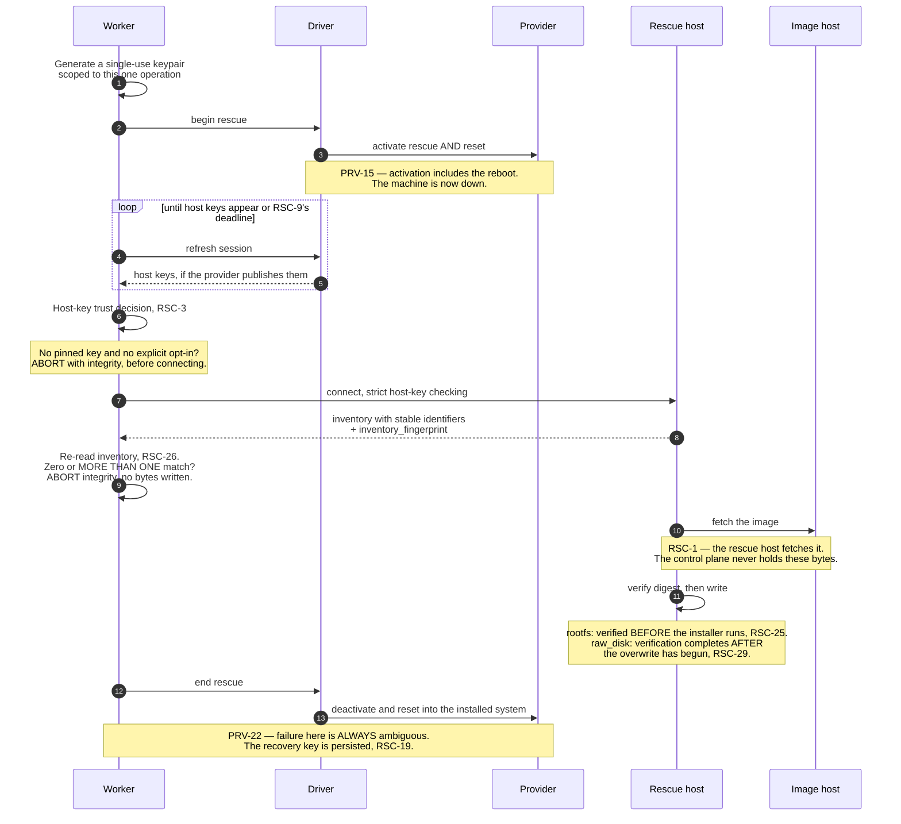

# 06 — Rescue mode and image installation

The rescue engine is generic (`OVR-8`). It receives a provider driver, drives the
provider through the rescue lifecycle, and installs an image over SSH.

## Sequence

1. Generate a single-use Ed25519 keypair scoped to this one operation.
2. Ask the driver to activate rescue and initiate the reboot (`PRV-15`).
3. Poll the driver's session refresh (`PRV-19`) until host-key material is available or
   the caller's policy resolves the question.
4. Establish the host-key trust decision, and refuse to connect if it cannot be made.
5. Wait for rescue SSH to answer, then collect an inventory report (block devices, UEFI
   presence).
6. Download the image *inside the rescue environment*.
7. Verify the caller-supplied digest.
8. Install: run the provider's OS installer against a generated layout config, or stream
   and decompress a raw image onto a named block device.
9. Ask the driver to exit rescue and reset into the installed system (`PRV-21`).
10. Remove any temporary provider-side credential.

**Two things in that sequence are where the audits found defects.** The abort before connecting is
`RSC-3`'s, and it is the security-critical decision in the whole workflow. The abort before writing
is `RSC-26`'s, added after the fourth audit found a path to destroying the wrong disk that satisfied
every requirement then in force — and *more than one match* is the dangerous case, not zero.

**RSC-1** **AMENDED 2026-08-31 — scoped to the rescue strategies.** For `rootfs_via_rescue` and
`raw_disk`, the image MUST be downloaded by the rescue host, never by the control plane, and the
control plane never holds image bytes. *The rule was written for a path where the target machine has
its own bandwidth and the control plane has no business in the data path. Catalogue install
(`DOM-28`) has no rescue host to do the fetching, and `RSC-39` states what happens there instead.*

**RSC-2** The engine MUST NOT contain provider conditionals. Everything provider-specific
lives behind the driver interface.

## Host-key trust

This is the security-critical decision in the whole workflow. The rescue environment
holds a credential that grants root on the customer's machine.

**RSC-3** The engine MUST NOT connect unless one of these is true:

| Condition | Behaviour |
|---|---|
| Caller supplied expected host keys | Pin exactly those. Strict checking. |
| Driver published host keys and caller supplied none | Pin the driver's. Strict checking. |
| Caller supplied keys *and* driver published keys | They MUST overlap. No overlap is an `integrity` failure, and the engine MUST abort before connecting. |
| Neither, and the caller explicitly opted into first-use trust | Accept-new. Permitted, but it is a documented downgrade. |
| Neither, and no explicit opt-in | Abort with an `integrity` error. |

**RSC-4** Caller-supplied keys and the first-use-trust opt-in MUST be mutually exclusive
in the request (`API-13`).

**RSC-5** A pinned connection MUST NEVER be silently downgraded to first-use trust — not
on retry, not on timeout, not when the driver returns an empty key set later.

**RSC-6** Host keys MUST be canonicalized before comparison: parse out the algorithm and
the base64 blob, discard comments and any leading host pattern, and compare the
`algorithm base64` pair. Comparing raw strings makes a formatting difference look like an
attack, and vice versa.

**RSC-7** The known-hosts entry MUST be written with the correct host/port form for
non-default ports and for literal IPv6 addresses.

**RSC-8** The global system known-hosts file MUST be disabled for these connections, and
the per-operation known-hosts file MUST live in a private temporary directory that
survives for the whole operation.

**RSC-9** The deadline for waiting on driver-published host keys MUST be derived from the
boot timeout, not from an unrelated hard-coded constant. Bare metal routinely takes
several minutes to POST and reach a rescue environment, and a provider that only
publishes keys after boot (`PRV-19`) will otherwise fail every pinned install. See
`DEF-5`.

## Credentials

**RSC-10** The rescue keypair MUST be generated per operation and MUST NOT be reused.

**RSC-11** A password-based rescue credential MUST be passed to the SSH client through
the environment or a file descriptor, never through the command line, where it is visible
in the process table.

**RSC-12** The installed system MUST NOT inherit the ephemeral rescue credential. Where
the provider's installer offers to copy rescue authorized keys into the target, the
generated configuration MUST explicitly disable that.

**RSC-13** A rootfs install MUST require at least one caller-supplied authorized key for
the installed system, precisely because of `RSC-12` — otherwise the result is a machine
nobody can reach.

**RSC-14** A raw-disk install MUST reject caller-supplied authorized keys. The filesystem
layout inside an arbitrary raw image is unknown, so keys cannot be injected generically.
Callers bake access into the image or use a post-install step that mounts it
deliberately. Silently ignoring the keys would be worse.

## Remote command transport

**RSC-15** Every caller-controlled value that reaches the rescue shell — URLs, digests,
hostnames, device paths, key material, post-install scripts, installer configuration —
MUST be transported base64-encoded and decoded on the remote side. No caller value may be
interpolated into shell text directly, even after validation.

**RSC-16** The remote script MUST run with errexit, nounset, and pipefail set, and with a
restrictive umask.

**RSC-17** Remote downloads MUST restrict the allowed protocols, including on redirect,
to exactly the scheme the URL declared. A redirect from `https` to `http`, or to a
non-HTTP protocol handler, MUST be refused by the fetch tool itself and not merely by
prior URL validation.

## Failure handling

**RSC-18** The caller MUST be able to choose between exiting rescue on failure and being
left in rescue for debugging. The default MUST be to exit.

**RSC-19** Whenever rescue exit is uncertain — activation failed ambiguously, cleanup
failed, or the caller asked to be left in rescue — the private key MUST be persisted
under a configured recovery directory, and its path MUST be reported in the operation's
error details along with the rescue address and port. **The key is the only part of the session
that may be written**, and the exception is owned by `DOM-11` (amended 2026-09-02) rather than
claimed here: that requirement forbids persisting a rescue session at all, so until it named this
case the two were a contradiction a builder had to resolve by guessing. A provider-supplied rescue
password is **never** persisted — it is the provider's to reset — and the record carries the path,
never the key.

**RSC-20** The recovery directory MUST be absolute, MUST be created with owner-only
permissions, and MUST live on encrypted storage (`STO-15`). Its contents are root
credentials for customer machines.

**RSC-21** Persisted recovery keys MUST be inventoried and MUST be removable by an
operator once recovery is complete. There MUST be a documented cleanup procedure; keys
accumulating in a directory forever is a slow leak of live credentials.

## Rootfs-archive installation

Applies to providers whose rescue environment ships an OS installer that consumes a root
filesystem archive.

**RSC-22** The engine MUST generate the installer's configuration from a structured
layout: drives, software-RAID flag and level, partitions (mountpoint, filesystem, size),
hostname, bootloader, image path, authorized-keys source, and an optional post-install
script.

**RSC-23** Layout validation MUST enforce: at least one drive; at least one partition;
every drive a **stable identifier** resolving to exactly one device (`RSC-26`) rather than a
device path — *the withdrawn "simple path under the device directory" is the unstable naming
`RSC-26` exists to eliminate, and this is the fifth document that stated it*; no
whitespace, CR, LF, or NUL in any config field; a RAID level from the supported set when
software RAID is enabled.

**RSC-24** Supported archive formats and their canonical extensions MUST be declared, and
the downloaded file MUST be given the extension matching the declared format — installers
routinely dispatch on it.

**RSC-25** The digest MUST be verified after download and *before* the installer runs.
This path is safe: nothing has been written to the target disk yet.

## Raw-disk installation

**RSC-26** **AMENDED — naming a device is not enough, because the name is not stable.** The
target block device MUST be named explicitly by the caller and the engine MUST NOT guess one.
**But `/dev/sda` is an ordering artefact that can differ across boots, between the rescue
environment and the installed system, and after any hardware change** — so a caller that reads an
inventory today and installs tomorrow can name a device that has since become a different disk.
On a two-disk machine that is the customer's data, destroyed, with every requirement in this
document satisfied.

**The target MUST therefore be bound to identity, not to a name:**

- **`RSC-38` makes rescue inventory its own operation** returning the block-device
  inventory with **stable identifiers** — serial and WWN — plus an opaque `inventory_fingerprint`
  over the whole device set.
- **An install request MUST carry both** the chosen device's stable identifier and the
  `inventory_fingerprint` it was chosen from (`WIR-20`).
- **The worker MUST re-read the inventory immediately before any disk I/O** and abort with
  `integrity` — before writing a single byte — if the fingerprint differs, if the named identifier
  is absent, or if the inventory fails to parse (`RSC-34` keeps the raw capture).

`RSC-27`'s path validation still applies to whatever device path the identifier resolves to at
write time. **The identifier is authoritative; the path is derived.**

**An identifier that does not resolve to exactly one device MUST abort `integrity` before any
write.** Zero matches is the stale-inventory case; **more than one is the dangerous case** —
duplicate or empty serials are real on consumer and virtualised disks, and "pick the first" there
is the same coin-flip over which disk gets destroyed that naming `/dev/sda` was. The driver MUST
prefer WWN where the provider exposes it and MUST declare an offer unsellable for `raw_disk` and
`rootfs_via_rescue` where no per-device unique identifier is available at all.

**This binds every strategy that names a disk, not only `raw_disk`, and the validation is
identical**: resolve each `layout.drives[].identifier` against a freshly re-read inventory, match
exactly one device, and abort `integrity` before any write on zero or multiple matches
(`WIR-20`). `RSC-22`'s installer layout
carries a `drives` list, and those are device names with exactly the same instability — a rootfs
install that partitions `/dev/sda` after the ordering shifted destroys the same customer data, and
scoping the rule to raw-disk would have left the launch product's primary install path on the
unstable identifier. Every caller-supplied disk reference MUST be a stable identifier checked
against the same `inventory_fingerprint`.

**RSC-38** **AMENDED 2026-08-31 — renamed from *preflight*. Rescue inventory is a first-class
operation, read-only about the disk and about nothing else.** It boots rescue, collects the
`RSC-33` report, and returns it without writing anything. It exists because the previous design
gave a caller no way to see the inventory *before* committing to a destructive write — the
information arrived attached to the result of the operation that had already destroyed the disk.
It MUST be free of side effects beyond entering and exiting rescue, and its report MUST carry the
same `inventory_fingerprint` an install will be checked against.

**The old name was the defect.** "Preflight" reads as harmless, and it is read-only about the
*disk* only: entering rescue means rebooting the machine into another operating system (`PRV-15`),
and `PRV-22` makes the exit *always* ambiguous, so a failure can strand a customer's machine there
with nothing serving. `OPS-11` already has to classify it with `install` rather than `refresh` and
say why, four documents away from the name that caused the confusion. `CONTEXT.md` bans the word.
*The same word also means the CORS `OPTIONS` request in `WIR-4a` — it was ambiguous inside a single
document before it was ambiguous about danger.*

**RSC-27** The target MUST be validated as a simple path under the device directory, and
the remote script MUST additionally verify at runtime that it is a block device.

**RSC-28** The stream MUST be digested while it is decompressed and written, so the image
is read once.

**RSC-29** **Digest verification for this strategy completes only after data has begun
overwriting the target disk.** This is inherent to single-pass streaming and MUST be
documented in the API. A mismatch leaves the disk partially or wholly overwritten; the
operation MUST fail with an `integrity` error and route to reconciliation (`OPS-11`).

**RSC-30** Because of `RSC-29`, the deployment MUST host custom images on controlled,
immutable storage — defined (`F18`) as storage where the bytes behind a URL cannot change after
the digest is computed: a content-addressed store, or object storage with versioning or object
lock where the URL pins the version. A mutable path behind a signed URL fails this even though
the URL is signed. The caller SHOULD verify the digest independently before
submitting. An implementation MAY offer a two-pass mode (download to scratch, verify,
then write) for hosts with sufficient scratch space, and if it does, that mode SHOULD be
the default.

**RSC-31** **AMENDED.** Optional post-write growth applies to the **final** partition and is
requested by the boolean `grow_partition` (`WIR-20`). *The withdrawn one-based-index form has no
wire representation and never had one; growing anything but the last partition is not a thing the
installer can do.*
It MUST be best-effort and MUST NOT fail the operation if the growth tool is absent.

**RSC-32** After writing, buffers MUST be flushed and the partition table re-read before
any post-install step runs.

## The inventory report

**RSC-33** Before writing anything, the engine MUST collect a machine-readable inventory
report — at minimum the block-device inventory (name, path, size, type, model, serial)
and whether the firmware is UEFI — and MUST attach it to the operation result. This is
the record that tells an operator afterwards which disk was actually overwritten.

**This is an obligation of the rescue engine and reaches only the strategies that enter rescue**
(`rootfs_via_rescue`, `raw_disk`, and `RSC-38`'s inventory pass). `provider_native` and
`provider_catalogue` boot nothing and read no disk, so they produce no report and their operation
result is empty (`WIR-10b`). *Scoped explicitly 2026-09-02: read unscoped it made a result field
mandatory on two strategies that cannot produce one, which `WIR-10b` had duly copied.*

**RSC-34** An inventory report that fails to parse MUST be captured raw rather than
discarded.

## Timeouts

**RSC-35** Three timeouts MUST be configurable and MUST be validated at startup: boot
(waiting for rescue SSH), command (a single remote command), and poll interval. Sensible
defaults: 10 minutes, 90 minutes, 5 seconds.

**RSC-36** The command timeout must accommodate a full image write over the provider's
network. It is normal for it to be an order of magnitude larger than the boot timeout.

**RSC-37** The operation lease (`OPS-7`) is unrelated to these and MUST be renewed by
heartbeat throughout, so a 90-minute install does not lose its lease at minute three.

## Catalogue installation

`DOM-28`'s second install feature. No rescue system is entered and the rescue engine above is not
involved: the caller's image is imported into the operator's private catalogue at the provider, and
the provider builds the machine from its own converted copy. `ADR-0013` records the decision and
what was rejected.

**RSC-39** **The operator re-hosts the image and verifies it in transit.** The provider fetches from
a URL rather than accepting an upload, so something must serve the bytes. provisiond MUST fetch the
caller's image, verify its `sha256` **as it streams**, store it in operator-controlled immutable
storage (`RSC-30`), and give the provider a URL to that copy. The caller's own URL MUST NOT be
passed to the provider.

**This fetch is bounded by `RSC-44`**, which validates every address the caller's URL resolves to,
and by `SEC-19`'s allowlist, which is a **MUST** on this path with an empty list meaning *no
catalogue install* rather than *any host* — that requirement's fail-open default was written when
every image fetch happened on the rescue host, and this path reverses who the client is.

Two reasons, and only one of them is about the provider. A caller's signed URL is a credential
(`SEC-21`), and handing it to a third party with no documented retention behaviour discloses it.
And **without the re-host this path verifies nothing at all** — the provider fetches and converts
the bytes and exposes no checksum field, so "integrity" would mean only that the provider fetched
something.

*The cost is real and is accepted: the control plane is in the data path for the size of the image,
which `RSC-1` was written to prevent. That prohibition is narrowed rather than broken.*

**RSC-44** **Where *provisiond itself* fetches a caller-supplied URL — today exactly `RSC-39`'s
catalogue re-host, and any fetch a later requirement adds inside this process — every address that
URL resolves to MUST be validated before a byte is sent to it, and again after every redirect.**
`RSC-39` makes provisiond fetch an anonymous
stranger's URL, inside the process that holds every provider credential and root on every customer
machine — which is a server-side request forgery primitive in the worst place this system has.
`RSC-40` puts hostile-input handling there deliberately and bounds it by refusing to *parse* the
bytes; nothing bounded where they are fetched **from**. `SEC-19`'s host allowlist is the only other
control and **was** optional and fail-open until `SEC-19`'s amendment of the same day made it a MUST
on this path, so on the default deployment as it stood `https://169.254.169.254/…`
or `https://127.0.0.1:8080/…` was a legal image URL.

- **Resolve first, then check every resolved address** — both families, every A and AAAA record.
  The fetch MUST be refused where any of them is loopback, link-local (`169.254.0.0/16`,
  `fe80::/10`), private (`10/8`, `172.16/12`, `192.168/16`, `fc00::/7`), carrier-grade NAT
  (`100.64/10`), multicast, broadcast, unspecified, or an IPv4-mapped or IPv4-compatible IPv6
  address wrapping any of those. A deployment MUST be able to add ranges — its own metadata service,
  its own management network — and MUST NOT be able to remove the list.
- **Connect to the address that was validated**, pinning it for the connection, or re-validate at
  connect time. Otherwise the name is resolved twice and the second answer is the attacker's: DNS
  rebinding defeats a check performed only on the first lookup.
- **Re-validate after every redirect, and cap the redirect count.** A redirect to a public host that
  then answers `302` to `http://169.254.169.254/` satisfies every rule this set had before today.
- **Re-check `SEC-19`'s host allowlist on every hop, against the redirect target's own name.**
  *Added 2026-09-04, and it is a different control from the bullets above rather than a restatement
  of them.* Those validate resolved **addresses**; an allowlisted `images.example.com` answering
  `302` to `https://images.attacker.example/` sends provisiond to a name nobody allowed, at an
  address that is public, routable and entirely ordinary — so every address class passes, the scheme
  is held, and the fetch proceeds. The allowlist was checked once, at request time, against a URL
  the attacker was free to abandon on the first hop. A redirect whose target is outside the list
  MUST be refused, exactly as the original URL would have been.
- **Hold the scheme across every hop**: `https` only, or `http` where a deployment has explicitly
  enabled it (`SEC-18`), refused on redirect as well as on the original URL. *`RSC-17` states that
  rule for the **rescue host's** fetch tool and binds nothing here — it sits under remote command
  transport and governs a shell running on the customer's machine — so this path had no
  scheme rule across hops at all, and citing `RSC-17` for it was citing a requirement about a
  different program.*
- **Refuse with `invalid_request`** (`DOM-17`), and **never report why in a way that describes the
  target**. The response body MUST
  NOT reach the caller and the error MUST NOT carry the resolved address, the status or the response
  size — those turn a refused fetch into a port scanner with an oracle. *The kind is named because
  `API-24` forbids a handler choosing one, and a refusal with no kind is the defect this same review
  fixed for `SEC-39` by minting `ceiling_exceeded`. `invalid_request` rather than a new kind: the
  URL genuinely is one the caller may not supply, the caller's remedy is to send a different one,
  and `retryable` is `false`.*

**This is a bounded fetch, so bounding it is cheap.** The alternative considered was isolating the
fetcher in a process with no credential — which is stronger and is what a deployment SHOULD do where
it can, since it also bounds the parser-shaped hazards `RSC-40` refuses to create. It is not
mandated because `ADR-0001` chose one deployable and a second process is a second deployment shape
the rest of this set does not model; the address validation is required unconditionally either way.

**The rescue strategies are outside this requirement, and the reason is narrower than "it is the
customer's own machine".** `RSC-1` has the **rescue host** fetch the image, so the client is a
machine the caller has already paid for and is already root on — but that machine sits in the
*operator's* provider account (`DOM-3`), where `169.254.169.254` is the operator's metadata service
and the neighbours are other tenants' servers. **That is `07-security-requirements.md`'s primary
threat, not a bystander**, and it is bounded by different controls than this one: the rescue host
runs the caller's chosen OS moments later and can reach whatever that OS can reach, so an
address filter on its `curl` protects nothing an install does not immediately undo. What actually
bounds it is `SEC-41`'s account-level segregation and `SEC-43`'s distribution across accounts.
*Recorded rather than asserted, because the obvious sentence — "it only reaches the customer's own
machine" — is false, and a reviewer who believes it will not go looking for the control that is
really doing the work.*

**RSC-40** **provisiond measures a caller's image and MUST NOT interpret it.** It counts the bytes
and hashes them. It MUST NOT parse the content — not the partition table, not the image format, not
the filesystem — and whatever the caller declares about the bytes is taken on trust exactly as
`WIR-20` already takes it on every other path. *On the catalogue variant that is `compression`
alone: `format` belongs to the `rootfs_tarball` source, and this path's source is `raw_disk`
(`DOM-13`, `WIR-20`). Naming a field the body cannot carry is how a conformance item ends up
testing a value no request can supply.*

**A maximum image size MUST be declared per offer and enforced against the stream**, aborting the
transfer when exceeded. That is the one check available without interpretation, and it doubles as a
bound: without it an unauthenticated-adjacent caller can make the operator stream arbitrary bytes.

**The prohibition is the load-bearing half, so the reason is recorded.** A parser for
caller-supplied binary is a parser for hostile input from an anonymous stranger, and it would run
inside the process that holds every provider credential and root on every customer machine —
`OVR-10a` calls that process's boundary the only structural defence left. Image-format parsers have
a long history of exactly this class of vulnerability. *Written down because the next reviewer will
propose a cheap magic-byte check, and this is why it was refused.*

**RSC-41** **The import happens outside the machine lock, and is bounded.** The import touches no
machine; only the switch-over does. So the operation MUST import and poll the provider to a usable
state while holding **no** machine lock, and acquire it only for the rebuild and the cleanup — the
one exception `OPS-8` admits, and it is admitted *there* (amended 2026-09-02) rather than asserted
here. *Naming itself a narrowing did not make it one: `OPS-8` said "for its duration" without
qualification, so the two requirements were a straight contradiction and the winner was whichever a
builder read second.* On re-acquiring the lock the operation MUST re-validate before the rebuild
(`OPS-9`, `OPS-23`): an exposure-reducing cancellation taking the lock during the import is the
behaviour this narrowing exists to permit, so the machine may be gone by the time the import
finishes.

**A maximum import wait MUST be stated**, past which the operation aborts and the imported image is
deleted.

Three things go wrong without this, and the third is the expensive one. The caller's existing
machine is locked and idle while still billing. An exposure-reducing cancellation queues behind it
(`OPS-9` defers rather than waits, so it simply does not run). And `PRV-13b` puts the deployment's
worst-case machine-lock hold inside `wind_down_cost`, which sizes the reserve on **every machine in
the fleet** — so an unbounded provider queue on one driver would raise the commitment every customer
must post before buying anything.

**RSC-42** **Both copies of the image are purged when the operation stops being live** — the
operator's re-hosted copy and the provider's imported one — on entry to any settled state **and on
entry to `needs_reconciliation`**, exactly as `OPS-2` purges the request payload. This is
`ADR-0005` applied to a new object rather than a new rule invented for one, which is the move
`STO-42` made for abuse statements.

**AMENDED 2026-09-06 — an install cannot be requeued** (`OPS-46`, `F39`), so a fresh copy arrives
only by the caller sending a fresh install. *The withdrawn sentence read "A requeue carries a fresh
payload (`OPS-34`) and re-uploads", which asked an operator to re-upload image bytes `STO-9` had
purged and never gave them.* **The provider-side copy is deleted by
a call that may fail or be lost**, so the import MUST carry the operation's correlator as a
provider-side tag and `OPS-32`'s account sweep MUST delete any image whose operation has settled or
vanished. An orphan is not merely a storage charge: it is a copy of a customer's operating system
left in the operator's account after the deployment undertook to destroy it.

**RSC-43** **A catalogue install settles on the provider's report, and provisiond makes no claim
about the machine.** `succeeded` means the provider completed the build. It does **not** mean the
machine booted, is reachable, or works.

**provisiond MUST NOT probe the machine to decide.** A caller's image may legitimately ship no SSH
daemon at all — a database appliance, a game server, a mesh node — so requiring one in order to call
an install successful would be the lowest-common-denominator reduction `OVR-1` forbids. Verifying
the machine is the customer's check.

**What the deployment owes instead is disclosure.** The offer MUST carry the provider's guest-image
requirements as prose the caller can relay to whoever built the image (`WIR-30`), and the machine
MUST record that provisiond did not verify these bytes (`DOM-29`). An image that fails those
requirements produces a machine that is running, billing, draining runway and unreachable, with no
rescue path on this provider to fix it — and the customer's only remedy is delete. *That is a
residual disclosed rather than solved, in the manner of `RSC-29`.*

## Reaching the machine at all

**RSC-45** **A driver MUST NOT assume a newly ordered machine has an IPv4 address, and MUST declare
which address family its rescue path uses.** A Hetzner Robot order carries **no IPv4 address unless
one is bought**: the API states that "If you do not specify the parameter, the server will be
ordered without an IPv4 address by default", and `addon[]=primary_ipv4` is separately priced. Two
auction orders placed on 2026-09-04 were delivered with `server_ip: null`. **[observed 2026-09-04]**

Everything in this document reaches the machine over SSH and pins its host key, and nothing in it
states which address family that connection uses. A deployment whose control plane has no IPv6 path
cannot reach a default-ordered Robot machine **at all** — and it discovers this after the money is
spent, on a machine that exists, bills, and drains runway exactly as `RSC-43`'s unreachable case
does, for a different reason and with the same remedy.

A driver MUST therefore either order the address addon and carry its cost into the offer's price, or
declare that its rescue path is IPv6-capable and that the deployment running it must be too. The
choice is a per-driver fact and belongs in `08-provider-notes.md`; what MUST NOT happen is a machine
bought before anyone established it could be reached.
