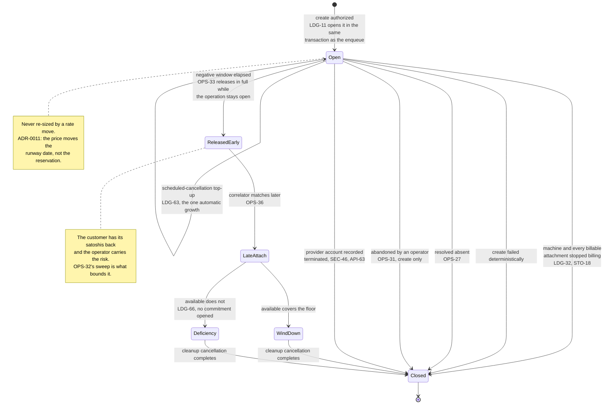

# 12 — Billing and the ledger

This document did not exist until 2026-08-11, and its absence was the largest hole in the set:
`API-17b` requires a deployment to define its spending authority, and nothing defined it. The
decisions it records live in `ADR-0002` (prepaid balance is the only spending authority),
`ADR-0003` (the float is denominated in satoshis) and `ADR-0004` (the perimeter).

**The ledger is not an accounting convenience. It is the authorization system.** Under `ADR-0002`
a balance is the *only* thing that permits spending, so a ledger bug is an authorization bug, and
the transaction that commits funds is the same transaction that authorizes a purchase.

> **Rewritten 2026-08-12 after two independent audits.** The first version modelled reservations
> as **holds** — a card-payments primitive: authorize once, capture once, against a discrete
> purchase of known size. Machine time is not that. It is continuous consumption against a
> prepaid claim, and a hold that never shrinks drives the available balance negative **in the
> ordinary happy path, one hour into the first machine's life**. Six further defects were
> downstream of the same mistake. The primitive is now a **commitment that decays as it is
> consumed**, and the consumption half of the ledger — the meter — is specified rather than
> assumed. Withdrawn requirements are marked in place, per the README's append-only rule.

## Units and arithmetic

**LDG-1** Every monetary quantity in the **ledger** MUST be a signed integer of satoshis. No
floating point, no decimal strings parsed late. A balance comparison is integer arithmetic with
no conversion in it — which is the point of `ADR-0003`'s denomination choice.

This does not reach provider prices. `DOM-9` requires an offer's price be carried as the exact
string the provider returned, and that remains correct: an offer is not money owed, it is a
quotation. **The conversion from that string to integer minor units MUST happen exactly once,
at the boundary where a price becomes an obligation** (`LDG-27`), and the string MUST NOT be
parsed into floating point at any point on that path.

**LDG-2** Provider-side amounts MUST be recorded in the provider's own billing currency alongside
the satoshi amount, as a separate integer of that currency's minor units, with an explicit
currency code — even while only one provider currency is in use. Without it, "what did this
machine actually cost me at the provider" is unanswerable for all history predating the second
currency, and is not reconstructable later.

**LDG-3** Adding two amounts with different currency codes MUST be an error, not an implicit
conversion.

**LDG-4** Every conversion MUST record the rate as an exact rational (numerator and denominator),
its source, its observation time, the haircut in basis points, and the rounding rule version —
denormalised onto the entry, so it remains self-explanatory after any rate table is pruned.

**LDG-28** **Rounding is specified per direction and applies everywhere, not only to
conversions.** Debits round up, credits round down, and a commitment's required amount rounds up.
Releasing a commitment returns **the exact satoshi amount still reserved** and performs no
conversion — a reservation is a quantity of satoshis once created, not a claim re-priced at
release. Without this rule a commitment opened at one rate and closed at another silently changes
the balance of a ledger whose whole purpose is exact integer arithmetic.

**LDG-29** The margin (`LDG-24`) MUST be expressed in basis points and applied as integer
arithmetic with a stated rounding direction. A percentage stored as a decimal fraction
reintroduces the float that `LDG-1` exists to exclude.

**LDG-68** **The billing period is the calendar month in UTC, and it is one boundary for the whole
deployment.** A period begins at `00:00:00Z` on the first day of a month and ends at the same
instant of the next. Every tenant, every machine and every attachment share it; a machine created
mid-month has a short first period, which is correct because the meter charges elapsed billable
time (`LDG-38`) rather than periods.

*Stated here because it was load-bearing and absent.* The phrase carried `LDG-8`'s deduplication
key, three terms of `LDG-38`'s arithmetic — which apportions corrections **and**
deficiency-absorbed windows across the boundary — and two
conformance items, and no document said what it was. A calendar month, a provider invoice month
and a per-machine anniversary each satisfied every sentence in the set and produced different
bills.

**AMENDED 2026-09-02 — it does not carry `PRV-13e`'s re-derivation cadence, and claiming it did was
a defect in this requirement.** The sentence above used to include that cadence in the list of
things the undefined phrase was carrying, and defining the phrase as a calendar month therefore set
re-derivation to **monthly** — under which `runway_until` is up to a month stale, the rule `LDG-16`
then carried, "persist across more than one derivation" (withdrawn 2026-09-21), becomes two months,
and `PRV-13c`'s "materially in the future" swallows every cancellation date under about thirty
days. `PRV-13e` now states its own interval, defaulting to hourly, and `OVR-19` carries it as a
separate deployment parameter.

**Two quantities, and the distinction is worth holding on to:** a billing period is a **boundary** —
where `LDG-38`'s increment closes and its rounding credit starts afresh, and which entries a
correction may name — while
a re-derivation interval is a **staleness bound** on a price-derived date. They answer different
questions, they have no reason to be equal, and fusing them made one requirement's silence set
another requirement's clock.

**A period is a property of the deployment, not of a provider or a machine.** Deriving it from the
provider's invoice month would make one machine's period depend on which account it landed in and
would encode a commercial term as a constant (`PRV-13c`); deriving it from the machine's create
instant gives an attached machine (`OPS-27`, `OPS-36`) two defensible start instants and no rule to
choose between them. The single boundary also makes `LDG-8`'s idempotency key and `LDG-38`'s
period placement a range scan on `(subject_kind, subject_id, billing_period, kind)`
(`05-persistence.md`). *"Netting" was deleted from this sentence and three others on 2026-09-05;
`LDG-38` stopped netting over entries on 2026-09-02, and the word had survived in every document
but the one that changed.*

**This is a deployment parameter only in the sense that it MUST be stated** (`OVR-19`): it is fixed
at deployment and MUST NOT vary per tenant, because a correction naming an entry in another
tenant's period arithmetic is not a case any requirement here defines.

## Entries

**LDG-5** The ledger MUST be append-only. No update, no delete. A correction is a new entry
naming the entry it corrects. **Balance is the sum of entries** and nothing else.

**LDG-6** *Amended 2026-10-04 (`pv-gip.39`): remove the unwritable settlement-reference
promise; provider billing references belong to `STO-57`.* Every entry MUST carry: a stable id; the tenant; a per-tenant monotonic sequence number;
a kind; the signed satoshi amount; the running balance after it; and the ids of whatever caused
it — operation, machine, commitment.
Provider-denominated entries additionally carry `LDG-2`'s native amount and `LDG-4`'s conversion
evidence.

**LDG-7** **AMENDED.** Entry kinds are exactly: `topup`, `usage_debit`, `setup_fee_debit`,
`operation_fee_debit`, and `correction`. **Every entry moves real money.** The previous list
included `hold`, `hold_adjustment`, `hold_release` and `expiry`; the first three are withdrawn
because a reservation is no longer a ledger entry (`LDG-30`), and `expiry` is withdrawn because
the closing section of this document prohibits the only behaviour it could have described.

A setup fee MUST be its own kind and MUST NOT be folded into usage, because it is the one
non-refundable component and a caller asking "why did I not get that back" deserves a row that
answers it.

**LDG-8** Every entry MUST carry an idempotency key unique within the tenant. For a `topup` that
key MUST be **derived from the payment's own identity at the rail** — not generated by the
receiving code — or a redelivered payment notification credits twice under two different keys.
For a `usage_debit` the key MUST be **`(subject, billing period, kind, increment end)`**, where
*subject* is the machine or an individual billable attachment and *increment end* is the instant
the metered increment closes (`LDG-38`). **The key is derived from the thing being billed, never
from a count of what has already been posted** — a redelivered or crash-replayed increment then
derives the *same* key, and where it inserts an entry and the first posting left one the insert
conflicts, while a cadence that subdivides a period still posts every increment under a distinct
one. What stops a replayed increment, and how little of that the conflict is, is `LDG-38`'s.
*Amended 2026-10-02: this sentence had the replay conflict unconditionally, and a conflict is a
refused insert, which a replay that writes no entry never attempts.*

*A "posting index" counted from the ledger was the withdrawn form, and it cannot deduplicate at
all: a second run reads one more prior debit, derives the next index, and its insert succeeds —
double-charging the tenant and double-decrementing the commitment. Serializing the allocation does
not help, because the two runs were never trying to claim the same number.* *The withdrawn `(machine, billing period, kind)` admitted exactly one posting per
period, which deduplicated away every cumulative posting after the first and stopped the
commitment decaying.*

## Commitments

**LDG-30** A **commitment** is a reservation of satoshis against a specific machine. It is **not
a ledger entry**; it is a separate record with an amount that **decreases as consumption is
debited against it**. The ledger records money that moved; a commitment records money that is
promised and has not moved yet. Conflating the two is what made the first version of this
document double-count every reservation.

A commitment MUST carry: the tenant, the machine, **the operation that opened it where one did**,
the satoshi amount **still reserved**, its state (`open` or `closed`), and the timestamps of both.

**The operation is nullable, and `LDG-62` is what makes it so.** Extend-runway is a synchronous
caller write that mints no operation — a pure balance event with no provider mutation is not one
(`OPS-39`) — so where it *opens* a commitment rather than growing one, that commitment has no
create behind it and its operation is null. The reachable case is `OPS-36`'s deficiency-funded
late-attach branch, which deliberately opens **no** commitment at all, leaving `LDG-62` as the only
thing that can open one on that machine. `05-persistence.md` marks the column nullable for exactly
this. What a commitment is a reservation *against* is the machine, not the operation.

**A machine MUST have at most one `open` commitment at a time.** This is the invariant
`LDG-31`'s "that machine's commitment" rests on, and until now it was stated
only as a storage constraint (`05-persistence.md`). It does not forbid a machine having two
commitments over its life: a create's is opened before the machine row exists — identified by its
operation until then — and `OPS-36`'s wind-down commitment is opened only after `OPS-33` closed
that first one.

### The life of a commitment

A commitment is the reservation `ADR-0002` makes the entire spending authority. It is sized once,
decays as the machine is consumed, and closes exactly once — and the branches below are where every
defect in this document has lived.



**Read the two notes together.** The early release is what stops a stuck order freezing a
customer's money indefinitely, and it is only safe because something later finds the machine if it
does turn up. `OPS-36` is that branch and `OPS-41`/`OPS-42` are what make it work.

**LDG-9** **AMENDED.** A tenant's **available** balance is:

```
available = Σ(ledger entries) − Σ(reserved amount of open commitments)
```

The spending authority check is `available ≥ required_commitment`, and it is the only
authorization a create receives (`ADR-0002`, `API-17b`).

**LDG-70** **`Σ(ledger entries)` is a definition, not a read strategy, and the read is
`balance_after` on the tenant's latest entry.** `LDG-5` says "**Balance is the sum of entries** and
nothing else"; `LDG-6` puts a running balance on every entry; `STO-21` permits a cached balance.
Three statements about one number, and none of them said which the authorization check reads —
so the literal implementation scans a tenant's entire ledger on every create, every extend and
every metered posting, over a table `LDG-22` exempts from purge and `STO-24` forbids retention
from ever reaching. **The unbounded side of `LDG-9` is the ledger sum; the commitment side is
already indexed** (`05-persistence.md`, "index on `(tenant_id, state)` for the availability
computation"), which is what makes the asymmetry visible.

The rule is:

- **`balance_after` on the greatest `seq` for that tenant is the authoritative read**, and
  `GET /v1/balance` (`API-47`) is answered from it. It is a single indexed row
  (`(tenant_id, seq desc)`), so a polling agent cannot make the read cost grow with its own
  history — and `CNF-157` forbids that `GET` from taking a write transaction, so a lazily
  repaired cache was never available as a fix.
- **`balance_after` MUST be computed and written inside the same serialized transaction that
  appends the entry** (`LDG-35`, `LDG-69`), as `previous.balance_after + amount_sats` read under
  that serialization. It is therefore not a cache that can drift: the serialization that already
  exists to prevent write skew is what keeps it exact.
- **A deployment MUST provide an audit path that recomputes the sum from the entries and compares
  it to the latest `balance_after`**, and a mismatch MUST fail closed in the manner of `LDG-20`'s
  solvency check. The denormalised column is authoritative for speed; the sum remains
  authoritative for truth, and the two are reconciled rather than merely assumed equal.

*A per-entry running balance whose relationship to the sum is never stated is exactly the shape of
defect this document was rewritten to remove: two numbers for one quantity, with no rule saying
which one authorizes a purchase.*

**LDG-31** **AMENDED — every debit against a machine, not only consumption.** Posting **any**
debit attributable to a machine **with an open commitment** — `usage_debit`, `setup_fee_debit`,
`operation_fee_debit` — MUST decrement that commitment by the same amount, in one transaction.
**AMENDED 2026-09-02 — the pairing rule has no exception.** *The withdrawn one was `LDG-39`'s late
setup fee, debited from available with no decrement where `OPS-33` had already released the
commitment. That is the seizure the paragraph below forbids, and `LDG-39` now makes the late fee an
operator deficiency instead — so there is no debit left that pairs with nothing, and a rule with one
exception is a rule two readers will apply differently.*

*The withdrawn text said "consumption", and `LDG-38` named only `usage_debit`. `PRV-13b` puts the
setup fee **inside** the commitment while `LDG-39` debits it, so on the ordinary funded dedicated
create the ledger sum fell, the reservation did not, and `available` went negative by exactly the
setup fee — violating `LDG-10`, which then requires the fee-post itself to fail. **This is the
2026-08-12 double-count reintroduced through the one entry kind the pairing rule forgot to
name**, and both independent reviewers found it.*

**The decrement clamps at zero and the excess is the operator's.** Where a debit exceeds the
commitment's remaining amount — reachable through the wind-down window, the rate window's lag
(`LDG-58`; amended 2026-09-23, `ADR-0027`) and a resolved-observed setup fee against a still-open
commitment (`LDG-39`) — the commitment decrements to zero, the tenant is debited only up to the
authority it granted, and the remainder is recorded as an **operator deficiency** in the manner of
`LDG-63`. It MUST NOT be taken from available balance: that would be the automatic seizure
`ADR-0011` exists to forbid, arriving through the meter instead of through re-derivation.

**The clamp MUST split provider-native cost as it splits satoshis** (added 2026-10-04,
`pv-gip.39`, `ADR-0031`). For computed debit `D > 0`,
customer debit `d` after clamping, and provider cost `N` in native minor units, the entry carries
`floor(N × d / D)` and the `clamp_overflow` carries the exact remainder `N − floor(N × d / D)`.
Thus neither side carries the full cost a second time; with `d = 0` the deficiency carries all of
it and no zero-value ledger entry is invented (`STO-45`). `LDG-75` consumes that partition.

Its effect on the ordinary path is unchanged — consumption leaves `available` **unchanged**,
because spending what you already committed neither frees nor freezes anything:

<!-- formal: Provisiond.Render.ldg31Table -->
| event | Σ entries | reserved | available |
|---|---:|---:|---:|
| `topup` +72,000 | 72,000 | 0 | 72,000 |
| commitment opened, 72,000 | 72,000 | 72,000 | 0 |
| one hour consumed: `usage_debit` −100, commitment → 71,900 | 71,900 | 71,900 | 0 |
| machine deleted at that increment end, commitment closed | 71,900 | 0 | 71,900 |
<!-- /formal -->

**LDG-32** **AMENDED.** A commitment MUST be closed, and its remaining amount released in full,
on **every** terminal outcome: the machine stops billing **and every billable attachment it left
behind has stopped billing** (`PRV-13a`, `STO-18`); the create fails deterministically; the create
is resolved absent (`OPS-27`); the create is abandoned (`OPS-31`); **or the machine's
provider account is recorded `terminated`** (`SEC-46`, `API-63`), which stops every meter in that
account (`LDG-74`) and closes every open commitment on its machines in the transaction that records
it — *the stop is named here because the first row above makes stopped billing the precondition for
every other outcome on this list, and the termination row arrived without it.*

*The account-termination row was missing until 2026-09-02 while `SEC-46` and `API-63` both cited
this requirement as the closing rule and the commitment state machine above drew the edge — the
"every terminal outcome" list named four and the set had five.* And the abandonment row is scoped to
the kinds that opened a commitment: an install or a delete opens none, and the only one within reach
is the machine's **running** commitment, which abandonment MUST NOT release (`OPS-31`).

**Attachments keep the commitment open, and metering follows them.** `PRV-13a` models volumes,
snapshots and reserved addresses that survive machine deletion and keep costing money; `PRV-13b`
reserves for them; but the meter (`LDG-37`) was machine-only, so a released commitment left them
billing against nothing. A deployment MUST meter each billable attachment on its own identity
until `released_at` is set, and MUST NOT sell an offer whose attachments have no bounded automatic
cleanup unless the operator has explicitly accepted and capped that exposure.

**Losing a provider account is not evidence that billing stopped** — see `SEC-46`, amended for the
same reason. **A terminal path with no close rule strands a customer's satoshis
permanently** — there is no withdrawal (`ADR-0004`), no expiry, and under `ADR-0005` no identity
to appeal with, so an ordinary retry loop against a contended offer would otherwise render a
balance unusable forever.

**LDG-33** **AMENDED (`ADR-0011`), with the formula now stated** — it was missing, and the
obvious reading was wrong in the operator's disfavour. Re-derivation (`PRV-13e`) MUST recompute
**`runway_until`** from the machine's fixed remaining commitment at the current rate, in **both**
directions — and MUST NOT resize the commitment.

```
protected_sats = at the current rate, rounded up:
                   wind_down_cost
                 + surviving billable attachments (PRV-13a)
                 + cost through any effective cancellation date (DOM-19)
                 + cost through any earliest cancellation date not yet passed (PRV-13c)
usable_sats    = max(0, reserved_sats − protected_sats)
runway_until   = now + floor(usable_sats / current_customer_rate)
```

**The two date terms are not additive.** Where both an effective cancellation date (`DOM-19`) and
an earliest cancellation date still in the future (`PRV-13c`) apply to the same machine, the
protected cost runs to the **later** of the two and is counted once. The earliest date is a
minimum-term constraint that exists from create (`PRV-31`), not something a cancellation creates,
so the cost of running to it is unavoidable from the moment the machine exists and MUST NOT be
advertised as spendable runway while it is still in the future.

**Exhaustion begins when `usable_sats` reaches zero, not when the commitment does.** Dividing the
*whole* commitment by the usage rate — which is what the fixture and the absent formula together
implied — advertises the wind-down reserve as runnable time and guarantees the operator is short
at the exact moment of cancellation, on every ordinary exhaustion rather than only on a crash.
`LDG-16`'s invariant ("still covers wind-down at the current rate") is satisfiable only with
`protected_sats` subtracted first. A commitment is sized once at open, decays as usage is debited
(`LDG-31`), and **is never increased without an explicit authorizing action** (`LDG-62`'s caller
extend-runway; the scheduled-cancellation branch is the one automatic exception, `LDG-63`). *The withdrawn text resized the commitment
to preserve the runway date, which spent three design rounds on widening speed before the
interviewee's observation dissolved it: every authorization prices at the current rate, usage
debits at spot, so a price move belongs to the runway date — the customer's purchasing power —
not to an automatic grab of their available balance.*

**LDG-34** A commitment adjustment MUST be a conditional write on the commitment's current
amount — a compare-and-swap or equivalent — so an adjustment computed from a read that another
transaction has since changed is refused rather than applied. The row has three writers: the
meter's decrement (`STO-28`), re-derivation's top-up on the scheduled-cancellation branch
(`LDG-63`), and a caller's runway extension (`LDG-62`), and no requirement serializes them against
each other. *Until 2026-09-08 the stated reason was two workers re-deriving the same machine in
the same period. `PRV-13e` says what re-derivation recomputes is "`runway_until`, not the
commitment", so that pair of writers does not exist.*

**LDG-10** A balance MUST NOT go negative, and `available` MUST NOT go negative. Any operation
that would do either MUST fail rather than proceed, including a runway extension (`LDG-62`) or
an exception-branch top-up (`LDG-63`) that available cannot fund — which route to the exhaustion
path and the operator-deficiency ledger respectively, never to borrowing.

**LDG-35** **The authorization read and the commitment write MUST be serialized per tenant.**
Computing `available` and opening a commitment in one transaction is not sufficient: two
transactions can each read the same balance and each commit, leaving twice the balance reserved
and one machine unfunded. This is write skew, and it commits without error under both READ
COMMITTED and SNAPSHOT isolation. A deployment MUST use a per-tenant lock, a serializable
transaction, or a conditional write against a versioned balance row, and MUST state which.
`STO-1` and `STO-51` specify exactly this kind of primitive for the queue and for one running
operation per machine; money needs one too, and did not have one.

**Stated 2026-09-06 (`ADR-0015`): per-tenant advisory locks**, held for the transaction and acquired
in the ascending order the amendment below requires. *The obligation to state one stood unmet from
the day it was written, because the reference store was an embedded single-writer engine whose
global write lock served the purpose without anyone selecting it (`STO-6`). A requirement met by
accident reads as met, which is why this one survived every review that checked whether the rule
existed rather than whether anything had chosen how to satisfy it.*

**AMENDED 2026-08-31 — two tenants, one transaction, and the primitive cannot depend on a tenant
row.** `WIR-42`'s attribution appends a correction pair spanning **two** tenants' ledgers and
`LDG-70` requires every append to happen inside this serialization, so one transaction must hold two
primitives — which this requirement never contemplated and never ordered. Therefore:

- **A transaction MAY hold the primitive for more than one tenant, and MUST acquire them in
  ascending tenant-identifier order.** Two concurrent attributions in opposite directions would
  otherwise deadlock, on the operator surface, on the money path.
- **The primitive MUST NOT require a live `tenants` row.** The ordinary input to `WIR-42` is a
  deposit whose tenant `API-34` already reaped, and `STO-26` deliberately removes the foreign key so
  its entries survive. A primitive implemented as a per-tenant lock row — which the paragraph above
  explicitly permits — would have nothing to lock for exactly the tenant being corrected.

*Found by a cross-model review of the abuse and attribution surfaces. The deadlock is the visible
half; the missing lock row is the one that fires on the common case.*

**LDG-69** **AMENDED 2026-09-08 (`ADR-0016`) — the machine lock is deleted; the rule binds the hold
`OPS-8` defines instead.** A deployment MUST hold `LDG-35`'s primitive for the duration of one
database transaction and no longer. While it is held, an implementation MUST NOT wait on a running
operation's hold on its machine (`OPS-8`), the completion of a child operation (`API-58`,
`WIR-39`), or any provider call.

**The permitted order is one-way: a running operation's hold on its machine (`OPS-8`) → a short
tenant-serialized transaction.** A worker whose operation holds the machine MAY enter the
serialization for a bounded read or write; **a transaction under the serialization MUST NOT acquire
or wait on a machine.** One direction cannot form a cycle, and `OPS-8` makes taking a machine
try-and-defer rather than wait, so nothing blocks on it either.

*The clause withdrawn on 2026-08-31 forbade a worker holding the machine from entering the primitive
at all, and then ordered the case it had just forbidden. Two independent reviewers found the
contradiction. It was written when nothing needed the nesting; `OPS-41` was added a week later and
is exactly a machine-holding worker that must read commitment state another transaction writes
under this primitive.*

**And the order alone does not make `OPS-41` correct** — which is the sharper half, and both
reviewers reached it independently. The window that matters is **between the read and the provider
call**, not inside the transaction: this requirement rightly forbids a provider call under the
serialization, so the worker must release it before mutating, and `LDG-62` can commit in the gap.
Entering the serialization changes nothing about that. `OPS-41`'s correctness rests on the fence
`OPS-42` specifies, not on this ordering.

**AMENDED 2026-09-02 — but the fence needs the nesting this requirement permits, so the permission
is now load-bearing rather than theoretical.** `OPS-42` requires `OPS-41`'s funding read and the
fence write to be **one** transaction under this primitive, taken by a worker whose operation already
holds the machine: without that, the extension commits between the read and the write, the fence
column is still null when the worker writes it, and the machine is destroyed anyway. So the
permitted direction above is exactly what the fence is built on, and the prohibition that matters is
the other clause: **the provider call happens after that transaction commits**, never inside it.

**LDG-11** Opening the commitment and enqueuing the operation MUST be one transaction — `store`'s,
the only module that opens one (`OVR-9`). A
commitment without an operation silently freezes a customer's money; an operation without a
commitment spends the operator's. This is the requirement `ADR-0001` was decided on.

**LDG-12** No provider mutation that can incur cost may begin before its commitment is committed.
*A clause here said "and this includes adopt"; adopt mutates nothing and is withdrawn (`ADR-0020`).*

*`LDG-36` — adopt places a commitment, passes create's authorization, and gets a runway — is
withdrawn with adopt (`ADR-0020`). Its reason survives as the shape adopt returns in: a machine
brought under management with no commitment and no `runway_until` never enters the exhaustion
sweep and bills against a balance nobody checked, and the commitment cannot be sized until the
machine's cost has been read, which is why the return is read-first and synchronous.*

## The meter

**LDG-37** **Usage MUST be metered from a stated source at a stated cadence.** The first version
of this document consumed `accrued_unbilled_usage` in `PRV-13b`'s reserve formula and never said
what produced it — the authorization side was fully specified and the consumption side did not
exist. A deployment MUST define, and record:

- **the source of truth for elapsed billable time** — the machine record's own state transitions,
  or the provider's usage API where one exists. Where the two disagree the provider wins, because
  the provider is what invoices the operator;
- **the cadence** at which a `usage_debit` is posted, which is the granularity at which
  exhaustion can be detected and therefore an input to `wind_down_cost` (`PRV-13b`). **It is a
  row on `OVR-19`, and the stated cadence MUST be the achieved one** (added 2026-09-12, `F51`): the
  meter writes at least one transaction per billable subject per interval, since `STO-45` says the
  total row "MUST be written in the same transaction as the increment it closes", a meter that
  falls behind its stated cadence under-reserves every machine silently, and lag past one interval is
  alarmed on `OVR-18`'s model. *The cadence was on no register until 2026-09-12, against `OVR-19`'s
  own rule;*
- **which machine states are billable.** `stopped` **is billable** — powering a machine off does
  not stop provider billing on either the cloud or the dedicated products (`LDG-13`). So is
  `cancellation_scheduled`: `DOM-19` states that "the machine is still running, the customer can
  still reach it, and the operator is still paying for it" until its effective date, and a meter
  that stops at cancellation acceptance under-bills for exactly
  the window `DOM-19` was written to make visible;
- **the treatment of a partial period**, rounded per `LDG-28`.

**LDG-74** **The meter MUST stop on evidence that the machine is gone, and no caller action may be
required to produce that evidence.** `LDG-37` meters from "the machine record's own state
transitions"; `DOM-8` makes that record a cache "refreshed by explicit refresh operations";
`05-persistence.md` concedes that **nothing in this set refreshes a machine on a schedule**; and
`OPS-32`'s account sweep *reports* a machine deleted behind the system's back and does nothing
else. So a machine the provider terminated — which `08-provider-notes.md` records as one of
Hetzner's own abuse remedies — went on draining its tenant's commitment until the tenant happened
to refresh or an operator intervened. The customer pays for a machine that does not exist, and
nothing in the system raises anything.

- **The trigger is that the resource is *gone*, not that it is broken.** An authoritative
  observation that the machine no longer exists at the provider — a refresh (`DOM-8`), a driver read
  during any operation, or `OPS-32`'s sweep concluding it absent **on that requirement's terms** —
  a complete pass, past `PRV-36`'s effective visibility window for that provider (the max, not the
  declaration — `ADR-0018`; this read "declared" until 2026-09-08), and confirmed by a
  direct re-read, since a listing narrows candidates and never establishes one — stops the meter for
  that machine. Inside that
  window a read is not evidence of absence at all, which is the same rule everywhere else in this set
  and is why a machine created moments ago does not stop its own meter. That window is listing lag,
  not `OPS-33`'s negative window, which bounds a correlator search and is far longer; binding the
  stop to the longer one would break the error bound stated below. **`DOM-7`'s `failed` does NOT stop it**: that state means "provider reports a
  terminal failure", and a failed dedicated machine is still allocated, still in the operator's
  account and still on the invoice. `LDG-37` continues to own which states are billable; this rule
  is about the resource ceasing to exist, which is not a state so much as the absence of one.
- **`OPS-32` MUST record what it saw on the machine row, not merely report it** — the state and the
  observation instant, in `machines.state` and `machines.state_observed_at` (`STO-48`) — so the
  meter stops without a caller. That is the one change that makes this
  rule self-executing rather than another thing waiting on a human. **The same write closes any
  open episode on the machine `resource_gone` and clears its fence** (`OPS-48`, `ADR-0021`): a
  machine established gone has nothing left to cancel, and an episode left open on it would sit in
  `OPS-26`'s listing until an operator retried a delete for the bookkeeping.
- **Billing stops at the observation instant, not at the unknown instant the provider acted** —
  except for a `cancellation_scheduled` machine, whose stop is the earlier of its
  `effective_cancellation_date` and the observation (`LDG-38`), because that is the one end the
  deployment knew before the provider did. A machine **still present after its date** has its
  meter stopped and is billing the operator, and the operator finds it by listing machines in
  `cancellation_scheduled` whose date has passed (`WIR-25`) — a query over columns that exist,
  not a sweep clause: `OPS-26` lists *operations*, the scheduled delete settled `succeeded`, and a
  caller's own delete can be scheduled too, with no episode and no fence behind it (*added
  2026-09-05; a first form put this on `OPS-32` and `OPS-26`, where it had no verb*). *A
  gone-write lost to a restore (`STO-54`) moves that instant to the next complete pass, so the
  customer is charged for a machine everyone already knew was gone for the lost interval plus one
  sweep; the correction is an operator `LDG-5` entry, and nothing triggers it (added 2026-09-12,
  `ADR-0023`).*
  provisiond polls rather than watches, so the earlier instant is not knowable; `STO-41` already
  draws that distinction for addresses and it is the same one. Guessing backwards would credit time
  nobody can evidence, on a ledger whose entries are the authorization system.
- **Stopping the machine's meter is not tombstoning it, and the two MUST NOT be collapsed.**
  `STO-18` forbids tombstoning while a billable attachment has a null `released_at`, and those
  attachments are separately metered subjects (`STO-38`, `LDG-32`) that keep running after the
  machine is gone. So the machine subject stops, each unreleased billable attachment keeps being
  metered on its own identity, and the row is tombstoned when `STO-18` allows and the commitment
  closes per `LDG-32`. For exit ordering, see `LDG-38`. *Written out because the obvious
  implementation — set `deleted` and
  tombstone — is the one `STO-18` refuses, and a terminated machine leaving volumes behind is the
  ordinary case rather than the exotic one.*

**The residual is the sweep interval, and it is therefore a money parameter.** `OPS-32` already
requires the interval to be stated; it is **this rule's error bound**, the maximum time a customer
can be billed for a machine that is gone, and it MUST be stated as such with the other deployment
parameters (`OVR-19`) rather than chosen as an operational convenience.

**A confirmed account termination stops every meter in the account, machines and attachments
alike.** Recording `terminated` (`API-63`, `SEC-46`) is an authoritative observation that the whole
account is gone, so it is a trigger of this rule and not an exception to it — the observation
instant is the recording instant, per the polls-not-watches rule above. It is also **the one place
the machine subject and its attachment subjects stop together**: the no-collapsing rule exists
because unreleased volumes outlive their machine, and nothing in a terminated account outlives it.
*Added 2026-09-04. `LDG-32` gained an account-termination row on 2026-09-02 that closes and
releases every commitment on that account, and closing a commitment does not stop a meter — while
its first row reads "the machine stops billing **and every billable attachment it left behind has
stopped billing**", which is the precondition the new row arrived without. Left as written, the debits went on
posting against a released commitment, which is the tenant's free balance, for machines on an
account whose credentials no longer work.*

**The credential-outage case is deliberately the other way, and the asymmetry is recorded rather
than smoothed.** Where `SEC-46` records `account_unreachable` or `credentials_rejected`, the meter
**continues**: the machines are almost certainly still running, still serving the customer, and
still billing the operator, and `SEC-46` retains the commitments for exactly that reason. That is
not the same as `LDG-64`'s rate outage, where the operator absorbs the window — there, consumption
is happening and provisiond cannot *price* it, and the customer can do nothing about it either way.
Here the customer still has the machine. *A customer whose own delete fails `authentication` during
such an outage is nonetheless paying for the operator's problem, which is the sharp edge of this
choice; the operator's remedy is to fix the credential, and the deficiency machinery (`LDG-66`) is
what carries any exposure it decides to absorb instead.*

**LDG-71** **A machine whose network a provider has blocked over abuse MUST be told to its owner as
still consuming runway.** The abuse case is where that is said (`DOM-23`), because a customer who
cannot reach a machine and is not told why will read the drain as theft, and under `ADR-0005` there
is no email in which to explain it afterwards.

**The telling is `DOM-27`'s structured `network_restriction` on the machine view, beside
`runway_until`** — not a sentence in the case. A restricted machine stays `running`, which
`LDG-37` already makes billable, so nothing here changes the meter; what changes is that a caller
can now tell a blocked machine from a broken one before it reaches for a destructive remedy.

*Rationale, not requirement.* Continued billing is also the right answer: the provider goes on
charging the operator, so making it free would move a real, uncapped cost onto the operator for a
condition the customer's machine caused, and would pay customers to be blocked. Delete remains
available as the customer's one-call remedy (`DOM-26`), and `LDG-13`'s exhaustion cancellation
still applies, as it does to every machine. **This closes F35.**

*Twice corrected on 2026-08-16. The first draft made four statements MUSTs, two of which restated
`DOM-26` and `LDG-13`. The trim that followed asserted the machine "keeps billing because nothing
knows it is blocked" — **and that was false.** Hetzner Cloud exposes `blocked` per address family
on the server object and Robot exposes `locked` per IP (`PRV-35`), so a driver can read this today.
The conclusion that it is not a `DOM-7` state survived the discovery; the reason written for it did
not, and it had been copied into three documents by the time a cross-model check caught it.*

**LDG-38** **AMENDED.** A `usage_debit` MUST be idempotent per **`(subject, billing period, kind,
increment end)`** (`LDG-8`), and posting **any** machine-attributable debit MUST decrement that
machine's commitment in the same transaction (`LDG-31`).

**The subject's billability and its stop boundary MUST be re-read inside the same `LDG-35`
serialization that appends, and the increment clipped to them.** *Added 2026-09-04, and it is the
half a lock alone does not buy.* `LDG-70` already puts every append inside that primitive, so two
appends cannot interleave — but nothing said the *inputs* had to be read there. A tick that read
`running` before an `API-63` termination or an `LDG-74` stop, then waited, then took the primitive,
posts an increment computed from state that is no longer true. Holding the primitive orders the
writes and does nothing about the stale read. After an ordinary exit closes its increment under
the exit rule below, a late tick re-reads the stop boundary and finds the mark there: its clipped
attempt is discarded, with no debit, decrement, rounding-state change or deficiency.

**For a `cancellation_scheduled` machine the stop boundary is the earlier of its
`effective_cancellation_date` and any gone observation** (`LDG-74`, `DOM-19`). *Added 2026-09-05.
`LDG-37` bills that state "until its effective date" and `LDG-74` stops at the observation instant —
and nothing observes the machine at the date except `OPS-32`'s next pass, so the customer paid up to
one sweep interval for a machine whose end the record had held in advance. The observation-instant
rule exists because the earlier instant is usually unknowable; here it is the one instant the
deployment knew before the provider did.* The sweep's tombstone on that path releases `OPS-44`'s
entry and clears the fence, which is stated there.

**An increment also closes at every period boundary** (`LDG-68`), and the new period's
`meter_totals` row starts with `r = 0`: the credit is less than one satoshi and it is forfeited in the
**operator's** favour, once a month. *This sentence said "the customer's favour" until 2026-09-12,
and that was backwards: `r` is never negative, so `ceil(exact − r) ≤ ceil(exact)` on every input and
starting a period at zero can only charge more, never less — by less than one satoshi per subject per
period, which is why the policy stands and only its stated direction changed. Witness in exact
fractions: 0.4 sat consumed in each of two periods posts 1 then 0 carrying `r`, and 1 then 1 resetting
it.* *Added 2026-09-05 — `CNF-216` asserted that a straddling increment
is apportioned across the two periods while this requirement split only at `rate_observed_at`, and
the row is keyed per period, so a straddling increment had two credits to read and no rule for
either.*

**Rounding MUST be applied to the cumulative charge, never per tick.** `LDG-28` rounds debits up;
applied to each posting, that makes a customer's price depend on how often the meter happens to
run — a deployment that meters every minute charges more than one that meters hourly, for
identical consumption. The rule is therefore:

```
For each metered increment i of this SUBJECT, closing at increment_end_i:

  net_seconds_i  = max(0,
                       elapsed billable seconds inside i
                     − the part of any deficiency-absorbed window (LDG-66) lying inside i)

  exact_i        = net_seconds_i × customer_rate_i     # the rate in force throughout i,
                                                       # carried as a rational (LDG-4)
                                                       # and NEVER rounded

  posted_debit_i = ceil(exact_i − r)                   # r is the rounding credit carried
                                                       # forward from the previous increment,
                                                       # read from LDG-72's record

  r'             = r + posted_debit_i − exact_i        # INVARIANT: 0 ≤ r < 1, always
```

The recurrence worked, rendered from its declaration (`Provisiond.Meter.debits`):

<!-- formal: Provisiond.Render.ldg38Examples -->
| | exact charges, in order (∣ is a period boundary, where `r` restarts at 0) | posted debits | Σ posted | `r` after |
|---|---|---|---:|---:|
| carrying the credit | 2/5, 2/5 | 1, 0 | 1 | 1/5 |
| resetting it at the period boundary | 2/5 ∣ 2/5 | 1 ∣ 1 | 2 | 3/5 |
| 7 sat/h rising to 14 at the half hour, the hour split there | 7/2, 7 | 4, 7 | 11 | 1/2 |
| the same hour unsplit, at the rate in force at its end | 14 | 14 | 14 | 0 |
<!-- /formal -->

`r` and the high-water mark are the whole of the meter's state. Both are read from and written to
`LDG-72`'s running total — `r` for this `(subject, billing period)`, the mark as the subject's
latest — never recomputed by query.

**This is the cumulative-ceiling rule, restated so that its state is bounded.** The withdrawn form
carried `exact_total` and `already_charged` and posted `ceil(exact_total) − already_charged`. That is
algebraically identical to the recurrence above — the two produce the *same debit on every
increment*, for any subdivision and any rate movement — but it stores two quantities that grow
without limit, and **a corrupted running total mis-bills the entire remainder of the period by an
unbounded amount.** `r` is confined to `[0,1)` by construction, so a corrupted `r` that is merely
*in range* changes what the subject is ever charged **by at most one satoshi**, and one that is out
of range is detectable by looking at it. The correctness argument does not change; the blast radius
does, and it is the reason `LDG-72` no longer needs to reconstruct anything.

**Two things fall out, and both remove machinery rather than adding it:**

- **`LDG-31`'s clamp no longer needs a rule about what the meter remembers.** `r` advances by
  `posted_debit_i` — what the meter **computed** — while the ledger entry may be smaller because the
  clamp reduced it. Nothing has to say "advance by the full amount, not the clamped one", because
  the recurrence never mentions the entry. *The withdrawn form needed exactly that rule and stated it
  twice, in two incompatible ways: the formula derived `already_charged` from the entries and the
  clamp paragraph derived it from the computation. Both reviewers found the contradiction on
  2026-09-02. It is not fixed here; it has nowhere left to occur.*
- **A correction cannot be clawed back, structurally.** A correction moves the balance and leaves `r`
  untouched, so the next increment posts `ceil(exact − r)` exactly as it would have. `LDG-73` existed
  to stop the next tick re-charging a credit — a real defect of the withdrawn form, where a
  correction lowered `already_charged` and the next tick made it back. That failure is now
  unreachable, and `LDG-73`'s seconds channel is withdrawn with it.

**Deficiency-absorbed time is subtracted in seconds, before conversion — never as a
satoshi amount.** An outage deficiency accrues precisely
while no rate exists (`LDG-64`), so there is no rate at which it could be converted; removing the
time it absorbed needs none, and the units never mix.

**AMENDED 2026-09-02 — the charge is a sum over increments, each priced at its own rate. The
withdrawn form re-priced the entire month on every tick.** It read `ceil(cumulative_exact_charge
over billable_seconds)`, with **one** `billable_seconds` scalar for the whole period and `LDG-27`
putting the conversion at posting time — so tick *k* priced every elapsed second of the period at
tick *k*'s rate. Three things follow from that and all three are wrong:

- **A rate that doubles retroactively re-bills the hours already paid for.** Hour one posts 100;
  the satoshi price of the hour halves; hour two posts `400 − 100 = 300` for one hour of identical
  consumption. Nothing in the set warns a customer of this and `WIR-17`'s `max_commitment_sats`
  cannot bound it, because the commitment was already open — the same objection `LDG-64` raises
  against deferred debits at a later rate, arriving through the ordinary path instead of through an
  outage.
- **A rate that falls makes `posted_debit` negative**, which is a *positive* `usage_debit`. `LDG-7`
  does not define one, and `LDG-31` would take it as a debit to pair with and **increment** the
  commitment — a fourth automatic growth path, which is exactly what `ADR-0011` abolished and what
  `PRV-13e` enumerates three named exceptions to.
- **It contradicted the argument the money model is built on.** `LDG-33` explains the fixed
  commitment by saying "usage debits at spot", and `ADR-0011`'s dissolving observation is that
  "every authorization is priced at the current rate, so nothing can be overcommitted at stale
  prices". Neither is true of a formula that reprices elapsed time.

**Under the amended form nothing is re-priced.** An increment is converted once, at the rate in
force throughout it, and its contribution to the charge never changes afterwards. **`ceil` still
applies to the cumulative total rather than to each posting**, which is what keeps cadence out of
the price (`CNF-185`) — the rounding argument survives intact; only the pricing point moves.

**A rate change MUST split the increment it lands in.** `PRV-13e` re-derives rates on an interval of
its own and the meter runs on its own cadence, so a re-derivation can land *inside* an open
increment. Pricing that whole increment at the rate in force when it closes re-prices every second
before the change — the identical defect this amendment removes, at a smaller scale. The meter MUST
therefore close an increment at each rate-change instant inside its elapsed window and open the next
one there, so that **every increment is priced at a rate that held for the whole of it**.

**The boundary MUST be durable before the rate is used, in `STO-49`'s `rate_observations`.** The
split is read from that record at posting time, not from process memory, so a rate observed
mid-increment and a crash before the tick still split the increment where the deployment learned
the rate. *Added 2026-09-05; without a durable record the rule below was unkeepable across a
restart, which is the ordinary way a long-running meter ends an increment.*

**The split uses `LDG-58`'s effective-time rule and `STO-49`'s `accepted_at`.**
*Amended 2026-10-04 (`pv-gip.28`, `pv-gip.6`, Q13).* The instant the deployment learned the
rate is dated at acceptance. The ledger's `rate_observed_at` remains evidence of the price's
age (`LDG-4`); no acceptance column is added to the entry, whose increment boundaries locate
the split. This does not purport to date the market's unobserved move.

*Withdrawn 2026-10-04:* "The boundary is the rate's `rate_observed_at`" (2026-09-02).
A pass can read before it is accepted; splitting at that earlier instant billed elapsed time at
a verdict no reader yet had. The earlier same-day correction also withdrew "the rate's own
effective instant, which `LDG-4` already records": that field never recorded an effective time.

*This is not a rounding refinement — it is what makes the sentence above true.* At 7 sats/hour
doubling to 14 exactly at the half hour, one hourly increment charges **14** for the hour while a
half-hourly or per-minute meter charges **11**, for identical consumption: the first half hour is
billed at a rate that did not exist while it elapsed. With the split, every cadence charges 11 —
hourly, half-hourly, per-minute and per-second alike. Splitting therefore restores **exact**
cadence-independence rather than the bound `CNF-185` had to settle for, which is why that item is
tightened back to equality in the same change. *Found by `codex` on 2026-09-02 and confirmed by
running the arithmetic.*

**`net_seconds_i` clamps at zero**, so no increment can reduce the charge. An absorbed
window can exceed the *billable* seconds inside an increment — a machine that was `deleted` for part
of it is not billable while the outage that absorbed the window ran regardless — and a negative
increment would then hand back time from an increment priced at a different rate, which is the
re-pricing this amendment removes arriving by subtraction. The excess is simply not owed; there is
nothing to carry forward.

**`posted_debit_i` cannot be negative, and this is now a property rather than a rule.**
`net_seconds_i` clamps at zero so `exact_i ≥ 0`, and the invariant holds `r < 1`, so
`exact_i − r > −1` and its ceiling is at least zero. A computed negative therefore means `r` itself
is out of range — the one corruption of the meter's state that is visible by inspection — and the
meter MUST **fail closed** for that subject in the manner of `LDG-72` rather than post anything.
*The withdrawn form needed this as a MUST with a supporting argument about monotonic sums, because
`ceil(exact_total) − already_charged` could go negative in several ways.* It MUST NOT post a
positive `usage_debit` under any circumstance: the entry kind means money leaving a balance
(`CONTEXT.md`), and a positive one is a growth path nothing authorized.

**`LDG-31`'s clamp changes the entry and not the meter.** Where a debit exceeds the commitment's
remaining amount the commitment decrements to zero, **the tenant is debited only up to the authority
it granted**, and the remainder becomes an operator deficiency carrying the difference (`LDG-66`,
`STO-37`, whose `clamped_sats` is that figure). The ledger entry is therefore smaller than
`posted_debit_i`. **`r` advances by `posted_debit_i` regardless**, because the recurrence is stated
over what the meter computed and never mentions the entry at all.

*This was the set's most dangerous arithmetic defect and the redesign removes its habitat.* Under
the withdrawn cumulative form the specification had to say, in prose, that `already_charged` advances
by the full computed debit rather than the clamped entry — and it said the opposite in the formula
directly above. With 100 exact and 30 of commitment left, a clamped posting debits 30 and books 70
as the operator's; advancing by 30 makes the next 50-unit increment post `ceil(150) − 30 = 120`,
billing the customer for 70 the operator had already absorbed. The error is **positive**, so no
fail-closed guard could see it: the meter computes a wrong number correctly, forever. The clamped
remainder is reachable through the wind-down window (`LDG-31`) and the rate window's lag (`LDG-58`;
amended 2026-09-23, `ADR-0027`), so this was an ordinary path, not an exotic one. There is no longer
a term that could be defined two ways.

**A `correction` leaves the meter's state untouched.** It moves the balance, and `r` does not change,
so the next increment posts `ceil(exact − r)` exactly as it would have and the credit stays with the
customer. *Under the withdrawn form a correction lowered `already_charged`, the next tick observed
the period short by that amount and charged it straight back — the customer watched a credit appear
and vanish inside one metering interval, on the ledger `ADR-0002` makes the authorization system.
`LDG-73` existed to close that hole and required every correction to carry the billable seconds it
returned. Both the hole and the seconds channel are withdrawn: the guarantee is now structural.*

**And it is subtracted increment by increment, which subsumes period by period.** Since 2026-09-02
each increment removes only the part of an absorbed window lying inside *it*, so a window straddling
either an increment boundary or a period boundary is split at both and every part is counted exactly
once — the finer rule was already required by pricing each increment at its own rate, and it happens
to make the period rule automatic rather than a second calculation. A deficiency
opened in an earlier period absorbed time that period already removed from its own charge;
subtracting the whole `absorbed_seconds` again here would hand the customer that window a second
time, in a period where it absorbed nothing — and an outage long enough would drive a later
period's billable time to zero for consumption nobody disputes, which is the operator paying
twice for one interruption. Where an absorbed window straddles a period boundary each period
subtracts its own part and no more, and the parts sum to `absorbed_seconds`.
**The window is read from the deficiency record's `absorbed_from` and `absorbed_until`**
(`STO-37`), which every cause that absorbs time MUST carry. `LDG-64`'s deadline is not that
window's end: an outage that clears early absorbed less time than the deadline implies, and a split
no record can locate in time is not a split an implementation can perform.
Before pricing, a posting performs `STO-37`'s replay and conditional insert.
`LDG-64` owns closure, including an insertion already closed. Split at the absorbed window's
boundaries as well as the period and rate boundaries: price the pieces on either side at their
own rates and absorb only the overlap with this increment. These row writes share the posting's
serialization and discard rule; a discarded increment writes no deficiency.

**AMENDED 2026-09-02 — exactly one cause absorbs time, and it is `rate_outage`.** *The withdrawn
clause said "a `clamp_overflow` deficiency absorbs billable time too", and that double-relieves the
customer.* A clamp overflow is the operator absorbing **satoshis**: the consumption happened, the
tenant was debited up to the authority it granted (`LDG-31`), and the excess became the operator's.
Subtracting the seconds as well would make the period's charge fall, so every later posting
would be smaller too — the customer relieved once in money and again in time, for one event.
`LDG-66`'s other causes are one-off amounts and meter no elapsed time at all. **A rate outage is
different in kind**: no rate existed, so the window was never priceable and there is nothing for the
customer to have been charged. Only that cause carries a non-zero `absorbed_seconds`, and only that
one appears in the subtraction above. *This also removes the case nothing had a rule for: a
`clamp_overflow` opens **during the posting of the increment it would have covered**, so a window
recorded after that increment was priced could never be applied to it — which is unanswerable if the
cause absorbs time and moot now that it does not.*

**`posted_debit_i` is a magnitude, and the entry `LDG-6` writes for it carries `LDG-1`'s debit
sign.** The recurrence works in magnitudes throughout; nothing in it reads a signed entry.

**A correction is attributed to the period of the entry it corrects, never to the period it was
posted in.** Corrections arrive late by nature — a wrong figure is usually found after the period it
fell in has closed — so the entry it names is the only thing that places it. This is what
`ledger_entries.billing_period` holds for a `correction` row, and it is a fact about the ledger
rather than about the meter: placing a correction by its posting instant would file it under a period
whose debits it does not name, and every period statement would then disagree with the entries it
summarises.

*A long sub-section stood here until 2026-09-02, and its removal is the point of this redesign
rather than a tidy-up.* It established how corrections **net** against the debits they name, why the
signed sum had to be negated exactly once, and what each direction of correction did to
`already_charged` — an argument that was correct, load-bearing, and delicate enough that the
paragraph concluding it stated the wrong result ("so the next tick posts more, not less") and
survived an amendment of its own conformance item before anyone noticed. All of it existed because
the meter's state was *what has been charged*, a quantity the entries also determine, so the two had
to be reconciled on every tick and in both directions. **The rounding credit is not that quantity.**
`r` records only where the last increment left the rounding, corrections do not move it, and the
whole netting argument has nothing left to be about. The trap worth retaining is the general one:
the sub-section was not wrong, it was *unnecessary*, and unnecessary correct machinery is the kind
that hides a wrong conclusion for a month.

**The subject's high-water mark is the greatest `increment end` already closed for it**, and
**an increment whose end instant is at or before that mark MUST be discarded, not posted** — a
re-meter after restart re-observes elapsed time it has already charged. **The mark, the cumulative
sum and the insert MUST occur in one serialized transaction** (`LDG-35`): computing them outside
it lets two concurrent runs both read the same prior total and both post. **Observation cadence is
an operational choice; it MUST NOT be a pricing input.**

**Every transition of a subject into billable MUST write that subject's high-water mark at its
seed instant** — as an empty increment through `STO-45`'s no-entry path, in the same transaction
as the write that records the subject billable and under `LDG-35`'s per-tenant serialization. For a
machine, this is the first write that records it billable — its row insert where the deployment
bills from creation, or its later first entry into billable — and any later re-entry into a
billable state; the seed instant is that transition's recorded instant. For a billable attachment,
the write is `PRV-45`'s and the seed instant is the machine's stop, as `LDG-74` gives it: "Billing
stops at the observation instant, not at the unknown instant the provider acted" — "except for a
`cancellation_scheduled` machine, whose stop is the earlier of its `effective_cancellation_date`
and the observation (`LDG-38`)". **A seed
at or before the subject's latest mark is discarded under the discard rule above.** This seed
carries no seconds and posts nothing: a period row it creates starts with `r = 0`, and an existing
row's `r` is untouched.

**Every transition of a subject out of billable MUST close that subject's increment at its stop
boundary, in the write that records the exit, holding that subject's tenant's `LDG-35` primitive,
before any `LDG-32` close.** This applies to the gone writers in `OPS-48`'s gone-write row and
`LDG-74`, attachment releases (`PRV-45`, `API-65`), transitions out of `LDG-37`'s deployment-defined
billable set, and account termination (`API-63`). Each subject closes independently; an attachment
release need not close its machine's commitment. For an exit to a deployment-defined nonbillable
state, the boundary is that transition's recorded instant; for an attachment release, it is
`released_at`. The start, splits, arithmetic, clamp and discard are the same as for any increment
below, including a stop whose boundary a tick already closed.
A scheduled cancellation uses the stop boundary above, never its later gone observation or future
time charged at cancellation acceptance.
For a quarantined subject, apply `LDG-72`'s exit exception.

**For an exit increment containing outage time, `LDG-64` owns the absorbed window's end.**
Each priced piece, including one after the rate's return, is debited under its applicable rate.
The exit closes an open subject outage row at that end; it MUST NOT overwrite an earlier
closure. A row the closing posting inserts through `STO-37`'s conditional insert is closed at
that end under `LDG-64`'s close bullet.
It advances the mark to the boundary without a satoshi debit for the absorbed segment. For rounding state, see above; for later billing, see `LDG-64`.
The rationale for exit closure is in `ADR-0011` (2026-10-03).

**An increment MUST start at the subject's latest high-water mark** — in whichever period's row that
mark sits (`LDG-72`) — **and MUST be split at every period boundary and every rate change it
crosses.** There is no case without a mark: the seed puts one there before the first metered
increment. The meter does not choose a start, and where a re-observation takes itself to have begun
is not an input. A re-meter that overlaps the mark is therefore **clipped** to it: after a mark at
10:00, a re-meter observing 09:00–10:30 charges 10:00–10:30 and nothing else, and the discard above
is the case with nothing left after the mark.

*Why the mark, and why seeded.* `net_seconds_i`'s "elapsed billable seconds inside i" comes from
billability "re-read inside the same `LDG-35` serialization that appends": a read at append, not a
history. It cannot say when the subject became billable, and nothing else in the store can —
`machines.state_observed_at` holds the latest observation only and `machine_attachments` has no
attach instant — so no start can be left to it. A start at the metering period's first instant, for
a subject not yet marked, forfeits every billable second before that boundary and makes the tick's
timing a pricing input, against the sentence above: a machine recorded billable at Jan 31 23:59:30Z
whose first tick is Feb 1 00:00:30Z owes thirty seconds under January's row and key and thirty
under February's, and that start charges February's alone.

**The mark and the start rule stop every replay, exact or overlapping; `LDG-8`'s key is a backstop
behind them, and a narrower one than it looks.** A replayed increment ends at or before the mark and
is discarded; an overlapping one is clipped to what lies past it. `LDG-8` owns the conflict:
"where it inserts an entry and the first posting left one the insert conflicts". A replay
that rounds or clamps to nothing inserts no row and meets no conflict, whatever the first posting
wrote; a replay of an increment whose first posting wrote no entry finds no key to conflict with,
whatever it inserts; and the key guarantees nothing about the meter's state: a replay it does not
refuse can move `r` and can book a deficiency.

*Added 2026-10-02 — the seed, the start and the clip.* Until then this requirement fixed a start
only after a rate change, where the meter MUST "close an increment at each rate-change instant
inside its elapsed window and open the next one there" — an instance of the rule above now. A
re-meter re-observing 0–10 after an increment had closed at 7 ended past the mark, derived a key
nothing held, and was admitted whole: seconds 0–7 charged twice.

*Amended 2026-10-02 — what the key stops.* This paragraph gave the mark's reason as "without the
mark the deduplication key protects only exact replays, not overlapping ones", which credits the key
with every exact replay. It refuses none that writes no entry. With the key alone in the way: at
1/5 sat a second, an increment of one second posts 1 and leaves `r` at 4/5, and its exact replay
rounds to nothing, inserts no row and still moves `r` to 3/5; with one satoshi of commitment left,
the replay of a clamped increment books a second deficiency. The over-claim is kept because a build
that believes it relies on the key alone.

**AMENDED — the mark and the running sum are read from `LDG-72`'s record, not derived by query.**
*The withdrawn wording said they were "a query over the ledger, not a stored column, and this
requirement adds no schema", which was deliberate and was wrong: it makes tick `k` read `k−1` rows,
so a period's metering cost is quadratic in its own tick count.* `LDG-72` states the replacement and
the arithmetic that forced it.

**`LDG-8` owns the key**; this requirement does not restate it. *A restatement here said `(subject, billing period, kind, posting index)` — the form `LDG-8` withdrew as unable to deduplicate — which is the duplication habit this set keeps paying for.*

**LDG-72** **The meter keeps a running record per `(subject, billing period)`, written in the same
transaction that closes the increment — with the debit where one posts, without a ledger entry but
with any deficiency `STO-45` requires where the increment rounds or clamps to nothing — and it is
two values: the rounding credit and the
high-water mark.**
`LDG-38` once defined `already_charged` as a sum over every prior usage debit for that subject and
period, and its high-water mark as a query over the same rows — explicitly adding no schema. **That
is withdrawn, and the reason is arithmetic:** tick *k* reads *k−1* rows, so the cost of metering a
period is quadratic in the number of ticks in it. At hourly cadence that is roughly 267,000 row reads
per subject per month; at the one-minute cadence `LDG-38`'s rounding rule is written to accommodate,
roughly 933 million — all of it inside `LDG-35`'s per-tenant serialization, on the single-writer
store `STO-6` describes, whose one recorded starvation (`DEF-11`) was caused by two write
transactions per second.

**`LDG-70` diagnosed this exact shape for the balance read and fixed it. The meter had the same
defect and the fix was not carried across.** It is carried across now, on the same terms:

- The record MUST carry the **rounding credit** `r` as an exact rational (`LDG-4`; `LDG-1`'s
  no-floating-point rule reaches it) and the **greatest `increment end` closed** for that
  `(subject, billing period)`. Both MUST be written inside the same serialized transaction that
  closes the increment — the one that appends the debit where one posts (`LDG-35`, `STO-45`).
- `LDG-38` reads both from this record, and neither read depends on cadence or on how far into the
  period the tick falls. **The mark is the greatest `increment end` among that subject's rows**,
  whichever period's row holds it: the current period's once that row exists, an earlier period's
  on the first tick of a new period and after a meter that lagged across more than one boundary.
  That is one read on the primary key's `(subject_kind, subject_id)` prefix (`05-persistence.md`),
  over one row per period the subject has a row in. **`r` is read per piece, from the row of the
  period the piece starts in**, using that row's current credit. For initialization and credit
  updates, see `LDG-38`. *Amended 2026-10-02: until then the mark was read from the current period's
  row only, which on a period's first tick holds none; `LDG-38`'s start rule needs the subject's
  latest.*
- For the seed, see `LDG-38`.
- A `correction` does **not** touch this record. It moves the balance and leaves `r` alone
  (`LDG-38`), so there is nothing to keep in step and no second channel to keep honest.

**AMENDED 2026-09-02 — the record carried six figures and five of them are withdrawn.** It held the
magnitude charged to date, the cumulative exact charge as a rational, and the billable, absorbed and
corrected seconds; and it required an audit that recomputed **every** column from `ledger_entries`
and `operator_deficiencies`, failing closed on a mismatch. Three separate things were wrong with
that, and they were found together:

- **The seconds columns bill nothing.** Once each increment is priced at its own rate, there is no
  cumulative-seconds term in the charge at all (`LDG-73`). Their only reader was the audit written to
  check them, which is circular. *They were added by an amendment on the same day another amendment
  removed the term they existed to serve, and neither noticed the other.*
- **The audit could not be performed.** A `usage_debit` row records a satoshi amount and nothing
  about time, and that amount is a rounded difference between two cumulative figures, so neither
  `billable_seconds` nor the exact rational is recoverable from the entries. `CNF-236` required a
  test no implementation could pass.
- **The audit's whole purpose was to bound an unbounded risk that no longer exists.** It guarded a
  cumulative total whose corruption mis-billed the entire remainder of a period. `r` lives in
  `[0,1)`, so an in-range corruption is worth **at most one satoshi** to the subject, ever, and an
  out-of-range one is visible without consulting any other table. Reconstructing increments to
  protect a sub-satoshi residual is machinery guarding less than it costs.

**What replaces it is two checks, a stated trigger, and a bounded blast radius.**

- **Range.** `0 ≤ r < 1` MUST hold. This needs no other table, and it is the only corruption of the
  meter's state that can cost more than a satoshi.
- **High-water, one-sided.** The mark MUST be **at least** the greatest `increment end` encoded in
  any `usage_debit` idempotency key for that `(subject, billing period)` (`LDG-8`). It is one-sided
  deliberately: an increment can post **no entry at all** — clamped to nothing by `LDG-31`, or
  rounded to nothing at a cadence finer than one satoshi per tick — so a mark ahead of every entry is
  ordinary and only a mark *behind* one is evidence of loss.
- **Trigger.** The deployment MUST run both **before serving a subject after a restore, import or
  migration**, and MAY run them at period close or on operator request. It MUST NOT run them on the
  posting path: a per-tick audit is the quadratic scan this requirement exists to remove, and would
  reintroduce it in the name of checking it. *A transactionally consistent restore passes both
  checks and proves nothing about the interval it lost — the mark and the entries roll back
  together, and the high-water check is one-sided by design — so this is not the restore gate;
  `STO-54` is (added 2026-09-12, `ADR-0023`).*
- **Fail closed means the SUBJECT, not the deployment.** On a failed check the deployment MUST
  quarantine further usage debits, commitment decrements and exhaustion decisions for that subject,
  MUST alert, and MUST continue to admit cancellation and deletion — a machine nobody can bill is
  still a machine somebody is paying for. **A quarantined exit MUST record the stop and allow
  deletion to complete, but MUST post no usage debit or commitment decrement and MUST write no
  meter state: both mark and `r` remain the evidence referenced by the alert.**
  *Amended 2026-10-04 (`pv-gip.39`, S1):* an already-open quarantined subject's `rate_outage`
  row MUST close on its exit or on `LDG-64`'s qualifying return; the return needs no posting
  or exit.
  Both return and exit closure use the end `LDG-64` gives, preserving an earlier valid stop;
  the close finalizes the existing row's `absorbed_seconds` and `native_minor` under `STO-37`.
  This deficiency-record closure is neither a meter-state write nor a usage debit or
  commitment decrement: quarantine, mark and `r` remain unchanged. It opens no new row. The unposted tail creates no new deficiency cause, catch-up debit or
  meter repair. Re-entry uses `LDG-38`'s seed unchanged.
  *`LDG-20`'s deployment-wide solvency halt was cited here
  and is the wrong instrument: one subject's corrupted rounding credit is not evidence that the
  float is short, and halting every tenant over it converts a one-satoshi exposure into an outage.*

**What is deliberately not audited: `r` itself is not reconstructible, and that is the design.** No
table records what it should have been, because nothing needs to — the bound is structural. *Say
this plainly rather than leaving the earlier "entries remain authoritative for truth" claim standing:
for the rounding credit there is no second source, and pretending otherwise is what produced an
impossible conformance item the first time.*

**LDG-73** **WITHDRAWN 2026-09-02. A `correction` carries no seconds, and the claw-back this
requirement prevented is now structurally unreachable.**

*What it required, and why it was right at the time.* `LDG-38` used to compute what to post as *the
period's correct total minus what had already been charged*. A correction changed the second term and
not the first, so the next tick observed the period short by exactly the corrected amount and charged
it straight back — the customer watching a credit appear and vanish inside one metering interval, on
the ledger `ADR-0002` makes the authorization system. `LDG-73` closed that by requiring every
correction naming a `usage_debit` to carry the billable seconds it returned, so both channels moved
together. It was amended once, on 2026-09-02, when per-increment pricing removed the `billable_seconds`
term from the charge: seconds returned from an increment that closed at a rate no longer in force
cannot be re-priced, so the money channel moved by the correction's own satoshi magnitude and the
seconds channel survived to keep `meter_totals` honest for the audit.

*Why it goes.* The meter's state is now the rounding credit `r`, and **a correction does not move
it** (`LDG-38`). The next increment posts `ceil(exact − r)` exactly as it would have, so the credit
stays with the customer with no rule required. The seconds channel then had one reader left,
`LDG-72`'s audit, which is itself withdrawn — and a required column whose only consumer is the check
written to verify it is `STO-38`'s failure class inverted. `ledger_entries.corrected_seconds` goes
with it.

*The cost this requirement accepted is also withdrawn:* a purely discretionary credit unrelated to
elapsed time no longer has to be expressed in seconds, which was always an odd unit for it.

**A correction naming an entry of any kind still carries no seconds and is outside `LDG-38`'s
arithmetic entirely**; `WIR-42`'s re-attribution pairs name `topup` entries and were never affected.

*The lesson worth keeping, and it is not about corrections.* This requirement was correct, carefully
argued, amended once to stay correct, and unnecessary — it existed only because the meter's state was
a quantity the ledger also determined, so the two had to be reconciled in both directions on every
tick. Changing the state variable deleted the requirement, its amendment, its conformance item and
its stored column together. **When a requirement exists to keep two representations of one quantity
in step, the question is whether the second representation should exist** (`LDG-70` reached the same
conclusion for the balance read, one quantity earlier).

**LDG-39** **AMENDED — the setup fee has a lifecycle, not a single moment.** It is committed at
create as part of `PRV-13b`'s sizing, and it becomes a debit **only when the order is known to
have landed**, at which point `LDG-31` decrements the commitment by the same amount so
`available` does not move. The full table, because every row was previously either wrong or
unstated:

| Outcome | Setup fee |
|---|---|
| Order accepted by the provider | **Debited**, commitment decremented in the same transaction |
| Deterministic rejection before acceptance | **Never debited**; released with the commitment (`LDG-32`) |
| Ambiguous — `needs_reconciliation` | **Remains reserved in the commitment**, and is *additionally* recorded as a pending fee obligation on the operation (`LDG-67`). The record exists because `OPS-33` releases the commitment in full at the negative window while the operation stays open — so the obligation must survive that release, not replace the reservation before it |
| Resolved *observed* (`OPS-27`) | **Debited against the commitment where one is still open; otherwise never debited to the customer at all.** `OPS-27` can resolve *before* `OPS-33`'s negative window elapses, in which case the create's own commitment is still open and still holds the fee: debit against it, decrementing per `LDG-31`. **Once `OPS-33` has released that commitment, the fee is an operator deficiency (`LDG-66`, cause `unrecoverable_setup_fee`) and the customer is not charged.** Where `OPS-36`'s late-attach branch has since opened a wind-down commitment on the same machine, that commitment belongs to a different operation and MUST NOT be decremented by this fee — it was sized to end the exposure, not to carry the create's obligations. *Asserting one source was the first defect; taking the second from available balance was the next, and it is corrected below. `LDG-67`'s parked obligation is settled either way, in `OPS-27`'s single resolution transaction* |
| Resolved *absent* | **Released in full**; no fee was incurred at the provider — **except where the provider's own transaction shows the order landed and a fee was charged for a machine that is nonetheless gone** (`OPS-27`'s direct read past the visibility window), in which case the fee is an **operator deficiency** (`LDG-66`, cause `unrecoverable_setup_fee`) and the customer is not charged (*row added 2026-09-05*) |
| Resolved *abandoned* (`OPS-31`) | **Never debited to the customer.** The commitment is closed and released in full (`LDG-32`), the parked obligation is cleared, and the fee becomes an **operator deficiency** (`LDG-66`, `LDG-67`) — the operator gave up establishing whether the order landed, and charging a customer for an outcome nobody established is not defensible |

*Amended 2026-10-04 (`pv-gip.39`, J2):* every setup-fee deficiency producer in this table
MUST populate `STO-37.provider_account` from the originating `operations.provider_account`
in the same transaction as the deficiency. This includes the absent-but-charged and
abandoned-estimate branches with no machine row; `STO-37` owns their durable subject/provenance
representation. Retaining the operation is not a condition of later cost attribution.

*Two defects are fixed here.* The withdrawn text debited the fee **before** the provider call, so
a deterministic rejection or a resolved-absent create left the customer paying a non-refundable
fee the operator never incurred — the operator keeping money for nothing, which `ADR-0006`'s
at-cost pass-through forbids and which an autonomous retrying caller reaches repeatedly. And
debiting without decrementing is `LDG-31`'s double-count.

**The original concern still holds and is still answered:** the fee must not be a *reversible*
reservation on the accepted path, or a create-then-delete cycle costs the tenant nothing and the
operator the whole fee. Acceptance is the trigger; reversal happens only where the provider never
charged.

**AMENDED 2026-09-02 — the late fee is the operator's, and the set said so in two places out of
three.** The withdrawn row debited it **from available balance** once `OPS-33` had released the
commitment. Three requirements disagreed with that and each other:

- `LDG-31` says a debit exceeding the commitment "MUST NOT be taken from available balance: that
  would be the automatic seizure `ADR-0011` exists to forbid";
- `OPS-33` says an early release moves the residual risk from the customer to the operator, and a
  late-appearing machine's cost "is a cost the operator can see, price and absorb";
- `OPS-36` refuses, on the same branch and in the same breath, to seize a balance "the customer may
  have already re-planned".

**Two of the three say operator, so operator it is**, and the ordinary input makes that the only
coherent answer: the branch's own premise is that the window elapsed and the tenant spent its
balance on something else, so the debit either drives `available` negative — which `LDG-10` refuses,
failing the post and leaving the obligation stranded — or seizes a commitment the customer opened
for a different machine. It also produced a perverse price: the customer paid **more** when the
operator released the commitment early than when it merely sized it short.

**`LDG-31`'s pairing rule therefore has no exception any more**, and that clause is withdrawn there
too. `LDG-67`'s parked obligation is cleared into the deficiency in `OPS-27`'s single resolution
transaction, exactly as the `abandoned` row already does.

*What this costs, plainly: the operator absorbs a real provider charge on a create it did place. That
is the price of `OPS-33`'s early release, which exists so that a customer's satoshis are not frozen
against a search nobody can finish — and `OPS-32`'s sweep is what bounds the rest of that exposure.
This is a judgement call between two defensible answers and it is recorded here so it can be
reversed in one edit if the operator would rather carry frozen balances than absorbed fees.*

## The rate

**LDG-40** **AMENDED — the source is now specified as a construction (`LDG-58`–`LDG-61`), not
left to be named.** What remains a deployment obligation is the trust model, the staleness bound,
the quorum and the unavailable behaviour below. Every commitment, every re-derivation and every
price depends on a satoshi-to-provider-currency rate, and the first version of this document
specified none — a load-bearing external dependency with no requirements and no threat model.

A deployment MUST state: the maximum age at which a source's price may still be used (`LDG-59`);
and, for each of the following, the behaviour when no rate is available — **create** (MUST halt:
it is a purchase priced at an unknown rate), **re-derivation** (MUST halt rather than
under-reserve, and the halt MUST NOT itself trigger exhaustion), **the exhaustion sweep** (MUST
route no machine priced in that currency: `LDG-16` holds the predicate, and a funding cancellation
already queued waits as `OPS-41` orders), and **the solvency check** (MUST continue over the
terms it can value). The check MUST evaluate `LDG-17`'s inequality and `LDG-20`'s stress using
held satoshis and the float, which need no currency rate, and the payables and stress legs of
currencies whose windows yield rates and whose outage costs are finalized, valued at those rates.
Asset treatment remains `LDG-53`'s and `LDG-20`'s. *Amended 2026-10-04 (`pv-gip.39`):*
a currency leg with any open `rate_outage` row is not valued even if its rate exists. The check
MUST omit that currency's non-negative payables and stress leg, as it does for an unrated currency.
`STO-37` owns cost finalization; `LDG-64` owns valid closure. An incomplete cost alone, like a
missing rate alone, MUST NOT start a solvency halt. A shortfall on the
valued terms is a computed failure and MUST trigger `LDG-20`'s deployment-wide consequences. *Amended 2026-10-04 (`pv-gip.42`,
`ADR-0029`):* An incomplete passing check MUST preserve
the existing verdict; a halt in force MUST lift only when every leg can be valued and the full
check passes. A shortfall cured during the outage, including by recording a payment or adding
satoshis, therefore keeps top-ups halted until every leg has a rate and finalized outage costs. This does not establish
that the whole pool is solvent while a leg is unknown, change the reserve obligation, or add a
public assurance.

**Metering** is `LDG-64`'s row.

**Late attach without a rate** (*added 2026-10-04, `pv-gip.27`, `ADR-0029`*): a correlator
match MUST attach the machine and open no commitment, regardless of available balance. The attach
transaction MUST record the native wind-down floor as a `late_attach_cleanup` deficiency with a
null rate and zero absorbed seconds; an applicable `unrecoverable_setup_fee` deficiency in that
transaction likewise has a null rate and zero absorbed seconds. The attach, deficiencies and cleanup
enqueue MUST commit atomically under the existing attach transaction. The cleanup follows
`OPS-41`'s funding-cancellation order, including suspension and restore precedence and waiting
before the rate returns or the outage bound. The meter's separate `rate_outage` row follows
`STO-37`'s clipped start; `LDG-64` owns customer relief during that window.

**With no rate for the machine's currency, an extension of runway MUST halt as a create does**: it
is a purchase priced at an unknown rate too. `LDG-62` holds what the halted extension leaves untouched; `API-7` owns purchase-tail refusal
collection and ordering.

*The withdrawn wording asked whether each of these "proceeds on a stale rate or halts", which
`LDG-59` removes as a choice — there is no proceeding on a stale rate. The matrix is now about
having no rate at all; that source-construction amendment altered none of its answers at the
time. The later row amendments are dated below.*

*Amended 2026-10-02 (`ADR-0029`), with the withdrawn row, kept because it reads as sound and was
not: until then the sweep's row was "**the exhaustion sweep** (MUST continue: it reduces
exposure)". Continuing cancelled machines whose stored date passed during the outage, and
`ADR-0029` holds the argument against it. The extension's row was added the same day.*

*Withdrawn 2026-10-03 (`ADR-0029`): "**the solvency check** (MUST fail closed)".
The retained trap turned an unavailable rate into a declared insolvency; `ADR-0029` holds the
decision and its accepted cost.*

**LDG-41** **AMENDED, and again 2026-09-23 (`ADR-0027`).** A rate MUST be treated as
attacker-influenced input. A manipulated or erroneous rate mis-prices the entire fleet
simultaneously, so `LDG-58`'s **window median** is a security control, not a pricing convenience
(`ADR-0027`). *The per-tick cap this requirement used to name alongside it is withdrawn with the
commitment resizing it governed (`ADR-0011`, `PRV-13e`): nothing increases per tick, so capping the
increase capped nothing.* *Withdrawn 2026-09-23 (`ADR-0027`): "`LDG-16`'s **multi-derivation
persistence rule** is a security control, not smoothing". It is kept because it reads as sound and
was not, and `LDG-16` keeps that rule's record.*

**And past those controls it is the only external input that destroys customer data.** A rate that
understates the satoshi makes solvent customers look exhausted; `LDG-14` then cancels the machine
and destroys its disk. Every other external dependency in this specification can at worst cost the
operator money or stop the service. This one reaches the customer's data.

**LDG-58** **The rate MUST be the median of at least three independent sources.** *Independent*
means not sharing a venue, an operator or an upstream feed — two front-ends onto the same order
book are one source, and counting them as two produces a quorum that a single venue controls. The
count MUST be odd, so the median is an observed price rather than an average of two.

**That is the rule for one pass's rate observation, and the rate is taken over a window of them**
(amended 2026-09-23, `ADR-0027`). **The rate is the lower median of the rate observations for its
currency — `STO-49`'s rows, one per pass — whose `observed_at` lies inside the last window-length
before the pass that computed the rate**: the middle value of those observations in price order, or
the lower of the two middle values where their count is even. **Each pass that accepts an
observation computes the rate over the window as of that pass, and the rate holds until the next
such pass**: an observation ageing out of the window changes nothing until a pass recomputes, and
whether there is a rate at all is `LDG-59`'s. (*Amended 2026-09-23, `ADR-0027`: the first form
measured the window from "now", which would have moved the rate at an observation's expiry, an
instant with no `STO-49` row to split an increment at.*) The window's length is stated per
deployment and per billing currency, twenty-four hours by default, with the other deployment
parameters (`OVR-19`). The odd-count rule above is about the pass's sources. The window's count is
whatever the passes produced, and the same principle picks the lower of two middle values, so the
rate is always a price some pass accepted.

*Amended 2026-10-04 (`pv-gip.28`, `ADR-0029`).* Each accepting pass MUST stamp its computed
window rate (or null for a thin window) on its `STO-49` row. Readers MUST use the latest
accepting pass's stamped verdict selected by the effective-time rule below, subject to
`LDG-59`'s staleness test.
A changed window length applies from the next accepted observation. Loading a setting alone
MUST NOT recompute the held verdict or rewrite whether historical time had a rate.

**Effective time** (*added 2026-10-04, `pv-gip.28`, `pv-gip.6`, Q13*): every pass verdict
MUST take effect at its row's `accepted_at`. At an instant `t`, readers MUST consider only rows
with `accepted_at ≤ t`, select the latest applicable accepting pass by `acceptance_order`, and
use that pass's stamped verdict. Equal acceptance timestamps are ordered by `acceptance_order`.
A later-accepted row MUST NOT rewrite the rate history before its `accepted_at`. This is the
common boundary for rate changes, qualifying returns and thin-window starts, including billing
splits and restore-grace spans. Freshness still uses the newest applicable observation's
`observed_at` plus its own stamped bound, over rows accepted by `t`: acceptance MUST NOT
rejuvenate old evidence. A verdict already stale at acceptance creates no rate-present span;
it neither interrupts the continuous outage nor restarts its deadline.

**LDG-59** **Each source MUST carry a staleness bound, and a stale source MUST be excluded rather
than used.** A deployment MUST state a **quorum**: the minimum number of live, non-excluded sources
a pass needs to accept an observation — **per billing currency**: there is one rate, one quorum, one
outage and one bound for each currency the deployment bills in, a subject's rate is its offer's
currency, and a USD quorum loss halts nothing priced in EUR (*added 2026-09-05, when `STO-49` gained
a currency dimension that "the rate" upstream did not have*). The bound is one duration on
`OVR-19`'s register, and each currency's outage runs its own clock against that one value
(*clarified 2026-10-02, `ADR-0029`*). **A pass below the quorum accepts no
observation and recomputes nothing, and the rate in force holds**: a pass below quorum halts
nothing, in any currency, and a quorum loss halts even its own currency only through the window
below, once that yields **no rate**. **Falling back to the last known rate MUST NOT happen.**
`LDG-58`'s window is not a fallback: it is the estimator, and a dead feed still halts. Nor is the
rate in force a fallback when a pass below the quorum leaves it standing: no accepting pass has
replaced it, so it is the current rate, and it holds only while the window below yields one. A stale
rate is not a degraded rate; it is a number that was true once and is now being used to price a
purchase, which is exactly the condition `LDG-40` makes create halt for. *Amended 2026-09-23
(`ADR-0027`), with the withdrawn wording: from 2026-08-12 the quorum was the count "below which
there is **no rate** … at which point `LDG-40`'s per-operation behaviour applies". It is kept
because it reads as sound beside `LDG-58`'s window, and `ADR-0027` withdrew exactly that per-pass
halt: it "handed whoever can disrupt one pass a halt they never had, and the window exists to absorb
exactly that pass".*

**A window is the only source of no rate, and one pass never is** (added 2026-09-23, `ADR-0027`).
`LDG-40`'s matrix is unchanged; these are new inputs to it.

- **The staleness bound also applies to the window's newest observation** — newest by
  `observed_at`, not by acceptance order, which can disagree with it (`STO-49`). Where none lies
  inside the bound there is **no rate**. *Amended 2026-10-04 (`pv-gip.28`):* that newest
  observation uses its own stamped `STO-49` staleness bound, not the current setting or the bound
  of a different row accepted later. The latest accepting pass's stored verdict must also be
  non-null for a rate to exist. **The window's staleness is tested continuously, and no
  pass is needed for it to produce no rate**: the instant the newest observation is older than the
  bound there is no rate, whether or not a pass has run, so a feed that falls silent halts between
  passes rather than holding its last rate — `LDG-58`'s "the rate holds until the next such pass"
  holds only while this window yields one (*added 2026-09-23, `ADR-0027`*).
- **Fewer than three observations inside the window is no rate**, because a median of one is that
  one. **Thinness is tested at the pass that computes the rate**, over the window as of that pass
  and not between passes, because at the minimum window of three passes the oldest observation
  ages out just before each new one arrives, and a continuous count would drop the rate between
  passes in steady state (*added 2026-09-23, `ADR-0027`*).

*Amended 2026-10-04 (`pv-gip.28`, `ADR-0029`).* Raising or lowering the staleness bound
applies only from the next accepted observation; changing it alone neither revives a stale feed
nor expires an observation earlier. Quorum governs new acceptance only, never retrospective
qualification of a stored row. Historical readers use `STO-37`'s stamped-history replay
and `LDG-58`'s effective-time rule (*amended 2026-10-04, `pv-gip.6`, Q13*).

**A deployment MUST state its window and its pass cadence so that a full window holds at least three
passes**, so the thin case is always an outage and never a configuration.

**LDG-60** **A source deviating from the median by more than a stated band MUST be excluded**, and
exclusion MUST reduce the count for `LDG-59`'s quorum test rather than being silently tolerated.
Repeated exclusion of the same source MUST be visible to the operator — this is operational data
about a price feed, not information about a customer, so `LDG-21` does not restrict it.

**LDG-61** **The source set MUST be fixed at deployment and MUST NOT be settable at runtime by any
API path, tenant input or database write.** This mirrors `SEC-50` for the same reason: an attacker
who can add a source can move the median, and moving the median moves every reserve, every price
and every exhaustion decision in the fleet at once. A rate feed the process can be told to trust
is not a control, it is a second front door.

**LDG-64** **A rate outage is operator-borne, time-bounded, and never billed retroactively.**
While there is no rate (`LDG-59`), a machine keeps running and the provider keeps charging, but
usage cannot be converted to satoshis. A deployment MUST:

- **meter in the provider's own currency** for the duration, recording elapsed billable time and
  its native cost (`LDG-2`), attributed to the machine;
- **charge the customer nothing for that window.** The native accrual is an **operator
  deficiency** in the manner of `LDG-63`. **Deferred satoshi debits at a later rate MUST NOT be
  posted** — a customer would be billed for hours at a price that did not exist while it was
  consuming, uncapped and unforeseeable, which `WIR-17`'s `max_commitment_sats` cannot protect
  against because the commitment was already open;
- **close the absorbed window on a qualifying rate return under `LDG-58`'s effective-time
  rule** (*amended 2026-10-04, `pv-gip.28`, `pv-gip.6`, Q13*). The accepting write MUST set
  `STO-37`'s `absorbed_until` to `max(accepted_at, the subject's mark)`, or the subject's
  valid meter-stop instant where that comes first (`LDG-38`), clipped to its billable span.
  An exit while no qualifying return exists closes at its valid meter-stop instant.
  This preserves relief actually given before the accepting write became visible.
  **The posting exception:** a posting discovering a completed outage inserts the subject's
  row already closed by that same rule, using the mark before the posting, or closes an
  existing open row by it. Neither path may reopen a closed row or overwrite an earlier
  closure. No other event closes the window. The same write supplies `absorbed_seconds` and
  `native_minor` under `STO-37`'s column rule, including insertion already closed.
  A thin or already-stale accepted verdict supplies no qualifying return (`LDG-58`, `LDG-59`).
  *Withdrawn 2026-10-04:* "written with that observation's instant, by that observation's own
  write" (2026-09-05) backdated a delayed return. Also withdrawn on 2026-10-04 (`pv-gip.28`):
  "including when changed replay parameters yield a rate without a new accepted observation";
  `ADR-0029` records the settings-only-return trap. The 2026-09-23 qualification remains:
  the first observation after a long outage can leave the window too thin. Native-cost
  finalization was added 2026-10-04 (`pv-gip.39`);
- **compute the outage's deadline from history, and store it nowhere.** The deadline is the
  outage's start plus the maximum tolerated outage below. An instant reached has passed:
  the deadline counts as passed at equality as well as after it. The start is the currency outage
  start `STO-37` defines, replayed from `STO-49`'s stamped observations. Any writer
  computes the same instant, for a subject the meter has opened no record for as for one it has,
  and a restart mid-outage does not reset the clock and quietly extend the exposure past
  the bound, because `STO-49` keeps the rows the start is replayed from. A changed maximum
  tolerated outage moves the deadline under `OVR-19`; settings alone cannot change the start
  (*amended 2026-10-04, `pv-gip.28`*). A restore that loses `STO-49` rows the start is
  replayed from moves it as well, through the backup; `STO-54` lists that among what a restore
  does not repair, and the report naming the lost window is what tells the operator the clock
  moved (*amended 2026-10-02, `ADR-0029`*);
- **keep the outage deficiency's historical record native-only** (*amended 2026-10-04,
  `pv-gip.39`*). Current payable valuation is
  `LDG-75`'s; it creates no customer debit and stamps no rate on this record. Its
  `rate_num`/`rate_den` stay null for good (`LDG-66`), because there was no rate while it accrued
  and stamping it with the first one to return would price those hours at a number that did not
  exist during them — the retroactive bill this requirement exists to forbid. The meter still has
  to know the window was paid for, and it does that in time rather than in satoshis: `LDG-38`
  subtracts the **elapsed time** the deficiency absorbed (`absorbed_seconds`), which needs no rate
  at any point;
- **state a maximum tolerated outage**, chosen against how much exposure the operator will carry,
  and **cancel machines at that bound** if no rate has returned. **The bound's cancellation
  reaches every machine not recorded gone priced in the outage's currency, whether or not the
  meter opened a `rate_outage` record for it** — a machine the meter is not posting for, as under `LDG-72`'s
  quarantine, can have none and still meets the bound (*added 2026-10-02, `ADR-0029`*).
  `LDG-74`: "a machine established gone has nothing left to cancel". **The bound
  MUST be disclosed before purchase (`WIR-30`'s offer) and the live deadline — the computed instant
  above — exposed on the machine view as `rate_outage_deadline`** (`WIR-11` holds the field and
  when it is null):
  otherwise a machine whose advertised `runway_until` is months away is destroyed for a
  reason its owner was never told about and cannot act on — `LDG-14` promises destruction at
  runway exhaustion and this is a second, undisclosed trigger. The bound is the operator's own
  loss limit, and it MUST be stated with the other deployment parameters (`OVR-19`), which holds
  what a change to it does to an outage already open.

**The bound caps one outage, not their sum, and the wait before it has a price** (added 2026-10-02,
`ADR-0029`, which records each of these as an accepted cost). Each outage has its own start and so
its own deadline, so a feed that flaps is capped per outage and not across them. And a funding
cancellation the outage delayed (`LDG-65`) can cost the operator one more period at a provider
whose contract has a notice period or a billing granularity (`PRV-13c`).

**LDG-66** **An operator deficiency is a durable record of its own, and it is NOT a ledger
entry.** *Amended 2026-10-04 (`pv-gip.39`): replace the unresolved-deficiency feed with
`LDG-75`.* `STO-37` owns the cause enumeration and records. A deployment MUST persist the subject,
provider-native amount and currency (`LDG-2`), elapsed billable time absorbed, cause and idempotency
key there. A deficiency MUST NOT alter any tenant balance. It records who bore a cost or exposure,
not whether a provider is still owed. `LDG-75` owns which incurred costs enter derived accrual;
there is no unresolved-deficiency feed into solvency.

**Absorbed time is zero for every cause but `rate_outage`** (amended 2026-09-02).
*Reasoning amended 2026-10-04 (`pv-gip.39`, T6):* the other causes record monetary cost or forward exposure, not an elapsed window to
subtract from metering (`LDG-38`). A rate outage absorbs time because there was no rate: the window was never priceable, so
there is no satoshi figure to absorb and time is the only channel that works.
**Nothing here is billable to a customer** — that is the whole point of calling it the operator's.

**The opening rate is a per-record condition** (*amended 2026-10-04, `pv-gip.27`*).
Except for a `rate_outage` record, the record MUST carry the rate in force when it opened as
`rate_num`/`rate_den` (`LDG-4`), or null where no rate existed then. A record opened without a
rate MUST keep it null permanently, including the late-attach wind-down and setup-fee records
under `LDG-40`. A rate-outage
deficiency (`LDG-64`) absorbs only time with no rate, so it carries none, ever, including one
inserted after the rate returns. `absorbed_seconds` alone is what the meter needs. Current
valuation of the provider payable belongs to `LDG-75`, not to this historical rate evidence
(*amended 2026-10-04, `pv-gip.39`*).

**LDG-65** **During a rate outage the funding-decision branch waits, for the rate or for `LDG-64`'s
bound** (`ADR-0029`, which holds the argument). The stored `runway_until` stands through the outage,
because `LDG-33` recomputes the date only when a rate exists. Nothing is cancelled on a date that
passes while there is no rate. The sweep's
predicate is `LDG-16`'s and the worker's order is `OPS-41`'s. A machine that reaches `LDG-64`'s
bound is cancelled there; that cancellation claims like every other exposure-reducing cancellation
and waits for a restore's grace as `OPS-41` requires.

*Amended 2026-10-04 (`pv-gip.11`, `ADR-0032`): scope follows `OPS-41`'s ordered
branches, including the explicit retry branch. The stored-date rule is unchanged.*

*Amended 2026-10-02 (`ADR-0029`), with the withdrawn wording, kept because it reads as sound and
was not. Until then this requirement held: "**The exhaustion sweep continues during an outage on the
last derived `runway_until`** (`LDG-40` requires it keep running), which remains correct because
`LDG-33` recomputes the date only when a rate exists. A machine whose runway expires mid-outage is
cancelled normally, and so is a machine that reaches `LDG-64`'s bound", and "What is suspended is
*pricing*, not *protection*." It cancelled a machine on a date that passed mid-outage, and
`ADR-0029` holds why that date is no trigger.*

*Withdrawn 2026-09-25 (`ADR-0028`), from the wording above: "each respects `LDG-16`'s destruction
deadline like every other exposure-reducing cancellation, since `LDG-16` says one "MUST NOT make its
provider call while its machine's `destroy_not_before` is in the future"" — that sentence of
`LDG-16` is withdrawn with the deadline, and so is the deadline the 2026-09-23 note below names.*

*Withdrawn 2026-09-23 (`ADR-0027`), with the reference: the clause that followed "cancelled
normally", "— **unless its `rate_confirmation_ref` is armed**, since a rate-induced jump with no
rate to confirm it is exactly what `LDG-16` withholds until a strictly later observation, and while
the outage lasts none arrives (2026-09-05; re-keyed to the reference 2026-09-21, `ADR-0026`)", and
the paragraph after it, "**`LDG-64`'s bound is the one cancellation that proceeds anyway** (added
2026-09-21, `ADR-0026`). The input that would discharge the reference is the same input whose
absence triggers that cancellation, so waiting for it would strand exactly the exposure the bound
exists to cap." As written on 2026-09-23 that note went on: "With no reference left to discharge,
no cancellation waits for a rate, so the bound's cancellation is no longer an exception: it
proceeds, and respects `LDG-16`'s destruction deadline, like every other cancellation". That was
true of the set that day and was withdrawn in turn on 2026-10-02 (`ADR-0029`), when a funding
cancellation began to wait for a rate.*

**Why there is no ADR for this.** Two of the three tests fail. The trade-off is real and the
alternatives were considered — a single named exchange, a published reference index, and
abandoning the rate entirely by pricing in satoshis — but **the decision is cheap to reverse**:
swapping the median for an index, or adding and removing sources, is a contained change behind
`LDG-40`'s interface. What is *not* cheap to reverse is `LDG-40`'s halt matrix and `LDG-59`'s
refusal to fall back, and those are recorded as requirements because they are product-visible
availability behaviour, not implementation. *The matrix has since had an ADR of its own for the
sweep's row and the extension's (`ADR-0029`, 2026-10-01), and the estimator has `ADR-0027`.*

## Money in

**LDG-42** **AMENDED 2026-09-08 — the money parameters are on `OVR-19`'s register, and this
requirement no longer carries a list of its own.** A funding path MUST exist and MUST be specified:
`ADR-0008` decided it and `LDG-46`–`LDG-57` are the decisions. Every deployment parameter those
decisions leave open — and every other money parameter the requirements in this document mandate —
is a row on `OVR-19`, which is the only register; a value stated anywhere else is not a parameter.
*The first version of this requirement gated tenant activation on "a payment has been credited"
(`API-35`) while specifying no endpoint that takes money; two later amendments accumulated a list
here that a reader had to reconcile with three others, which is what `OVR-19` replaces.*

*A requirement that says "MUST be stated with the other deployment parameters" and points at a list
it is not on has stated nothing. Four did.* The expiry is the load-bearing one:
it is simultaneously the customer's deadline, the operator's disclosure (`LDG-54`) and the bound
on the watch set (`LDG-57`), so choosing it short to save work shortens the customer's window and
choosing it long to be generous grows an obligation the operator cannot shed.

**LDG-46** **AMENDED. A deposit is one object with two ways to pay it.** A funding request MUST
mint a single **deposit** carrying an **amount** and an **expiry**, and MUST return *both* a
Lightning destination and an on-chain destination for it. **The deployment MUST NOT select the
rail; the payer selects it at payment time.**

*The withdrawn text made the rail an operator choice at mint, answering on-chain whenever the
amount exceeded inbound capacity. That is wrong in two ways. It forces a guess about liquidity
that can be stale by the time the customer pays, and it makes the awkward case — the large
first top-up — the one where the operator's guess is load-bearing. Offering both moves the choice
to the party who knows their own constraints.*

**LDG-54** **The deposit's expiry governs both rails, and on-chain it is a promise rather than a
mechanism.** A Lightning invoice enforces its own expiry: after it, the payment cannot be made. An
address does not and cannot — it stays payable forever, and nothing the operator does changes
that. So on the on-chain rail the expiry means only that **the operator stops watching**, and that
distinction MUST be disclosed to the caller at mint, in those terms. **The disclosure MUST also say
that during a solvency halt (`LDG-20`) the address remains payable and anything arriving is credited
as an unsecured claim** — the one rail the halt cannot close, disclosed rather than discovered. **An address that still looks
payable but is no longer watched is the trap this requirement exists to prevent**, and it is the
one place in the funding design where a customer can lose money by doing something that looks
correct.

**LDG-55** **Settlement on one rail MUST NOT stop watching the other before expiry.** *One
exception, added 2026-08-31: `LDG-20`'s solvency halt cancels unsettled Lightning invoices. That is
the one rail whose life can be ended early, and ending it is what stops the operator taking money
for a claim it has just computed it cannot honour.* Both
destinations are live for the deposit's whole life, so a customer may pay both — most plausibly by
paying on-chain, waiting, losing patience, and paying over Lightning. Each payment MUST be
credited on its own terms (`LDG-47`); the deposit is not a receivable that closes on first
settlement. Treating first settlement as closure strands the second payment, which is `LDG-43`'s
forbidden outcome reached through an optimisation.

**LDG-56** **Paying a deposit twice credits twice, and there is no refund.** This follows from
`LDG-47` and `ADR-0004` and is stated separately because it is the one consequence a customer
will experience as surprising. It MUST be disclosed alongside `LDG-54`'s expiry disclosure. The
alternative — refusing or holding the second payment — would strand money the operator is
forbidden from returning, which is worse.

**LDG-57** **The active watch set is bounded by the expiry, and this is what makes on-chain
funding affordable.** A deployment MUST watch only unexpired deposits' addresses, so the set is
bounded by *mint rate × expiry window* regardless of how long an attacker persists. Retaining the
expired binding is a storage question and a cheap one (`STO-29`); **watching is the expensive
obligation, and the expiry is what bounds it.** An implementation that watches every address ever
issued has re-created an unbounded, un-reclaimable commitment minted by a free action.

**LDG-47** **Credit what arrived, never what was intended.** One rule, both rails. On-chain the
payer bears the network fee, so the credit is the received output value; on Lightning the invoice
amount is exact and routing is paid by the payer on top. An overpayment MUST be credited in full
— refusing it would strand money `ADR-0004` forbids returning. An underpayment MUST also be
credited at its received value; whether it activates a pending tenant depends on the tenant's
**cumulative** credited balance reaching `LDG-44`'s activation minimum (`LDG-52`, `API-35`), not
on this single payment clearing anything. **A credit derived from the requested amount rather than the settled
amount mints the difference**, and does so silently, on every partial payment.

**LDG-48** **Finality is per-rail and both MUST be stated.** On Lightning, credit MUST NOT be
posted before the invoice is settled and its preimage is known to the operator's node; an
accepted-but-held HTLC is not a payment. On-chain, credit MUST NOT be posted before a stated
confirmation depth, and **zero-confirmation credit MUST NOT be offered on any rail or for any
amount** — a replaceable transaction would buy a machine whose setup fee is already
non-refundable the instant the order lands (`LDG-39`), which is a self-funding attack rather than
a risk to be priced.

**LDG-49** **Attribution is by deposit, never by payer.** Each of a deposit's two destinations —
the payment hash and the derived address — MUST resolve to exactly one deposit and therefore to
exactly one tenant, and the credit MUST be posted against that binding. Destinations MUST NOT be
shared between deposits or between tenants. The destination-to-deposit map is the operator's own
record and identifies no counterparty, so it satisfies `LDG-21` and `ADR-0005` while doing the
work that knowing the payer would otherwise be needed for.

**LDG-50** **A fresh on-chain address per deposit.** Reusing one address per tenant publicly links
every top-up that tenant ever makes, on a ledger that is permanent and worldwide. That is a larger
privacy harm than anything `ADR-0005` prevents by not writing logs, and it is inflicted by the
operator's own address policy rather than by the customer's choice.

**LDG-51** **AMENDED. Expiry ends watching; the binding outlives it.** A payment arriving at an
expired deposit's address, for a live tenant, MUST be credited if it is observed at all — the
binding is retained (`STO-29`) precisely so that a late payment brought to the operator's
attention can still be attributed rather than being unrecoverable by construction. What expires is
the obligation to *notice* it (`LDG-57`), not the ability to resolve it. A payment for a tenant
that no longer exists is governed by `LDG-43`.

*The withdrawn text said "expiry ends payability, not the binding" and treated an address's
permanent payability as the anomaly. Under `LDG-54` the anomaly is named directly and the
consequence is split in two: watching stops, resolution does not.*

**LDG-52** **AMENDED twice — a rail floor is not the activation minimum, and conflating them
stranded customers.** The two are separate parameters doing different jobs: **`LDG-44`'s
activation minimum** is a threshold on the tenant's **cumulative credited balance**, and
**activation MUST occur atomically the moment that cumulative total reaches it** — two credited
payments of 60,000 against a 100,000 minimum activate the tenant, where the withdrawn per-payment
reading left it pending forever holding 120,000 non-refundable satoshis. A **rail floor** is an
economic and disclosure parameter only (`WIR-14`) and gates nothing.

The on-chain floor MUST exceed the cost of eventually spending the output the payment creates. A top-up smaller than its
own future sweep fee reduces the satoshis the operator holds while increasing the float, so it
does not underfund a tenant — it moves `LDG-17` in the wrong direction, and does so more the more
often it happens.

**Because a deposit is payable over either rail (`LDG-46`), the floor cannot be enforced at
mint.** A deposit whose amount clears the Lightning floor but not the on-chain floor MUST still be
mintable; what the deployment MUST do is disclose the on-chain floor with the destination, and
credit an under-floor on-chain payment at its received value (`LDG-47`) rather than refusing it.
**Refusing it would strand it**, since `ADR-0004` forbids sending it back.

**LDG-53** **Solvency counts both rails** (`LDG-17`). Satoshis actually held MUST include channel
balances and confirmed on-chain outputs at addresses derived from the operator's key material. A
channel balance is encumbered by channel state and a force-close returns it on a timelock, so a
deployment MUST state whether the solvency check counts a channel balance at face value — and if
it does, that a fully-drained inbound position can be solvent on paper while unable to fund a
withdrawal it is in any case forbidden from making (`ADR-0004`).

**The check MUST be computable without any ability to spend** (`SEC-48`). Counting what is held is a
read, so the
invariant this whole design rests on needs no key that can spend — which is the property that
made `ADR-0009` affordable. An implementation that reaches for a spending key to answer "am I
solvent" has either misunderstood the question or acquired a capability `SEC-48` forbids.

*Two reads, not one, and the second one had no permission until 2026-09-02.* The on-chain side is
answered from watch-only material (`SEC-48`, `LDG-50`). The Lightning side is a **balance read on
the node**, which the process's scoped credential now explicitly permits and previously did not —
`SEC-48`'s withdrawn scope was "create, look up, list and subscribe", under which this requirement
was uncomputable. "Watch-only" was the right idea and the wrong word for the Lightning leg, where no
extended-public-key analogue exists; what is true, and what is now required, is that the credential
can **read** those balances and cannot move them.

**LDG-43** A payment that cannot be attributed to a live tenant MUST be recorded as unattributed
and MUST NOT be silently dropped, and a tenant MUST NOT be deleted while a payment attributable
to it is in flight (`API-34`). The ledger is append-only and never purged (`LDG-22`), so an
entry against a deleted tenant can never be cleaned up — and `ADR-0004` forbids a refund while
`ADR-0005` forbids retaining the means to find the payer. **Keeping a stranger's money with no
way to return it is the one outcome this specification must not permit by accident.**

**The unattributed record MUST carry the deposit id, or the money is unreachable.** `WIR-42`
re-attributes an orphaned deposit by correcting the credits that deposit already produced, and it
is reached *through the deposit id* — the only handle a returning customer still holds
(`WIR-14`'s disclosure), since `ADR-0005` retains nothing about the payer. A payment that settles
**after** the tenant row is gone has no attributed credit to correct, so without the deposit id on
its unattributed entry there is nothing linking the two and `WIR-42` finds it by no route at all.
The id is the operator's own binding (`LDG-49`, `STO-29`), not information about a counterparty,
so recording it costs `LDG-21` nothing.

**AMENDED 2026-09-02 — it now has somewhere to be carried, and "unattributed" now has a definition.**
`ledger_entries.deposit_id` is the column, indexed, required on every `topup` (`05-persistence.md`);
`STO-46`'s `payments` table is the payment record `STO-30` demanded and no document supplied. **A
payment is unattributed exactly when no live `tenants` row bears the identifier it was credited
to** — a join, not a flag, so there is no second copy of the fact to drift. *For three weeks this
requirement, `STO-30` and `WIR-42` each named a structure that did not exist: the deposit binding on
the entry, the payment record, and the "credits this deposit produced" that attribution enumerates.
Three MUSTs pointing at one another with nothing underneath.*

**Where the deposit has already been attributed, a later payment is not unattributed at all.**
`WIR-42` persists its target on the deposit row (`deposits.attributed_tenant_id`), so a payment
settling after that call is credited to that tenant directly as an ordinary `topup` — no correction
pair, because no wrong credit exists to reverse. This rule and the one above cover the two orders
the same deposit can settle in: unattributed-then-attributed, where the deposit id is the route
back, and attributed-then-settled, where the target is already recorded and nothing waits on a
human.

**LDG-44** Activation MUST require a **minimum funding amount** sufficient to purchase something.
`API-35` graduated a tenant on any credited payment, so a single satoshi produced a permanent
row that `API-34`'s time-to-live could never reclaim.

**LDG-67** **A pending fee obligation is a record, not an entry.** `LDG-39`'s ambiguous row parks
the setup fee on the operation until resolution, and that home is **the attempt's entry in
`operations.request_summary`**: each attempt's entry MUST carry the fee in the provider's currency
(`LDG-2`), because it is not yet a satoshi obligation, **and the satoshi amount authorized for that
attempt**, so a resolution that debits the fee debits what the customer actually authorized rather
than a re-conversion at whatever the rate has since become — **which is the case where the create's
own commitment is still open**; once `OPS-33` has released it the fee is not debited at all
(`LDG-39`, amended 2026-09-02) and that figure is what the operator deficiency records instead.
**The outstanding obligation is the latest attempt's entry, and resolution debits the matched
attempt's.** *Until 2026-09-05 `operations` also carried three scalar columns as "the copy of the
latest attempt's fee" — a second representation of a figure the entries already held, and the same
shape `LDG-73` was withdrawn for. They are gone; nothing needed a scalar that a read of the latest
entry does not answer.*

The obligation is settled **on every resolution**, and on resolved-observed the settlement MUST
happen inside
`OPS-27`'s single resolution transaction rather than as a follow-up write. The outcomes differ in
what it *settles*, not in whether it happens: **debited** against a still-open commitment,
**dropped** on resolved-absent and on a deterministic rejection — *except a fee the provider's own
transaction shows was charged for an order whose machine is nonetheless gone, which `LDG-39`'s
absent row sends to an `unrecoverable_setup_fee` deficiency, atomically with the resolution
(2026-09-05)* — and **absorbed as an operator deficiency** on `abandoned` and on a resolved-observed whose commitment `OPS-33` had already
released. *Amended 2026-09-02: this sentence named the debit and the drop and left the third
outcome — now the ordinary one on a late resolution — with no rule for the parked obligation at all.* **On `abandoned`
(`OPS-31`) the fee is an operator
deficiency** (`LDG-66`): the operator gave up establishing whether the order landed, and charging
a customer for an outcome nobody established is not defensible. The obligation moves no satoshis
while it sits there, so it is not a `LDG-7` entry kind — the same reason `LDG-66`'s deficiencies
are not.

**AMENDED 2026-09-05 — the scalar and the record are the same fee, because there is one attempt**
(`ADR-0014`). A create has exactly one attempt, so there is never a superseded attempt whose
order might still be the one that landed, and the parked columns and `request_summary`'s retained
fee describe the same order. Resolution settles that fee: debited against a still-open commitment,
or carried as an operator deficiency where `OPS-33` released it (`LDG-39`'s late-fee row).

## Pricing

**LDG-23** Customer price MUST be a derived value, never the provider's price string passed
through. One function maps an offer to a customer price and every caller goes through it.

**LDG-27** **AMENDED 2026-09-02 — "once" is right and "at posting" was the defect.** The conversion
from a provider price string to integer minor units happens **once per obligation**, at the point
the obligation is *incurred* — opening or adjusting a commitment, or **closing a metered
increment** (`LDG-38`). Offers carry the provider's exact string (`DOM-9`); obligations carry
integers (`LDG-1`).

*The withdrawn phrasing was "or posting a debit", and `LDG-38` names it as half of the whole-period
re-pricing defect: with the conversion at posting time, a tick priced every elapsed second of the
period at that tick's rate. The increment is the obligation — it is the consumption the customer
actually incurred, at the rate in force while it happened — and the posting is bookkeeping that may
arrive later, after a restart or a subdivided cadence. One conversion per increment, never
re-applied.*

**LDG-24** The margin is a percentage applied to machine time only (`ADR-0007`), expressed in
basis points (`LDG-29`). Setup fees pass through at cost (`ADR-0006`). It MUST be configuration,
resolvable per provider account or product class, and MUST NOT be a constant in code.

**LDG-25** Privileged operations — custom-image installs, rescue sessions, reimages — are free in
v1 but MUST be metered from the first release. A price cannot be introduced later for something
that was never counted.

**AMENDED 2026-09-02 — the units are named, because a requirement to "meter" that does not say what
to count cannot be built.** Per privileged operation a deployment MUST record: the operation kind,
the machine, and the **duration** of the privileged phase — rescue occupancy for a rescue-entering
operation, import-to-switchover for a catalogue install. **A catalogue install MUST additionally
record the bytes transferred and the storage-seconds of the operator's re-hosted copy**
(`RSC-39`, `RSC-42`), which are the two units that path actually consumes and the only two that
scale with the customer's own choice of image. **The home is three nullable columns on
`operations`** — `privileged_seconds`, `bytes_transferred`, `storage_seconds`
(`05-persistence.md`) — since the kind and the machine are already there. *Named 2026-09-05; the
MUST had no table for three days, which is `STO-38`'s failure class, and they are metering facts
rather than caller payload so `ADR-0005`'s purge does not reach them — **but `STO-14`'s retention
job does**, since it removes the settled operation row and the columns with it. That is accepted in
words: the count exists for as long as the row does, which is the configured retention age, and a
deployment that intends to price these later MUST aggregate before that age or lengthen it. A
column that outlives its row would be a second table for a price nobody has set.* `ADR-0013` asserted that this requirement "already
covers the money … the units to meter are the transferred bytes and the storage-seconds" while this
requirement named no unit at all; it does now, and the ADR's claim is true rather than
aspirational.

*These are meter records, not `LDG-7` entries.* Nothing is debited in v1 — that is what "free"
means — and the point of counting is that `ADR-0007`'s decision to price only machine time can be
revisited against real numbers instead of guesses.

**LDG-26** **AMENDED twice.** The offers endpoint MUST return customer prices. It MUST NOT return
the operator's own cost as a *field* — and because `DOM-9`'s offer carries the provider's price
and raw metadata, a deployment MUST **strip** them on the customer-facing path. `WIR-30` says the
same at the wire: the provider's currency, price string and raw metadata MUST NOT appear.
*The first text prohibited returning provider cost while the offer type it returns is defined as
containing it. The second offered a choice — strip, or accept that cost is disclosed — which
`WIR-30` does not permit; the choice is withdrawn.*

## Exhaustion

**LDG-13** A machine whose funding fails MUST be cancelled, and cancellation is the only effective
remedy — powering a machine off does not stop provider billing. There is no unfunded grace
period, because `PRV-13d`'s runway is the grace period and it is committed in advance. **A rate
outage is a window that sentence does not cover** (*added 2026-10-02, `ADR-0029`*): `LDG-65` holds
what a funding cancellation does then, and `ADR-0029` records what that costs the operator as
accepted. **Restore grace is the other exception**, both its original wall-clock interval and
its paused portion with a rate in force; `OPS-41` owns the rule.

**LDG-45** The runway is **committed**, not prepaid, and `LDG-13`'s justification MUST be read
that way. A committed reservation is released if unused (`LDG-32`); a prepayment would not be.
The first version used both words and they mean different things to a customer reading the terms.

**LDG-14** **AMENDED.** At end of runway the machine MUST be cancelled and its disk destroyed
with it; this destruction and `LDG-65`'s outage wait MUST be stated plainly in the terms and the
API documentation. Where the stored
date passes while the machine's currency has no rate, `LDG-65` holds what happens instead (*added
2026-10-02, `ADR-0029`*). **Where the
provider cannot cancel immediately** (`PRV-13`'s scheduled-cancellation shape, `DOM-19`), the
machine keeps running and keeps billing until its effective date, and the deployment MUST hold a
commitment covering that whole window or MUST NOT sell that machine on prepaid terms
(`PRV-13c`). The previous text made immediate destruction unconditional, which is unexecutable
on exactly the branch where cost cannot be stopped.

**LDG-15** Remaining runway MUST be readable from the machine view, so a caller can act on it. A
caller that is software will act on a number long before it would act on an email, and there is
no email. **`runway_until` floats with the price** (`LDG-33`): the read is the customer's whole
visibility into repricing, which is why it is a MUST and not a nicety.

**LDG-62** **Extending runway is a caller write, authorized like a purchase.** It increases the
machine's commitment — **or opens one where the machine has none**, which is `OPS-36`'s
deficiency-funded late-attach branch — from available balance at the **current** rate, under `LDG-35`'s per-tenant
serialization and `LDG-10`'s no-negative rule, in one transaction. **A commitment *opened* by an
extension MUST be sized `requested runway × current customer rate + protected_sats` (`LDG-33`)**,
the same shape a create uses: sized at the requested runway alone it would advertise as runnable
time the satoshis wind-down and any cancellation date already need, which is exactly the error
`LDG-33` exists to prevent. It is the only way a **caller** grows a commitment; the only other
growth path is `LDG-63`'s scheduled-cancellation top-up. It MUST be idempotent per `API-8` — two
concurrent extends must not reserve twice.

**With no rate for the machine's currency an extension halts, and `LDG-40` holds that rule and its
reason** (*added 2026-10-02, `ADR-0029`*). The halted extension opens or grows no commitment and
moves no balance. `API-7` owns tail refusal collection and ordering; `WIR-24` owns the wire action.

**Amended 2026-10-04 (`ADR-0030`, `pv-gip.26`).** Refusal collection reads
`destroy_committed` from the `API-7` snapshot; a non-null value contributes the fence refusal.
See `API-7` for refusal purity and receipts. Only an admitting extension, with a rate to re-derive
`runway_until`, proceeds to the conditional write.

**It is fenced, and this requirement carries the obligation rather than merely being cited for it**
(added 2026-09-02). In the same `LDG-35` transaction, an admitted extension MUST **conditional-write the
machine row guarded on `machines.destroy_committed IS NULL`**, and where that write affects no row
it MUST fail `conflict` with `details.reason: "cancellation_committed"` (`WIR-9a`) — **opening or
growing no commitment and moving no balance** — telling the tenant plainly that the machine is
already being cancelled. `OPS-42` holds the argument: the extension and an exposure-reducing
cancellation contend for one row so that one of them provably loses, and a customer whose payment
lands after the fence keeps its satoshis rather than paying for a machine that is going.

**In that same admitting transaction an extension MUST write the re-derived `runway_until` (`LDG-33`) to the
machine row** (*withdrawn 2026-09-25, `ADR-0028`: "and clear the deadline — `LDG-16`'s
`machines.destroy_not_before`, an extension being the authorized future-date write that ends the
restore grace (`ADR-0026`)" — no machine carries a deadline; see `OPS-41` for restore grace*).
*Amended 2026-10-04 (`pv-gip.39`): remove the deficiency-resolution write; `LDG-75` owns
accrual classification. The commitment and stored runway write remain.* *Added 2026-09-05. The exhaustion sweep
routes on the stored date (`05-persistence.md`'s index), and re-derivation runs on `PRV-13e`'s
interval, not on events — so an extension that grew the commitment and wrote no date left the stored
one in the past for up to a whole interval. Every sweep pass in that window opened a fresh episode,
enqueued a delete, had `OPS-41` abort it, and set and cleared the fence; and inside each pass there
was a moment where a second extension was refused `cancellation_committed`. The machine survived;
the customer was told, once per pass, that it was being cancelled.*

*Stated here because it was stated everywhere else.* `OPS-42` and `05-persistence.md` both say
`LDG-62` MUST perform this write, and the string `destroy_committed` did not occur in this document
at all — so a builder implementing extend-runway from the two requirements that define it, this one
and `WIR-24`, would have shipped an unfenced extension and destroyed a machine the customer had just
paid for. That is the second-normative-copy failure inverted: not two copies drifting, but zero
copies where the work is done.

**LDG-63** **The scheduled-cancellation branch is the exception, because the operator cannot
exit.** For a machine whose billing runs to an effective date regardless (`DOM-19`, `PRV-13c`),
re-derivation MUST top the commitment from available so it covers cost through that date at the
current rate; where available cannot fund it, the shortfall is **operator-borne** — there is no
customer action to wait for and no faster cancellation to route to — and MUST be surfaced to the
operator as a named deficiency, bounded per machine by `PRV-31`'s declared worst case. This is
one of the two exceptions `ADR-0003`'s amended matching claim names.

**LDG-16** **AMENDED (`ADR-0011`), again 2026-09-21 (`ADR-0026`), again 2026-09-23
(`ADR-0027`), and again 2026-09-25 (`ADR-0028`).** A rate or price movement MUST NOT have its own cancellation machinery; it reaches
the machine by moving `runway_until` (`LDG-33`) into this same exhaustion path. A machine MUST be
routed into that path while its remaining commitment still covers wind-down **at the current rate**
— that invariant, not commitment widening, is what keeps the operator whole. **No single rate
observation moves the rate outside the range the window's other observations carry** (`LDG-58`),
**so a transient bad observation among honest ones cannot destroy a disk that no price inside that
range would destroy.** **It promises no more than that.** A machine within one honest step of
exhaustion can be pushed over by that step, and a plausible price carried by half the window can
move the rate to itself; no median refuses either. *The per-tick cap on commitment adjustment is
withdrawn with the adjustment itself. So is "persist across more than one derivation", withdrawn
2026-09-21: re-derivation runs on an interval and does not imply a new observation (`CONTEXT.md`,
**Derivation**), so two derivations an interval apart could consume the same poisoned price and the
wait established nothing.*

**The exhaustion sweep MUST route a machine where its stored `runway_until` has passed and its
currency has a rate (`LDG-59`) and it is not recorded gone, and MUST NOT route it otherwise.**
An instant reached has passed: the stored date counts as passed at equality as well as after it.
`LDG-74`: "a machine established gone has nothing left to cancel". *With a rate in force a past date
routes immediately, and that is the point: natural expiry of a
runway the customer was shown is not a glitch, and delaying it an interval would run every ordinary
exhaustion one interval into the wind-down reserve this requirement exists to keep whole.* While the
currency has no rate the sweep routes nothing priced in it, and `LDG-65` holds what becomes of a
machine whose date passes then. A
restore's grace is no clause of this predicate; see `OPS-41` for the grace rule and `STO-54` for
the sweep's freeze (*amended 2026-09-25, `ADR-0028`*). *Amended 2026-10-02, `ADR-0029`: until then the predicate was the date
alone, "MUST route a machine where its stored `runway_until` has passed, and MUST NOT route it
otherwise".*

*Withdrawn 2026-09-25 (`ADR-0028`), the deadline: "**The destruction deadline** —
`machines.destroy_not_before`, `STO-54`'s restore grace, which buys "the tenant one re-derivation
interval in which to extend again" (added 2026-09-12, `ADR-0023`). It is **wall clock, and no
observation discharges it**: a restore moves the fleet's dates backward by something other than
consumption, and no price speaks to that. **An authorized future-date write clears the deadline** —
an extension (`LDG-62`) or `OPS-41`'s no-mutation abort, the two writes a tenant's money or a
worker's re-check stands behind. Re-derivation's own write is not one: it never touches the
deadline." — and the predicate's second clause, "and its `destroy_not_before` is null or past". No
machine carries a deadline; see `OPS-41` for restore grace.*

**Some cancellations reach the worker without passing through that predicate**, which is the
exhaustion sweep's alone. One is `LDG-64`'s bound: `LDG-64` says the deployment MUST "**cancel
machines at that bound** if no rate has returned", and `LDG-65` carries the case. Another is a
cancellation on a suspended tenant: `OPS-41` says "**The funding re-check does not apply where the
machine's tenant IS suspended** at the moment of the re-check". Another is `OPS-36`'s late-attach
cleanup, enqueued by its attach transaction and not by the sweep; while its machine's currency has
no rate it waits at `OPS-41`'s order as every funding cancellation does (*added 2026-10-02,
`ADR-0029`*). Each claims like every other
exposure-reducing cancellation and waits for a restore's grace as `OPS-41` requires (*amended
2026-09-25, `ADR-0028`*).
*Withdrawn 2026-09-25 (`ADR-0028`), the trap retained: "**The worker's provider call reads the
deadline and nothing else of this requirement's: an exposure-reducing cancellation MUST NOT make its
provider call while its machine's `destroy_not_before` is in the future**, whichever path reached
the worker. `OPS-41`'s re-check decides whether to cancel and the deadline decides when, so every
such provider call respects the deadline, which runs on wall clock, expires on its own and is never
longer than one re-derivation interval."*

*Withdrawn 2026-09-23 (`ADR-0027`): the rate confirmation reference, `machines.rate_confirmation_ref`
— a per-machine mark that a backward re-derivation armed and a strictly later accepted observation
discharged, read by the sweep's routing predicate and by nothing else. It gated the routing decision
and not the destruction: in a trace executed on the formal model, an attempt already queued
re-derived at the same poisoned rate and destroyed the disk with the mark armed. `ADR-0027` holds
that trace and the repairs it refused; `ADR-0026` holds the mark's single-column predecessor, the
traps it fell into, and the alternatives refused then. Before either, until 2026-09-05, the sweep
routed on the date alone at one pass's rate, and one poisoned observation could move the date into the
past and destroy the disk within one sweep interval — the case `LDG-58`'s window now absorbs.*

## Solvency

**LDG-17** **AMENDED — wording is load-bearing here.** The operator MUST maintain satoshi reserves
at least equal to the float plus provider payables already incurred (`LDG-75`; amended
2026-10-04, `pv-gip.39`). Customer float is not
operating capital and MUST NOT be spent on operating costs.

**AMENDED 2026-09-02 — the operator-account clause is deleted.** *It said the operator's own margin
"MUST be distinguishable in the ledger from customer balances — which requires an operator account
in the ledger model, since `LDG-6` otherwise attributes every entry to a tenant". `05-persistence.md`
has no such account, `LDG-6` requires a tenant on every entry, and `STO-21`'s categories rule offers
nowhere to put one — so this was a MUST with no schema, in the shape `STO-38` names as this set's
recurring defect.* **It is deleted rather than built, because the float is computable without it:**
the float is the sum of tenant balances (`CONTEXT.md`), every one of which is a `ledger_entries` row
carrying a tenant identifier, and margin is the difference between customer price and provider cost
on entries that already denormalise both (`LDG-2`, `LDG-24`). An operator account would be a second
representation of a number the entries already answer, inside the one table `LDG-5` makes
append-only and `LDG-22` exempts from retention — the most expensive place in the set to put a
duplicate.

**LDG-75** **Provider payables are recorded facts plus derived accrual** (*added 2026-10-04,
`pv-gip.39`, `ADR-0031`*). For each `(provider_account, currency)`, derive one native balance:

```
B = sum(effective invoice amounts) − sum(effective payment amounts) + uncovered recorded cost
held_sats ≥ float_sats + sum_over_valued_account_currency(ceil(max(0, B) at current rate)) + stress_sats
```

`STO-57` owns the append-only billing stream. An invoice or payment is effective exactly when
no void names it. A void removes its target's amount and, for an invoice, its coverage; a void
is validated under `STO-57`. Invoices are net of credits already applied by the provider;
`STO-57` owns admissible amounts and corrected re-recording (*ownership amended 2026-10-04,
`pv-gip.39`, T7*).

**Coverage is by `LDG-68` billing period, a UTC calendar month.** An invoice names the month it
bills. A month is covered iff it has an effective non-negative invoice in this account/currency.
A negative invoice alone covers nothing; it adjusts the amount, and a separate effective
non-negative invoice still supplies coverage. Recording order is irrelevant: an uninvoiced month
stays accrued even when later months have invoices. Voiding the last non-negative invoice for a
month restores that month's accrual. Reference validity and corrected re-recording belong
to `STO-57`.

Accrual MUST be derived at check/read time, never separately stored. Each eligible recorded
provider cost belongs to a month:

- A ledger entry belongs to its `billing_period`; `LDG-38` owns correction-period assignment.
  Where no period exists, use the month of `created_at` (*pointer amended 2026-10-04, `pv-gip.39`, T8*).
  Corrections keep the corrected cost's account/currency and signed native adjustment.
  A debit's native provider cost is positive here independently of its tenant-satoshi sign.
- A non-outage deficiency belongs to its `opened_at` month.
- A closed `rate_outage` row is apportioned across every UTC month its absorbed window touches,
  using `LDG-38`'s billable seconds in each overlap and native provider pricing, with each month's
  cost rounded up to native minor units. The close writer stores the sum as `native_minor`
  (`STO-37`); the monthly shares are derived, not separate accrual rows. Neither opening nor
  closing dates the whole straddling cost. An open row has no finalized cost; `LDG-40` owns the
  resulting incomplete currency leg. Neither an outage bound nor stalled cancellation closes it.

Sum these eligible costs only for uncovered months. Ledger entries join subjects to provider
accounts (attachments through their machine; setup-fee entries through `machine_id`). Every
deficiency takes its account from its own `STO-37.provider_account`, including machine-less
setup fees after operation retention (*amended 2026-10-04, `pv-gip.39`, J2*). The classification below
covers the cause inventory owned by `STO-37`; it does not add causes:

| Cause | Accrual treatment and actual-charge path |
|---|---|
| `clamp_overflow` | Include only the native remainder from `LDG-31`; the entry carries the covered part. |
| `rate_outage` | Include the closed native cost recorded under `LDG-64`, without a tenant debit or a historical rate. |
| `unrecoverable_setup_fee` | Include the fee obligation recorded under `LDG-39`, including its abandoned branch; it is not also a customer entry. The invoice replaces this estimate. |
| `exception_branch` | Exclude the forward coverage shortfall from `LDG-63`. Subsequent metering supplies entries and any incurred clamp remainder; the invoice supplies anything missed. |
| `account_loss` | Exclude `SEC-46`'s unconfirmed exposure. Include subsequent entries and incurred deficiencies through their own records; see `LDG-74` for the meter-stop rule. The invoice supplies anything missed. |
| `late_attach_cleanup` | Exclude `OPS-36`'s wind-down floor. Actual charges subsequently carried by entries or incurred deficiencies count through those records; cost without such a record arrives on the invoice. Opening a commitment is not itself a provider charge. |

Provider cost MUST count once whoever bore it: an exposure estimate and the charge realizing it
MUST NOT both enter accrual. Deficiency resolution is not an input. On invoice recording,
`true_up_minor` MUST be null if that account/currency has an open `rate_outage` row touching
the invoiced month at recording time. Otherwise it MUST be the signed invoice amount minus
the accrual of the month it newly covers; if it newly covers no month, subtract zero.
This reporting exception does not defer invoice recording or change its coverage or B.
*Amended 2026-10-04 (`pv-gip.39`, S4).* Serialization belongs to `API-66`. Coverage
and B themselves depend on effective rows and month membership, not arrival order. Replays
return the stored true-up, including null, even after an outage closes or more records arrive.

**Accepted accounting gaps:** costs absent from local charges — including `LDG-25` free
operations, quarantine and resources provisiond did not create — remain missing until invoice
authority supplies them. The abandoned setup-fee obligation remains an estimate until invoiced.
Provider local-time months can misplace cost by up to the UTC offset at each boundary. A deficiency
dated in a later month than the provider charged it is missed only while an earlier invoice is
unrecorded behind a later one. A month with two invoices counts as covered when only one is
recorded. These limitations add no new cost writer, alarm or coverage machinery.

Only held satoshis under `LDG-53`'s asset treatment count on the asset side; fiat, self-reported
bank funds and provider credit MUST NOT count as assets. Floor B at zero separately per
account/currency before current-rate valuation and summation, rounding each valuation up to
satoshis; credit in one cannot cancel another's debt. `LDG-20` owns the additional stress leg;
`LDG-40` owns omissions and halt transitions. The operator pays from business money, records
payment, then draws satoshis. Drawing needed coverage first fails the check until the payment is
recorded, subject to the retained halt. The accepted working-capital cost is about an invoice cycle.

There is no staleness rule, stale-tab alarm or per-account customer block. An unrecorded invoice
leaves that month's accrual standing in; an unrecorded payment does not extinguish the payable.
Deployment-wide headroom is `max(0, held_sats − this check's right-hand side)`;
`WIR-54` owns its read alongside completeness and halt status. Headroom MUST NOT be summed across account reads or,
with an incomplete leg, presented as whole-pool assurance. It is an observation, not a reserved
draw authorization; provisiond executes no draw or provider payment.

**LDG-18** The float MUST NOT be pledged, lent, or posted as collateral (`ADR-0003`).

**LDG-19** **AMENDED — and this correction is the important one.** The previous text said the
solvency invariant SHOULD be published, on the reasoning that publishing converts a later breach
into actionable misrepresentation. **That reasoning collides with `ADR-0004` §4**, which forbids
describing balances as "held", "backed", "reserved" or "segregated" — because publishing "the
operator holds satoshis equal to the sum of customer balances" *is* that description, and a
maintained one-to-one asset-to-claim ratio is what safekeeping on behalf of clients looks like
from outside, whatever the contract says.

The two requirements were written the same day and neither noticed the other.

**SETTLED 2026-08-13 by operator decision: the invariant MUST NOT be published, ever — not
pending advice.** The reasoning was not legal caution but plainness: *any* public statement in
this area is confusing to the reader, because the true position ("we hold enough, and you still
have only a contractual claim") requires a customer to hold two apparently opposed ideas at once,
and every shorter phrasing of it drifts toward the custody words `ADR-0004` §4 bans. **A statement
a reader will misunderstand is worse than silence**, and the enforceability benefit the original
text chased is not worth buying with a sentence that misleads.

**What is given up, stated plainly:** the original reasoning was sound on its own terms —
publishing converts a later breach into actionable misrepresentation, which was the only
enforcement the perimeter otherwise supplies. That protection is now absent, and the customer's
recourse if the operator fails is ordinary unsecured creditor status and nothing more. `ADR-0004`
is amended to record the reversal.

**LDG-19a** **Silence about the invariant is not silence about the arrangement, and the two MUST
NOT be conflated.** `LDG-19` prohibits publishing the solvency *ratio*; `ADR-0004` §4 continues to
**require** the terms to state that a balance is an **unsecured claim** and that funds are used in
the business. Saying nothing at all would leave a customer to assume their money is safeguarded —
which is the misrepresentation `ADR-0004` §4 exists to prevent, arrived at by omission instead of
by wording. The rule is therefore: **publish no assurance, and publish the disclaimer.**

The internal obligation is untouched: `LDG-17` still requires the satoshis actually be held,
`LDG-18` still forbids pledging them, and `LDG-20` still gates operations on the solvency check.
**This decision changes what is said, not what is done** — the operator remains fully reserved and
simply declines to advertise it.

**LDG-20** **AMENDED** (*2026-10-04, `pv-gip.39`: scope due-time treatment to stress*). Solvency MUST be checked against stress: the provider-currency pair
adverse by 15%, an inaccessible venue for seven days, no new top-ups, and every existing balance
consumed with maximum provider cost through cancellation. For the forward stress leg only, an
asset counts only if it can reach the provider's account before the liability falls due.
`LDG-75` owns recorded payable coverage; it has no due-date test.

**On failure the system MUST halt top-ups first**, then refuse every bill-increasing operation,
while continuing to permit cancellation and deletion. See `LDG-40` for a check during a currency's
rate outage and for the transition that retains or lifts a halt. `API-7` owns purchase-tail
refusal collection and ordering.

**AMENDED 2026-08-31 — "halt top-ups" halts minting, and only minting.** Every destination already
handed out stays payable: a Lightning invoice until its own expiry, an on-chain address forever
(`LDG-54`), and `LDG-47`/`LDG-51` require crediting whatever arrives. So the float keeps growing
during a declared insolvency, from destinations issued before it, and the requirement claimed a
protection it could not deliver. What the deployment MUST actually do:

- **Cancel unsettled Lightning invoices on unexpired deposits.** This is closeable and closing it is
  safe: the rail is atomic, so an HTLC against a cancelled invoice fails back and the payer never
  parted with funds — `LDG-48` already says an accepted-but-unsettled HTLC is not a payment. An HTLC
  that settles concurrently with the cancel **was** received and MUST be credited. This is an
  explicit exception to `LDG-55`, which otherwise forbids ending a destination's life early.
- **Keep crediting everything that still arrives, on both rails.** Refusing or holding an arrived
  payment is `LDG-43`'s forbidden outcome — a stranger's money with no way to return it, and
  `ADR-0004` bars the refund that would resolve it.
- **State that the on-chain rail cannot be halted** and that the float can still grow during a halt.
  It is an accepted residual, not a gap.
- **Surface it where a program will see it before paying.** The deposit read (`WIR-15`) MUST report
  the halt and any cancelled invoice, with `gate: "solvency"`. The caller is an agent that polls;
  a disclosure it can read beats one in the terms, which is `LDG-19a`'s standard applied to the one
  moment it matters. The previous version halted sales and left
funding open — so a customer could pay for a claim the operator had just computed it could not
honour, which is precisely the misrepresentation `LDG-19` warns of. The operations that *reduce*
exposure MUST never be gated by the check that fires because exposure is too high.

*(The previous stress set opened with "bitcoin down 50%", which is a no-op against a float
denominated in satoshis and reserves held in satoshis — a test that cannot fail on its own first
parameter. The exposure that survives `ADR-0003` is the provider-currency leg, and that is what
this now stresses.)*

## Privacy constraints on the ledger

**LDG-21** The ledger MUST NOT record anything identifying beyond the tenant identifier
(`ADR-0005`). No caller addresses, no payment counterparty information. Payment references are
retained only as far as reconciling a top-up requires, and MUST NOT include a spendable secret —
no ecash token, no preimage. **This is not hygiene: the ledger is append-only and exempt from
retention (`LDG-22`), so a bearer secret written here is a secret no cleanup job may ever
remove.**

**LDG-22** Ledger retention is not subject to the operation payload purge (`ADR-0005`). A
financial record outlives the request that caused it, and contains no caller secrets to purge
only because `LDG-21` kept them out.

## What deliberately does not exist here

There is no withdrawal, no transfer between tenants, no fiat refund, and no balance expiry that
credits the operator. Each is prohibited by `ADR-0004`, each for more than one independent
reason, and adding any of them changes the regulatory position of the whole business rather than
adding a feature.
