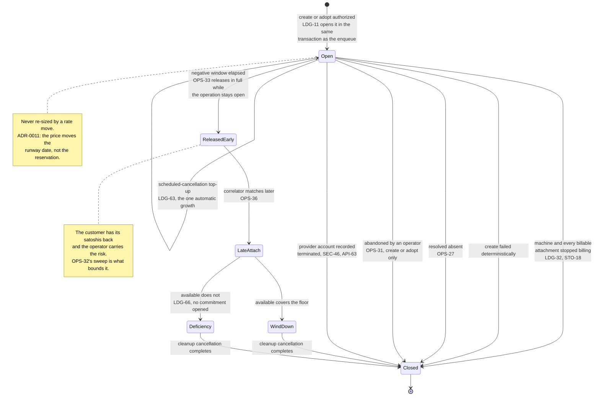

# 12 — Billing and the ledger

This document did not exist until 2026-08-11, and its absence was the largest hole in the set:
`API-17b` requires a deployment to define its spending authority, and nothing defined it. The
decisions it records live in `ADR-0002` (prepaid balance is the only spending authority),
`ADR-0003` (the float is denominated in satoshis) and `ADR-0004` (the perimeter).

**The ledger is not an accounting convenience. It is the authorization system.** Under `ADR-0002`
a balance is the *only* thing that permits spending, so a ledger bug is an authorization bug, and
the transaction that commits funds is the same transaction that authorizes a purchase.

> **Rewritten 2026-08-12 after two independent audits.** The first version modelled reservations
> as **holds** — a card-payments primitive: authorize once, capture once, against a discrete
> purchase of known size. Machine time is not that. It is continuous consumption against a
> prepaid claim, and a hold that never shrinks drives the available balance negative **in the
> ordinary happy path, one hour into the first machine's life**. Six further defects were
> downstream of the same mistake. The primitive is now a **commitment that decays as it is
> consumed**, and the consumption half of the ledger — the meter — is specified rather than
> assumed. Withdrawn requirements are marked in place, per the README's append-only rule.

## Units and arithmetic

**LDG-1** Every monetary quantity in the **ledger** MUST be a signed integer of satoshis. No
floating point, no decimal strings parsed late. A balance comparison is integer arithmetic with
no conversion in it — which is the point of `ADR-0003`'s denomination choice.

This does not reach provider prices. `DOM-9` requires an offer's price be carried as the exact
string the provider returned, and that remains correct: an offer is not money owed, it is a
quotation. **The conversion from that string to integer minor units MUST happen exactly once,
at the boundary where a price becomes an obligation** (`LDG-27`), and the string MUST NOT be
parsed into floating point at any point on that path.

**LDG-2** Provider-side amounts MUST be recorded in the provider's own billing currency alongside
the satoshi amount, as a separate integer of that currency's minor units, with an explicit
currency code — even while only one provider currency is in use. Without it, "what did this
machine actually cost me at the provider" is unanswerable for all history predating the second
currency, and is not reconstructable later.

**LDG-3** Adding two amounts with different currency codes MUST be an error, not an implicit
conversion.

**LDG-4** Every conversion MUST record the rate as an exact rational (numerator and denominator),
its source, its observation time, the haircut in basis points, and the rounding rule version —
denormalised onto the entry, so it remains self-explanatory after any rate table is pruned.

**LDG-28** **Rounding is specified per direction and applies everywhere, not only to
conversions.** Debits round up, credits round down, and a commitment's required amount rounds up.
Releasing a commitment returns **the exact satoshi amount still reserved** and performs no
conversion — a reservation is a quantity of satoshis once created, not a claim re-priced at
release. Without this rule a commitment opened at one rate and closed at another silently changes
the balance of a ledger whose whole purpose is exact integer arithmetic.

**LDG-29** The margin (`LDG-24`) MUST be expressed in basis points and applied as integer
arithmetic with a stated rounding direction. A percentage stored as a decimal fraction
reintroduces the float that `LDG-1` exists to exclude.

**LDG-68** **The billing period is the calendar month in UTC, and it is one boundary for the whole
deployment.** A period begins at `00:00:00Z` on the first day of a month and ends at the same
instant of the next. Every tenant, every machine and every attachment share it; a machine created
mid-month has a short first period, which is correct because the meter charges elapsed billable
time (`LDG-38`) rather than periods.

*Stated here because it was load-bearing and absent.* The phrase carried `LDG-8`'s deduplication
key, three terms of `LDG-38`'s arithmetic — which apportions corrections **and**
deficiency-absorbed windows across the boundary — and two
conformance items, and no document said what it was. A calendar month, a provider invoice month
and a per-machine anniversary each satisfied every sentence in the set and produced different
bills.

**AMENDED 2026-09-02 — it does not carry `PRV-13e`'s re-derivation cadence, and claiming it did was
a defect in this requirement.** The sentence above used to include that cadence in the list of
things the undefined phrase was carrying, and defining the phrase as a calendar month therefore set
re-derivation to **monthly** — under which `runway_until` is up to a month stale, `LDG-16`'s
"persist across more than one derivation" becomes two months, and `PRV-13c`'s "materially in the
future" swallows every cancellation date under about thirty days. `PRV-13e` now states its own
interval, defaulting to hourly, and `LDG-42` carries it as a separate deployment parameter.

**Two quantities, and the distinction is worth holding on to:** a billing period is a **netting
boundary** — where `LDG-38`'s arithmetic starts over and which entries a correction may name — while
a re-derivation interval is a **staleness bound** on a price-derived date. They answer different
questions, they have no reason to be equal, and fusing them made one requirement's silence set
another requirement's clock.

**A period is a property of the deployment, not of a provider or a machine.** Deriving it from the
provider's invoice month would make one machine's period depend on which account it landed in and
would encode a commercial term as a constant (`PRV-13c`); deriving it from the machine's create
instant gives an attached machine (`OPS-27`, `OPS-36`) two defensible start instants and no rule to
choose between them. The single boundary also makes `LDG-38`'s netting a range scan on
`(subject_kind, subject_id, billing_period, kind)` rather than a per-subject calculation
(`05-persistence.md`).

**This is a deployment parameter only in the sense that it MUST be stated** (`LDG-42`): it is fixed
at deployment and MUST NOT vary per tenant, because a correction naming an entry in another
tenant's period arithmetic is not a case any requirement here defines.

## Entries

**LDG-5** The ledger MUST be append-only. No update, no delete. A correction is a new entry
naming the entry it corrects. **Balance is the sum of entries** and nothing else.

**LDG-6** Every entry MUST carry: a stable id; the tenant; a per-tenant monotonic sequence number;
a kind; the signed satoshi amount; the running balance after it; and the ids of whatever caused
it — operation, machine, commitment, and the provider-side settlement reference once known.
Provider-denominated entries additionally carry `LDG-2`'s native amount and `LDG-4`'s conversion
evidence.

**LDG-7** **AMENDED.** Entry kinds are exactly: `topup`, `usage_debit`, `setup_fee_debit`,
`operation_fee_debit`, and `correction`. **Every entry moves real money.** The previous list
included `hold`, `hold_adjustment`, `hold_release` and `expiry`; the first three are withdrawn
because a reservation is no longer a ledger entry (`LDG-30`), and `expiry` is withdrawn because
the closing section of this document prohibits the only behaviour it could have described.

A setup fee MUST be its own kind and MUST NOT be folded into usage, because it is the one
non-refundable component and a caller asking "why did I not get that back" deserves a row that
answers it.

**LDG-8** Every entry MUST carry an idempotency key unique within the tenant. For a `topup` that
key MUST be **derived from the payment's own identity at the rail** — not generated by the
receiving code — or a redelivered payment notification credits twice under two different keys.
For a `usage_debit` the key MUST be **`(subject, billing period, kind, increment end)`**, where
*subject* is the machine or an individual billable attachment and *increment end* is the instant
the metered increment closes (`LDG-38`). **The key is derived from the thing being billed, never
from a count of what has already been posted** — a redelivered or crash-replayed increment then
derives the *same* key and conflicts, while a cadence that subdivides a period still posts every
increment under a distinct one.

*A "posting index" counted from the ledger was the withdrawn form, and it cannot deduplicate at
all: a second run reads one more prior debit, derives the next index, and its insert succeeds —
double-charging the tenant and double-decrementing the commitment. Serializing the allocation does
not help, because the two runs were never trying to claim the same number.* *The withdrawn `(machine, billing period, kind)` admitted exactly one posting per
period, which deduplicated away every cumulative posting after the first and stopped the
commitment decaying.*

## Commitments

**LDG-30** A **commitment** is a reservation of satoshis against a specific machine. It is **not
a ledger entry**; it is a separate record with an amount that **decreases as consumption is
debited against it**. The ledger records money that moved; a commitment records money that is
promised and has not moved yet. Conflating the two is what made the first version of this
document double-count every reservation.

A commitment MUST carry: the tenant, the machine, **the operation that opened it where one did**,
the satoshi amount **still reserved**, its state (`open` or `closed`), and the timestamps of both.

**The operation is nullable, and `LDG-62` is what makes it so.** Extend-runway is a synchronous
caller write that mints no operation — a pure balance event with no provider mutation is not one
(`OPS-39`) — so where it *opens* a commitment rather than growing one, that commitment has no
create behind it and its operation is null. The reachable case is `OPS-36`'s deficiency-funded
late-attach branch, which deliberately opens **no** commitment at all, leaving `LDG-62` as the only
thing that can open one on that machine. `05-persistence.md` marks the column nullable for exactly
this. What a commitment is a reservation *against* is the machine, not the operation.

**A machine MUST have at most one `open` commitment at a time.** This is the invariant `OPS-20`'s
reuse rule and `LDG-31`'s "that machine's commitment" both rest on, and until now it was stated
only as a storage constraint (`05-persistence.md`). It does not forbid a machine having two
commitments over its life: a create's is opened before the machine row exists — identified by its
operation until then — and `OPS-36`'s wind-down commitment is opened only after `OPS-33` closed
that first one.

### The life of a commitment

A commitment is the reservation `ADR-0002` makes the entire spending authority. It is sized once,
decays as the machine is consumed, and closes exactly once — and the branches below are where every
defect in this document has lived.



**Read the two notes together.** The early release is what stops a stuck order freezing a
customer's money indefinitely, and it is only safe because something later finds the machine if it
does turn up. `OPS-36` is that branch and `OPS-41`/`OPS-42` are what make it work.

**LDG-9** **AMENDED.** A tenant's **available** balance is:

```
available = Σ(ledger entries) − Σ(reserved amount of open commitments)
```

The spending authority check is `available ≥ required_commitment`, and it is the only
authorization a create or an adopt receives (`ADR-0002`, `API-17b`).

**LDG-70** **`Σ(ledger entries)` is a definition, not a read strategy, and the read is
`balance_after` on the tenant's latest entry.** `LDG-5` says balance is the sum of entries and
nothing else; `LDG-6` puts a running balance on every entry; `STO-21` permits a cached balance.
Three statements about one number, and none of them said which the authorization check reads —
so the literal implementation scans a tenant's entire ledger on every create, every extend and
every metered posting, over a table `LDG-22` exempts from purge and `STO-24` forbids retention
from ever reaching. **The unbounded side of `LDG-9` is the ledger sum; the commitment side is
already indexed** (`05-persistence.md`, "index on `(tenant_id, state)` for the availability
computation"), which is what makes the asymmetry visible.

The rule is:

- **`balance_after` on the greatest `seq` for that tenant is the authoritative read**, and
  `GET /v1/balance` (`API-47`) is answered from it. It is a single indexed row
  (`(tenant_id, seq desc)`), so a polling agent cannot make the read cost grow with its own
  history — and `CNF-157` forbids that `GET` from taking a write transaction, so a lazily
  repaired cache was never available as a fix.
- **`balance_after` MUST be computed and written inside the same serialized transaction that
  appends the entry** (`LDG-35`, `LDG-69`), as `previous.balance_after + amount_sats` read under
  that serialization. It is therefore not a cache that can drift: the serialization that already
  exists to prevent write skew is what keeps it exact.
- **A deployment MUST provide an audit path that recomputes the sum from the entries and compares
  it to the latest `balance_after`**, and a mismatch MUST fail closed in the manner of `LDG-20`'s
  solvency check. The denormalised column is authoritative for speed; the sum remains
  authoritative for truth, and the two are reconciled rather than merely assumed equal.

*A per-entry running balance whose relationship to the sum is never stated is exactly the shape of
defect this document was rewritten to remove: two numbers for one quantity, with no rule saying
which one authorizes a purchase.*

**LDG-31** **AMENDED — every debit against a machine, not only consumption.** Posting **any**
debit attributable to a machine **with an open commitment** — `usage_debit`, `setup_fee_debit`,
`operation_fee_debit` — MUST decrement that commitment by the same amount, in one transaction.
**AMENDED 2026-09-02 — the pairing rule has no exception.** *The withdrawn one was `LDG-39`'s late
setup fee, debited from available with no decrement where `OPS-33` had already released the
commitment. That is the seizure the paragraph below forbids, and `LDG-39` now makes the late fee an
operator deficiency instead — so there is no debit left that pairs with nothing, and a rule with one
exception is a rule two readers will apply differently.*

*The withdrawn text said "consumption", and `LDG-38` named only `usage_debit`. `PRV-13b` puts the
setup fee **inside** the commitment while `LDG-39` debits it, so on the ordinary funded dedicated
create the ledger sum fell, the reservation did not, and `available` went negative by exactly the
setup fee — violating `LDG-10`, which then requires the fee-post itself to fail. **This is the
2026-08-12 double-count reintroduced through the one entry kind the pairing rule forgot to
name**, and both independent reviewers found it.*

**The decrement clamps at zero and the excess is the operator's.** Where a debit exceeds the
commitment's remaining amount — reachable through the wind-down window, `LDG-16`'s persistence
delay and a resolved-observed setup fee against a still-open commitment (`LDG-39`) — the commitment decrements to zero, the tenant is debited
only up to the authority it granted, and the remainder is recorded as an **operator deficiency**
in the manner of `LDG-63`. It MUST NOT be taken from available balance: that would be the
automatic seizure `ADR-0011` exists to forbid, arriving through the meter instead of through
re-derivation.

Its effect on the ordinary path is unchanged — consumption leaves `available` **unchanged**,
because spending what you already committed neither frees nor freezes anything:

| event | Σ entries | reserved | available |
|---|---:|---:|---:|
| `topup` +72,000 | 72,000 | 0 | 72,000 |
| commitment opened, 72,000 | 72,000 | 72,000 | 0 |
| one hour consumed: `usage_debit` −100, commitment → 71,900 | 71,900 | 71,900 | 0 |
| machine deleted, commitment closed | 71,900 | 0 | 71,900 |

**LDG-32** **AMENDED.** A commitment MUST be closed, and its remaining amount released in full,
on **every** terminal outcome: the machine stops billing **and every billable attachment it left
behind has stopped billing** (`PRV-13a`, `STO-18`); the create fails deterministically; the create
is resolved absent (`OPS-27`); the create or adopt is abandoned (`OPS-31`); **or the machine's
provider account is recorded `terminated`** (`SEC-46`, `API-63`), which closes every open commitment
on that account's machines in the transaction that records it.

*The account-termination row was missing until 2026-09-02 while `SEC-46` and `API-63` both cited
this requirement as the closing rule and the commitment state machine above drew the edge — the
"every terminal outcome" list named four and the set had five.* And the abandonment row is scoped to
the kinds that opened a commitment: an install or a delete opens none, and the only one within reach
is the machine's **running** commitment, which abandonment MUST NOT release (`OPS-31`).

**Attachments keep the commitment open, and metering follows them.** `PRV-13a` models volumes,
snapshots and reserved addresses that survive machine deletion and keep costing money; `PRV-13b`
reserves for them; but the meter (`LDG-37`) was machine-only, so a released commitment left them
billing against nothing. A deployment MUST meter each billable attachment on its own identity
until `released_at` is set, and MUST NOT sell an offer whose attachments have no bounded automatic
cleanup unless the operator has explicitly accepted and capped that exposure.

**Losing a provider account is not evidence that billing stopped** — see `SEC-46`, amended for the
same reason. **A terminal path with no close rule strands a customer's satoshis
permanently** — there is no withdrawal (`ADR-0004`), no expiry, and under `ADR-0005` no identity
to appeal with, so an ordinary retry loop against a contended offer would otherwise render a
balance unusable forever.

**LDG-33** **AMENDED (`ADR-0011`), with the formula now stated** — it was missing, and the
obvious reading was wrong in the operator's disfavour. Re-derivation (`PRV-13e`) MUST recompute
**`runway_until`** from the machine's fixed remaining commitment at the current rate, in **both**
directions — and MUST NOT resize the commitment.

```
protected_sats = at the current rate, rounded up:
                   wind_down_cost
                 + surviving billable attachments (PRV-13a)
                 + cost through any effective cancellation date (DOM-19)
                 + cost through any earliest cancellation date not yet passed (PRV-13c)
usable_sats    = max(0, reserved_sats − protected_sats)
runway_until   = now + floor(usable_sats / current_customer_rate)
```

**The two date terms are not additive.** Where both an effective cancellation date (`DOM-19`) and
an earliest cancellation date still in the future (`PRV-13c`) apply to the same machine, the
protected cost runs to the **later** of the two and is counted once. The earliest date is a
minimum-term constraint that exists from create (`PRV-31`), not something a cancellation creates,
so the cost of running to it is unavoidable from the moment the machine exists and MUST NOT be
advertised as spendable runway while it is still in the future.

**Exhaustion begins when `usable_sats` reaches zero, not when the commitment does.** Dividing the
*whole* commitment by the usage rate — which is what the fixture and the absent formula together
implied — advertises the wind-down reserve as runnable time and guarantees the operator is short
at the exact moment of cancellation, on every ordinary exhaustion rather than only on a crash.
`LDG-16`'s invariant ("still covers wind-down at the current rate") is satisfiable only with
`protected_sats` subtracted first. A commitment is sized once at open, decays as usage is debited
(`LDG-31`), and **is never increased without an explicit authorizing action** (`LDG-62`'s caller
extend-runway, or `OPS-20`'s operator requeue re-pricing the commitment it reuses; the scheduled-
cancellation branch is the one automatic exception, `LDG-63`). *The withdrawn text resized the commitment
to preserve the runway date, which spent three design rounds on widening speed before the
interviewee's observation dissolved it: every authorization prices at the current rate, usage
debits at spot, so a price move belongs to the runway date — the customer's purchasing power —
not to an automatic grab of their available balance.*

**LDG-34** A commitment adjustment MUST be a conditional write on the commitment's current
amount — a compare-and-swap or equivalent — so two workers re-deriving the same machine in the
same period cannot both apply the delta.

**LDG-10** A balance MUST NOT go negative, and `available` MUST NOT go negative. Any operation
that would do either MUST fail rather than proceed, including a runway extension (`LDG-62`) or
an exception-branch top-up (`LDG-63`) that available cannot fund — which route to the exhaustion
path and the operator-deficiency ledger respectively, never to borrowing.

**LDG-35** **The authorization read and the commitment write MUST be serialized per tenant.**
Computing `available` and opening a commitment in one transaction is not sufficient: two
transactions can each read the same balance and each commit, leaving twice the balance reserved
and one machine unfunded. This is write skew, and it commits without error under both READ
COMMITTED and SNAPSHOT isolation. A deployment MUST use a per-tenant lock, a serializable
transaction, or a conditional write against a versioned balance row, and MUST state which.
`STO-1` and `STO-2` specify exactly this kind of primitive for the queue and the machine lock;
money needs one too, and did not have one.

**AMENDED 2026-08-31 — two tenants, one transaction, and the primitive cannot depend on a tenant
row.** `WIR-42`'s attribution appends a correction pair spanning **two** tenants' ledgers and
`LDG-70` requires every append to happen inside this serialization, so one transaction must hold two
primitives — which this requirement never contemplated and never ordered. Therefore:

- **A transaction MAY hold the primitive for more than one tenant, and MUST acquire them in
  ascending tenant-identifier order.** Two concurrent attributions in opposite directions would
  otherwise deadlock, on the operator surface, on the money path.
- **The primitive MUST NOT require a live `tenants` row.** The ordinary input to `WIR-42` is a
  deposit whose tenant `API-34` already reaped, and `STO-26` deliberately removes the foreign key so
  its entries survive. A primitive implemented as a per-tenant lock row — which the paragraph above
  explicitly permits — would have nothing to lock for exactly the tenant being corrected.

*Found by a cross-model review of the abuse and attribution surfaces. The deadlock is the visible
half; the missing lock row is the one that fires on the common case.*

**LDG-69** **AMENDED 2026-08-31 — stated as a lock order, because the absolute form forbade what
`OPS-41` requires.** A deployment MUST hold `LDG-35`'s primitive for the duration of one database
transaction and no longer. While it is held, an implementation MUST NOT wait on an operation lease,
a machine lock (`OPS-8`, `machine_locks`), the completion of a child operation (`API-58`,
`WIR-39`), or any provider call.

**The permitted order is one-way: operation lease → machine lock → a short tenant-serialized
transaction.** A worker holding the machine lock MAY enter the serialization for a bounded read or
write; **a transaction under the serialization MUST NOT acquire or wait on the machine lock.** One
direction cannot form a cycle, and `OPS-9` makes the machine lock try-and-defer rather than wait, so
nothing blocks on it either.

*The withdrawn clause was "a worker holding the machine lock MUST NOT enter it", stated absolutely
and then followed by an ordering for the case it had just forbidden. Two independent reviewers
found the contradiction. It was written when nothing needed the nesting; `OPS-41` was added a week
later and is exactly a machine-lock-holding worker that must read commitment state another
transaction writes under this primitive.*

**And the order alone does not make `OPS-41` correct** — which is the sharper half, and both
reviewers reached it independently. The window that matters is **between the read and the provider
call**, not inside the transaction: this requirement rightly forbids a provider call under the
serialization, so the worker must release it before mutating, and `LDG-62` can commit in the gap.
Entering the serialization changes nothing about that. `OPS-41`'s correctness rests on the fence
`OPS-42` specifies, not on this ordering.

**AMENDED 2026-09-02 — but the fence needs the nesting this requirement permits, so the permission
is now load-bearing rather than theoretical.** `OPS-42` requires `OPS-41`'s funding read and the
fence write to be **one** transaction under this primitive, taken by a worker that already holds the
machine lock: without that, the extension commits between the read and the write, the fence column is
still null when the worker writes it, and the machine is destroyed anyway. So the permitted direction
above — machine lock, then a short tenant-serialized transaction — is exactly what the fence is built
on, and the prohibition that matters is the other clause: **the provider call happens after that
transaction commits**, never inside it.

**This stated an invariant the set satisfied by accident, and as of 2026-09-02 it no longer does.**
Every `LDG-35`-serialized path *used to be* machine-lock-free — enqueue-time
authorization (`LDG-11`), `OPS-27`'s resolution (made "by no worker and under no lease",
`OPS-3`), `OPS-36`'s late attach, the meter (`LDG-38`), extend-runway (`LDG-62`) — and a create
holds no machine lock at all, because `OPS-8` binds the lock to an operation that *names* a
machine and a create's `machine_id` is set only on completion (`05-persistence.md`). **`OPS-41`'s
re-check is now the first path that genuinely nests**, which is why this requirement was written as
a lock *order* rather than a prohibition, and why `CNF-217` asserts the boundary — no lease, no
machine-lock acquisition, no child wait and no provider call from *inside* the primitive — rather
than asserting that nothing outside it holds a lock. The one
entry kind that would put a debit inside a machine-locked worker is `operation_fee_debit`, and
`LDG-25` prices privileged operations at zero in v1 — so it is defined, paired by `LDG-31`, and
posted by nothing. **Price an install and the nesting becomes reachable in the same release**,
which is why the rule is written now rather than when it first bites.

*Recorded because it was checked: an earlier review asserted a live lock-order inversion between
the machine lock and this primitive, and two independent reviewers refuted it on the reading above.
What survived the refutation was the absence of any boundary rule at all — nothing said a money
transaction may not outlive itself — and that is what this requirement supplies.*

**LDG-11** Opening the commitment and enqueuing the operation MUST be one transaction. A
commitment without an operation silently freezes a customer's money; an operation without a
commitment spends the operator's. This is the requirement `ADR-0001` was decided on.

**LDG-12** No provider mutation that can incur cost may begin before its commitment is committed
— and this includes **adopt** (`LDG-36`), not only create.

**LDG-36** **Adopt MUST place a commitment and pass the same authorization check as create.**
Adoption brings an already-billing machine under management, and `PRV-13c` names it as the main
road onto the branch where cost *cannot* be stopped quickly. An adopted machine MUST also be
given a runway and a `runway_until`, or it never enters the exhaustion sweep and consumes
unstoppable billable compute against a balance nobody checked.

## The meter

**LDG-37** **Usage MUST be metered from a stated source at a stated cadence.** The first version
of this document consumed `accrued_unbilled_usage` in `PRV-13b`'s reserve formula and never said
what produced it — the authorization side was fully specified and the consumption side did not
exist. A deployment MUST define, and record:

- **the source of truth for elapsed billable time** — the machine record's own state transitions,
  or the provider's usage API where one exists. Where the two disagree the provider wins, because
  the provider is what invoices the operator;
- **the cadence** at which a `usage_debit` is posted, which is the granularity at which
  exhaustion can be detected and therefore an input to `wind_down_cost` (`PRV-13b`);
- **which machine states are billable.** `stopped` **is billable** — powering a machine off does
  not stop provider billing on either the cloud or the dedicated products (`LDG-13`). So is
  `cancellation_scheduled`: `DOM-19` states the machine is still running and still billing until
  its effective date, and a meter that stops at cancellation acceptance under-bills for exactly
  the window `DOM-19` was written to make visible;
- **the treatment of a partial period**, rounded per `LDG-28`.

**LDG-74** **The meter MUST stop on evidence that the machine is gone, and no caller action may be
required to produce that evidence.** `LDG-37` meters from "the machine record's own state
transitions"; `DOM-8` makes that record a cache "refreshed by explicit refresh operations";
`05-persistence.md` concedes that **nothing in this set refreshes a machine on a schedule**; and
`OPS-32`'s account sweep *reports* a machine deleted behind the system's back and does nothing
else. So a machine the provider terminated — which `08-provider-notes.md` records as one of
Hetzner's own abuse remedies — went on draining its tenant's commitment until the tenant happened
to refresh or an operator intervened. The customer pays for a machine that does not exist, and
nothing in the system raises anything.

- **The trigger is that the resource is *gone*, not that it is broken.** An authoritative
  observation that the machine no longer exists at the provider — a refresh (`DOM-8`), a driver read
  during any operation, or a **complete** pass of `OPS-32`'s sweep not finding it — stops the meter
  for that machine. **`DOM-7`'s `failed` does NOT stop it**: that state means "provider reports a
  terminal failure", and a failed dedicated machine is still allocated, still in the operator's
  account and still on the invoice. `LDG-37` continues to own which states are billable; this rule
  is about the resource ceasing to exist, which is not a state so much as the absence of one.
- **`OPS-32` MUST record what it saw on the machine row, not merely report it** — the state and the
  observation instant, in `machines.state` and `machines.state_observed_at` (`STO-48`) — so the
  meter stops without a caller. That is the one change that makes this
  rule self-executing rather than another thing waiting on a human.
- **Billing stops at the observation instant, not at the unknown instant the provider acted.**
  provisiond polls rather than watches, so the earlier instant is not knowable; `STO-41` already
  draws that distinction for addresses and it is the same one. Guessing backwards would credit time
  nobody can evidence, on a ledger whose entries are the authorization system.
- **Stopping the machine's meter is not tombstoning it, and the two MUST NOT be collapsed.**
  `STO-18` forbids tombstoning while a billable attachment has a null `released_at`, and those
  attachments are separately metered subjects (`STO-38`, `LDG-32`) that keep running after the
  machine is gone. So the machine subject stops, each unreleased billable attachment keeps being
  metered on its own identity, and the row is tombstoned when `STO-18` allows and the commitment
  closes per `LDG-32`. *Written out because the obvious implementation — set `deleted` and
  tombstone — is the one `STO-18` refuses, and a terminated machine leaving volumes behind is the
  ordinary case rather than the exotic one.*

**The residual is the sweep interval, and it is therefore a money parameter.** `OPS-32` already
requires the interval to be stated; it is **this rule's error bound**, the maximum time a customer
can be billed for a machine that is gone, and it MUST be stated as such with the other deployment
parameters (`LDG-42`) rather than chosen as an operational convenience.

**The credential-outage case is deliberately the other way, and the asymmetry is recorded rather
than smoothed.** Where `SEC-46` records `account_unreachable` or `credentials_rejected`, the meter
**continues**: the machines are almost certainly still running, still serving the customer, and
still billing the operator, and `SEC-46` retains the commitments for exactly that reason. That is
not the same as `LDG-64`'s rate outage, where the operator absorbs the window — there, consumption
is happening and provisiond cannot *price* it, and the customer can do nothing about it either way.
Here the customer still has the machine. *A customer whose own delete fails `authentication` during
such an outage is nonetheless paying for the operator's problem, which is the sharp edge of this
choice; the operator's remedy is to fix the credential, and the deficiency machinery (`LDG-66`) is
what carries any exposure it decides to absorb instead.*

**LDG-71** **A machine whose network a provider has blocked over abuse MUST be told to its owner as
still consuming runway.** The abuse case is where that is said (`DOM-23`), because a customer who
cannot reach a machine and is not told why will read the drain as theft, and under `ADR-0005` there
is no email in which to explain it afterwards.

**The telling is `DOM-27`'s structured `network_restriction` on the machine view, beside
`runway_until`** — not a sentence in the case. A restricted machine stays `running`, which
`LDG-37` already makes billable, so nothing here changes the meter; what changes is that a caller
can now tell a blocked machine from a broken one before it reaches for a destructive remedy.

*Rationale, not requirement.* Continued billing is also the right answer: the provider goes on
charging the operator, so making it free would move a real, uncapped cost onto the operator for a
condition the customer's machine caused, and would pay customers to be blocked. Delete remains
available as the customer's one-call remedy (`DOM-26`), and `LDG-13`'s exhaustion cancellation
still applies, as it does to every machine. **This closes F35.**

*Twice corrected on 2026-08-16. The first draft made four statements MUSTs, two of which restated
`DOM-26` and `LDG-13`. The trim that followed asserted the machine "keeps billing because nothing
knows it is blocked" — **and that was false.** Hetzner Cloud exposes `blocked` per address family
on the server object and Robot exposes `locked` per IP (`PRV-35`), so a driver can read this today.
The conclusion that it is not a `DOM-7` state survived the discovery; the reason written for it did
not, and it had been copied into three documents by the time a cross-model check caught it.*

**LDG-38** **AMENDED.** A `usage_debit` MUST be idempotent per **`(subject, billing period, kind,
increment end)`** (`LDG-8`), and posting **any** machine-attributable debit MUST decrement that
machine's commitment in the same transaction (`LDG-31`).

**Rounding MUST be applied to the cumulative charge, never per tick.** `LDG-28` rounds debits up;
applied to each posting, that makes a customer's price depend on how often the meter happens to
run — a deployment that meters every minute charges more than one that meters hourly, for
identical consumption. The rule is therefore:

```
For each metered increment i of this SUBJECT, closing at increment_end_i:

  net_seconds_i  = max(0,
                       elapsed billable seconds inside i
                     − the part of any deficiency-absorbed window (LDG-66) lying inside i)

  exact_total   += net_seconds_i × customer_rate_i     # the rate in force at i's close,
                                                       # carried as a rational (LDG-4)
                                                       # and NEVER rounded

already_charged  = meter_totals.charged_magnitude for this (SUBJECT, period)  (LDG-72)
                 = Σ(every posted_debit already COMPUTED for this SUBJECT and period,
                       each in FULL — never the amount the tenant was debited, which
                       LDG-31's clamp may have reduced; see the clamp paragraph below)
                   adjusted by every correction naming one of those debits, by the same
                   integer magnitude it moves exact_total (LDG-5, LDG-7, LDG-73)

posted_debit     = ceil(exact_total) − already_charged
```

`exact_total`, `already_charged`, the elapsed-seconds figures and the high-water mark are all read
from and written to `LDG-72`'s running total for this `(subject, billing period)`, never recomputed
by query.

*The `already_charged` line read "− Σ(signed amounts of the previous usage debits … plus every
correction naming one of them)" until 2026-09-02 — a definition from the ledger **entries** — while
the clamp paragraph below defined the same term as what the meter **computed** and `CNF-274` tested
that second reading. The trap is that the entries definition is the one a builder copies, it is
correct in every period where nothing clamps, and where something does clamp it re-posts the
written-off remainder on every subsequent tick, forever: `posted_debit` is measured against a
smaller `already_charged` each time. The drift is **positive**, so the fail-closed guard below —
which fires only on a negative `posted_debit` — never sees it. Found by both reviewers of
2026-09-02, independently.* **Deficiency-absorbed time is subtracted in seconds, before conversion — never as a
satoshi amount.** An outage deficiency accrues precisely
while no rate exists (`LDG-64`), so there is no rate at which it could be converted; removing the
time it absorbed needs none, and the units never mix.

**AMENDED 2026-09-02 — the charge is a sum over increments, each priced at its own rate. The
withdrawn form re-priced the entire month on every tick.** It read `ceil(cumulative_exact_charge
over billable_seconds)`, with **one** `billable_seconds` scalar for the whole period and `LDG-27`
putting the conversion at posting time — so tick *k* priced every elapsed second of the period at
tick *k*'s rate. Three things follow from that and all three are wrong:

- **A rate that doubles retroactively re-bills the hours already paid for.** Hour one posts 100;
  the satoshi price of the hour halves; hour two posts `400 − 100 = 300` for one hour of identical
  consumption. Nothing in the set warns a customer of this and `WIR-17`'s `max_commitment_sats`
  cannot bound it, because the commitment was already open — the same objection `LDG-64` raises
  against deferred debits at a later rate, arriving through the ordinary path instead of through an
  outage.
- **A rate that falls makes `posted_debit` negative**, which is a *positive* `usage_debit`. `LDG-7`
  does not define one, and `LDG-31` would take it as a debit to pair with and **increment** the
  commitment — a fourth automatic growth path, which is exactly what `ADR-0011` abolished and what
  `PRV-13e` enumerates three named exceptions to.
- **It contradicted the argument the money model is built on.** `LDG-33` explains the fixed
  commitment by saying "usage debits at spot", and `ADR-0011`'s dissolving observation is that
  "every authorization is priced at the current rate, so nothing can be overcommitted at stale
  prices". Neither is true of a formula that reprices elapsed time.

**Under the amended form nothing is re-priced.** An increment is converted once, at the rate in
force when it closes, and its contribution to `exact_total` never changes afterwards. **`ceil` still
applies to the cumulative total rather than to each posting**, which is what keeps cadence out of
the price (`CNF-185`) — the rounding argument survives intact; only the pricing point moves.

**A rate change MUST split the increment it lands in.** `PRV-13e` re-derives rates on an interval of
its own and the meter runs on its own cadence, so a re-derivation can land *inside* an open
increment. Pricing that whole increment at the rate in force when it closes re-prices every second
before the change — the identical defect this amendment removes, at a smaller scale. The meter MUST
therefore close an increment at each rate-change instant inside its elapsed window and open the next
one there, so that **every increment is priced at a rate that held for the whole of it**.

**The boundary is the rate's `rate_observed_at` (`LDG-4`, denormalised onto the entry), not the
instant the market moved.** `LDG-4` records a rate's *observation* time and nothing records an effective time, because
provisiond **polls a rate source rather than watching one** — the identical distinction `STO-48`
draws for machine state, where `LDG-74` stops the meter at `state_observed_at` and never "at the
unknown instant the provider acted". Splitting at an instant nobody recorded is not implementable;
splitting at the instant the deployment learned the rate is, and it is the same honesty the rest of
the set already applies to every other polled fact. A deployment that polls more often therefore
tracks the market more closely — which is a real property, not an accounting artefact, and it does
not reopen the re-pricing defect: every increment is still priced at a rate that held for the whole
of it, as the deployment knew it. *An earlier form of this paragraph said the boundary was "the
rate's own effective instant, which `LDG-4` already records". `LDG-4` records no such thing, and a
builder would have gone looking for a column that does not exist. Written and corrected the same
day, 2026-09-02.*

*This is not a rounding refinement — it is what makes the sentence above true.* At 7 sats/hour
doubling to 14 exactly at the half hour, one hourly increment charges **14** for the hour while a
half-hourly or per-minute meter charges **11**, for identical consumption: the first half hour is
billed at a rate that did not exist while it elapsed. With the split, every cadence charges 11 —
hourly, half-hourly, per-minute and per-second alike. Splitting therefore restores **exact**
cadence-independence rather than the bound `CNF-185` had to settle for, which is why that item is
tightened back to equality in the same change. *Found by `codex` on 2026-09-02 and confirmed by
running the arithmetic.*

**`net_seconds_i` clamps at zero**, so `exact_total` never decreases through metering. An absorbed
window can exceed the *billable* seconds inside an increment — a machine that was `deleted` for part
of it is not billable while the outage that absorbed the window ran regardless — and a negative
increment would then hand back time from an increment priced at a different rate, which is the
re-pricing this amendment removes arriving by subtraction. The excess is simply not owed; there is
nothing to carry forward.

**`posted_debit` MUST NOT be negative**, and a computed negative means the running total has drifted
from the entries: the meter MUST **fail closed** in the manner of `LDG-20`'s solvency check rather
than post anything. `exact_total` is
non-decreasing, `ceil` is monotonic, and a correction moves `exact_total` and `already_charged` by
the same **integer** magnitude, so nothing in the ordinary path can drive it below zero.

**`already_charged` is what the meter *computed*, not what the tenant was *debited*, and `LDG-31`'s
clamp is why the two differ.** Where a debit exceeds the commitment's remaining amount the
commitment decrements to zero, **the tenant is debited only up to the authority it granted**, and
the remainder becomes an operator deficiency. So the ledger entry is smaller than `posted_debit`
was. `already_charged` MUST nonetheless advance by the **full** `posted_debit`, and
`meter_totals.charged_magnitude` MUST record it, because the question that term answers is *what has
this period already accounted for* — not *what did the tenant pay*.

*Getting that wrong re-charges written-off money, silently and forever.* With `exact_total` at 100
and 30 of commitment left, a clamped posting debits 30 and books 70 as the operator's. If
`already_charged` advances by 30, the next increment of 50 posts `ceil(150) − 30 = 120` — the
customer billed for 70 the operator has already absorbed, on top of its own 50. And the error is
**positive**, so the fail-closed guard above never fires: it is not a drift the meter can detect, it
is the meter computing the wrong number correctly. The clamped remainder is reachable through the
wind-down window and `LDG-16`'s persistence delay (`LDG-31`), so this is an ordinary path rather
than an exotic one. **The deficiency record carries the difference** (`LDG-66`, `STO-37`), which is
also what makes `LDG-72`'s audit recomputation reconcile: entries plus deficiencies, never entries
alone. It MUST NOT
post a positive `usage_debit` under any circumstance: the entry kind means money leaving a balance
(`CONTEXT.md`), and a positive one is a growth path nothing authorized.

**A `correction` naming one of this subject and period's usage debits moves `exact_total` by its own
magnitude, in the same transaction that appends it** (`LDG-72`, `LDG-73`) — `exact_total := exact_total
− amount_sats`, so a credit of +50 lowers both sides by 50 and the next tick posts neither more nor
less. That is what makes `LDG-73`'s guarantee hold under per-increment pricing: seconds removed from
an increment that closed at a rate no longer in force cannot be re-priced, and the correction's own
satoshi figure is the only correct adjustment. **`corrected_seconds` remains required** and remains
`LDG-73`'s: it keeps the elapsed-seconds channel truthful for deficiency apportionment and for
`LDG-72`'s audit, which is the channel that has no rate in it at all.

**And it is subtracted increment by increment, which subsumes period by period.** Since 2026-09-02
each increment removes only the part of an absorbed window lying inside *it*, so a window straddling
either an increment boundary or a period boundary is split at both and every part is counted exactly
once — the finer rule was already required by pricing each increment at its own rate, and it happens
to make the period rule automatic rather than a second calculation. A deficiency
opened in an earlier period absorbed time that period already removed from its own charge;
subtracting the whole `absorbed_seconds` again here would hand the customer that window a second
time, in a period where it absorbed nothing — and an outage long enough would drive a later
period's `billable_seconds` to zero for consumption nobody disputes, which is the operator paying
twice for one interruption. Where an absorbed window straddles a period boundary each period
subtracts its own part and no more, and the parts sum to `absorbed_seconds`.
**The window is read from the deficiency record's `absorbed_from` and `absorbed_until`**
(`STO-37`), which every cause that absorbs time MUST carry. `outage_started_at` and
`outage_deadline` are not that window: `LDG-64` ties the first to the `rate_outage` cause and the
second is a *computed deadline* rather than an end, so an outage that clears early absorbed less
time than the pair implies, and a split no record can locate in time is
not a split an implementation can perform.

**AMENDED 2026-09-02 — exactly one cause absorbs time, and it is `rate_outage`.** *The withdrawn
clause said "a `clamp_overflow` deficiency absorbs billable time too", and that double-relieves the
customer.* A clamp overflow is the operator absorbing **satoshis**: the consumption happened, the
tenant was debited up to the authority it granted (`LDG-31`), and the excess became the operator's.
Subtracting the seconds as well would make the period's `exact_total` fall, so every later posting
would be smaller too — the customer relieved once in money and again in time, for one event.
`LDG-66`'s other causes are one-off amounts and meter no elapsed time at all. **A rate outage is
different in kind**: no rate existed, so the window was never priceable and there is nothing for the
customer to have been charged. Only that cause carries a non-zero `absorbed_seconds`, and only that
one appears in the subtraction above. *This also removes the case nothing had a rule for: a
`clamp_overflow` opens **during the posting of the increment it would have covered**, so a window
recorded after that increment was priced could never be applied to it — which is unanswerable if the
cause absorbs time and moot now that it does not.*

**What is subtracted is a magnitude, because `LDG-1` makes a debit negative.** The signed sum of
the prior usage debits is a negative number — the worked table above posts `usage_debit` −100 for
the first hour — so negating it is what turns it into the amount already charged. Subtracting that
signed sum *unnegated* would add it back: a second tick whose cumulative charge is 200, against a
prior debit of −100, would post `200 − (−100) = 300` and the period would collect 400 for 200 of
consumption, over-charging by the running total on every tick after the first. `posted_debit` is a
magnitude for the same reason, and the entry `LDG-6` writes for it carries `LDG-1`'s debit sign.

**Corrections net against the debits they name.** `LDG-5` makes a correction a new entry rather
than an edit, so the corrected `usage_debit` row survives unchanged and a gross subtraction cannot
see it. The next posting would then re-charge whatever a correction added, or hand back a second
time whatever it refunded — the customer paying twice, or the operator, for a row that exists
precisely because the first figure was wrong. The subtraction is therefore over the **net**: the
prior usage debits for that subject and period, plus every `correction` (`LDG-7`) naming one of
them. A correction naming an entry of any other kind is not part of this sum.

**A correction is attributed to the period of the entry it corrects, never to the period it was
posted in.** Corrections arrive late by nature — a wrong figure is usually found after the period
it fell in has closed — so the entry it names is the only thing that places it, and "naming one of
them" is the whole test. A correction posted much later against a debit for this subject and period
is inside this period's `already_charged`; a correction posted inside this period against an
earlier period's debit is outside it, and belongs to that earlier period's arithmetic. Placing it
by its posting instant instead would drop it from the period whose charge it actually alters and
admit it to a period whose debits it does not name — and both errors reach the customer wherever
that period still has a posting to make, which is an ordinary occurrence: a late increment after a
restart, or any cadence that subdivides the period (`LDG-8`).

**A correction carries its own sign, and the netting must respect it.** A correction that
*reduces* a charge is a positive entry: it moves the negative net toward zero and therefore
**lowers** `already_charged`. A correction that *increases*
a charge is negative and raises `already_charged`. Netting the signed amounts and negating once,
as the formula does, is what makes both directions come out right; taking the absolute value of
each entry before summing would make a refund add to the amount already charged and re-charge the
customer for money handed back.

**AMENDED 2026-09-02 — and it does NOT follow that the next tick posts more.** This paragraph used
to end "so the next tick posts more, not less", which is the claw-back `CNF-215` was rewritten on
2026-08-31 to forbid and `LDG-73` exists to prevent — the customer watching a credit appear and
vanish inside one metering interval. It was true of an arithmetic where only `already_charged`
moved. It is not true now: a correction moves `already_charged` **and** `exact_total` by the same
integer magnitude, so `ceil(exact_total) − already_charged` is unchanged and **the next tick posts
neither more nor less**. The sign rule above is still exactly right and still load-bearing; only the
conclusion drawn from it was wrong, and it survived one amendment of its own conformance item.

**The subject's high-water mark is the greatest `increment end` already posted for it**, and
**an increment whose end instant is at or before that mark MUST be discarded, not posted** — a
re-meter after restart re-observes elapsed time it has already charged, and without the mark the
deduplication key protects only exact replays, not overlapping ones. **The mark, the cumulative sum
and the insert MUST occur in one serialized transaction** (`LDG-35`): computing them outside it lets
two concurrent runs both read the same prior total and both post. **Observation cadence is an
operational choice; it MUST NOT be a pricing input.**

**AMENDED — the mark and the running sum are read from `LDG-72`'s record, not derived by query.**
*The withdrawn wording said they were "a query over the ledger, not a stored column, and this
requirement adds no schema", which was deliberate and was wrong: it makes tick `k` read `k−1` rows,
so a period's metering cost is quadratic in its own tick count.* `LDG-72` states the replacement and
the arithmetic that forced it.

**`LDG-8` owns the key**; this requirement does not restate it. *A restatement here said `(subject, billing period, kind, posting index)` — the form `LDG-8` withdrew as unable to deduplicate — which is the duplication habit this set keeps paying for.*

**LDG-72** **The meter keeps a running total per `(subject, billing period)`, written in the same
transaction as the debit.** `LDG-38` defined `already_charged` as a sum over every prior usage debit
for that subject and period, and its high-water mark as a query over the same rows — explicitly
adding no schema. **That is withdrawn, and the reason is arithmetic:** tick *k* reads *k−1* rows, so
the cost of metering a period is quadratic in the number of ticks in it. At hourly cadence that is
roughly 267,000 row reads per subject per month; at the one-minute cadence `LDG-38`'s own rounding
rule is written to accommodate, roughly 933 million — all of it inside `LDG-35`'s per-tenant
serialization, on the single-writer store `STO-6` describes, whose one recorded starvation
(`DEF-11`) was caused by two write transactions per second.

**`LDG-70` diagnosed this exact shape for the balance read and fixed it. The meter had the same
defect and the fix was not carried across.** It is carried across now, on the same terms:

- The record MUST carry the **magnitude charged to date**, the **cumulative exact charge as a
  rational**, the **elapsed billable seconds**, the **absorbed** and **corrected** seconds, and the
  **greatest `increment end` posted** for that `(subject, billing period)`; every one of them MUST be
  written inside the same serialized
  transaction that appends the debit (`LDG-35`, `STO-45`). It is therefore not a cache that can
  drift — the serialization that already exists to prevent write skew is what keeps it exact.
- `LDG-38` reads all of them from this record, which makes a tick a single indexed row read
  regardless of cadence or of how far into the period it falls.
- A `correction` naming one of that subject and period's usage debits MUST update the record in the
  same transaction that appends it (`LDG-73`), so the satoshi and second channels never diverge from
  the entries they summarise.

**AMENDED 2026-09-02 — the seconds were still a scan, and the exact charge had nowhere to live.**
The original carried two figures and left `LDG-38`'s `Σ corrected_seconds` and `Σ absorbed_seconds`
as per-tick queries over `ledger_entries` and `operator_deficiencies` — the same quadratic shape this
requirement exists to remove, surviving in the channel nobody counted. And once each increment is
priced at its own rate (`LDG-38`), the **unrounded** cumulative charge has to persist between ticks:
recomputing it would mean re-pricing every earlier increment, which is the defect that amendment
removed. So the record carries `exact_charge_num`/`exact_charge_den` as an exact rational (`LDG-4`,
`LDG-1`'s no-floating-point rule reaches it), never a rounded satoshi figure — rounding the running
total is rounding per tick with extra steps, and `CNF-185` is the test that catches it.
The bullets resume, and the last one is amended by the paragraph above rather than orphaned by it:

- A deployment MUST provide an audit path that recomputes **every** column of the record — not the
  two the original carried — from `ledger_entries` **and `operator_deficiencies`**, and a mismatch
  MUST **fail closed** in the manner of `LDG-20`'s solvency check. The
  record is authoritative for speed; those two tables remain authoritative for truth, and they are
  reconciled rather than assumed equal. **Both sources are required, and `LDG-31`'s clamp is why**:
  where a debit exceeded the commitment the entry is smaller than what the meter charged, the
  difference is a deficiency, and a recomputation from entries alone would report a discrepancy on
  every clamped posting and fail closed against nothing.

**LDG-73** **A `correction` naming a `usage_debit` MUST carry the billable seconds it corrects, and
`LDG-38` subtracts them.** Without this a correction is undone by the next tick, and the
specification mandates it.

`LDG-38` computes what to post as *the period's correct total minus what has already been charged*.
A correction changes the second term and not the first, so the next tick observes that the period is
short by exactly the corrected amount and charges it again. The customer sees a credit appear and
vanish inside one metering interval, on the ledger `ADR-0002` makes the authorization system.

**The two channels must move together.** `LDG-66` already established the mechanism: deficiency
time is subtracted in **seconds**, before any conversion, because an outage accrues while no rate
exists. This opens that same channel to the only other thing that adjusts a charge. A correction
that returns *n* satoshis' worth of consumption carries the seconds that consumption represented.

**AMENDED 2026-09-02 — which channel carries the money changed, and this requirement survives with
a different job.** *The withdrawn sentence was "`LDG-38` removes them from `billable_seconds`, and
the period's correct total falls to match".* Under the whole-period formula that was how the total
fell; under per-increment pricing there is no `billable_seconds` term in the charge at all, and
seconds removed from an increment that closed at a rate no longer in force **cannot be re-priced**.
So `LDG-38` adjusts `exact_total` by the correction's own **satoshi magnitude**, which is the only
figure that is still true, and the guarantee is unchanged: the next tick posts nothing to claw back.

**`corrected_seconds` is still required and is still this requirement's.** It keeps the
elapsed-seconds channel honest — the channel that has no rate in it, which `LDG-66`'s deficiency
apportionment reads and `LDG-72`'s audit recomputes. A correction that returns money without
returning the seconds it represents leaves `meter_totals` claiming consumption the ledger has
already refunded, and the audit path then fails closed against a discrepancy nobody introduced.

**A correction naming an entry of any other kind carries no seconds** and is outside `LDG-38`'s
arithmetic entirely; `WIR-42`'s re-attribution pairs name `topup` entries and are unaffected.

*The cost accepted: a purely discretionary credit unrelated to elapsed time must still be expressed
in seconds, which is an odd unit for it. The alternative considered and rejected was a new entry
kind excluded from the netting, which opens `LDG-7`'s closed set and creates a second way to move a
balance that the meter cannot see.*

**LDG-39** **AMENDED — the setup fee has a lifecycle, not a single moment.** It is committed at
create as part of `PRV-13b`'s sizing, and it becomes a debit **only when the order is known to
have landed**, at which point `LDG-31` decrements the commitment by the same amount so
`available` does not move. The full table, because every row was previously either wrong or
unstated:

| Outcome | Setup fee |
|---|---|
| Order accepted by the provider | **Debited**, commitment decremented in the same transaction |
| Deterministic rejection before acceptance | **Never debited**; released with the commitment (`LDG-32`) |
| Ambiguous — `needs_reconciliation` | **Remains reserved in the commitment**, and is *additionally* recorded as a pending fee obligation on the operation (`LDG-67`). The record exists because `OPS-33` releases the commitment in full at the negative window while the operation stays open — so the obligation must survive that release, not replace the reservation before it |
| Resolved *observed* (`OPS-27`) | **Debited against the commitment where one is still open; otherwise never debited to the customer at all.** `OPS-27` can resolve *before* `OPS-33`'s negative window elapses, in which case the create's own commitment is still open and still holds the fee: debit against it, decrementing per `LDG-31`. **Once `OPS-33` has released that commitment, the fee is an operator deficiency (`LDG-66`, cause `unrecoverable_setup_fee`) and the customer is not charged.** Where `OPS-36`'s late-attach branch has since opened a wind-down commitment on the same machine, that commitment belongs to a different operation and MUST NOT be decremented by this fee — it was sized to end the exposure, not to carry the create's obligations. *Asserting one source was the first defect; taking the second from available balance was the next, and it is corrected below. `LDG-67`'s parked columns are cleared either way, in `OPS-27`'s single resolution transaction* |
| Resolved *absent* | **Released in full**; no fee was incurred at the provider |
| Resolved *abandoned* (`OPS-31`) | **Never debited to the customer.** The commitment is closed and released in full (`LDG-32`), the parked obligation is cleared, and the fee becomes an **operator deficiency** (`LDG-66`, `LDG-67`) — the operator gave up establishing whether the order landed, and charging a customer for an outcome nobody established is not defensible |
| Operator requeue out of `needs_reconciliation` (`OPS-3`, `OPS-4`) | **Never debited for the superseded attempt.** The parked obligation is cleared and the fresh attempt commits and settles its own setup fee through the rows above (`LDG-67`); keeping the old one alive would bill one machine's setup twice |

*Two defects are fixed here.* The withdrawn text debited the fee **before** the provider call, so
a deterministic rejection or a resolved-absent create left the customer paying a non-refundable
fee the operator never incurred — the operator keeping money for nothing, which `ADR-0006`'s
at-cost pass-through forbids and which an autonomous retrying caller reaches repeatedly. And
debiting without decrementing is `LDG-31`'s double-count.

**The original concern still holds and is still answered:** the fee must not be a *reversible*
reservation on the accepted path, or a create-then-delete cycle costs the tenant nothing and the
operator the whole fee. Acceptance is the trigger; reversal happens only where the provider never
charged.

**AMENDED 2026-09-02 — the late fee is the operator's, and the set said so in two places out of
three.** The withdrawn row debited it **from available balance** once `OPS-33` had released the
commitment. Three requirements disagreed with that and each other:

- `LDG-31` says a debit exceeding the commitment "MUST NOT be taken from available balance: that
  would be the automatic seizure `ADR-0011` exists to forbid";
- `OPS-33` says an early release moves the residual risk from the customer to the operator, and a
  late-appearing machine's cost "is a cost the operator can see, price and absorb";
- `OPS-36` refuses, on the same branch and in the same breath, to seize a balance "the customer may
  have already re-planned".

**Two of the three say operator, so operator it is**, and the ordinary input makes that the only
coherent answer: the branch's own premise is that the window elapsed and the tenant spent its
balance on something else, so the debit either drives `available` negative — which `LDG-10` refuses,
failing the post and leaving the obligation stranded — or seizes a commitment the customer opened
for a different machine. It also produced a perverse price: the customer paid **more** when the
operator released the commitment early than when it merely sized it short.

**`LDG-31`'s pairing rule therefore has no exception any more**, and that clause is withdrawn there
too. `LDG-67`'s parked obligation is cleared into the deficiency in `OPS-27`'s single resolution
transaction, exactly as the `abandoned` row already does.

*What this costs, plainly: the operator absorbs a real provider charge on a create it did place. That
is the price of `OPS-33`'s early release, which exists so that a customer's satoshis are not frozen
against a search nobody can finish — and `OPS-32`'s sweep is what bounds the rest of that exposure.
This is a judgement call between two defensible answers and it is recorded here so it can be
reversed in one edit if the operator would rather carry frozen balances than absorbed fees.*

## The rate

**LDG-40** **AMENDED — the source is now specified as a construction (`LDG-58`–`LDG-61`), not
left to be named.** What remains a deployment obligation is the trust model, the staleness bound,
the quorum and the unavailable behaviour below. Every commitment, every re-derivation and every
price depends on a satoshi-to-provider-currency rate, and the first version of this document
specified none — a load-bearing external dependency with no requirements and no threat model.

A deployment MUST state: the maximum age at which a source's price may still be used (`LDG-59`);
and, for each of the following, the behaviour when no rate is available — **create** (MUST halt:
it is a purchase priced at an unknown rate), **re-derivation** (MUST halt rather than
under-reserve, and the halt MUST NOT itself trigger exhaustion), **the exhaustion sweep** (MUST
continue: it reduces exposure), and **the solvency check** (MUST fail closed).

**The fifth row — metering — was missing, and it is the one that costs money** (`LDG-64`).

*The withdrawn wording asked whether each of these "proceeds on a stale rate or halts", which
`LDG-59` removes as a choice — there is no proceeding on a stale rate. The matrix is now about
having no rate at all, and its four answers are unchanged.*

**LDG-41** **AMENDED.** A rate MUST be treated as attacker-influenced input. A manipulated or
erroneous rate mis-prices the entire fleet simultaneously, so `LDG-16`'s **multi-derivation
persistence rule** is a security control, not smoothing. *The per-tick cap this requirement used
to name alongside it is withdrawn with the commitment resizing it governed (`ADR-0011`,
`PRV-13e`): nothing increases per tick, so capping the increase capped nothing.*

**And past those controls it is the only external input that destroys customer data.** A rate that
understates the satoshi makes solvent customers look exhausted; `LDG-14` then cancels the machine
and destroys its disk. Every other external dependency in this specification can at worst cost the
operator money or stop the service. This one reaches the customer's data.

**LDG-58** **The rate MUST be the median of at least three independent sources.** *Independent*
means not sharing a venue, an operator or an upstream feed — two front-ends onto the same order
book are one source, and counting them as two produces a quorum that a single venue controls. The
count MUST be odd, so the median is an observed price rather than an average of two.

**LDG-59** **Each source MUST carry a staleness bound, and a stale source MUST be excluded rather
than used.** A deployment MUST state a **quorum**: the minimum number of live, non-excluded
sources below which there is **no rate**, at which point `LDG-40`'s per-operation behaviour
applies — create halts, re-derivation halts without triggering exhaustion, the exhaustion sweep
continues, the solvency check fails closed. **Falling back to the last known rate MUST NOT
happen.** A stale rate is not a degraded rate; it is a number that was true once and is now being
used to price a purchase, which is exactly the condition `LDG-40` makes create halt for.

**LDG-60** **A source deviating from the median by more than a stated band MUST be excluded**, and
exclusion MUST reduce the count for `LDG-59`'s quorum test rather than being silently tolerated.
Repeated exclusion of the same source MUST be visible to the operator — this is operational data
about a price feed, not information about a customer, so `LDG-21` does not restrict it.

**LDG-61** **The source set MUST be fixed at deployment and MUST NOT be settable at runtime by any
API path, tenant input or database write.** This mirrors `SEC-50` for the same reason: an attacker
who can add a source can move the median, and moving the median moves every reserve, every price
and every exhaustion decision in the fleet at once. A rate feed the process can be told to trust
is not a control, it is a second front door.

**LDG-64** **A rate outage is operator-borne, time-bounded, and never billed retroactively.**
While there is no rate (`LDG-59`), a machine keeps running and the provider keeps charging, but
usage cannot be converted to satoshis. A deployment MUST:

- **meter in the provider's own currency** for the duration, recording elapsed billable time and
  its native cost (`LDG-2`), attributed to the machine;
- **charge the customer nothing for that window.** The native accrual is an **operator
  deficiency** in the manner of `LDG-63`. **Deferred satoshi debits at a later rate MUST NOT be
  posted** — a customer would be billed for hours at a price that did not exist while it was
  consuming, uncapped and unforeseeable, which `WIR-17`'s `max_commitment_sats` cannot protect
  against because the commitment was already open;
- **persist the outage's start instant and the exact computed deadline** (not the duration, which
  a restart would re-apply from a fresh start), so a restart mid-outage does not reset the clock
  and quietly extend the exposure past the bound. The deficiency record (`STO-37`) is where they
  live;
- **keep the outage deficiency native-only: it is never converted, at any later rate.** Its
  `rate_num`/`rate_den` stay null for good (`LDG-66`), because there was no rate while it accrued
  and stamping it with the first one to return would price those hours at a number that did not
  exist during them — the retroactive bill this requirement exists to forbid. The meter still has
  to know the window was paid for, and it does that in time rather than in satoshis: `LDG-38`
  subtracts the **elapsed time** the deficiency absorbed (`absorbed_seconds`), which needs no rate
  at any point;
- **state a maximum tolerated outage**, chosen against how much exposure the operator will carry,
  and **cancel machines at that bound** if no rate has returned. **The bound MUST be disclosed
  before purchase (`WIR-30`'s offer) and the live deadline exposed on the machine view as
  `rate_outage_deadline`, null when no outage is in progress (`WIR-11`)**: otherwise a machine whose advertised `runway_until` is months away is destroyed for a
  reason its owner was never told about and cannot act on — `LDG-14` promises destruction at
  runway exhaustion and this is a second, undisclosed trigger. The bound is the operator's own
  loss limit, and it MUST be stated with the other deployment parameters (`LDG-42`).

**LDG-66** **An operator deficiency is a durable record of its own, and it is NOT a ledger
entry.** `LDG-7`'s entry kinds are closed and every one of them moves *tenant* satoshis, so the
native-currency accruals this specification now creates in **six** places — `LDG-31`'s clamp overflow, `LDG-63`'s
exception branch, `LDG-64`'s rate outage, `SEC-46`'s unconfirmed account loss, `OPS-36`'s
unfunded wind-down and `LDG-39`'s unrecoverable setup fee —
have nowhere legal to live — six sources, not the four an earlier draft counted. A deployment
MUST persist them in a separate record (`STO-37`)
carrying the machine or attachment, the provider-native amount and currency (`LDG-2`), **the
elapsed billable time it absorbed** — without which the meter cannot remove that window from the
charge at all (`LDG-38` subtracts it in seconds) — the cause, and an idempotency key; they MUST
feed provider payables in the solvency check (`LDG-17`) and MUST NOT alter any tenant balance.

**Absorbed time is zero for every cause but `rate_outage`** (amended 2026-09-02). The others absorb
**satoshis** against consumption the customer was charged for up to the authority it granted, so
subtracting their seconds as well would relieve the customer twice for one event (`LDG-38`,
`LDG-31`). A rate outage absorbs time because there was no rate: the window was never priceable, so
there is no satoshi figure to absorb and time is the only channel that works.
**Nothing here is billable to a customer** — that is the whole point of calling it the operator's.

**The rate is nullable and is required only for a cause that had one.** Where a rate existed when
the deficiency was opened — the clamp overflow, the exception branch, an account loss, an unfunded
wind-down, an unrecoverable setup fee — the record MUST carry it as `rate_num`/`rate_den` (`LDG-4`),
because that is what the operator's loss was worth at the moment it was taken. A rate-outage
deficiency (`LDG-64`) opens precisely when there is no rate, so it carries none, ever, and nothing
in this specification converts it: `absorbed_seconds` alone is what the meter needs.

**LDG-65** **The exhaustion sweep continues during an outage on the last derived
`runway_until`** (`LDG-40` requires it keep running), which remains correct because `LDG-33`
recomputes the date only when a rate exists. A machine whose runway expires mid-outage is
cancelled normally; what is suspended is *pricing*, not *protection*.

**Why there is no ADR for this.** Two of the three tests fail. The trade-off is real and the
alternatives were considered — a single named exchange, a published reference index, and
abandoning the rate entirely by pricing in satoshis — but **the decision is cheap to reverse**:
swapping the median for an index, or adding and removing sources, is a contained change behind
`LDG-40`'s interface. What is *not* cheap to reverse is `LDG-40`'s halt matrix and `LDG-59`'s
refusal to fall back, and those are recorded as requirements because they are product-visible
availability behaviour, not implementation.

## Money in

**LDG-42** **A funding path MUST exist and MUST be specified.** The first version gated tenant
activation on "a payment has been credited" (`API-35`) and made a payment notification a BLOCKING
conformance item (`CNF-94`) while specifying no endpoint that takes money — the only path that
turns a stranger into a customer was missing entirely.

**AMENDED — this requirement previously listed what a deployment must decide; `ADR-0008` decided
it.** `LDG-46`–`LDG-57` are the decisions. What survives as a deployment obligation is narrower:
the confirmation depth of `LDG-48`, the per-rail floors of `LDG-52`, the **deposit expiry** of
`LDG-54`, and the channel-balance treatment of `LDG-53` are all deployment parameters, and each
MUST be stated rather than left to an implementer's judgement.

**AMENDED 2026-09-02 — four more parameters were mandated by requirements that sent a reader here,
and this list did not have them.** Each is money, not operations:

- **`PRV-13e`'s re-derivation interval**, separate from `LDG-68`'s billing period, and the bound on
  how stale `runway_until` may be;
- **`OPS-32`'s account-sweep interval**, which `LDG-74` makes the maximum time a customer can be
  billed for a machine the provider has destroyed;
- **`PRV-13b`'s worst-case machine-lock hold**, which sits inside `wind_down_cost` and therefore
  inside the commitment every customer posts before buying anything;
- **`LDG-64`'s maximum tolerated rate outage**, which is a second trigger that destroys a machine
  and which `WIR-30` must disclose before purchase.

*A requirement that says "MUST be stated with the other deployment parameters" and points at a list
it is not on has stated nothing. Four did.* The expiry is the load-bearing one:
it is simultaneously the customer's deadline, the operator's disclosure (`LDG-54`) and the bound
on the watch set (`LDG-57`), so choosing it short to save work shortens the customer's window and
choosing it long to be generous grows an obligation the operator cannot shed.

**LDG-46** **AMENDED. A deposit is one object with two ways to pay it.** A funding request MUST
mint a single **deposit** carrying an **amount** and an **expiry**, and MUST return *both* a
Lightning destination and an on-chain destination for it. **The deployment MUST NOT select the
rail; the payer selects it at payment time.**

*The withdrawn text made the rail an operator choice at mint, answering on-chain whenever the
amount exceeded inbound capacity. That is wrong in two ways. It forces a guess about liquidity
that can be stale by the time the customer pays, and it makes the awkward case — the large
first top-up — the one where the operator's guess is load-bearing. Offering both moves the choice
to the party who knows their own constraints.*

**LDG-54** **The deposit's expiry governs both rails, and on-chain it is a promise rather than a
mechanism.** A Lightning invoice enforces its own expiry: after it, the payment cannot be made. An
address does not and cannot — it stays payable forever, and nothing the operator does changes
that. So on the on-chain rail the expiry means only that **the operator stops watching**, and that
distinction MUST be disclosed to the caller at mint, in those terms. **The disclosure MUST also say
that during a solvency halt (`LDG-20`) the address remains payable and anything arriving is credited
as an unsecured claim** — the one rail the halt cannot close, disclosed rather than discovered. **An address that still looks
payable but is no longer watched is the trap this requirement exists to prevent**, and it is the
one place in the funding design where a customer can lose money by doing something that looks
correct.

**LDG-55** **Settlement on one rail MUST NOT stop watching the other before expiry.** *One
exception, added 2026-08-31: `LDG-20`'s solvency halt cancels unsettled Lightning invoices. That is
the one rail whose life can be ended early, and ending it is what stops the operator taking money
for a claim it has just computed it cannot honour.* Both
destinations are live for the deposit's whole life, so a customer may pay both — most plausibly by
paying on-chain, waiting, losing patience, and paying over Lightning. Each payment MUST be
credited on its own terms (`LDG-47`); the deposit is not a receivable that closes on first
settlement. Treating first settlement as closure strands the second payment, which is `LDG-43`'s
forbidden outcome reached through an optimisation.

**LDG-56** **Paying a deposit twice credits twice, and there is no refund.** This follows from
`LDG-47` and `ADR-0004` and is stated separately because it is the one consequence a customer
will experience as surprising. It MUST be disclosed alongside `LDG-54`'s expiry disclosure. The
alternative — refusing or holding the second payment — would strand money the operator is
forbidden from returning, which is worse.

**LDG-57** **The active watch set is bounded by the expiry, and this is what makes on-chain
funding affordable.** A deployment MUST watch only unexpired deposits' addresses, so the set is
bounded by *mint rate × expiry window* regardless of how long an attacker persists. Retaining the
expired binding is a storage question and a cheap one (`STO-29`); **watching is the expensive
obligation, and the expiry is what bounds it.** An implementation that watches every address ever
issued has re-created an unbounded, un-reclaimable commitment minted by a free action.

**LDG-47** **Credit what arrived, never what was intended.** One rule, both rails. On-chain the
payer bears the network fee, so the credit is the received output value; on Lightning the invoice
amount is exact and routing is paid by the payer on top. An overpayment MUST be credited in full
— refusing it would strand money `ADR-0004` forbids returning. An underpayment MUST also be
credited at its received value; whether it activates a pending tenant depends on the tenant's
**cumulative** credited balance reaching `LDG-44`'s activation minimum (`LDG-52`, `API-35`), not
on this single payment clearing anything. **A credit derived from the requested amount rather than the settled
amount mints the difference**, and does so silently, on every partial payment.

**LDG-48** **Finality is per-rail and both MUST be stated.** On Lightning, credit MUST NOT be
posted before the invoice is settled and its preimage is known to the operator's node; an
accepted-but-held HTLC is not a payment. On-chain, credit MUST NOT be posted before a stated
confirmation depth, and **zero-confirmation credit MUST NOT be offered on any rail or for any
amount** — a replaceable transaction would buy a machine whose setup fee is already
non-refundable the instant the order lands (`LDG-39`), which is a self-funding attack rather than
a risk to be priced.

**LDG-49** **Attribution is by deposit, never by payer.** Each of a deposit's two destinations —
the payment hash and the derived address — MUST resolve to exactly one deposit and therefore to
exactly one tenant, and the credit MUST be posted against that binding. Destinations MUST NOT be
shared between deposits or between tenants. The destination-to-deposit map is the operator's own
record and identifies no counterparty, so it satisfies `LDG-21` and `ADR-0005` while doing the
work that knowing the payer would otherwise be needed for.

**LDG-50** **A fresh on-chain address per deposit.** Reusing one address per tenant publicly links
every top-up that tenant ever makes, on a ledger that is permanent and worldwide. That is a larger
privacy harm than anything `ADR-0005` prevents by not writing logs, and it is inflicted by the
operator's own address policy rather than by the customer's choice.

**LDG-51** **AMENDED. Expiry ends watching; the binding outlives it.** A payment arriving at an
expired deposit's address, for a live tenant, MUST be credited if it is observed at all — the
binding is retained (`STO-29`) precisely so that a late payment brought to the operator's
attention can still be attributed rather than being unrecoverable by construction. What expires is
the obligation to *notice* it (`LDG-57`), not the ability to resolve it. A payment for a tenant
that no longer exists is governed by `LDG-43`.

*The withdrawn text said "expiry ends payability, not the binding" and treated an address's
permanent payability as the anomaly. Under `LDG-54` the anomaly is named directly and the
consequence is split in two: watching stops, resolution does not.*

**LDG-52** **AMENDED twice — a rail floor is not the activation minimum, and conflating them
stranded customers.** The two are separate parameters doing different jobs: **`LDG-44`'s
activation minimum** is a threshold on the tenant's **cumulative credited balance**, and
**activation MUST occur atomically the moment that cumulative total reaches it** — two credited
payments of 60,000 against a 100,000 minimum activate the tenant, where the withdrawn per-payment
reading left it pending forever holding 120,000 non-refundable satoshis. A **rail floor** is an
economic and disclosure parameter only (`WIR-14`) and gates nothing.

The on-chain floor MUST exceed the cost of eventually spending the output the payment creates. A top-up smaller than its
own future sweep fee reduces the satoshis the operator holds while increasing the float, so it
does not underfund a tenant — it moves `LDG-17` in the wrong direction, and does so more the more
often it happens.

**Because a deposit is payable over either rail (`LDG-46`), the floor cannot be enforced at
mint.** A deposit whose amount clears the Lightning floor but not the on-chain floor MUST still be
mintable; what the deployment MUST do is disclose the on-chain floor with the destination, and
credit an under-floor on-chain payment at its received value (`LDG-47`) rather than refusing it.
**Refusing it would strand it**, since `ADR-0004` forbids sending it back.

**LDG-53** **Solvency counts both rails** (`LDG-17`). Satoshis actually held MUST include channel
balances and confirmed on-chain outputs at addresses derived from the operator's key material. A
channel balance is encumbered by channel state and a force-close returns it on a timelock, so a
deployment MUST state whether the solvency check counts a channel balance at face value — and if
it does, that a fully-drained inbound position can be solvent on paper while unable to fund a
withdrawal it is in any case forbidden from making (`ADR-0004`).

**The check MUST be computable without any ability to spend** (`SEC-48`). Counting what is held is a
read, so the
invariant this whole design rests on needs no key that can spend — which is the property that
made `ADR-0009` affordable. An implementation that reaches for a spending key to answer "am I
solvent" has either misunderstood the question or acquired a capability `SEC-48` forbids.

*Two reads, not one, and the second one had no permission until 2026-09-02.* The on-chain side is
answered from watch-only material (`SEC-48`, `LDG-50`). The Lightning side is a **balance read on
the node**, which the process's scoped credential now explicitly permits and previously did not —
`SEC-48`'s withdrawn scope was "create, look up, list and subscribe", under which this requirement
was uncomputable. "Watch-only" was the right idea and the wrong word for the Lightning leg, where no
extended-public-key analogue exists; what is true, and what is now required, is that the credential
can **read** those balances and cannot move them.

**LDG-43** A payment that cannot be attributed to a live tenant MUST be recorded as unattributed
and MUST NOT be silently dropped, and a tenant MUST NOT be deleted while a payment attributable
to it is in flight (`API-34`). The ledger is append-only and never purged (`LDG-22`), so an
entry against a deleted tenant can never be cleaned up — and `ADR-0004` forbids a refund while
`ADR-0005` forbids retaining the means to find the payer. **Keeping a stranger's money with no
way to return it is the one outcome this specification must not permit by accident.**

**The unattributed record MUST carry the deposit id, or the money is unreachable.** `WIR-42`
re-attributes an orphaned deposit by correcting the credits that deposit already produced, and it
is reached *through the deposit id* — the only handle a returning customer still holds
(`WIR-14`'s disclosure), since `ADR-0005` retains nothing about the payer. A payment that settles
**after** the tenant row is gone has no attributed credit to correct, so without the deposit id on
its unattributed entry there is nothing linking the two and `WIR-42` finds it by no route at all.
The id is the operator's own binding (`LDG-49`, `STO-29`), not information about a counterparty,
so recording it costs `LDG-21` nothing.

**AMENDED 2026-09-02 — it now has somewhere to be carried, and "unattributed" now has a definition.**
`ledger_entries.deposit_id` is the column, indexed, required on every `topup` (`05-persistence.md`);
`STO-46`'s `payments` table is the payment record `STO-30` demanded and no document supplied. **A
payment is unattributed exactly when no live `tenants` row bears the identifier it was credited
to** — a join, not a flag, so there is no second copy of the fact to drift. *For three weeks this
requirement, `STO-30` and `WIR-42` each named a structure that did not exist: the deposit binding on
the entry, the payment record, and the "credits this deposit produced" that attribution enumerates.
Three MUSTs pointing at one another with nothing underneath.*

**Where the deposit has already been attributed, a later payment is not unattributed at all.**
`WIR-42` persists its target on the deposit row (`deposits.attributed_tenant_id`), so a payment
settling after that call is credited to that tenant directly as an ordinary `topup` — no correction
pair, because no wrong credit exists to reverse. This rule and the one above cover the two orders
the same deposit can settle in: unattributed-then-attributed, where the deposit id is the route
back, and attributed-then-settled, where the target is already recorded and nothing waits on a
human.

**LDG-44** Activation MUST require a **minimum funding amount** sufficient to purchase something.
`API-35` graduated a tenant on any credited payment, so a single satoshi produced a permanent
row that `API-34`'s time-to-live could never reclaim.

**LDG-67** **A pending fee obligation is a record, not an entry.** `LDG-39`'s ambiguous row parks
the setup fee on the operation until resolution, and that needs a home: `operations` carries
`pending_fee_native_minor` and `pending_fee_currency` (`05-persistence.md`), in the provider's
currency because the fee is not yet a satoshi obligation. Alongside the native figure it carries
`pending_fee_sats`, the **satoshi amount authorized at create**, so a resolution that debits the fee
debits what
the customer actually authorized rather than a re-conversion at whatever the rate has since
become — **which is the case where the create's own commitment is still open**; once `OPS-33` has
released it the fee is not debited at all (`LDG-39`, amended 2026-09-02) and this figure is what the
operator deficiency records instead.

All three columns are cleared **on every resolution**, and on resolved-observed the clear MUST
happen inside
`OPS-27`'s single resolution transaction rather than as a follow-up write. The outcomes differ in
what the clear *settles*, not in whether it happens: **debited** against a still-open commitment,
**dropped** on resolved-absent and on a deterministic rejection, and **absorbed as an operator
deficiency** on `abandoned` and on a resolved-observed whose commitment `OPS-33` had already
released. *Amended 2026-09-02: this sentence named the debit and the drop and left the third
outcome — now the ordinary one on a late resolution — with no rule for the parked columns at all.* **On `abandoned`
(`OPS-31`) the fee is an operator
deficiency** (`LDG-66`): the operator gave up establishing whether the order landed, and charging
a customer for an outcome nobody established is not defensible. **On an operator requeue**
(`OPS-3`'s `needs_reconciliation → queued`, `OPS-4`) **the parked fee is cleared and nothing is
debited for it**: the requeue re-executes the order, and the fresh attempt commits and settles its
own setup fee under `LDG-39`, so keeping the old obligation alive would bill one machine's setup
twice. It moves no satoshis while it sits there, so it is not a `LDG-7` entry kind — the same
reason `LDG-66`'s deficiencies are not.

**AMENDED 2026-08-14 — the three columns are the *latest* attempt's fee, and resolution debits the
*matched* attempt's.** A requeued create can have several attempts outstanding at once (`OPS-20`,
`PRV-26`), and clearing the parked scalar on requeue leaves nothing behind for the superseded
attempt — whose order may still be the one that landed. Each attempt's at-cost fee is therefore
also kept in its own entry in `request_summary` (`OPS-13`, `05-persistence.md`), and when
resolution matches an attempt's correlator the amount `LDG-39` settles is **that entry's**
fee, not the scalar's — debited against a still-open commitment, or carried as an operator
deficiency where `OPS-33` released it (amended 2026-09-02 with `LDG-39`'s late-fee row). Where the match is the latest attempt the two agree, which is the ordinary
case; where it is an earlier one, the scalar would bill terms the provider never charged for that
order.

## Pricing

**LDG-23** Customer price MUST be a derived value, never the provider's price string passed
through. One function maps an offer to a customer price and every caller goes through it.

**LDG-27** **AMENDED 2026-09-02 — "once" is right and "at posting" was the defect.** The conversion
from a provider price string to integer minor units happens **once per obligation**, at the point
the obligation is *incurred* — opening or adjusting a commitment, or **closing a metered
increment** (`LDG-38`). Offers carry the provider's exact string (`DOM-9`); obligations carry
integers (`LDG-1`).

*The withdrawn phrasing was "or posting a debit", and `LDG-38` names it as half of the whole-period
re-pricing defect: with the conversion at posting time, a tick priced every elapsed second of the
period at that tick's rate. The increment is the obligation — it is the consumption the customer
actually incurred, at the rate in force while it happened — and the posting is bookkeeping that may
arrive later, after a restart or a subdivided cadence. One conversion per increment, never
re-applied.*

**LDG-24** The margin is a percentage applied to machine time only (`ADR-0007`), expressed in
basis points (`LDG-29`). Setup fees pass through at cost (`ADR-0006`). It MUST be configuration,
resolvable per provider account or product class, and MUST NOT be a constant in code.

**LDG-25** Privileged operations — custom-image installs, rescue sessions, reimages — are free in
v1 but MUST be metered from the first release. A price cannot be introduced later for something
that was never counted.

**AMENDED 2026-09-02 — the units are named, because a requirement to "meter" that does not say what
to count cannot be built.** Per privileged operation a deployment MUST record: the operation kind,
the machine, and the **duration** of the privileged phase — rescue occupancy for a rescue-entering
operation, import-to-switchover for a catalogue install. **A catalogue install MUST additionally
record the bytes transferred and the storage-seconds of the operator's re-hosted copy**
(`RSC-39`, `RSC-42`), which are the two units that path actually consumes and the only two that
scale with the customer's own choice of image. `ADR-0013` asserted that this requirement "already
covers the money … the units to meter are the transferred bytes and the storage-seconds" while this
requirement named no unit at all; it does now, and the ADR's claim is true rather than
aspirational.

*These are meter records, not `LDG-7` entries.* Nothing is debited in v1 — that is what "free"
means — and the point of counting is that `ADR-0007`'s decision to price only machine time can be
revisited against real numbers instead of guesses.

**LDG-26** **AMENDED twice.** The offers endpoint MUST return customer prices. It MUST NOT return
the operator's own cost as a *field* — and because `DOM-9`'s offer carries the provider's price
and raw metadata, a deployment MUST **strip** them on the customer-facing path. `WIR-30` says the
same at the wire: the provider's currency, price string and raw metadata MUST NOT appear.
*The first text prohibited returning provider cost while the offer type it returns is defined as
containing it. The second offered a choice — strip, or accept that cost is disclosed — which
`WIR-30` does not permit; the choice is withdrawn.*

## Exhaustion

**LDG-13** A machine whose funding fails MUST be cancelled, and cancellation is the only effective
remedy — powering a machine off does not stop provider billing. There is no unfunded grace
period, because `PRV-13d`'s runway is the grace period and it is committed in advance.

**LDG-45** The runway is **committed**, not prepaid, and `LDG-13`'s justification MUST be read
that way. A committed reservation is released if unused (`LDG-32`); a prepayment would not be.
The first version used both words and they mean different things to a customer reading the terms.

**LDG-14** **AMENDED.** At end of runway the machine MUST be cancelled and its disk destroyed
with it, and this MUST be stated plainly in the terms and the API documentation. **Where the
provider cannot cancel immediately** (`PRV-13`'s scheduled-cancellation shape, `DOM-19`), the
machine keeps running and keeps billing until its effective date, and the deployment MUST hold a
commitment covering that whole window or MUST NOT sell that machine on prepaid terms
(`PRV-13c`). The previous text made immediate destruction unconditional, which is unexecutable
on exactly the branch where cost cannot be stopped.

**LDG-15** Remaining runway MUST be readable from the machine view, so a caller can act on it. A
caller that is software will act on a number long before it would act on an email, and there is
no email. **`runway_until` floats with the price** (`LDG-33`): the read is the customer's whole
visibility into repricing, which is why it is a MUST and not a nicety.

**LDG-62** **Extending runway is a caller write, authorized like a purchase.** It increases the
machine's commitment — **or opens one where the machine has none**, which is `OPS-36`'s
deficiency-funded late-attach branch — from available balance at the **current** rate, under `LDG-35`'s per-tenant
serialization and `LDG-10`'s no-negative rule, in one transaction. **A commitment *opened* by an
extension MUST be sized `requested runway × current customer rate + protected_sats` (`LDG-33`)**,
the same shape a create uses: sized at the requested runway alone it would advertise as runnable
time the satoshis wind-down and any cancellation date already need, which is exactly the error
`LDG-33` exists to prevent. It is the only way a **caller** grows a commitment; the only other
growth paths are `LDG-63`'s scheduled-cancellation top-up and `OPS-20`'s requeue, which re-prices
the commitment it reuses at the current rate through this same mechanism and is an operator
purchase decision passing a fresh create's spending gates. It MUST be idempotent per `API-8` — two
concurrent extends must not reserve twice.

**It is fenced, and this requirement carries the obligation rather than merely being cited for it**
(added 2026-09-02). In the same `LDG-35` transaction, an extension MUST **conditional-write the
machine row guarded on `machines.destroy_committed IS NULL`**, and where that write affects no row
it MUST fail `conflict` with `details.reason: "cancellation_committed"` (`WIR-9a`) — **opening or
growing no commitment and moving no balance** — telling the tenant plainly that the machine is
already being cancelled. `OPS-42` holds the argument: the extension and an exposure-reducing
cancellation contend for one row so that one of them provably loses, and a customer whose payment
lands after the fence keeps its satoshis rather than paying for a machine that is going.

*Stated here because it was stated everywhere else.* `OPS-42` and `05-persistence.md` both say
`LDG-62` MUST perform this write, and the string `destroy_committed` did not occur in this document
at all — so a builder implementing extend-runway from the two requirements that define it, this one
and `WIR-24`, would have shipped an unfenced extension and destroyed a machine the customer had just
paid for. That is the second-normative-copy failure inverted: not two copies drifting, but zero
copies where the work is done.

**LDG-63** **The scheduled-cancellation branch is the exception, because the operator cannot
exit.** For a machine whose billing runs to an effective date regardless (`DOM-19`, `PRV-13c`),
re-derivation MUST top the commitment from available so it covers cost through that date at the
current rate; where available cannot fund it, the shortfall is **operator-borne** — there is no
customer action to wait for and no faster cancellation to route to — and MUST be surfaced to the
operator as a named deficiency, bounded per machine by `PRV-31`'s declared worst case. This is
one of the two exceptions `ADR-0003`'s amended matching claim names.

**LDG-16** **AMENDED (`ADR-0011`).** A rate or price movement MUST NOT have its own cancellation
machinery; it reaches the machine by moving `runway_until` (`LDG-33`) into this same exhaustion
path. A machine MUST be routed into that path while its remaining commitment still covers
wind-down **at the current rate** — that invariant, not commitment widening, is what keeps the
operator whole — and cancellation MUST still require the deficiency to persist across more than
one derivation, so a single bad rate reading can move a date but can never destroy a disk. *The
per-tick cap on commitment adjustment is withdrawn with the adjustment itself.*

## Solvency

**LDG-17** **AMENDED — wording is load-bearing here.** The operator MUST maintain satoshi reserves
at least equal to the float plus provider payables already incurred. Customer float is not
operating capital and MUST NOT be spent on operating costs.

**AMENDED 2026-09-02 — the operator-account clause is deleted.** *It said the operator's own margin
"MUST be distinguishable in the ledger from customer balances — which requires an operator account
in the ledger model, since `LDG-6` otherwise attributes every entry to a tenant". `05-persistence.md`
has no such account, `LDG-6` requires a tenant on every entry, and `STO-21`'s categories rule offers
nowhere to put one — so this was a MUST with no schema, in the shape `STO-38` names as this set's
recurring defect.* **It is deleted rather than built, because the float is computable without it:**
the float is the sum of tenant balances (`CONTEXT.md`), every one of which is a `ledger_entries` row
carrying a tenant identifier, and margin is the difference between customer price and provider cost
on entries that already denormalise both (`LDG-2`, `LDG-24`). An operator account would be a second
representation of a number the entries already answer, inside the one table `LDG-5` makes
append-only and `LDG-22` exempts from retention — the most expensive place in the set to put a
duplicate.

**LDG-18** The float MUST NOT be pledged, lent, or posted as collateral (`ADR-0003`).

**LDG-19** **AMENDED — and this correction is the important one.** The previous text said the
solvency invariant SHOULD be published, on the reasoning that publishing converts a later breach
into actionable misrepresentation. **That reasoning collides with `ADR-0004` §4**, which forbids
describing balances as "held", "backed", "reserved" or "segregated" — because publishing "the
operator holds satoshis equal to the sum of customer balances" *is* that description, and a
maintained one-to-one asset-to-claim ratio is what safekeeping on behalf of clients looks like
from outside, whatever the contract says.

The two requirements were written the same day and neither noticed the other.

**SETTLED 2026-08-13 by operator decision: the invariant MUST NOT be published, ever — not
pending advice.** The reasoning was not legal caution but plainness: *any* public statement in
this area is confusing to the reader, because the true position ("we hold enough, and you still
have only a contractual claim") requires a customer to hold two apparently opposed ideas at once,
and every shorter phrasing of it drifts toward the custody words `ADR-0004` §4 bans. **A statement
a reader will misunderstand is worse than silence**, and the enforceability benefit the original
text chased is not worth buying with a sentence that misleads.

**What is given up, stated plainly:** the original reasoning was sound on its own terms —
publishing converts a later breach into actionable misrepresentation, which was the only
enforcement the perimeter otherwise supplies. That protection is now absent, and the customer's
recourse if the operator fails is ordinary unsecured creditor status and nothing more. `ADR-0004`
is amended to record the reversal.

**LDG-19a** **Silence about the invariant is not silence about the arrangement, and the two MUST
NOT be conflated.** `LDG-19` prohibits publishing the solvency *ratio*; `ADR-0004` §4 continues to
**require** the terms to state that a balance is an **unsecured claim** and that funds are used in
the business. Saying nothing at all would leave a customer to assume their money is safeguarded —
which is the misrepresentation `ADR-0004` §4 exists to prevent, arrived at by omission instead of
by wording. The rule is therefore: **publish no assurance, and publish the disclaimer.**

The internal obligation is untouched: `LDG-17` still requires the satoshis actually be held,
`LDG-18` still forbids pledging them, and `LDG-20` still gates operations on the solvency check.
**This decision changes what is said, not what is done** — the operator remains fully reserved and
simply declines to advertise it.

**LDG-20** **AMENDED.** Solvency MUST be checked against stress: the provider-currency pair
adverse by 15%, an inaccessible venue for seven days, no new top-ups, and every existing balance
consumed with maximum provider cost through cancellation. An asset counts only if it can reach
the provider's account before the liability falls due.

**On failure the system MUST halt top-ups first**, then refuse every bill-increasing operation,
while continuing to permit cancellation and deletion.

**AMENDED 2026-08-31 — "halt top-ups" halts minting, and only minting.** Every destination already
handed out stays payable: a Lightning invoice until its own expiry, an on-chain address forever
(`LDG-54`), and `LDG-47`/`LDG-51` require crediting whatever arrives. So the float keeps growing
during a declared insolvency, from destinations issued before it, and the requirement claimed a
protection it could not deliver. What the deployment MUST actually do:

- **Cancel unsettled Lightning invoices on unexpired deposits.** This is closeable and closing it is
  safe: the rail is atomic, so an HTLC against a cancelled invoice fails back and the payer never
  parted with funds — `LDG-48` already says an accepted-but-unsettled HTLC is not a payment. An HTLC
  that settles concurrently with the cancel **was** received and MUST be credited. This is an
  explicit exception to `LDG-55`, which otherwise forbids ending a destination's life early.
- **Keep crediting everything that still arrives, on both rails.** Refusing or holding an arrived
  payment is `LDG-43`'s forbidden outcome — a stranger's money with no way to return it, and
  `ADR-0004` bars the refund that would resolve it.
- **State that the on-chain rail cannot be halted** and that the float can still grow during a halt.
  It is an accepted residual, not a gap.
- **Surface it where a program will see it before paying.** The deposit read (`WIR-15`) MUST report
  the halt and any cancelled invoice, with `gate: "solvency"`. The caller is an agent that polls;
  a disclosure it can read beats one in the terms, which is `LDG-19a`'s standard applied to the one
  moment it matters. The previous version halted sales and left
funding open — so a customer could pay for a claim the operator had just computed it could not
honour, which is precisely the misrepresentation `LDG-19` warns of. The operations that *reduce*
exposure MUST never be gated by the check that fires because exposure is too high.

*(The previous stress set opened with "bitcoin down 50%", which is a no-op against a float
denominated in satoshis and reserves held in satoshis — a test that cannot fail on its own first
parameter. The exposure that survives `ADR-0003` is the provider-currency leg, and that is what
this now stresses.)*

## Privacy constraints on the ledger

**LDG-21** The ledger MUST NOT record anything identifying beyond the tenant identifier
(`ADR-0005`). No caller addresses, no payment counterparty information. Payment references are
retained only as far as reconciling a top-up requires, and MUST NOT include a spendable secret —
no ecash token, no preimage. **This is not hygiene: the ledger is append-only and exempt from
retention (`LDG-22`), so a bearer secret written here is a secret no cleanup job may ever
remove.**

**LDG-22** Ledger retention is not subject to the operation payload purge (`ADR-0005`). A
financial record outlives the request that caused it, and contains no caller secrets to purge
only because `LDG-21` kept them out.

## What deliberately does not exist here

There is no withdrawal, no transfer between tenants, no fiat refund, and no balance expiry that
credits the operator. Each is prohibited by `ADR-0004`, each for more than one independent
reason, and adding any of them changes the regulatory position of the whole business rather than
adding a feature.
